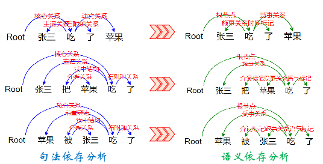

# 语义依存图结构语义关系标注规范

<<<<<<< HEAD
 
 
=======
## 关于语义依存图分析
>>>>>>> 43e4d93984504bf8fa69ac3f7b683afd4c3f0277
相较于句法依存分析，语义依存分析摆脱了表层句式的干扰，能够直达句子的深层语义信息。如图1所示，右侧为语义依存分析，
左侧为句法依存分析。三个句子用三种不同的句式表达了同一个语义信息。注意观察“张三”，“苹果”，“吃”三个主要词语之间的依存关系，
可以发现语义依存分析不受表达方式的影响（“张三”，“苹果”，“吃”之间的依存关系在三个句式中保持不变），
但句法依存分析显然受到了句子表达方式的影响。

<<<<<<< HEAD

=======

>>>>>>> 43e4d93984504bf8fa69ac3f7b683afd4c3f0277

语义依存分析采用图结构描述句子的语义结构。传统的树结构依存分析受到树结构的限制，尤其是其不允许一个节点有多个父节点，
也不允许依存弧之间相互交叉（`非投射`，`non-projection`）。语义依存图分析允许使用图结构表达句子的依存信息，其允许非本地和非投射现象的存在，
对连动、兼语、概念转位等汉语中常见的现象的分析更全面深入，能够更充分地表达真实的语言现象，
同时这使得最终的分析结果变为了一个有向无环图，客观上增加了分析的难度。

北京语言大学应用语言学研究所