**语义依存图结构语义关系标注规范希望**

**北京语言大学应用语言学研究所**

 1语义依存图标注概述
=======================

1.1语义分析概述
---------------

语言具有三个重要层次：音、形、义。“音”指语音，是语言的声音表现形式；“形”主要指句法，是语言的构造方式；而“义”则为语义，代表语言的意义。这三个层面中，意义是最重要的一个层面，没有“意义”的语言是没有价值的，因为如果没有了意义，无论声音还是形体，都无法用其来进行交流，语言也就失去了价值。尤其对于汉语来讲，汉语的语法特性是以意义为基础、以语序以及虚词的运用为主要语法手段、以音律为辅助手段的。汉语语序灵活，以意义作为排列依据。传统的仅将句子分成若干个句法成分的句法研究在分析句子意义时是有一定局限性的，句义研究仅靠句法研究是不够的。多年来，人们对语音和句法的研究取得了很大的进展，但如何对语义知识进行表达与获取，一直都还是个难题。自然语言处理的核心任务就是使计算机能够像人一样知道每个词、每个句子、每个段落的“意思”，如何对语义知识进行正确表达和自动分析则是必经之路。

对句子进行语义分析，简单地说，就是指根据句子的句法结构和句中每个词的词义信息，将句子转化为某种可以表达句子意义的形式化表示。语言学界在面向自然语言处理的语义分析领域，也有多种知识描述形式的探索，包括语义分类、语义特征、语义聚合关系、语义组合限制等。目前在句义方面的研究主要集中在语义角色标注（Semantic Role Labeling,SRL）这种浅层语义分析的任务上，这种浅层语义分析对句子意义的理解不够深入，存在一定的局限性，进行更深层次的语义分析才是真正理解句义的唯一途径。

相较于语义角色标注，语义依存分析属于更深层次的语义分析。语义依存分析（Semantic Dependency Parsing）是建立在依存理论基础上的深层语义分析。它是一种融合了句子中的依存结构和语义信息的语义分析方法，更好地表达了句子的结构与语义关系。语义依存分析提取句子中所有的修饰词与核心词对间的语义关系，句子中的每一个词都有其核心节点（除了整个句子的核心节点外）。语义依存分析是处理词级别、短语级别、从句级别以及句子级别的语义结构的过程，是面向整个句子的深层分析，并且还含有非主要位于包含的语义信息，如数量（quantity）、属性（attribute）等。

对于语义依存分析，我们经历了由依存树结构向依存图结构发展的过程。语义依存树是单一父节点、无环、连通、可投射的，符合依存理论的四条公理。但是真实语言现象中经常会出现某个词语同时依存多个词语，即同时和句中其他多个词语发生语义关联从而拥有多个父节点的现象；也可能出现依存弧相互交叉的非投射现象。这些现象是传统的依存树结构无法表达的。为了将这些真实存在的语言现象显现出来，同时还能兼顾依存表达的优势，我们突破了原有的依存树结构表达的限制，提出了语义依存图结构。即在标注过程中，只要句子中的词与词之间存在语义关系，就将这两个词语节点用依存弧进行连接。

本规范将对语义依存图理论进行详细解释并介绍相应的语料库构建情况，同时对于标注细则进行全面的描述。一方面希望能够对语义知识进行全面而有效的描述；另一方面也希望能为提高机器自动语义标注提供更好的标注知识，从而提高语义自动标注的性能。

1.2相关理论简介
---------------

在语义依存图语料库建设过程中，用到的语言学理论以语义依存理论为主，兼参考谓词论元结构。

语义依存分析是绝对基础，主要是对语义事件进行依存关系分析。第一版语料库的标注全部都是基于语义依存关系的。后来，对数量庞大的语义依存关系标签进行粒度上的提升，形成了粗细两层标注颗粒度，其中粗粒度标注粒度主要是分析某一语义事件的谓词-论元结构，并对这个结构进行依存标注，也即对于一些依附性的成分进行了简化处理。所以说，理论基础仍然是语义依存理论，但是在粗粒度标注框架中，涉及到了对谓词-论元结构的分析与标注。

下面是对这两种语义理论的介绍。

### 1.2.1语义依存图理论简介

为了如何让计算机更好的理解人类自然语言所表达的丰富含义，我们采用语义依存图结构表达中文句子内部的语义依存关系。

语义依存分析是建立在依存语法（Dependency Grammar，DG）基础上，依存语法描述了句子中词与词之间的依存结构，法国语言学家Robinson将依存语法总结为以下四个公理：

1.  一个句子中只有一个成分是核心成分；

2.  其他成分直接依存于某一成分；

3.  任何成分不能依存于两个或两个以上的成分；

4.  依存成分之间不能有交叉。

相应地，语义依存分析是分析句子中所有词与词之间的结构关系以及有结构关系的词对间的语义关系，也即句子中的任何词语都有其父节点（整个句子的核心成分除外）它面向整个句子以及句子中所有的词。

> 例如：鲁迅写的《故乡》是一篇好文章。（root，是）

语义依存图标注结果如下图所示：第一个图是粗粒度[^1]标注标签示例，第二个图是细粒度标注标签示例。

[^1]: 图例：大写英文字母代号为粗粒度标注标签，首字母大写代号为细粒度标注标签，后文有详细解释。

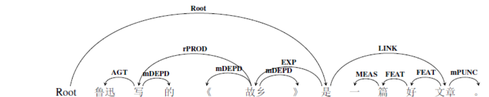

图 1语义依存图示例1（粗粒度）

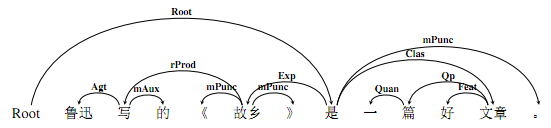

图 2语义依存图示例2（细粒度）

从例子中可以看出，一个句子经过了语义依存分析后，既可以得到句子的结构信息，比如知道了词与词的相互依存（如“好”依存于“文章”），短语和词的依存等（“一篇好文章”依存于“是”）；也可以得到语义信息，包括谓词和论元间的语义信息[^2]（如“是”和“文章”间的语义关系是类指关系Clas），也包括短语内部的语义信息（如“一篇”和“文章”是名量关系）。经过了语义依存分析后，一个句子被彻底“解构”，被彻底“分析”，是一种真正的深层语义分析。

[^2]: 语义信息：对于各种语义信息的名称如属事、类事和英文代号以及实际所指，后文有详细解释。

以往的语义依存研究大多基于依存树进行分析，但是根据大规模真实语料的实际，同时也考虑到中文灵活多变，经常出现连动、兼语、概念转位等现象，我们的标注结构从原来的依存树结构改为依存图结构。举例来说，现代汉语中经常会出现句子中的某个词语可以和句中多个词语发生语义关联的现象，间隔的词语对之间也会出现交叉关联的情况。例如：我有个妹妹很能干。从依存树分析的结果来看，“妹妹”的父节点是“有”表属事关系，但是“能干”与“妹妹”之间也有语义关系，却没有被标识出来。再比如：她心情不好，不愿意说话。依存树的分析中“她”的父节点是“心情”表示领属关系，但是“说话”与“她”之间也存在表示施事的语义关系，却没有表示出来，因此，语义依存树结构对汉语语义的刻画还存在一定局限性。

正是由于依存树结构在汉语语义研究上存在的不足，在体系结构设计方面，我们运用更加坚实的理论基础，结合汉语本身的特点和依存分析处理语言的优势，我们对依存树结构进行扩展，提出语义依存图体系。在依存图体系的标注中，打破了原来的树的标注限制，允许某个标注成分有多个父亲节点，允许不同的标注弧之间存在交叉，即只要句子中的词与词之间存在语义关系，就将它们相连接。

> 例如：他把杯子打破了。（root，打）

语义依存图结构分析结果如下：

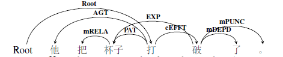

图 3语义依存图示例3（粗粒度）

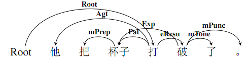

图 4语义依存图示例4（细粒度）

从例子中可以看出，这个句子经过了语义依存图分析后，“杯子”与“打”和“破”两个词语都有语义关系，即词语“杯子”存在两个父亲节点：“打”和“破”，分别表示受事和当事；另外，弧（打-\>他）与弧（破-\>杯子）也形成了交叉。从句意理解的角度来看，这样的多父亲节点和交叉弧都有其表达语义的真实价值，如果用依存树来表达，语义表达上就会不全面：以“打”为全句核心，依存树的语义标注情况为：（打-\>他，Agt),（打-\>杯子，Pat），（杯子-\>把，mPrep），（打-\>破，eResu），（破-\>杯子，Exp），（破-\>了，mTone），从而丢掉了“杯子”和“破”之间存在的真实语义关系。

通过对大量语言事实的分析和研究，我们在这里对传统的Robinson依存理论中所规定的公理进行了部分修订，突破了原有的依存树的局限性，构建依存图，以增强依存表达的生命力。依存图结构遵循如下公理：

1.  一个句子中只有一个成分是核心成分（唯一根节点）；

2.  其他成分直接依存于某一个成分；

3.  任何一个成分可以同时依存于两个或两个以上的成分（多父节点）；

4.  如果A成分直接依存于B成分，而C成分子啊句中位于A和B之间，那么C可以依存于A左边的成分或B右边的成分，即允许依存弧之间发生交叉（非投射）；

可见，语义依存图分析体系是对缘由语义分析理论的继承和发展，继承了依存树结构的核心思想（规则1和2），打破了语义依存树结构的限制（规则3和4）。

### 1.2.2谓词-论元结构简介

人类所有的语言在它们的语义结构的核心部分都有一种谓词论元排列的形式，叫做“谓词论元结构”（Predicate-argument Sturcture）。这种谓词论元结构表示了隐藏在构成句子的单词和短语的成分的底层之下的各个概念之间存在着的特定关系。

句子中必须包含或隐含谓词信息，而每一个谓词对应着一个或几个事件，事件的参与者就是它的论元。例如“张三走了”，“张三”就是谓词“走”的论元。

1.3语义依存图语料库建设
-----------------------

我们构建了两版语义依存分析语料库：BH-SDP-v1：第一版标注了1万句语义依存树库。采用了先自动转换CPB的语料，再进行人工标注的方式；BH-SDP-v2：第二版构建了一个包含2万个句子的语义依存图库，所有句子均为人工标注。这些语料都来自于不同的领域，包括新闻语料（10068）、中小学语文课本（10038）、新浪微博语料（5000）和用于机器翻译的语料（4900）。其中，微博语料的标注结果还有待进一步优化。

在标注过程中，也尝试了不同的词性规范体系，包括CTB（Chinese Penn Tree Bank）的词性体系和北京大学计算语言学研究所人民日报词性标注体系（PKU）。不同来源的数据的句子长度，词次和词性体系如下表所示。

表格 1第一版语料基本统计

|                    | 句子数量 | 词数量 | 句子平均长度 | 词性体系 |
|--------------------|----------|--------|--------------|----------|
| 新闻语料           | 10068    | 308383 | 30.63        | CTB      |
| 中小学语文课本语料 | 10038    | 101140 | 13.44        | CTB      |
| 微博语料           | 5000     | 160880 | 16           | CTB&PKU  |

1.4标注单位及内容
-----------------

### 1.4.1标注单位 

在标注时，将以句号、问号、惊叹号作为标注单位的分隔标志（类似于标题自成一行也可以作为一个标注单位）。每一个标注单位只含有一个独立的节点（即没有父节点的节点）。
试看以下几个例句：

> 1. 唱歌释放的是自己的感情。

> 2. （拔刀）有杀气！

> 3. 陋室空堂，当年笏满床；衰草枯杨，曾为歌舞场。

> 4. 走惯了远路的三毛唱道：“远方有多远，请你告诉我！”

例1来自中小学语文课本，以句号分隔成为一个标注单位。例2来自剧本，以冒号之后的语录作为标注单位，对于括号内部的状态修饰语也是待标内容。例3是来自《红楼梦》的古诗词，我们把句号分开的句子作为一个待标语句。例4是余秋雨的散文，其中涉及到了直接引语，直接引语作为一个整体，与说话人一起，作为一个标注单位。

### 1.4.2标注成分

标注成分是分词结果，每一个切分单位为一个标注成分，包括词和标点。采用的分词工具是哈工大语言云LTP。

例如：

> 1.张/老师/给/学生/讲/历史/。/

此句中的标注成分为：张，老师，给，学生，讲，历史，以及句号“。”，共计7个标注成分。

> 2.老师/是/新/来/的/，/不/知道/英子/的/情况/。/

此句中的标注成分为：老师，是，新，来，的，逗号“，”，不，知道，英子，的，情况，句号“。”共计12个标注成分。

### 1.4.3标注内容

标注内容是每两个标注成分之间的语义依存关系，包括以下两个部分：

（1）二者之间的管辖关系。即确定两个标注成分谁是中心成分，即父节点，谁是被辖（或称依存、修饰）成分，即子节点，它们之间存在一个依存弧，该弧的方向是由父节点指向子节点。

（2）二者之间的语义关系。它们由语义角色表示，例如施事、受事、当事、方式、时间、处所等，对于语义上并不存在关系只在句法上有关系的标注成分，须标上依附标记。

简而言之，标注内容主要指二元弧连接两个标注成分，以及两个标注成分之间的语义关系。

1.5标注工具（待更新）
---------------------

我们建立的网络在线标注工具，不仅免去标注工具的安装过程和标注工作语料分配回收过程，增加了工具使用便捷性。另外，在线标注工具增添了网络同步查询和修改等功能，增加了标注者之间的实时沟通。并方便标注管理者随时检查标注情况。标注工具包括的主要功能如下：

1）
修改句子分词错误。出现分词错误时，先点击按钮进入分词修改模式，修改分词，分词被修改后，依存树自动做相应修改。当分词修改完毕，需要用户点击按钮返回依存标注模式，再对分词被修改的部分重新标注依存关系。程序自动检查分词被改动的句子必须保持原句内容不变。

2）
修改句子词性标记错误。词性出现错误，也需要先进入分词修改模式，然后在错误词性上右键，从显示的词性列表中选择正确的词性即可。词性修改句子的依存结构保持不变。词性修改后仍需点击按钮返回依存标注界面。模式的切换，保证了依存标注流程的完整性，保证分词与词性修改的正确性。

3）
语义依存标注。依存标注分别左键点击两个词语，系统会自动在两个词语之间连接依存弧，弧的方向从第一个词指向第二个词。系统会默认给出弧的语义标签，如果标签错误，右键点击标签，再从弹出的标签列表中选择正确的语义标签即可。提交时，系统会自动检查标注完整性，也会做必要的错误检查，如果不满足依存图条件，系统给出相应错误提示。如果标注正确，系统则顺利提交并自动跳转到下一个句子。必要的错误检查包括，原句子是否被改变；是否每一个词都有父亲节点；是否每一条弧关系都具有依存关系；是否出现依存环结构。

4）
查询标注历史，并修改错误句子。点击标注界面右上角历史记录，即可进入标注历史显示页面。标注者可以检查自己历史标注情况，如果发现标注错误，可以点击句子进入修改页面进行修改。

5）
按关键字搜索已标注数据。搜索功能可以按句子关键字、语义标签、词性、标注时的备注及它们的组合进行搜索，搜索范围是自己的标注历史。对搜索返回的句子，同样可以点击句子进入修改页面进行修改。搜索功能方便标注者针对某一类错误进行查询和修改。另外，系统还提供在全部已标注数据中搜索以上内容，方便标注者针对标注中的疑问，从别人的标注数据里学习。但是这种搜索不能对搜索返回的句子进行修改。搜索界面如图19所示。

6）
管理员管理标注人员标注情况。管理员使用超级账号登陆后，系统会按管理员需求在每个标注者标注的句子中随机抽取一定数量的句子供管理员检查，管理员可以为每个句子标记是否标注正确并备注错误信息。这些信息系统会反馈给相应标注者。

标注工具的页面如下图所示：

图 5标注工具示例

1.6标注步骤
-----------

为保证标注规范的客观性以及标注的一致性，我们建议有以下六步操作规范：

1.  确定标注单位是否由多个事件(非紧缩句)组成，确定每个事件的中枢概念，或核心谓词；

2.  确定事件和事件间的语义关系，如并列、选择、假设等事件关系，若为单一事件，则略过此步骤；

3.  确定事件中与中枢概念相关的语义角色，包括所有的主体角色、客体角色以及情境角色；

4.  确定事件中与核心指称概念相关的语义角色，包括情境角色，以及事件中出现的反关系和嵌套事件关系

5.  确定标注单位中的语义依附标记，包括标点标记和所有的依附标记；

6.  整体检查：有无漏标、错标等现象。

1.7标注意义及难点
-----------------

当下的自然语言处理研究，统计方法处于主体地位，但是要想让统计方法发挥优势，必须有大规模的人工标注的语料库作为支撑。因此，基于统计的语义依存分析研究，也必须有大规模的语料库资源。所以，我们需要花费一定的人力、物力，进行语义依存资源的建设。而且，以往的经验告诉我们，大规模高质量的语料库资源往往能够极大地推动研究方向的进展。所以想要推广语义依存分析研究，也必须配以相应的语料库资源。

标注过程中，难点主要在于如何贯彻标注的一致性。标注一致性是衡量语料质量的重要指标，语料的自动标注对自动分析器十分重要。语义依存标注的一致性体现在相同的语言现象被标注为相同的依存结构。相同的依存结构指依存弧和依存关系都一致。我们进行过标注一致性实验，标注者在标注语料时很大程度上都取得一致结果。但是，仍然会存在某些词语对可标注多种依存关系的情况。所以，我们在制订标注规范的时候，会对不同依存关系的边界划分制定规则，使区分更加清晰。

难点之二在于对于汉语的复杂性。首先是结构的复杂性，汉语有并列、兼语、连动、比较等特殊结构，对于不同的结构，需要具体问题具体分析，要尽量将结构义表达出来。其次是口语语料的稀疏性。这是一个很宽泛的概念，剧本语料涉及到的口语语料、汉语中的一些谚语、俗语、歇后语等，都可以归入此类。比如说，俗语“碰钉子”与动宾短语“碰钉子”的含义不同，前者的含义是“比喻遭到拒绝或者斥责”，而后者是一个短语，“碰钉子”表达的是“碰到了钉子上”，在标注的时候，要将这一类情况进行区分。再比如，一些口语中的提示性话语，例如“你看”，有时候，“你看”并不是表达真正的“看”，而是提醒听话人注意接下来的内容，对于这样的情况，我们也要区别对待。

所以，针对这种情况，我们在本规范的第七章，对于各种特殊情况给出专门的标注细则，一方面能够指导标注工作，另一方面也是对语言知识的总结。

 2语义关系概述
=================

2.1语义单位层级
---------------

同语音、语法类似，语义也是由不同的语义单位组成的层级系统。在鲁川定义的汉语意合网络语义关系体系的基础上，本标注规范借鉴了其语义单位层级划分、语义组合的思想及语义关系标签集合，同时结合依存语法的由中心词驱动、易于提取词之间的关系等特点，构建了一套更加清晰的语义关系体系构架。

语义平面上的层级单位由大到小分别是事链、事件、论元、概念、标记。这些语义单位大致对应于句法单位的复句、小句、语块、实词、虚词。

1.  **事链**

事链表示一段密切相关的事件。一个事链通常由两个或两个以上的相关事件组成。与句法上的复句（包括紧缩句）相对应。

2. **事件**

事件是知识的基本单位。事件是以一个核心谓词为中枢论元，一个或多个相关的论元为周边的语义组合所反映的客观现实。事件是语义平面上的术语，相当于述谓结构。

当一个事件在语义功能上只相当于一个论元时，标注为嵌套事件关系。

> 例如：我在电视上看见*王军霞在跑五千米*。

“王军霞在跑五千米”这一事件在本句中是“看见”的宾语，其语义功能相当于述谓概念“看见”一个周边论元，在具体标注中，标注为嵌套事件关系。

3. **论元**

论元是构成事件的单元，也可称其为事元。分为中枢论元和周边论元。其中中枢论元代表所在的事件，相当于句法上的述谓语块VC，一个事件只能有一个中枢论元；周边论元与中枢论元相对，指事件中枢所关涉的处于周边的论元，相当于句法上的一个指称语块NC。

4. **概念**

事件网络中的一个结点所表示的知识元素，大致相当于句法上的一个实词。常用的概念分类以意义为标准，可以分为述谓概念和指称概念，其中述谓概念相当于句法上的谓词；指称概念相当于句法上的体词。

5. **标记**

标记指发话者传递语言信息时，在实体信息上所“标”的依附性信息的“记”号。例如一些语气词、标点符号等。

> 例如：这帮歹徒曾绑架过经理的女儿。

以本句为例，由大到小依次阐述语义单位。这个句子是一个单一事件；“曾绑架过”是句子的谓语部分，是整个事件的中枢论元；“这帮歹徒”和“经理的女儿”是周边论元；“绑架”是述谓概念，“这”“歹徒”、“经理”“女儿”是指称概念；而“曾、过、的”等是依附在实体信息之上的标记。

> 再例如：我有个妹妹很能干。

从句法上说，这是一个兼语句，从语义关系上讲，这是复杂语义事件，即由“我有个妹妹”以及“妹妹很能干”这两个事件组成的一个事链。

根据以上定义，可以对语义单位的层级进行一个小结：一个句子的语义由各个小句代表的事件构成的事链来表达；小句的语义由中枢事元及周边事元来表示，而中枢事元的语义由述谓概念来表达，周边事元由其他指称概念、界定概念等来表达；其中，概念之间会由一些标记相粘连。

2.2语义标签体系
---------------

我们确立了三类两级的标签体系：三种类型，指的是语义周边角色、语义结构关系和语义依附标记，这三种类型，分别对应三种语义关系框架；两级标注体系，指不同的标注粒度，分别是粗粒度标注标签集和细粒度标注标签集。

我们提出了粗细两种标注颗粒度，来对一个语义事件进行不同深度的加工。从细粒度标注层面上讲，我们要对一个语义事件中每项待标成分都进行详细的语义分析；相应地，从粗粒度标注层面上讲，我们主要是对一个语义事件的谓词-论元结构进行标注。这样的分层处理以应对不用的实际需要。

### 2.2.1语义关系框架

我们定义的语义关系框架有三类，分别对应了三种标注类型：语义周边角色、语义结构关系以及语义依附标记。

**语义周边角色的标注对象是与中枢论元有直接语义关系的周边论元。**又细分为主体角色、客体角色以及情境角色。主体角色是一切运动的主体，客体角色是除主体角色之外第二个参与的实体，情境角色是一系列外围角色，描写的是语义事件发生的场景性因素，比如时间、空间、范围等。

**语义结构关系的标注对象是更复杂的语义事件，针对的是除中枢论元外，出现在语义事件中的其他述谓概念。**细分为反关系、嵌套事件关系以及事件关系。反关系说的是述谓概念转位充当指称概念的情况，出现在定中结构中；嵌套事件关系也称为降级事件，指的是一个完整的事件降级作为一个论元；事件关系指的是多个完整的语义事件既不转位，也不降级，而是按照不同的语义关系连接在一起，句法上相当于复句。

**语义依附标记是对语义事件中依附性成分的标注。**它们实际意义较虚，而且鲜少单独出现，而是作为附加性成分紧紧依附在核心成分周围。这类成分数量齐全，种类多样，对句子的语义也有一定程度的影响。细分为标点标记和依附标记。标点标记是对语义事件中的标点符号做的标注，依附标记是对依附于其他论元或概念上的成分进行的标注。

完整的语义关系框架如下图所示：

图 6语义关系框架

### 2.2.2语义标注粒度

我们在设置语义标签时，第一要义是做到全面。目前，我们的体系和语义角色数量基本上可以满足语义分析的要求，但是全面设置语义角色之后，角色数量偏多的问题便显现出来。为了处理角色数量偏多的情况，采取的策略是：将语义标签按照粒度粗细划分为不同的层级。

划分的依据是各个标签内部的语义联系以及在语料库中的分布情况。我们对其中的一些对应关系进行一些说明。

首先，对于语义周边关系来说，变化不大。主要的区别在于对情境角色语义标签。情境角色表达的语义事件发生的场景性因素。细粒度标注标签中，对于每一种时间关系（时间起点、时段、时距等）、空间关系（位置、趋向、空间起点、空间终点等）、度量关系（数量、数量短语、顺序、频次等）、状态关系（状态、起始状态等）、修饰关系（名称修饰语、宿主角色等）都进行了详细的刻画，而在粗粒度标注体系中，将它们统一分别标注为时间、空间、度量、修饰。其他的主体角色和客体角色作为语义事件的核心参与者，变化不大。粗粒度标签采用大写的英文代号，而细粒度标注标签采用的是首字母大写的英文代号。此类对应关系如下：

表格 2语义周边角色标签体系

| 语义角色分类 | 粗粒度标签 | 细粒度标签                               |
| ------------ | ---------- | ---------------------------------------- |
| 主体角色     | 1施事AGT   | 1施事Agt；2感事Aft                       |
|              | 2当事EXP   | 3当事Exp；4领事Poss                      |
| 客体角色     | 3受事PAT   | 5受事Pat                                 |
|              | 4客事CONT  | 6客事Cont                                |
|              | 5成事PROD  | 7成事Prod；8结局Cons                     |
|              | 6涉事DATV  | 9涉事Datv；10比较Comp；11源事Orig        |
|              | 7系事BELG  | 12类事Clas；13属事Belg                   |
| 情境角色     | 8工具TOOL  | 14工具Tool                               |
|              | 9材料MATL  | 15材料Matl                               |
|              | 10方式MANN | 16方式Mann；17依据Accd                   |
|              | 11范围SCO  | 18范围Sco                                |
|              | 12缘由REAS | 19缘故Reas；20意图Int                    |
|              | 13时间TIME | 21时间Time；22时间起点Tini；             |
|              |            | 23时间终点Tfin；24时段Tdur；25时距Trang  |
|              | 14空间LOC  | 26空间Loc；27原处所Lini；28终处所Lfin；  |
|              |            | 29通过处所Lthru；30趋向Dir               |
|              | 15度量MEAS | 31数量Quan；32起始量Nini；33终止量Nfin； |
|              |            | 34数量短语Qp；35频率Freq；36顺序Seq；    |
|              |            | 37变化量Nvar                             |
|              | 16状态STAT | 38状态Stat；39起始状态Sini；             |
|              |            | 40终止状态Sfin；41历经状态Sproc          |
|              | 17修饰FEAT | 42描写Desc；43宿主Host；                 |
|              |            | 44名词修饰语Nmod；45时间修饰语Tmod       |

其中，粗粒度标注标签一共有17个，而细粒度标注标签有45个，从数量上讲，标签的数量大大减少。同时，需要注意的是，反关系和嵌套事件关系的语义标签设置是以语义周边角色为基础，原则上，有多少语义周边角色，就有多少种反关系和嵌套事件关系。所以，对于这两种语义结构关系的粗细粒度对应关系，可参照语义周边角色。

其次，是语义事件关系的语义标签。对于事件关系的整合力度非常大，主要依据的就是它们在第一版出料库中出现的频次，以及它们的内在语义联系。其中细粒度事件关系标签有19个，而粗粒度事件关系缩减到3个。对应关系如下：

表格 3事件关系标签体系

| 粗粒度事件关系标签 | 细粒度事件关系标签                      |
| ------------------ | --------------------------------------- |
| 1并列关系eCOO      | 1并列eCoo；2等同eEqu；3分叙eRect；      |
|                    | 4选择eSelt；5割舍eAban；6选取ePref；    |
|                    | 7总括eSum                               |
| 2先行关系ePREC     | 8先行eRrec；9原因eCau；10条件eCond；    |
|                    | 11假设eSupp；12手段eMetd；13让步eConc   |
| 3后继关系eSUCC     | 14后继eSucc；15递进eProg；16转折eAdvt； |
|                    | 17目的ePurp；18结果eResu；19推论eInf    |

最后，对于语义依附标记来说，其变化是最大的。细粒度语义依附标签数量庞大，语义分来非常细，但是鉴于粗粒度的标注层级主要是对谓词-论元关系进行的标注，所以，对于这些语义依附标记所附带的信息不再具体标明，只显示这是一个语义依附标记，表示的断句的标点标记、表示否定关系的否定关系保留，而表示语法关系的介词、连词标记都表示为关系标记。所以，粗粒度标记标签一共只有4种，而细粒度标记标签共有17种。对应关系如下表所示：

表格 4语义依附标记标签体系

| 语义依附标记粗粒度标签 | 语义依附标记细粒度标签                 |
| ---------------------- | -------------------------------------- |
| 1标点标记mPUNC         | 1标点标记mPunc                         |
| 2否定标记mNEG          | 2否定标记mNeg                          |
| 3关系标记mRELA         | 3连词标记mConj                         |
|                        | 4介词标记mPrep                         |
| 4依附标记mDEPD         | 5语气标记mTone；6时间标记mTime；       |
|                        | 7范围标记mRang；8情态标记mMod；        |
|                        | 9频率标记mFreq；10程度标记mDegr；      |
|                        | 11趋向标记mDir；12的字标记mAux；       |
|                        | 13多数标记mMaj；14插入语标记mPars；    |
|                        | 15实词虚化标记mVain；16重复标记mRept； |
|                        | 17离合标记mSepa                        |

我们对标签数量进行一个总结：

表格 5标签数量统计表

| **数量 分类**                         | **粗粒度标签（个）** | **细粒度标签（个）** |
| ------------------------------------- | -------------------- | -------------------- |
| **不含反关系/嵌套事件关系的标签数量** | 24                   | 81                   |
| **总量**                              | 58                   | 171                  |

由上表可以非常直观的看出，粗粒度标注标签是对细粒度标注标签数量上的大大减少。这两层标注粒度，能够针对不同的应用需要。语义关系框架全表请参见附录2.

 3中枢论元的标注细则
=======================

3.1总述
-------

中枢论元由核心述谓概念充当。标注时，用依存弧将root指向中枢论元，而并不标注中枢论元的具体语义角色。对于中枢论元的标注，简单总结，就是找出一个语义事件的核心述谓概念。

然而，中枢论元与述谓概念之间的关系并非简单的一一对应。有些语义事件，没有典型的核心述谓概念；有些语义事件，包含多个述谓概念。对于这两种情况，我们需要分开讨论。

从中枢论元的角度来看，在汉语句子里，谓词性成分和体词性成分都可以充当中枢论元，谓词性成分又可细分为两种类型：动词充当中枢论元的情况以及形容词充当中枢论元的情况。（详见3.2节与3.3.1节）

从述谓概念的角度来看，一个语义事件往往不止一个述谓概念，有的述谓概念是核心述谓概念，是root（详见3.3.2节）；而有些述谓概念不是核心述谓概念，比如有些形式动词、情态动词（详见3.4节）；有的述谓概念转位做指称概念（详见5.2节）；有的述谓概念激起的语义事件是一个更大语义事件的组成部分，即降级关系（详见5.3节），有的述谓概念组合形成语义事件链（详见5.4节）；；不同的述谓概念之间又组合形成特殊的结构类型，比如连谓、兼语等结构（详见3.5节）。每一种类型，都需要标注细则。

语义依存图标注体系需要对句子中的每一个成分进行分析，这个过程是对语义关系的解析与重组。关键步骤就是对语义事件中出现的谓词进行分析，确定谁是中枢论元；然后就是句子中间的其他成分进行分析，将有语义关系的词对用依存弧连接起来。

3.2体词性成分充当中枢论元
-------------------------

体词性成分包括体词和体词短语，从词类划分角度来说，包括名词、数词、量词以及人称代词。体词是与谓词相对的概念。体词性成分充当中枢论元，主要用来判断或说明事物的种类数量、时间性质、特点用途等。一般来说，体词性成分不能充当谓语，只有以下情况才可以：

1.  只能是肯定句，不能是否定句；

2.  只能是短句，不能是长句；

3.  一般只能是口语句式，不能是书面语句式；

4.  限于说明时间、天气、籍贯、年龄、容貌、数量等的口语短句。

从以上四种限制条件来看，体词性成分充当中枢论元时，主要包括三种类型：

1.  时间词作谓语；

2.  名词性偏正结构作谓语；

3.  数量词和数量名结构作谓语。

对于名词谓语句，root直接指向体词性成分的中心词。

> 例如：这孩子圆圆的脸蛋。（root，脸蛋）

分析：该句中，“脸蛋”是中心词，故将root指向它，而“孩子”，“圆圆”，“。”这三个成分与脸蛋有语义关系，所以用依存弧标示出来，其他成分之间的语义关系也要标注出来。

标注结果用依存图结构表示如下：

图 7体词性成分做中枢论元示例1

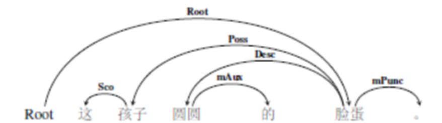

图 8体词性成分做中枢论元示例2

正是因为体词性成分充当中枢论元有诸多限制条件，所以形成的多是单一语义事件，易于标注。但是，有一种情况需要特殊注意，那就是“的”字短语充当中枢论元的情况。“的”字短语是由助词“的”附着在实词或短语后面组成，指称人或事物，属于名词性短语。“的”字短语一般作主语、宾语，但是也能出现在名词谓语句中。

> 例如：这本书\|\|新买的。（root，买）

分析：在这个句子里，“买的（V+的）”构成的是一个具有指称概念的名词短语，复指主语“这本书”。在对“的”字短语进行标注时，我们将“的”字作为结构中心，其他成分按照实际语义关系进行标注。这样处理的原因在于，“的”字结构中的“的”与普通的助词“的”的语义内涵不同，需要特殊标注出来。

标注结果用依存图结构形式表示如下：

图 9体词性成分做中枢论元示例3

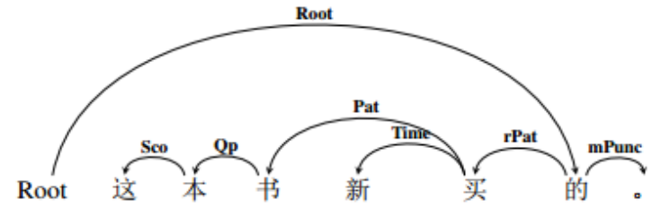

图 10体词性成分做中枢论元示例4

3.3谓词性成分充当中枢论元
-------------------------

谓词性成分包括谓词和谓词短语，从词类划分的角度来说，包括动词、形容词和代替动词、形容词的代词。谓词是与体词相对的概念。谓词性成分充当中枢论元，主要指动词谓语句和形容词谓语句这两种情况。

### 3.3.1形容词充当中枢论元 

形容词充当中枢论元的情况在句法上体现出来的主要是形容词谓语句，用来描写人或物的形状、性质、特征等，以形容词为核心。当形容词充当中枢论元的时候，一般也不会出现复杂的长难句，所以在实际标注时，直接将root指向该形容词。

> 例如：宝塔很高。（root，高）

标注结果依存图结构表示如下：

图 11形容词充当中枢论元示例1

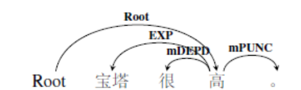

图 12形容词充当中枢论元示例2

简单来说，形容词充当中枢论元并构成简单语义事件的情况如上介绍所示。然而，形容词与动词的组合也会构成复杂语义事件，这个时候，需要判断不同述谓概念之间的语义联系。一般来说。如果句中出现多个形容词并列充当述谓概念时，将第一个形容词标注为中枢论元root，其余形容词标注按照语义关系与root形容词进行连接即可。

> 例如：她时而开心，时而忧愁，性格阴晴不定。（root，开心）

分析：这个句子中出现了三个形容词：“开心、忧愁、阴晴不定”，相当于三个语义事件。“开心”和“忧愁”是并列关系，而“阴晴不定”是对前两种关系的总结。我们将root指向第一个形容词“开心”。

标注结果如下所示：

图 13形容词充当中枢论元示例3

图 14形容词充当中枢论元示例4

### 3.3.2动词充当中枢论元

动词充当中枢论元选择中枢论元最复杂的一类情况。从句法上说，不仅涉及到单句，还涉及到复句、紧缩句等；从语义上说，不仅涉及到单一事件，还涉及到事链。主要用来叙述人或物的动作行为、发展变化等。下面我们分情况讨论事件中动词充当中枢论元的情况。

1.  **语义事件中只有一个动词的情况。**

当语义事件中只有一个动词时，将root指向这个动词。一般来讲，这个动词多是动作行为动词。

>   例如：公司处分了旷工者。（root，处分）

分析：该事件只有一个动词“处分”，所以将root指向“处分”，其余标注成分按照语义关系进行标注，标注结果用依存图形式表示如下：

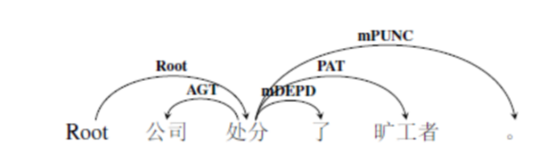

图 15动词充当中枢论元示例1

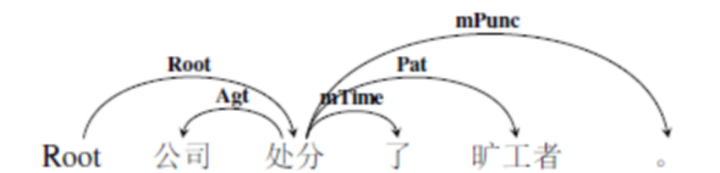

图 16动词充当中枢论元示例2

2. **语义事件中有多个动词的情况。**

当语义事件中出现多个动词时，默认情况是将核心述谓概念作为中枢概念root的，但真实语言情况复杂多变，我们需要注意复杂的语言现象中找出核心的述谓概念。比如以下情况。

> 1. 现在着手进行一些小的调查。（root，着手）
> 2. 它们正在进行研究。（root，研究）

例1中有两个动词——“着手”和“进行”，进行的语义较虚，所以把root指向“着手”；同理，例2将root指向研究，尽管从语言学上讲，研究已经“名词化”了，但是相对于进行来说，它依然是这一语义事件的核心述谓概念。以例1为例，标注结果如下所示：

图 17动词充当中枢论元示例3

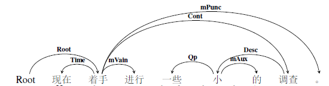

图 18动词充当中枢论元示例4

> 3. 他一边写作业，一边听歌。（root，写）

例3从句法上讲，是一个并列复句，从语义上讲，是一个事链。两个动词“写”和“听”对于这个事链的贡献值是一样的。所以，我们默认将root指向第一个述谓概念。标注结果如下所示：

![C:\\Users\\cheng\\Documents\\Tencent Files\\1501808365\\FileRecv\\MobileFile\\Image\\)RC[XVTJ0[N\@Q6(UP]H{RXB.png](media/9810256c0973054b50297caa726b6315.png)

图 19动词充当中枢论元示例5

图 20动词充当中枢论元示例6

> 4. 我希望他来。（root，希望）
> 5. 他来不来还不知道。（root，知道）

例4和例5都涉及到了主谓短语充当某一句法成分的情况。例4是主谓短语做宾语，例5是主谓短语做主语句。这时候，两个动词在语义事件上的地位是不平等的，即这个主谓短语是做了核心动词的一个论元，具体来说，就是“他来”是希望的一个客事角色。所以我们将root指向句子主干中的述谓概念，主谓短语中的述谓概念做降级关系处理。以例4为例，标注结果如下所示：

图 21动词充当中枢论元示例7

图 22动词充当中枢论元示例8

> 6. 他看着剪下来的地图。（root，看）

例6中也有两个动词，“看”和“剪”。但是动词“剪”在这里并不是一个述谓概念，而是转位做了指称概念，充当一个修饰成分，所以root指向“看”，而“剪”被标注为反关系。标注结果如下所示：

图 23动词充当中枢论元示例9

图 24动词充当中枢论元示例10

更详细的标注细则，在后文中皆有叙述。

3. **语义事件中既有动词也有形容词的情况。**

主要有两种情况：

如果句子是形容词和动词联合构成复杂语义事件时，我们将root指向第一个述谓概念。对比下面两个例句：

> 1. 他从小就很聪明，非常喜欢买书、读书。（root，聪明）
> 2. 孙中山长得像他的母亲，性格比较安静。（root，长）

例1中有四个述谓概念，分别是“聪明、喜欢、买、读书”，我们默认将root指向第一个述谓概念——形容词“聪明”。例（2）有两个述谓概念，分别是“长、安静”，我们默认将root指向第一个述谓概念——动词“长”。

也就是说，当语义事件中，同时出现形容词和动词并构成复杂语义事件时，谁是中枢论元不是按照词类确定的，主要看谁的位置在前。

3.4特殊谓词的标注细则
---------------------

上文已经提及，单一语义事件中也会出现多个动词的情况。在选定了中枢论元root后，如何对于剩余动词进行合理的标注，是一个亟待解决的问题。《现代汉语》将动词分为七种意义类别，分别是动作行为动词、心理活动动词、存在变化消失类、判断动词、能愿动词、趋向动词以及形式动词。动作行为动词一般表示主体的动作行为，经常做语义事件的中枢论元。在此，我们再举出几个例子：

> 1. 他送给我一本新词典。（root，送）
> 2. 一个游击队员突然说。（root，说）
> 3. 门关得严严的。（root，关）
> 4. 那件事原来是他搞的。（root，搞）

上述例（1）（2）（3），“送、说、关”等都是动作行为动词，我们将root指向这些动词。例（4）的“搞”虽然意义比较虚，我们还是将root指向它。

但是，我们再看几个例子：

> 5. 外商到中西部地区进行投资。
> 6. 他拿出一本书来。
> 7. 这可能会改变我们的生活。

这三个例子都是单一语义事件，但是都包含了不止一个动词，例（5）有形式动词“进行”，例（6）涉及到趋向动词“出来”，例（7）包括了能愿动词“可能”和“会”。结合语义我们得知，每一个语义事件的核心述谓概念都不是这些辅助性的动词，而是那些具有明显动作行为的动词。试比较下面两组句子：

> a)外商到中西部地区投资。               b) \*外商到中西部进行

>    他拿一本书。                                      \*他出一本书来。

>    这改变我们的生活。                          \*这可能会我们的生活。

a组和b组句子是例（5）到例（7）的变体，a组句子是将所有的心理活动动词、能愿动词去掉后的句子，我们发现，虽然句子的一些“情态义”消失了，但是句子的“命题义”并不受影响；b组句子是将动作行为动词去掉后的结果，我们发现，这些句子不能完整的表达一个清晰的语义事件。所以，我们将root指向那些动作行为动词。

接下来的问题是，对于表达一些“情态义”的述谓概念，我们如何标注。接下来，分别叙述判断动词、形式动词、趋向动词、心理活动动词以及能愿动词的标注细则。

### 3.4.1判断动词

判断动词“是”表示肯定，表示事物等于什么或属于什么；表示事物的特征、质料、情况等，也可以表示事物的存在。对于判断动词，我们需要注意一种特殊情况，即判断动词“是”与副词“是”之间的语义差别。

**1)判断动词“是”的标注情况。**

“是”字最常见的用法是放在两个名词（词或短语）中间，前面的名词是句子的主语。一般来说，判断动词出现在单一语义事件中，表达的含义简单清晰，“是”就是该语句的中枢论元，用依存弧将root指向“是”即可。例如：

> 1. 他是最好的老师。（root，是）
> 2. 这不是新书。（root，是）

这两个例句一肯一否，都是“是”作为判断动词的用法。“是”作为判断词，是一种特殊的动词，判断词加名词构成一个“合成谓语”。所以，“是”的客体角色是相对固定的，粗粒度标签是系事角色，细粒度标签为类事角色，而主体角色需要根据相应的语言情况进行标注。具体分析例2——“这”是一个范围角色，“书”是系事角色（类事角色），“新”是一个修饰角色，“不”是否定修饰。标注结果如下所示：

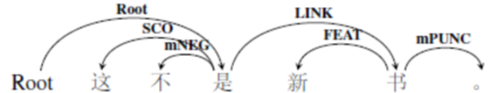

图 25判断动词示例1

图 26判断动词示例2

**2)副词“是”的标注情况。**

副词“是”常常用在谓语动词、形容词前，表示肯定的情况。这些情况中的“是”从语句语调的角度来看，需要重读，相当于“确实”的意思，不能省略。但是，“是”不重读的时候，可以省略，只表示一般的肯定，可以与句末语气词“的”配合构成“是……的”结构。不论重读还是轻读，副词“是”表示的都是语气上的含义。所以一般来说，我们将它的粗粒度标签标注为依附标记mDEPD，细粒度标注为情态标记mMod，依附在中枢论元上。例如：

> 1. 今天是很冷。（root，冷）
> 2. 他的家底老肖是知道的。（root，知道）

这两个例句分别是重读的“是”和轻读的“是”，都标注为依附标记。注意例（2）与“的”字短语的区别。

> 3. 他是卖菜的。（root，是）

例（2）与例（3）形式上都是“是……的”的结构，但是二者表达含义不同。例（2）是副词“是”，需要标注为依附标记，而例（3）是判断动词“是”，需要标注为中枢论元root。以例2为例，“老肖”是知道的主体角色（粗粒度为施事角色额，细粒度为感事角色），“他的家底”是“知道”的客体角色（粗细标签皆为当事角色），而“是”和“的”是依附标记。所以标注结果如下图所示：

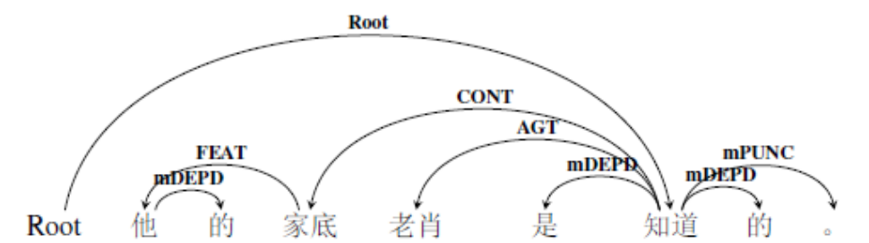

图 27判断动词示例3

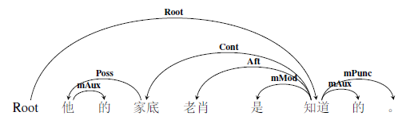

图 28判断动词示例4

**3)其他“是”的标注情况。**

有时候，“是”在语句中出现的时候，形式上看起来似乎像是判断动词或者是副词，而实际上，它们是连词“不是、而是、还是、就是”等。这种情况，我们要将它们的粗粒度标签标注为关系标记mRELA，细粒度标签标注为连词标记mConj,依附在每一个语义事件的核心述谓概念上。例如：

> 1. 他在休息的时候，不是看书，就是看报。（root，看1[^3]）

[^3]:表示句子中第一个“看”，下同。

> 2. 草地并不是金色的，而是绿色的。（root，是1）

例1中的“不是，就是”是表示选择关系的连词，我们将它们的粗粒度标签标注为关系标记mRELA，细粒度标签标注为连词标记mConj。例2中的“不是、而是”虽然从形式上看是连词，但是实际上是判断动词，真正的连词是“而”。第一个“是”是root，第二个“是”是表示选择关系的另一个事件，应该标注为eSelt（粗细粒度标签相同），依附在第一个“是”上。例2的标注结果如下所示：

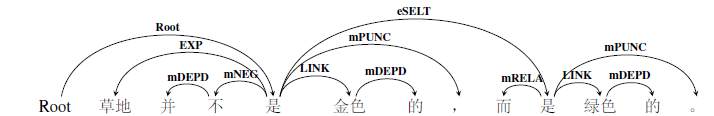

图 29判断动词示例5

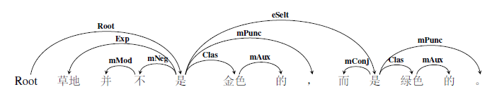

图 30判断动词示例6

**综上，“是”有三种标注情况：**

1.  判断动词“是”应该标注为中枢论元root；

2.  副词“是”标注为依附标记mDEPD（细粒度为mMod）

3.  由“是”构成的连词“不是、而是、就是”等标注为连词标记mConj。

### 3.4.2形式动词

形式动词一般是指“进行、加以、给以、给予、予以”等语义虚化的动词，它们是本身不具有实在意义而只能用动名词或以动名词为中心语的偏正短语作宾语的动词。从句法上说，“进行”的功能之一是将动词宾语名词化；而从语义上将，真正表示该语义事件动作行为的是形式动词后面的动词，而且后面动词的受事常常在前面。例如：对优秀员工进行表扬。实际的语义是“表扬优秀员工”。核心述谓概念是“表扬”而非“进行”，所以我们将root指向动词“表扬”，形式动词标注为依附标记mDEPD，细粒度标签为虚化标记mVain，依存于中枢论元上。例如：

> 1. 他们正在进行研究。（root，研究）
> 2. 此类活动必须予以制止。（root，制止）

分析：以句1为例，中枢论元是“研究”，“他们”是研究的主体，“正在”表示的是时间，而“进行”的作用是将研究名词化。所以，标注结果如下图所示：
