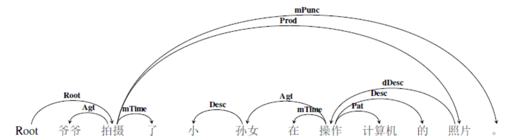
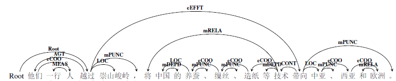
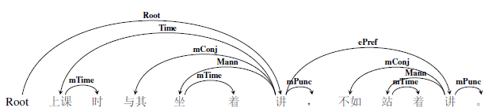
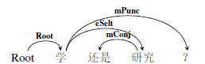
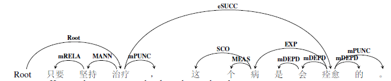
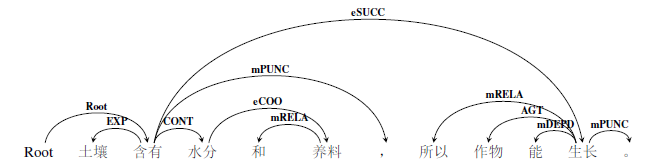
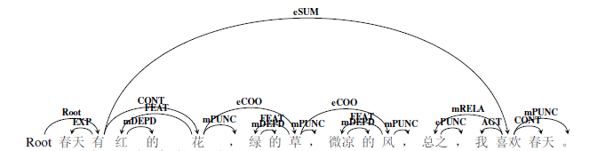
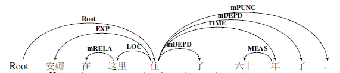

### 5.3.2嵌套事件关系标注示例

根据嵌套事件关系中的“降级”事件在句子中的语义功用，对于嵌套事件的标注有以下四种情形。

1.  **降级事件充当一个周边论元。**

在该降级事件的核心词和全句事件谓词之间连线，标注语义关系，在该语义关系前面加d（degrade）表示嵌套，标明该事件是一个嵌套事件。例如

> ①爷爷看见小孙女在操作计算机。（root，看见）（看见，操作，dCont）

分析：“小孙女在操作计算机”这个语义事件是句子中枢论元“看见”的一个客事角色，也即句法上讲的作宾语成分。这种情况的标注十分简单。标注结果用依存图结构表示如下：

图 123嵌套事件关系示例1

![C:\\Users\\cheng\\Documents\\Tencent Files\\1501808365\\FileRecv\\MobileFile\\Image\\9%10ICI0SGC[_XH5F(R8]\~E.png](media/1bcf66f434d964af3dca299d4312f093.png)

图 124嵌套事件关系示例2

2. **降级事件作为修饰成分，所修饰的核心词不是该降级事件中的周边论元。**

在降级事件的核心词与其所修饰的核心词之间的语义关系，在该语义关系前加前缀缀d，标明该事件是一个嵌套（降级）事件。例如：

> ②爷爷拍摄了小孙女在操作计算机的照片。（root，拍摄）（照片，操作，嵌套修饰dDesc）

分析：这个句子的主干部分是“爷爷拍摄照片”，而“小孙女在操作计算机”是降级做了修饰成分，所以标注结果用依存图结构表示如下：

图 125嵌套事件关系示例3

图 126嵌套事件关系示例4

3. **降级事件作为修饰成分，所修饰的核心词同时还是该降级事件中的周边论元。**

在降级事件的核心词和修饰词之间如果是反关系，直接标反关系不再标注嵌套关系。例如：

> ③爷爷拍摄了操作计算机的小孙女的照片。（root，拍摄）（孙女，操作，rAgt）

分析：本句中，“操作计算机”是一个述谓概念，但是转位做了指称概念，修饰小孙女，同时，小孙女是该降级事件中的施事角色，这个结构解析出来是“操作计算机的小孙女”，与“关押的犯人”等是相同的的结构，所以标注为反关系。标注结果用依存图结构表示如下：

图 127嵌套事件关系示例5

图 128嵌套事件关系示例6

4. **多个动词组成的降级事件作为修饰成分。**

降级事件由多个动词组成，可能是连动、兼语或主谓短语作宾语等等复杂情况，该降级事件中的核心动词并不直接和被修饰的中心语发生语义关系，而是非核心动词与其发生关系，那么，被修饰的核心词仍然指向该降级事件中的核心动词，，标注为降级修饰关系dDesc，而和被修饰的核心词存在语义关系的降级事件中的非核心动词也要指向其修饰的核心词，标注为反关系。以下面这个句子为例：

> ④维多利亚一直是我想去参观的城市。（root，是）（城市，想，降级修饰dDesc）（城市，参观，反客事rCont）

分析：本句结构出来是两个事件——“维多利亚是城市”和“我想去参观（城市）”，其中，事件一成为了句子的主干，而事件二成为了修饰成分，跟第二种情况相同。但复杂的是，修饰成分“我想去参观”又包含了三个动词——“想”，“去”和“参观”，所以我们依次将它们标注为嵌套客事角色，即“想”的客事是“去参观”，“去”的客事是“参观”，而同时，“参观”和句子主干中的“城市”是反客事的关系。综上，这个句子标注结果用依存图结构表示如下：

图 129嵌套事件关系示例7

图 130嵌套事件关系示例8

### 5.3.3嵌套事件关系小结

同反关系一样，嵌套事件关系的语义标签也是以语义角色为基础的。理论上讲，二者的语义标签数量也应该是一致的，但是与反关系一样，有些语义标签并没有出现。下面是对语义周边角色、反关系和嵌套事件关系的语义标签的数量对比。

表格 18语义周边角色VS反关系VS嵌套事件关系频次统计表

| 语义角色标签 | 频次  | 反关系标签   | 频次 | 降级事件关系标签 | 频次     |
| ------------ | ----- | ------------ | ---- | ---------------- | -------- |
| 施事         | 23582 | 反施事       | 1146 | 降级施事         | 2        |
| 当事         | 24697 | 反当事       | 1780 | 降级当事         | 1356     |
| 感事         | 4728  | 反感事       | 104  | 降级感事         | 1        |
| 领事         | 12571 | 反领事       | 286  | 降级领事         | 44       |
| 受事         | 8907  | 反受事       | 730  | 降级受事         | 133      |
| 客事         | 11222 | 反客事       | 941  | **降级客事**     | **7922** |
| 成事         | 2173  | 反成事       | 358  | 降级成事         | 10       |
| 源事         | 292   | 反源事       | 6    | 降级源事         | 64       |
| 涉事         | 8212  | 反涉事       | 202  | 降级涉事         | 209      |
| 比较         | 736   | 反比较       | 0    | 降级比较         | 36       |
| 属事         | 2720  | 反属事       | 84   | 降级属事         | 33       |
| 类事         | 6267  | 反类事       | 26   | 降级类事         | 753      |
| 结局         | 823   | 反结局       | 29   | 降级结局         | 118      |
| 依据         | 514   | 反依据       | 8    | 降级依据         | 54       |
| 缘由         | 740   | 反缘由       | 69   | 降级缘由         | 17       |
| 意图         | 34    | 反意图       | 18   | 降级意图         | 18       |
| 方式         | 5883  | 反方式       | 83   | 降级方式         | 501      |
| 工具         | 623   | 反工具       | 60   | 降级工具         | 3        |
| 材料         | 299   | 反材料       | 7    | 降级材料         | 2        |
| 状态         | 294   | 反状态       | 1    | 降级状态         | 63       |
| 起始状态     | 157   | 反起始状态   | 1    | 降级起始状态     | 24       |
| 终止状态     | 122   | 反终止状态   | 1    | 降级终止状态     | 14       |
| 历经状态     | 176   | 反历经状态   | 6    | 降级历经状态     | 0        |
| 时间         | 7407  | 反时间       | 330  | 降级时间         | 1301     |
| 时间起点     | 218   | 反时间起点   | 0    | 降级时间起点     | 47       |
| 时间终点     | 223   | 反时间终点   | 1    | 降级时间终点     | 8        |
| 时距         | 1655  | 反时距       | 44   | 降级时距         | 16       |
| 时段         | 37    | 反时段       | 2    | 降级时段         | 2        |
| 空间         | 9755  | 反空间       | 250  | 降级空间         | 90       |
| 原处所       | 441   | 反原处所     | 1    | 降级原处所       | 0        |
| 终处所       | 1721  | 反终处所     | 5    | 降级终处所       | 2        |
| 通过处所     | 248   | 反通过处所   | 7    | 降级通过处所     | 0        |
| 趋向         | 1505  | 反趋向       | 29   | 降级趋向         | 21       |
| 范围         | 8191  | 反范围       | 14   | 降级范围         | 18       |
| 数量         | 13268 | 反数量       | 19   | 降级数量         | 0        |
| 数量短语     | 10078 | 反数量短语   | 2    | 降级数量短语     | 0        |
| 变化量       | 190   | 反变化量     | 0    | 降级变化量       | 0        |
| 起始量       | 46    | 反起始量     | 0    | 降级起始量       | 3        |
| 终止量       | 181   | 反终止量     | 1    | 降级终止量       | 4        |
| 频率         | 424   | 反频率       | 0    | 降级频率         | 6        |
| 顺序         | 1331  | 反顺序       | 0    | 降级顺序         | 0        |
| 修饰         | 29069 | 反修饰       | 10   | **降级修饰**     | **2526** |
| 宿主         | 846   | 反宿主       | 0    | 降级宿主         | 22       |
| 名称修饰语   | 7845  | 反名称修饰语 | 0    | 降级名称修饰语   | 0        |
| 时间修饰语   | 1211  | 反时间修饰语 | 0    | 降级时间修饰语   | 0        |

在降级事件标签中，降级客事角色（7922次）和降级修饰（2526）是出现频次最高的两种标签。这与降级事件可以谓词的一个论元、还可以充当指称概念做修饰成分息息相关。可见不同的语义角色在不同的结构关系中的分布是很不一样的

5.4事件关系
-----------

### 5.4.1事件关系概述

事件关系表达的是这样一种语义结构关系：如果多个述谓概念既没有出现转位现象，也没有出现嵌套降级现象，而是不同的事件形成一个有语义关系的事链，我们将这种语义关系标注为事件关系。例如：

> ①我打算去颐和园。（这是嵌套事件，“去颐和园”是“打算”的降级客事论元。）

> ②如果星期六天气好，我就去颐和园。（没有降级关系，功能上仍然是事件，前者是后者的假设，后者是前者的推论）

所有的事件关系的标号都以e开头，表明这是一个事件关系，同样，事件关系也分粗粒度和细粒度两层标注粒度。

### 5.4.2并列关系eCOO

并列关系eCOO表达的是两个或多个平行的语义事件。对应的细粒度标注标签集有三种，分别是：并列关系eCoo、等同关系eEqu以及分叙关系eRect。

#### 5.4.2.1并列eCoo

并列eCoo（coordinate）表示的是：前后两个事件或多个事件分别叙述或描写一个事链或一个事物的几个方面，表示平行的语义关系。例如：

> ①大家一会儿吃西瓜，一会儿喝汽水。（root，吃）（吃，喝，并列eCoo）

> ②兄弟俩边走边说。（root，走）（走，说，并列eCoo）

并列关系有一些标记词：

表格 19并列关系标记词

| 单用 | 和、与、及、同、跟、并、且、并且、连同、以及 |
|------|----------------------------------------------|
| 合用 | 又…又，既…又，一会…一会，边…边，一面…一面    |

注：单用的标记词在一定语境中是介词，此时前后主体的语义角色并不相同，语义上也不平行，所以不能标为并列。判断标准是看前后主体是否可以互换位置而语义保持不变，若不能互换，则为介词，可以互换，认为并列时事件关系。

注意：在实际标注过程中，有些概念之间也有并列的关系。所以，我们也将概念的并列标注为事件关系。例如：

> ①爸爸买了一些报纸和杂志。（买，报纸，客事Cont）（报纸，杂志，并列eCoo）

#### 5.4.2.2等同eEqu

等同eEqu（equivalent）是对于同一个事物的复指或注释。通常会出现指示代词“这、那”或人称代词对该成分进行复指。例如：

> ①女儿要离婚，妈妈对这坚决不同意。（root，离婚）（离婚，这，eEqu）

等同关系有一些标记词：即、就是、也称、也叫做、就是说、指的是等。

注意，一些概念间也可形成等同关系，故而，我们也把概念间的复指标注为等同关系。概念间的等同关系可以用代词复指，也可意合而成，即句法上说的同位关系。

> ①这把刀我打算用它剁骨头。（刀，它，等同eEqu）

> ②首都北京。（首都，北京，等同eEqu）

#### 5.4.2.3分叙关系eRect

分叙eRect（recount）是对要总括的事件尽心分别叙述的分叙性事件。例如：

> ①参与会议的国家有很多，比如美国，日本，韩国等。（国家，美国，eRect）

典型的分叙标记词有：例如，比方，比如说，此外，另外，还有等。

并列关系eCOO在语义事件中出现的频率很高，细粒度标签分别是并列关系eCoo，等同关系eEqu和分叙关系eRect，其中并列事件是同类概念或动作的并列，分叙关系是对一个概念或动作的分别叙述，经常与并列关系连用，而等同关系则是从两个或多个角度对同一概念或动作的表述。这三种细粒度标签可以共现。例如：

> ①他们一行人越过崇山峻岭，将中国的养蚕、缫丝、造纸等技术带向中亚、西亚和欧洲。（root，越过）

分析：这个句子中“他们”和“一行人”是等同关系eEqu，而“养蚕”、“缫丝”、“造纸”与“技术”是分叙关系，它们四个是“技术”的具体表现形式，“中亚”、“西亚”和“欧洲”是并列关系。细粒度标签能体现这种差异，而粗粒度标签都标注为eCOO。该语义事件中主要有两个动作行为——“越过”和“带向”，其中“带向”是“越过”的一个结果事件。所以该例句的语义依存图表示如下：

图 131并列关系示例1

图 132并列关系示例2

### 5.4.3选择关系eSELT

选择关系eSELT表达的是可选性事件之间的关系，有割舍的事件，也有选取的事件。对应的细粒度标注标签有三个，分别是选择eSelt，割舍eAban和选取ePref。

#### 5.4.3.1选择eSelt

选择eSelt指的是在两种或几种可能的情况让人从中进行选择。选择关系eSelt与句法关系中的选择复句内涵不同，略等同与选择复句中的未定选择，可以是数者选一或二者选一。例如：

> ①您是喝茶，还是喝咖啡？（root，喝1）（喝1，喝2，eSelt）

> ②或者你去上海，或者你去南京，或者你哪里都不去。（去，root）（去，去，eSelt）（去，去，eSelt）

选择关系也有一些标记词：

表格 20选择关系标记词

| 单用 | 或，或者，还是                 |
|------|--------------------------------|
| 合用 | 或……或，不是……就是，要么……要么 |

注意，概念之间也有选择关系。我们也将概念的选择标注为选择关系eSelt。例如：

> ①学还是研究。（root，学，选择eSelt）（学，研究，选择eSelt）

#### 5.4.3.2割舍eAban

割舍eAban（abandonment）指为选取有利事件而舍去的另一个可选性事件。割舍的可以是前一个事件，也可以是后一个事件。又由于默认事件关系中第一个述谓概念是中枢论元，所以，当前一个事件是割舍的事件时，后一个事件要标注为选取事件ePref（5.4.3.3）例如：

> ①我宁愿饿死，也不愿讨饭。（root，饿）（饿，讨饭，割舍eAban）

> ②上课时与其坐着讲，不如站着讲。（root，坐）（坐，站，选取ePref）

典型的割舍标记词为：与其、也不、不等。

#### 5.4.3.3选取ePref

选取ePref（preference）指舍去一个可选事件而选择有利的可选性事件。选取的可以是前一个事件，也可以是后一个事件。与割舍相同，如果前一个事件是选取的事件，那么后一个事件要标注为割舍事件关系。例如：

> ① 你让我猜，还不如让我直接看呢。（root，猜）（猜，看，选取ePref）

典型的选取标记词为：不如，还不如，倒不如，宁可，宁愿，宁等。

对于粗粒度的选择关系eSELT，又细分成选择eSelt、割舍eAban，选取ePref。其中，选择关系eSelt不涉及主体角色的主观倾向，单纯的给出不同的选择事件，而割舍和选取都是包含着主体主观态度的选择事件。我们举三个例子进行说明：

> ①上课时与其坐着讲，不如站着讲。（root，讲1）（讲1，讲2，选取ePref）

> ②我宁愿饿死，也不愿讨饭。（root，饿）（饿，讨饭，割舍eAban）

> ③学还是研究？（root，学）（学，研究，选择eSelt）

分析：句1是先割舍后选取的事件链，句2是先选取后割舍的事件链，句3是不涉及主体主观态度的事件链。细粒度标签标不同，而粗粒度标签相同。所以，标注结果分别如下图所示：

图 133选取关系示例1

图 134选取关系示例2

图 135割舍关系示例1

图 136割舍关系示例2

图 137选择关系示例1

图 138选择关系示例2

### 5.4.4先行关系ePREC

先行关系ePREC指按时间、空间或逻辑上顺序说出的发生在前的动作或相关的情况。顺承关系与句结构上的顺承复句内涵不同。结合标注经验，先行关系对应的细粒度标注标签集有6个，分别是：先行ePrec，原因eCau，条件eCond，假设eSupp，手段eMetd和让步eConc。从名称上看，我们是把能作为前提出现的事件都提升为先行关系ePREC了。这是因为，这些作为前提出现的事件，本质上就是后一事件发生的基础。

表示先行关系ePREC的事件从位置上讲，可以置前，也可以置后。但默认情况下是将第一个述谓概念标注为语义中枢论元root，所以，只有当表先行关系的事件置后的时候，才会被标注为先行关系。接下来对这6种关系进行解释。

#### 5.4.4.1先行ePrec

先行ePrec（precedent）指时间上或逻辑上发生在前的先行性事件。例如：

> ①明天天气一定会很好，看现在的天空就知道。（root，好）（好，看，ePrec）（看，知道，推论eInf）

分析：本句中有三个谓语动词——“好”，“看”以及“知道”。后一句子是前一个句子的前提基础，即根据“当下的天空”得出“明天天气好”的结论，所以，后一事件被标注为前一事件的先行ePrec。

典型的先行标记词：首先，先。

#### 5.4.4.2原因eCau

原因eCau（cause）是造成某种成事或导致另一事件的引发性事件。例如：

> ①今年春天来得晚，到现在柳条还没绿呢？（root，来）（来，绿，eCau）

典型的原因标记词有：因为，由于，正因为，既然，鉴于等。

#### 5.4.4.3条件eCond

条件eCond（condition）是影响事件进展的必要的或充分的前提性事件。例如：

> ①要想成功，就要努力。（root，成功）（成功，努力，eCond）

> ②这个病症是能痊愈的，只要坚持治疗。（root，痊愈）（痊愈，治疗，eCond）

典型的条件标记词有：只有，只要，除非，无论，不论，不管，别管，任凭等。

#### 5.4.4.4假设eSupp

假设eSupp（suppose）是对事件进展有所推断而提出的假设性条件。例如：

> ①你会怎么办，如果你处在他的位置上？（root，办）（办，处，eSupp）

典型的假设标记词有：如果，若，如，倘若，假如，假使，要是……话等。

#### 5.4.4.5手段eMetd

手段eMetd（method）是为了达到某种目的而采取的措施性事件。例如：

> ①为争取全人类的自由，就必然有牺牲。（root，实现）（实现，牺牲，eMetd）

#### 5.4.4.6让步eConc

让步eConc（concession）是跟转折事件形成对比而提出的让步性事件，实质上是转折关系的前件。例如：

> ①我们团队都不怕，纵然创业会面临各种各样的困难。（root，怕）（怕，面临，eConc）

典型的让步标记词有：虽然，纵然，纵使，尽管，哪怕，就是，即使，即便等。

### 5.4.5后继关系eSUCC

后继关系eSUCC表达的是按时间、空间或逻辑上顺序说出的发生在后的动作或相关的情况。也即后继关系主要描述的是时间线上靠后发生的事件，细粒度标签有两个，分别是后继eSucc和递进eProg。其中。后继eSucc是接着先行事件发生的事件，递进eProg是接着先行事件更进一步发生的动作。

#### 5.4.5.1后继eSucc

后继eSucc（succession）指先行时间上或逻辑上或空间上发生在后的后续性事件。例如：

> ①瑞恩羞涩地走下车去，不好意思地向大家打招呼。（root，走下）（走下，打，后继eSucc）

> ②坑挖好了，他把一个木匣放进坑里。（root，挖）（挖，放，后继eSucc）

> ③有人闯红灯。（root，有）（有，闯，后继eSucc）
> 空间主语省略的存现兼语句，体现空间上的存在先后顺序。

有时候句子语义上的时间性并不凸显，例如“他坐着看书”，由于没有关联词连接两个动词，我们将其统一标为后继，以期与并列区分开来。在标注时还得判断发生先后的动词之间是否有因果关系，后一动作的发生是不是由前一动作导致的，有的话，根据句中跟节点的位置标成原因事件关系或结果事件关系。

典型的后继标记词有：然后，接着，随后，从而，于是，就，便，这才等。

#### 5.4.5.2递进eProg

递进eProg（progression）指某方面比先行事件更进一层的后续性事件。与后继eSucc相比，二者都是先行事件后发生的事件，不同的是递进有更进一层的含义。例如：

> ①他将于今天晚上达到，并准备住上几天。（root，到达）（到达，准备，eProg）

典型的递进标记词有：还，而且，何况，并且，况且，进而，就是等。

### 5.4.6结局关系eEFFT

结局关系eEFFT是前提事件的后续结果，是在先行关系ePREC事件的影响下产生的一系列结果，或实现的目的，或得出的结论。对应的细粒度标注标签集有三个，分别是：目的ePurp，结果eResu，推论eInf。

#### 5.4.6.1目的ePurp

目的ePurp（purpose）是通过某些手段而要达到的目的性事件。例如：

> ①明天我将去看他。（root，去）（去，看，目的ePurp）

> ②他走到她跟前，请她跳个舞。（root，走）（走，请，ePurp）

典型的目的标记词有：为了，为的是，好，以便，以免，免得，省得等。

#### 5.4.6.2结果eRes

结果eResu（result）是由于某种原因或条件所造成的结局性事件。例如：

> ①小岛远离大陆，没有蜜蜂。（root，远离）（远离，没有，eResu）

> ②土壤含有水分和养料，所以作物能生长。（root，含有）（含有，生长，eResu）

典型的结果标记词有：所以，因而，因此，以致，就，只好等。

#### 5.4.6.3推论eInf

推论eInf（inference）是根据某种原因或假设而得出的推论性事件。例如

> ①眼看你们的身子一天比一天虚弱，说不定就会起不来。（root，虚弱）（虚弱，起，推论eInf）

典型的推论标记词有：就，才，则，也，便，都，那么，可见，否则。

注意，先行事件关系ePREC分别与后继事件关系eSUCC和结局事件关系eEFFT配对使用。一般来说，只要有了先行事件，那么一定会有一个后续事件发生，这个后续的事件，如果在时间线上顺承发生或者递进发生，那么它就是后继事件关系eSUCC，而如果在这个先行事件的基础上，产生了一系列结果推论等，那么它就是结局事件关系eEFFT。

标注时，应该注意到，不论是先行和后继，先行和结局，这两对关系的标注会根据小句位置的变化而变化。例如下面的例子（三元组表示语义关系是只描述细粒度标签）：

> ①只要坚持治疗，这个病是会痊愈的。（root，治疗）（治疗，痊愈，后继eSucc）

> ②这个病是会痊愈的，只要坚持治疗。(root ,治疗)（痊愈，治疗，条件eCond）

> ③土壤含有水分和养料，所以作物能生长。（root，含有）（含有，生长，结果eRes）

> ④作物能生长，因为土壤含有水分和养料。（root，生长）（生长，含有，原因eCau）

分析：句1和句2是相同的语义事件，句3和句4也是相同的语义事件，区别在于出现的位置发生了变化。句1的中枢论元是坚持，而后一事件痊愈是它的一个后继发生的情况；句2的中枢论元是痊愈，治疗是痊愈的先行事件。句3句4是同样的道理。细粒度标签能够体现住具体的先行、后继、结局关系，而粗粒度标签是对基本的逻辑关系进行描述。所以，标注结果下图所示：

图 139后继事件关系示例1

![C:\\Users\\cheng\\Documents\\Tencent Files\\1501808365\\FileRecv\\MobileFile\\Image\\\`13\`7%[]B9B_2%L(SEI39E6.png](media/8d2afbb58ddda46a362ab631ddbf2fe4.png)

图 140后继事件关系示例2

图 141先行事件关系示例1

图 142先行事件关系示例2

图 143后继事件关系示例3

图 144后继事件关系示例4

图 145先行事件关系示例3

图 146先行事件关系示例4

### 5.4.7总括关系eSUM

总括关系eSUM指事件之间是总体与部分的解说性关系或总结性关系。对应的细粒度标注标签集有一个，分别是：总括eSumm。

#### 5.4.7.1总括eSum

总括eSum（summary）是对要分叙的事件进行总结概括的总括性事件。例如：

> ①春天有红的花，绿的草，微凉的风，总之，我喜欢春天。（root，有）（有，喜欢eSum）

典型的总括标记词有：总之，总而言之，总起来看。

总括关系标注非常简单，如上述例子的依存图标注结果如下所示：

图 147总括事件关系示例1

图 148总括事件关系示例2

### 5.4.8事件关系小结

综上所述，事件关系描述的是复杂语义事件，即多个事件相连所形成的语义关系。我们一共提取了6个粗粒度标注标签集，并列关系和选择关系类似平行事件，区别在于它们对于主体的意义不同；后继关系是与先行事件有时间上的线性联系的语义事件，而结局关系是超时间的线性联系的语义事件，先行关系标签的存在是为了解决标注实践上的一些问题；而总括关系则与事件类型中的整体与部分有关系。

**需要对转折关系进行一下说明。**

转折关系是这样一种语义关系：前后分句的意思相反或者相对，即后面分句不是顺着前面分句的意思说下去，而是突然转成同前面分句意思相反或相对的说法，后面分句是说话人所要表达的正义。前后前后分句的意思相反、相对程度的强弱，转折关系分为重转、轻转、弱转。在原来的标注体系中，对于转折关系的标注是单列一个标签，并且出现的频次并不算低。但是对转折关系细究起来，逃不脱与先行事件在时间上存在的某种关系，所以，可以将重转可以合并到结局关系中，轻转和弱转可以合并到后继关系中。例如：

1.  虽然二诸葛说是千合适万合适，小二黑却不认账。（重转，后续事件是前一个事件的一个结果。）

2.  事情到了后头，他倒不干了。（轻转，可以标注为后继事件。）

在第一版语料库中，这19个事件关系语义标签出现的频次如下表所示：

表格 21事件关系频次统计表

| 并列eCoo  | 13110 |
|-----------|-------|
| 等同eEqu  | 2732  |
| 选择eSelt | 697   |
| 割舍eAban | 41    |
| 选取ePref | 234   |
| 先行ePrec | 96    |
| 后继eSucc | 15208 |
| 递进eProg | 1820  |
| 转折eAdvt | 1957  |
| 让步eConc | 407   |
| 原因eCau  | 1185  |
| 条件eCond | 282   |
| 假设eSupp | 725   |
| 手段eMetd | 13    |
| 目的ePurp | 2198  |
| 结果eRes  | 2683  |
| 推论eInf  | 236   |
| 总括eSum  | 73    |
| 分叙eRect | 254   |

5.5小结
-------

本章节主要介绍了语义结构关系，有三类：反关系、嵌套事件关系以及事件关系。

反关系和嵌套事件关系的语义标签语义周边角色为基础，在语义周边角色前加“r”表示这是反关系角色，加“d”表示这是嵌套事件关系。对于事件关系的标注，我们规定了6个粗粒度标注标签集以及18个细粒度标注标签集。

总体来说，与语义周边角色相比，语义结构关系更为复杂。对于句中有多个谓词的情况，反关系处理的是谓词转位充当修饰成分的情况，嵌套时间关系处理的是谓词“降级”嵌套进一个主要事件的情况，事件关系处理的是多个事件发生的情况。通过语义结构关系标注系统，将实现对更广阔的现代汉语句法语义的标注。

 6.语义依附标记的标注细则
============================

6.1总述
-------

语义依附标记是对语义事件中依附性成分的标注。虽然它们实际意义较虚，而且鲜少单纯出现，而是作为附加性成分紧紧依附在核心成分周围。这类成分数量齐全，种类多样，对句子的语义也有一定程度的影响。比如：“逗号”表示语义的停顿，“句号”表示语义的完结，“的”是定中标记等。所以，我们也需要对这一类依附性成分进行标注说明。

> 例如：①贸易是大多数现代国家的生命线。（root，是）

这句话是一个语义事件，root是“是”，“贸易”是当事Exp，“生命线”是类事Clas，“大多数现代国家”是“生命线”的修饰成分，“大多数”是数量Quan角色，“现代”是修饰Feat角色，“国家”是领事Poss角色。除此之外，还有两个成分没有标注：“的”和句号“。”

> ②我们不但不能骄傲自满，而且要继续努力。（root，骄傲）

这是一个事链，包含两个事件，root是“骄傲自满”，“我们”是当事Exp，“努力”是客事Cont，“继续”是“骄傲自满”的递进事件关系eProg。除此之外，还有“不但”，“不能”，“逗号”，“而且”，“要”，“句号”等6个成分没有标注。

我们规定了2种类型分别是标点标记和依附标记，内部包含4种粗粒度标注标签集以及18种细粒度标注标签集。英文代号统一以“m”开始，表示这是一个语义依附标记。

6.2标点标记
-----------

标点标记是对语义事件中的出现的标点符号的标注。标点标记在框架结构以及粗细标注颗粒度上的标注细则一致，相对应的粗粒度标注标签集为标点标记mPUNC，对应的细粒度标注标签集是标点标记mPunc。所以，我们直接对细粒度标点标记进行说明。

### 6.2.1标点标记mPUNC

标点标记mPUNC（punctuation）是对一个语义事件中出现的所有标点进行的标注。相应的细粒度标签为mPunc。

1.  句中只有一个标点时，中枢论元指向句尾标点。例如：

>   ①士兵在黑夜的掩护下向前爬行。（root，爬行）（爬行，句号。，mPunc）

2. 句中有不只一个标点时，每一语义事件核心谓词指向距离自身最近的一个标点。例如：

>   ①碰了钉子后，他收敛多了。（root，碰）（碰，逗号，，mPunc）（碰，收敛，eSucc）（收敛，句号。，mPunc）

6.3依附标记
-----------

依附标记主要是指由各种标记表示的语义依附成分。分为三种类型，分别是：否定标记mNEG，关系标记mRELA以及依附标记mDEPD。

### 6.3.1否定标记mNEG

否定标记mNEG（negative）是对事件中否定关系的标记。相对应的细粒度标注标签集只有一个，即否定标记mNeg。

#### 6.3.1.1否定标记mNeg

否定标记mNeg（negative）主要是对句中否定词的标注。在具体标注时，将核心词指向否定词，并标注否定标记。在现代汉语中，主要的否定词是“不”和“没有”，另外，一些含有否定含义的副词。例如：

> ①她不像她母亲。（root，像）（像，不，mNeg）

> ②但是我还没有放弃多看书的决心。（root，放弃）（放弃，没有，mNeg）

> ③除了他，大家都来了。（他，除，mNeg）

否定标记对于全句意义的影响重大，常见的否定标记mNeg有：没、别、不、休、莫、未、无从等。

### 6.3.2关系标记mRELA

关系标记mRELA（relation）是对句法事件中各种关系的标记。对应的细粒度标注标签集有两种类型，分别是：连词标记mConj和介词标记mPrep。

#### 6.3.2.1连词标记mConj

连词标记mConj（conjunction）是对句法事件中连词的标注。连词标记mConj一般出现在事件关系类型中。各种事件关系的典型标记词都需要标注为连词标记mConj。在实际标注时，把结构中心成分指向关联词语，并标记为mConj。例如：

> ①但是我还没有放弃看很多书的决心。（root，放弃）（放弃，但是，mConj）

> ②许多人喜欢住在农村而不喜欢住在城市。（root，喜欢）（喜欢，而，mConj）

对于连词标记mConj的标注，除了连词之外，还有一部分表示关联作用的副词等。所以常见的连词标记有：并，且，并且，而，和，及，连同，同，以及，与，还是，或，或者，要么，首先，不但，不仅，按说，接着，随后，于是，便，这才，还，而且，况且，进而，就是，甚至，但是，不过，却，可，然而，反而，因为，由于，既然，鉴于，所以，因此，于是，以致，只好，只有，只要，就，才，便，可见，否则，除非，无论，不管，任凭，如果，倘若，加入，要是，的话，，虽然，纵然，尽管，哪怕就是，即使，为了，好，免得，省得，与其，也不，不如，还不如，倒不如，宁可，宁愿，总之，总而言之，总起来看，例如，比方，另外，还有…..

#### 6.3.2.2介词标记mPrep

介词标记mPrep（preposition）是对句法事件中介词的标注。在实际标注时，将介词所关涉的对象用依存弧指向该介词，并标注为mPrep。例如：

> ①山上的小溪正好从我家门前流过。（家，从，mPrep）

> ②他在外国学习了六个月。（外国，在，mPrep）

> ③这样就能更好地把理论应用于实践。（理论，把，mPrep）

但是在实际上，除了介词之外，还有少部分起到介词作用的词也标记为mPrep，例如：陪、论等。常见的介词标记mPrep有：首先，不但，不仅，按说，接着，随后，于是，便，这才，还，而且，况且，进而，就是，甚至，但是，不过，却，可，然而，反而，因为，由于，既然，鉴于，所以，因此，于是，以致，只好，只有，只要，就，才，便，可见，否则，除非，无论，不管，任凭，如果，倘若，加入，要是，的话，，虽然，纵然，尽管，哪怕就是，即使，为了，好，免得，省得，与其，也不，不如，还不如，倒不如，宁可，宁愿，总之，总而言之，总起来看，例如，比方，另外，还有…..

### 6.3.3依附标记mDEPD

依附标记mDEPD（dependency）是概念或事件的语义依附的形式标记。相对应的细粒度标注标签集共有14种。

#### 6.3.3.1语气标记mTone

语气标记mTone（tone）指对句中语气词的标注。汉语最基本的语气词实际上只有六个：的，了，呢，吧，吗，啊。在实际标注的时候，不仅要对基本语气助词进行标注，还要对语气助词的一些变体进行标注。标注的时候，将语气成分所标记的成分用依存弧指向该语气助词，并标记为mTone。例如：

> ①这真是一条伟大的路呀。（root，是）（是，呀，mTone）

> ②我可以先看看吗？（root，看看）（看看，吗，mTone）

#### 6.3.3.2时间标记mTime

时间标记mTime是对句中一些时间副词以及动态助词的标注。注意时间标记mTime与情境角色中的时间角色Time不同。一般所说的时间副词，比如“刚、已经、马上、正在、终于、常常”等，事实上不是表示时间的，是表示时态的，所以不能标记为时间角色。在实际标注时，要将所标记的成分指向时间标记。

1.  **时间副词作为事件标记mTime。**

> ①月光正照在她那恬静的脸上。（照，正，mTime）

> ②不料森林却从此遭了殃。（遭，从此，mTime）

2. **动态助词作为时间标记mTime。**

> ①大家过着“日出而作日落而息”的生活。（过，着，mTime）

> ②不料森林却从此遭了殃。（遭，了，mTime）

除了以上两种最为典型时间标记之外，一些表示开始、持续、完成的词如“起来（如：吵起来），上了（如：好上了），开了（如：玩开了），下去，出来了，成，下来，到”等也要标注为时间标记mTime；一些表时间的情态动词如“快要，就要，即将”也标注为时间标记mTime。

注意，现代汉语中，助词“了“字有两种用法，动态助词和句末语气词，对这两种的用法，在标注的时候，要有所区别。例如：

> ①他走了。（走，了，mTone）

分析：这是“了”作为句末语气词的用法。了在句末作为结尾词的时候，一般都是动词助词与语气词兼用的情况，即语法书的所说的了，这个时候，我们统一标注为语气助词mTone。

> ②这家博物馆收藏了很多珍品。（收藏，了，mTime）

分析：这是“了”作为句中动态助词的用法。

> ③安娜在这里住了六十年了。（住，了1，mTime）（住，了2，mTone）

分析：这是“了”的两种用法在一个句中的共现的情况。本句用依存图结构表示如下：

图 149语义标记示例1

图 150语义标记示例2

#### 6.3.3.3范围标记mRang

范围标记mRang（range）是对句中表示范围的词进行的标注。这样的词可以是对空间范围、时间范围或者是所指对象的范围进行的标记。在标注的时候，将表范围的词所标记的对象用依存弧指向范围词，这样的词有“都、到处、一律”等，另外一些在介词短语中出现的、表示空间方位的词也标注为范围标记。例如：

> ①村里的人都围上去看。（围，都，mRang）

> ②墙上有一幅画。（墙，上，mRang）

常见的范围标记mRang有：都、全、总、总共、共、到处，处处，统统、仅仅、只、光、净、一概、一律、一齐、单、单单、百分百、附近、周围……

#### 6.3.3.4情态标记mMod

情态标记mMod（Modal）是对句中表示情态的词进行的标注。这样的词表达的是主体的一种情形状态，比如惊讶、疑问、感叹或者是能力、猜测等。从词类上说，可以是一些表示方式情态的副词，例如“居然、突然、偏偏、难道”等，也可以是一些情态动词，例如“会、能、可以”等。在实际标注时，要将情态所标记的主体用依存弧指向情态词。

1.  方式情态副词作为情态标记。

> ①老王突然感到不踏实了。（感到，突然，mMod）

> ②难道要违背人类的真理吗？（要，难道。mMod）

2. 情态动词作为情态标记。

> ①也许他跑到花园里了吧。（跑到，也许，mMod）——表示猜测

> ②甚至能透过厚实的门和窗看到东西。（透过，能，mMod）——表示能力。另外这句话中的“甚至”也是一个情态标记。

常见的情态标记mMod有以下类别：

1.  表示必然的：必，总，必然，毕竟，迟早，当然，当真，到底，反正，果然，果真，横竖，究竟，势必，早晚，终归，终究，终于，自然，总归，总是……

2.  表示肯定的：定，准，的确，分明，明明，难怪，难免，其实，确实，实在，无非，显然，一定，一准，准保，着呢……

3.  表示照常的：照，仍，还，也，本来，原来，仍旧，仍然，依旧，依然，照常，照旧，照例，照样，通常……

4.  表示反常的：反，偏，倒，岂，竟，不料，倒是，反倒，反而，竟然，居然，难道，偏偏，唯独，相反，异常，想不到，没料到，哪想到，哪知道……

5.  表示遗憾的：姑且，何尝，可惜，暂且，只得，只好，恨不得，由不得……

6.  表示幸好的：恰，刚好，好在，可巧，恰好，恰恰，恰巧，正巧，多亏，幸而，幸亏……

7.  表示礼貌的：请，费心，谢谢，好吗，借光，久仰，劳驾，哪里，岂敢，请问，失敬，失陪，有劳，对不起，打扰一下，麻烦一下……

8.  表示揣测的：约，会，可能，不定，大概，大约，大致，未必，多半，仿佛，兴许，也许，约莫，左右，好像，或许，前后，上下，似乎，恐怕，看起来，看样子，是否……

9.  表示能够、理应的：会，能，可以，能够，得，应，该，得，必，按理，必得，必须，理应，务必，务须，应当，应该，不能不……

10. 表示评价的：配，好，可，便于，不愧，不屑，敢于，难以，难于，善于，适于，宜于，值得，来得及，来不及……

根据意义分，表示情态的词实际上可以有更多的种类，在实际标注时，只要是表示方式情态的词，都可以根据实际语义标注为情态标记mMod。下面来区别一个字：“都”。

在现代汉语中，“都”有三种意思，分别是①全部；②甚至；③已经。根据意义，我们对“都”有两种标注方法，表示全部义的“都”要标为范围标记，表示甚至、已经义的“都”要标为情态标记。但是在粗粒度标注层级上，具体充当哪一种语义标记不再做区分。例如：

> ①村里的人都围上去看。（围，都，mRang）——这是表全部义的都。

> ②我们死都不怕，何况困难？（怕，都，mMod）——这是表甚至义的都。

#### 6.3.3.5频率标记mFreq

频率标记mFreq（frequency）是对句中表示频率的词进行的标注。这种词主要是表频率的副词，“常常、时时、往往、渐渐、又、再、屡次”等。在实际标注的时候，将频率所修饰的成分用依存弧指向该频率词，并标记为mFreq例如：

> ①我妈妈通常在晚上煮一顿热饭。（煮，通常，mFreq）

> ②女儿睡觉之前，我总讲故事给她听。（讲，总，mFreq）

常见的频率标记mFreq有：还、再、又、也、常常、往往、一再、再三、屡次、来回、反复、每，隔……

有些副词的功能是多样的，要在具体的语义上下文中，判定其语义标记类型，例如：

> ①深夜里他还在工作。（“还”是情态标记mMod ）

> ②我还要去一次。（“还”是频率标记mFreq）

> ③我再也不相信他的话了。（“再”是时间标记mTime）

> ④我得再去一次。（“再”是频率标记mFreq）

下面分析一下“每”字的标注细则，每有两种标记形式：

1.  每+名词，标注为范围角色Sco。

>   ①每一本书。（书，本，Qp）（本，一，Quan）（本，每，Sco）

>   ②只见每峰骆驼的背上都驮着两个大包袱。（峰，每，Sco）

2. 每+动词，标注为频率标记mFreq。

>   ①每隔一天。（隔，每，mFreq）

>   ②每完成一项任务。（完成，每，mFreq）

#### 6.3.3.6程度标记mDegr

程度标记mDegr（degree）是对句中表示程度的词进行的标注。这种词主要是表程度的副词，“很、最、极、太、非常”等。在实际标注的时候，将程度所修饰的成分用依存弧指向该程度词，并标记为mDegr。例如;

> ①妈妈真小气。（小气，真，mDegr）

> ②蓝天白云下的风火山，分外妖娆。（妖娆，分外，mDegr）

常见的程度标记mDegr有：很、非常、极、十分、相当、最、顶、太、更、挺、极其、格外、分外、更加、越、越发、有点儿、稍、稍微、略微、几乎、过于、尤其、比较、极、狠、透、慌、死、坏、过，毫，极，尤，绝，全，过分，过于，极度，及其，简直，断然，干脆，根本，绝对，全然，丝毫，索性，透顶，尤其……

#### 6.3.3.7趋向标记mDir

趋向标记mDir（direction）是对句中表示趋向的词进行的标注。这种词主要趋向动词“来、去、上、下、进、出”等。在标注的时候，将核心动词指向趋向词并标记为mDir。例如：

> ①我被父亲从车上赶了下来。（赶，下来，mDir）

> ②小胖墩儿跳起来了。（跳，起来，mDir）

要注意区别范围标记中的空间范围词与趋向标记的区别，例如下句：

> ①她从墙上把画取了下来。（墙，上，mRang）（取，下来，mDir）

在这个句子中，“上”是“墙”的范围标记，表示“画在墙上”，“下来”是动作“取”的趋向标记。可以看出，范围标记标注的内容是周边论元，而趋向标记标注的内容是中枢论元。

####  6.3.3.8的字标记mAux

的字标记mAux（auxiliary）是对句中出现的结构助词“的、地、得”进行的标注。汉语中，“的”是定中关系的标记，“地”是状中关系的标记，“得”是中补关系的标记，除此之外，古汉语沿用至今的结构助词“之”也标注为mAux。在实际标注时，将结构助词前面的成分用依存弧指向结构助词。例如：

> ①熊猫是珍贵的动物。（珍贵，的，mAux）

> ②我们全家都诚心诚意地欢迎他。（诚心诚意，地，mAux）

> ③家里清静得很。（清静，得，mAux）

注意，现代汉语中“的”有两种用法，一种是结构助词，一种是语气助词，但是在进行语义依存图标注时，都标注为的字标记mAux。

#### 6.3.3.9多数标记mMaj

多数标记mMaj（majority）是对句中指称概念的所述依附标记，主要有：“们”、“多”、“等”以及“什么的”等。标注时，将它们之前的成分用依存弧指向表示多数它们。一般来说，复数人称代词如“你们、我们”等在分词时都是一个词语，无需标注。但是对由“们”构成的短语需要标注。例如：

> ①在小朋友们的面前是一件非常神气的事。（朋友，们，mMaj）

> ②妈妈买了三斤多鸡蛋。（斤，多，mMaj）

> ③参会的国家有美国、加拿大、澳大利亚等。（澳大利亚，等，mMaj）

> ④你去买点西瓜什么的来招待客人。（西瓜，什么的，mMaj）

#### 6.3.3.10插入语标记mPars

插入语mPars（parenthesis）是对句子内的插入语成分进行的标注。汉语中的一些俗语经常用来作为插入语成分。标注时，将它们作为一个整体，中枢论元指向它们，并标注为mPars。例如：

> ①这样一来，火车上山就容易得多了。（上，这样一来，mPars）

> ②的确，伯父就是这样一个人。（是，的确，mPars）

