常见的插入语标记mPars有：常言道，众所周知，总的来说，据了解，对他来说，这样一来……

#### 6.3.3.11实词虚化标记mVain

实词虚化标记mVain（vain）是对句中虚化的实词成分进行的标注。在实际标注时，主要是对形式动词“予以、加以”等以及动词前“有”的标注。例如：

> ①终于有一天，父亲望着饭桌上总也盛不满的菜碗，说要重新开一块菜地。（望，有，mVain）

> ②北京有我家乡十倍大。（大，有，mVain）

> ③这份报纸对那件事进行了如实的报道。（报道，进行，mVain）

注：“要是……的话”中“的”和“话”分开进行标注原始词性，因为没有承担实质性意义，分别标为助词标记（mAux）和实词虚化标记（mVain）

#### 6.3.3.12重复标记mRept

重复标记mRept（repeat）是对句中重复的成分进行的标注。在真实语料中，会出现后一成分对前一成分重复的现象。例如：

> 开会了，开会了。（开1，开2，mRept）

#### 6.3.3.13离合标记mSepa

离合标记mSepa（separate）是对句中离合短语分开使用时宾语的标注。例如：

> 我去洗个澡。（洗，澡，mSepa）

关于离合标记的标注范式详见3.5.2小节中的标注图示。

6.4小结
-------

语义依附标记是对句中出现的标记性的成分进行的标注说明。通过上述说明，我们也能发现语义依附标记的特点：

1.  包含种类多。

从句法结构上说，语义依附标记涉及到了动词如形式动词、情态动词，名词如方位名词、时间名词，副词以及虚词等，甚至还有一些常用习语。从数量上说，语义依附标记有4个粗粒度标注标签集以及17个粗粒度标注标签集。汇总结果如下表：

2. 出现频率高。

综上所述，在每一个语义事件中，都有很多语义依附性成分。也许某一类别中具体所指没有很多，但是出现频率很高。比如说：的字标记mAux具体所指是“的、地、得”以及“之”等少数几个词，但是作为结构助词，出现频率极高。同样，一个语义事件中，可以同时涉及到多种多样的语义依附标记。在第一版语料库中，各语义依附标签出现的频次如下表所示：

表格 22语义依附标记频次统计表

| 语义依附标记 | 频次  |
|--------------|-------|
| 标点标记     | 76482 |
| 否定标记     | 5329  |
| 连词标记     | 11237 |
| 介词标记     | 17389 |
| 语气标记     | 4589  |
| 时间标记     | 13487 |
| 范围标记     | 8965  |
| 情态标记     | 16953 |
| 频率标记     | 2121  |
| 程度标记     | 6045  |
| 趋向标记     | 2041  |
| 的字标记     | 25454 |
| 多数标记     | 920   |
| 插入语标记   | 927   |
| 离合标记     | 174   |
| 实词虚化标记 | 1202  |
| 重复标记     | 7     |

从粗粒度标注层面上讲，简化后的语义依附标记对于整句意义的标注作用不大，相当于指对整个语义事件的谓词-论元角色进行了标注，抓住了事件的主干部分；从细粒度标注层面来说，对于语义依附标记的语义看似轻巧虚化，实际上对整个句义的影响很大，对它们进行详细的标注说明是非常有必要的。

 7特殊结构标注集
===================

7.1双宾结构
-----------

双宾结构一般是指一个动词带两个宾语的结构，两个宾语意义上前一个一般指人，可叫做指人宾语或近宾语；后一个宾语一般指物或者事情，可叫指物宾语或者远宾语。

对于双宾结构，有很多不同的讨论。汉语学界对双宾结构的定义和分析主要是两个方向：一是根据结构理论，偏重句法分析；一是根据题元理论，偏重语义分析。每一种分析角度都又有“宽”和“严”两种方向的处理。

从句法分析的角度上讲，按照“宽”的方向看，一个动词后有两个宾语的情况都是双宾结构，即符合“V+N+N”结构的都是双宾结构。例如：“送你一朵小红花”、“落树上一只小鸟”、“等你十分钟”等，都可以视为双宾结构；而按照“严”的方向来看，只有动词是“给予类”的时候，才是严格意义上的双宾结构，即这个动词可以支配任何一个宾语。上述例子中“送你一朵小红花”是严格意义上的双宾结构，可以分开说成“送你”和“送小红花”，但是“落树上一只小鸟”，不可以分开说成“落树上”，“\*一只小鸟”，所以它不是严格意义上的双宾结构。

从语义分析的角度上讲，按照“宽”的方向看，双宾结构其实是双及物结构，即某个动词能够联系三个论元。而从“严”的方向看，只有带有“与事（涉事）角色”的才是双宾结构。

而对于双宾结构的两个宾语的成分，也有不同的看法。近宾语一般是人，回答“谁”的问题，靠近动词，中间无语音间歇，常常由代词、名词充当；远宾语一般指事物，回答“什么”的问题，远离动词，前头可以有语音间歇或逗号，一般比较复杂，由名词、短语等组成。虽然有些学者认为远宾语可以由谓词性的成分充当（黄伯荣、张志公等），例如：“告诉爸爸要出国”。但是我们把它视为连谓结构而非双
宾结构，按照连谓式的标注方式进行标注。不作为双宾结构处理。

所以，为了标注上的整齐划一，我们对于双宾结构的按照严格的方向来界定，只有带“与事（涉事）角色”的才是双宾结构。标注方式为：

图 151双宾结构范式1

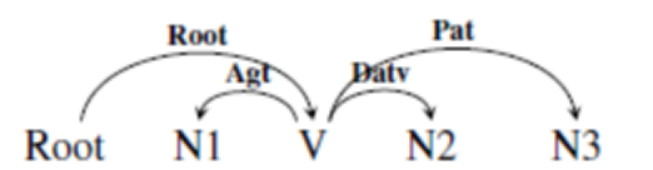

图 152双宾结构范式2

> 例如：他赠弟弟一支笔。（root，赠）

分析：“赠”是“给予类”的动词，“他”是“赠”的施事，“弟弟”是“赠”的涉事，“笔”是“赠”的受事。标注结果如下所示。

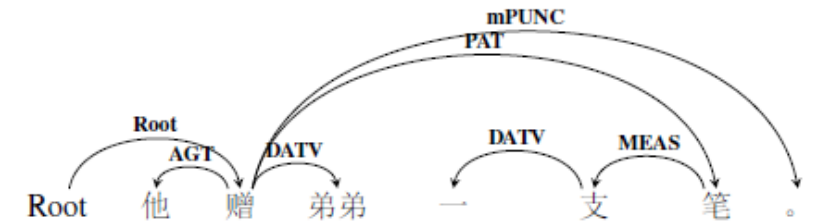

图 153双宾结构示例1

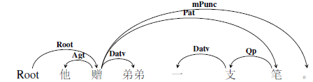

图 154双宾结构示例2

注意，有些双宾句可以变为非双宾句同义句，操作方式是将宾语提起那，上述例子变为：

> 他把一支笔赠给弟弟。（root，赠）

分析：这句话在句法上已经不是双宾结构，但是在语义上，这个动词仍然支配了三个论元并且其中一个论元是“与事”角色，即词对之间的语义关系不变。这其实也是深层语义表示超越句法限制的一种体现。标注结果如下图所示：

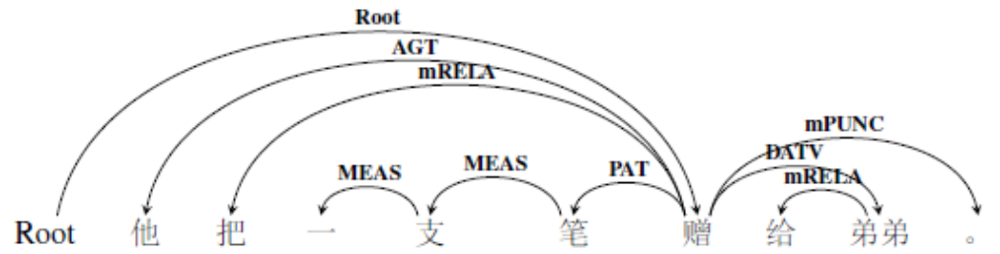

图 155双宾结构示例3

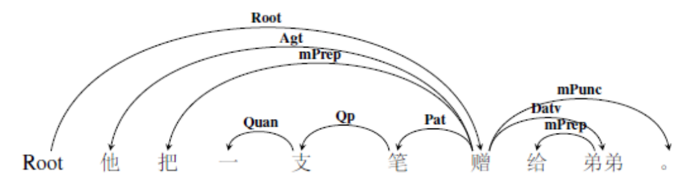

图 156双宾结构示例4

7.2.把字结构
------------

“把”字结构是这样一种结构，在谓语动词前头用介词“把”引出受事并对受事加以处置的一种主动句，在书面语言中，有时用“将”来替代“把”，但仍然称之为“把”字句。“把”字结构有明显的处置性，就是谓语动词为“把”引出的人或事物有施加影响，使它产生某种结果，发生某种变化，或者处于某种状态。“把”字结构有以下三个明显的特点：

1.  动词有明显的处置性，因此，不及物动词、能愿动词、趋向动词和“有”等不能用来做谓语动词；

2.  动词一般不能单独出现，通常后面有补语、宾语、动态助词，至少也是动词的重叠形式；

3.  有时候，把字引出的成分与谓语中心没有什么语义联系，而是跟动词后面的动补结构有语义上的联系。例如：“把眼睛哭肿了”。与“眼睛”有语义联系的词不是“哭”，而是“肿”。

基于上述三个特征，对于“把”字结构有两种标注方式：

**1）“把”引出的成分与谓语中心有语义联系。**

由于动词有明显的处置性，所以，主体成分一般是施事角色，“把”字后面引出受事。介词把依附在引出的成分上，并标注为介词标记mPrep，粗粒度标签为依附标记mDEPD，所以标注范式为：

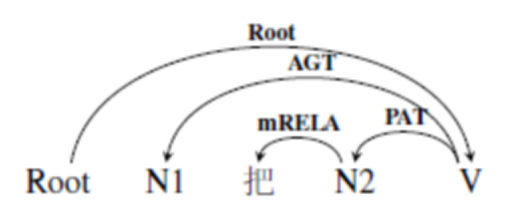

图 157把字结构范式1

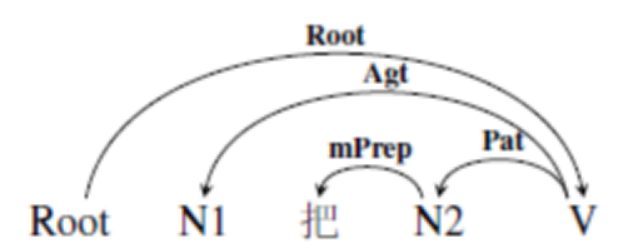

图 158把字结构范式2

> 例如：农民伯伯把庄稼种上了。（root，种）

分析：中枢论元root是“种”，“农民伯伯”是“种”的施事，而“农民”是“伯伯”的名称修饰语Nmod，“庄稼”是“庄稼”的受事，而介词“把”依存在“庄稼”上，“上”是“种”的一个依附标记。所以，标注结果如下图所示：

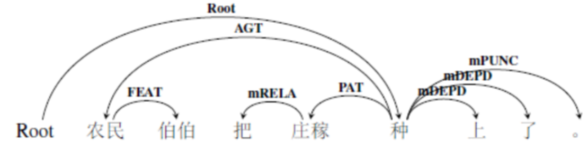

图 159把字结构示例1

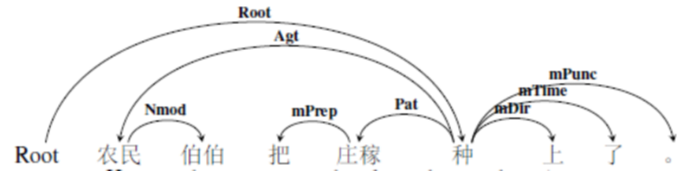

图 160把字结构示例2

**2）“把”引出的成分与谓语补语由语义联系。**

与上述情况的主要差别在于：介词“把”引出的成分不仅仅是谓语中心的受事，也是谓语补语成分的当事角色。这时候，就会出现语义依存弧交叉的情况。如果用“N1+把+N2+V+VC”来表示这种结构的话（VC是补充成分），那么标注范式如下：

图 161把字结构范式3

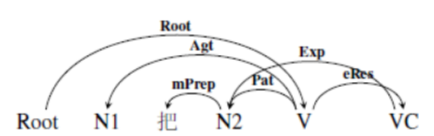

图 162把字结构范式4

> 例如：她把眼睛哭肿了。（root，哭）

分析：这个句子可以解构出三个关键信息：她哭了；眼睛肿了；哭肿了。我们要将这些语义信息都表示出来，所以标注结果如下图所示：

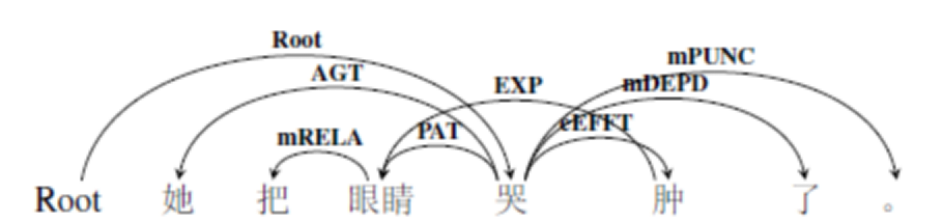

图 163把字结构示例3

图 164把字结构示例4

7.3.被字结构
------------

“被”字结构是指在谓语动词前面，用介词“被”引出施事或者单独使用“被”的被动结构。其中，被字可以替换成“给、叫、让”等。“被”字句用在两种事物的名称之间,表示后者处置前者。例如:我被老师批评了。其中，谓语动词也是具有明显动作行为的处置式动词，表达主语位置上的受事角色所遭受的某个动作。而且被字引出的施事主语经常不出现。即“我被批评了”。施受共现的被字句可以用“N1+被+N2+V”表示，施事隐现的被字句可以用“N1+被+V”表示。需要注意的是，如果施事出现的话，那么“被”字依附在N2上，如果施事不出现的话，那么“被”字依附在V上。所以，“被”字结构的标注范式为：

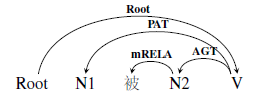

图 165被字结构范式1

图 166被字结构范式2

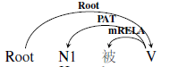

图 167被字结构范式3

图 168被字结构范式4

> 例如：我被老师批评了。（root，批评）

分析：这个句子的深层语义结构是“老师批评了我。”所以，此句的语义依存图标注如下：

图 169被字结构示例1

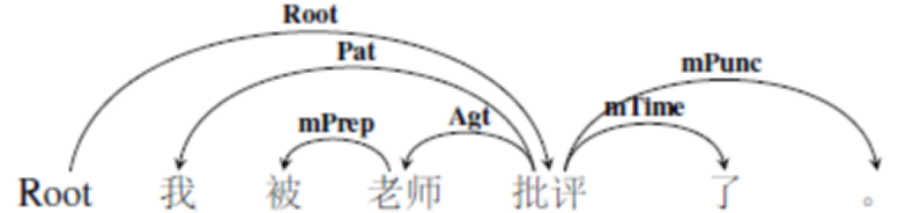

图 170被字结构示例2

与把字结构类似，被字结构的谓语中心所带的补语，也有可能与受事主语发生语义联系。这时候的被字结构可以用“N1+被+N2+V+VC”表示，VC不仅与V有语义上的关系，也与N1有语义联系，所以这时候标注范式为：

图 171被字结构范式5

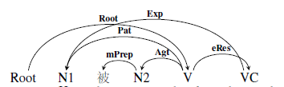

图 172被字结构范式6

> 例如：树叶被风吹跑了。（root，吹）

分析：谓语的补充成为“跑”不仅是吹的结果事件，同时其主体是树叶。我们要将这种语义关系也都标注出来。所以，标注结果用依存图表示如下：

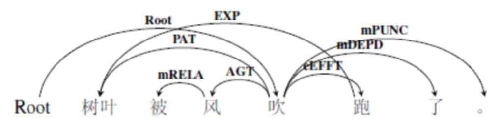

图 173被字结构示例3

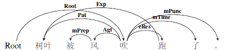

图 174被字结构示例4

7.4.比较结构
------------

比较结构是用来比较人和事物的异同的。含有比较结构的句子就是比较句。邵敬敏说过：究其差异、体现比较结果是比较句的基本语义要求。对于比较句的研究，也可以从句法和语义两个角度谈起。

从句法的角度来看，主要是对各种比较句式进行的研究。有很多分类，比如“比”字句——指含有“比”字介词短语作状语的句子；“没”字比较句和“不如”比较句——专指用“没有”或“不如”表示对它前后两个事物进行比较的句子；“和”字比较句，指用“和”字表示比较的句子。除此之外，还对比较句其他各种位置上，能够出现的句法成分进行了很多的研究。

从语义的角度来看，对比较句的语义分类，有二分的，也有三分的，也有更为细致的分类方法。吕叔湘将比较句分为异同比和高下比两种；《马氏文通》将比较句分为平比、差比、极比三种；也有学者分为同比、异比、差比和极比四种，也有学者借鉴外语，将汉语比较句分为最高级、比较级、等同级和相差级四种等等。

对于比较句的标注，很多标注规范采用了特殊处理的方式。虽然比较句式有很多种，例如陈珺、周小兵（2005）等归纳总结了28个比较句式，但是比较要素却是有限的。一般来说，比较结构有比较主体、比较客体、比较词、比较点以及比较结果，其中比较点指的是比较主体和比较客体的相同点，比较结果由比较属性和比较差值组成，例如：今年的收成比去年好。比较点是“收成”，比较主体是“今年”，比较客体是“去年”，比较结果是“好”。

一般来说，比较主体是当事角色，比较客体是涉事角色（细粒度标注标签为比较Comp），比较结果是整个句子的谓语中心。在出现同样的比较要素的情况下，比较句式可以多变。即表层形式可以有多种变化，但是深层语义是一致的。例如：

> 1. 今年的收成比去年好。
> 2. 今年的收成比去年的好。
> 3. 今年的收成比去年的收成好。
> 4. 今年比去年收成好。

这四个句子虽然句式不同，但是基本的比较要素是一致的。所以，标注时，将比较客体指向比较主体上，粗粒度标签标注为涉事角色DATV，细粒度标签标注为比较角色Comp比较点依附在比较结果上，一般是当事角色Exp，而比较词“比”依附在比较客体上，细粒度标签标注为介词标记mPrep，粗粒度标签标注为依附标记mDEPD。以例1和例4为例，将标注结果展示如下：

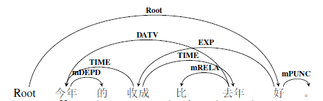

图 175比较结构示例1

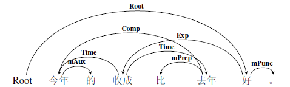

图 176比较结构示例2

图 177比较结构示例3

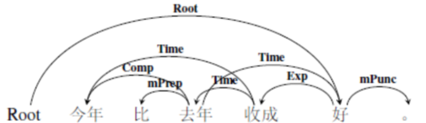

图 178比较结构示例4

与比较相关的有一种易混淆的修辞手法，即比喻。比喻是一种形象的修辞手法，包括本体和喻体，比喻跟比较不同，比喻是基于两个事物的相似性，比较是为了对两个事物进行差异化描述。

> 例如：这个工地有如田径场般大。（root，大）

分析：在这个短语中，“田径场”是对“工地”面积的一种形象化的表示，而非将“工地”与“田径场”进行比较。像、类似、如等是关系动词。所以，我们将它的细粒度标签标注为类事角色Clas，粗粒度标签标注为系事角色LINK。标注结果如下所示：

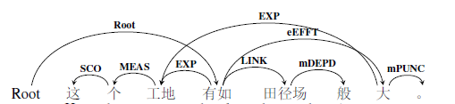

图 179比较结构示例5

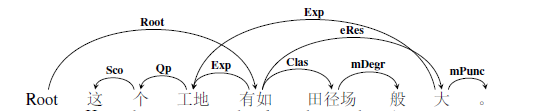

图 180比较结构示例6

7.5.话题结构
------------

话题结构指的是由话题和说明两部分组成的语法结构，话题在前，说明在后，对话题进行进一步的解释，又可以叫作话题-陈述结构，或者话题-述题结构。从语用上看，汉语的主谓谓语句具有明显的“话题－说明”结构。有学者认为（LI&Thompson，1976），虽然汉语中并存着“主语－谓语”和“话题－说明”两种语法关系，但是后者更具有类型学价值。汉语被称为话题凸显的语言，除了典型的SVO语序外，汉语还允许两种变异语序——SOV和OSV。主谓谓语句是“话题－说明”结构的基本句式。

主谓短语充当谓语的句子叫做主谓谓语句。这类句子的出现，需要一定的语义组合限制，黄伯荣，廖序东按照全句的主语（大主语）和主谓短语里的主语（小主语）是施事还是受事等语义关系来看，分为五种：

1.  大主语是受事，小主语是施事。全句的语义关系类型是：受事｜｜施事——动作。

>   例如：任何困难｜他都能克服。

2. 大主语是施事，小主语是受事。全句的语义关系类型是：施事｜｜受事——动作。

>   例如：他｜任何困难都能克服。

3. 大主语和小主语有广义的领属关系。

>   例如：他｜一向态度和蔼。

4. 谓语里有复指大主语的复指成分。

>   例如：这孩子，｜我也疼他。

5. 大主语前暗含一个介词“对、对于、关于”等。大主语前如果加上介词，就变成了句首状语了。

>   例如：这件事｜中国人的经验太多了。

为了简化分类，以便更简洁的对话题结构进行标注，我们借鉴袁毓林（1996）对于主谓谓语句的语义连结模式的分类。他将大主语标记为S，小主语标注为S’，所以主谓谓语句可以表示为“S+S’+VP”结构。S/S’跟VP的语义连结有两种模式：

- S/S’受到VP的格框架的支配，即S/S‘是VP的一个格。一般来说，S/S’可以是VP的施事、受事、与事、系事、工具等语义格。

- S/S’受不到VP的格框架的支配，是从属于句子框架的环境成分，例如时间空间等。

基于上述两种分类，我们按照S/S’是充当主客体角色或者是情境角色，分为两类：

1. S/S’充当主客体角色，大主语可以是VP结构的施事、受事、涉事等语义角色。例如：

>   1. 他｜任何困难都能克服。（root，克服）（克服，他，施事Agt）

>   2. 任何困难｜他都能克服。（root，克服）（克服，困难，受事Pat）

>   3. 结婚的\|我总送这个。（root，送）（送，结婚，涉事Datv）

>   4. 快乐\|他感受不到。（root，感受）（感受，快乐，客事Cont）

2. S/S’充当情境角色，大主语描述的是整个语义事件发生的时间、空间、工具等场景性因素。例如：

> 1. 这把刀\|我剁排骨。（root，剁）（剁，刀，工具Tool）

> 2. 昨天\|小王去上海了。（root，去）（去，昨天，时间Time）

> 3. 屋里\|大伙儿正开会呢。（root，开会）（开会，屋里，空间Loc）

综上是对话题结构的标注说明。话题结构是从语用角度分析出来的语法结构。对于这种结构的标注方式，本质上还是按照实际的语义关系来处理，即无论表层结构是什么形式的，其深层的语义关系是不变的。所以，在标注的时候按照实际语义关系进行标注即可。分别以上述两个例句为例：

> 1. 他｜任何困难都能克服。（root，克服）（克服，他，施事Agt）

> 2. 任何困难｜他都能克服。（root，克服）（克服，困难，受事Pat）

分析：句1和句2的深层语义关系是一致的，“他”为施事角色，“困难”是受事角色，“克服”是整个句子的中枢论元。但是句1是将施事角色作为话题置于句首，而句2是将受事角色作为话题置于句首，标注时，仍按照真实语义关系进行标注，没有固定的标注范式。所以标注结果如下所示：

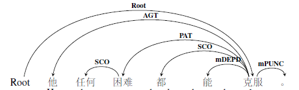

图 181话题结构示例1

图 182话题结构示例2

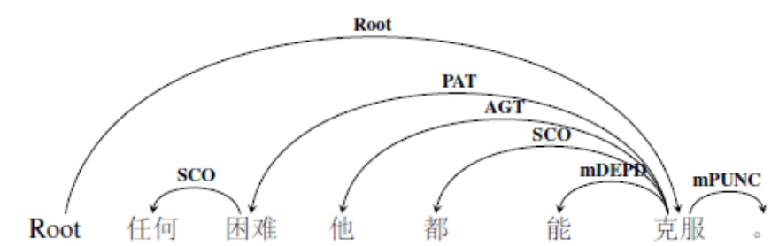

图 183话题结构示例3

图 184话题结构示例4

7.6.介词结构
------------

介词起标记作用，依附在实词或者短语前面共同构成“介词短语”，整体主要起修饰、补充谓词性词语，标明跟动作、性状有关的时间、处所、方式、原因、目的、施事、受事、对象等。

根据定义，我们知道介词的主要功能是起标记作用，所以，我们对于介词一律标注为介词标记mPrep，粗粒度标注标签为关系标记mRELA，依附在介词后面的实词上。同时，根据介词的不同，我们可以很容易的对介词引出的成分进行标注。例如：

介词“把”引出施事角色（详见7.2节）；

介词“被”引出施事角色（详见7.3节）；

介词“按照、通过、用”用等引出方法、工具角色等；

介词“从、到”等引出时间、空间等角色。

但是，有些介词短语已经抽象出一些固定词组，对于这些固定用法，我们说明一下标注细则：

1. **在……上/下：**多标注为“**介词标记+范围角色+依附标记**”。将介词结构内部的中心语与整个语义事件中与该短语由依存关系的词语连接，并标注为范围角色。例如：

   > 1. **在运行机制上**与保税区配套。（root，配套）

分析：这个介词结构中，“在运行机制上”是“配套”的范围，“保税区”是一个涉事角色，“运行机制”中，“机制”是中心语，“运行”是“机制”的内容角色，“在”是一个介词标记，而“上”是一个依附标记。所以，最终的标注结果如下所示：

图 185介词结构示例1

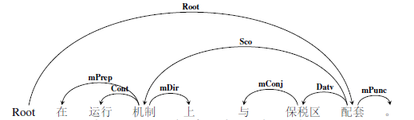

图 186介词结构示例2

2. **在……时候：**多标注为“**介词标记+时间角色+依附标记**”。在这个结构里，无论中间是什么成分，它都是句子的时间状语，也即整个语义事件的时间角色。所以，我们将结构内部的中心标注为时间角色，并与结构外部的谓语中心相连接。而“时候”则依附在内部语义中心上，粗粒度标签标注为依附标记mDEPD，细粒度标签标注为时间标记mTime。注意，这种结构也可以缩写为“V+时”。

- **a)当中间插入的成分是单独一个谓词时：**

>   例如：在吃饭的时候，爸爸回来了。（root，回来）（回来，吃饭，时间角色Time）

分析：根据分词结果，单独的一个动作会被切成一个待标成分，我们把“回来”指向“吃饭”。“吃饭”指向“时候”，标注为依附标记。标注结果如下图所示：

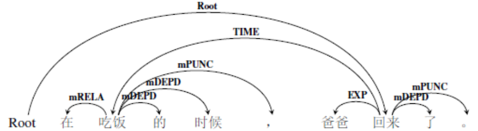

图 187介词结构示例3

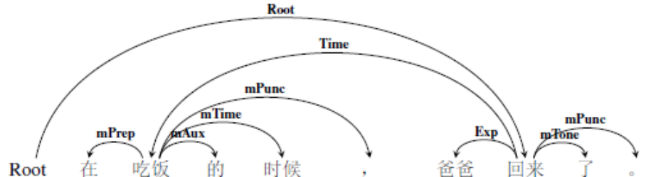

图 188介词结构示例4

该例句可以缩写为：

> 吃饭时，爸爸回来了。

标注结果如下所示：

图 189介词结构示例5

图 190介词结构示例6

- **b)当中间插入的成分是一个形容词时：**

>   例如：在我们满头雾水的时候，他想出了一个好主意。（root，想）（想，满头雾水，时间角色Time）

分析：“满头雾水”是一个形容词，是这个介词结构内部的语义中心，将“想”指向“满头雾水”，标注为时间角色，“满头雾水”指向“时候”，标注为依附标记。标注结果如下图所示：

图 191介词结构示例7

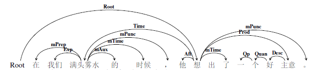

图 192介词结构示例8

- **c)当中间插入的成分是一个语义事件时：**

>   例如：就在决定结束三星堆工作站的时候，传来了振奋人心的消息。（root，传来）（传来，结束，时间角色Time）

分析：结构内部是一个完整的语义事件，“结束”是其语义中心，所以，将“传来”指向“结束”，标注为时间角色，剩下的成分按照其语义关系进行标注。标注结果如下图所示：

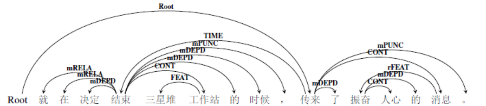

图 193介词结构示例9

图 194介词结构示例10

3. **以A为B：**这个结构中，“以”是一个介词，而“为”是一个表示关系类的动词，通常情况下，A是一个名词短语，B也是一个名词短语。以A为B，也就是把A当作B，所以，我们把A标注为受事角色，把B标注为系事角色，细粒度标签标注为类事角色Clas。这样相似的结构还有“把A当作B”、“把A称之为B”等，即“**介词+A+关系动词+B**”的结构。标注范式为：

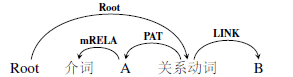

图 195介词结构范式1

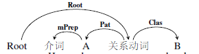

图 196介词结构范式2

>   例如：经济发展会不会以社会公平为代价？（root，为）

分析：“经济发展”是当事角色，“社会公平”是受事，而“代价”是一个系事角色。注意，本句中的“会不会”是一个选择关系（eSelt）的语义情态标记。标注结果如下图所示：

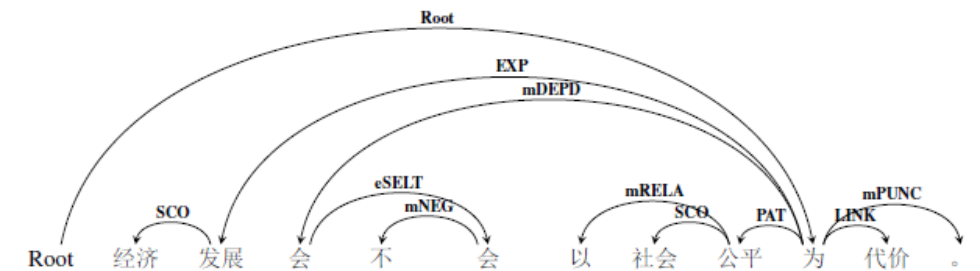

图 197介词结构示例11

图 198介词结构示例12

7.7.同位结构
------------

同位结构多由两项组成，前项和后项的词语不同，但所指是同一事物。在更大的机构中，前后项共作一个成分，因前后语法地位相同，故名同位短语；又因前后项有互相说明的复指关系，故又名复指短语。因为同位的两个或多个成分指代的是同一事物，所以，我们将它们标注为等同关系eEqu（粗粒度标签为并列关系eCOO）。如果将同位结构用“N1+N2”表示的话，N1是结构中心，与整个语义事件的中枢论元root连接。所以，同位结构的标注范式是：

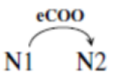

图 199同位结构范式1

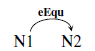

图 200同位结构范式2

同位结构可以中间有停顿，也可以中间无停顿。例如：

> ①首都北京（首都，北京，等同eEqu）

> ②一只野兔，这个可怜的小生灵，窜上了公路。（root，窜）（窜，野兔，施事Agt）（野兔，生灵，等同eEqu）

分析：句1是一个同位短语，只需将首都与北京相连接，标注为等同关系即可。句2
是一个语义事件，中枢论元root是窜，而野兔和生灵是同位关系，标注为等同关系eEqu，而窜需要和野兔连接。标注结果如下图所示：

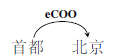

图 201同位结构示例1

图 202同位结构示例2

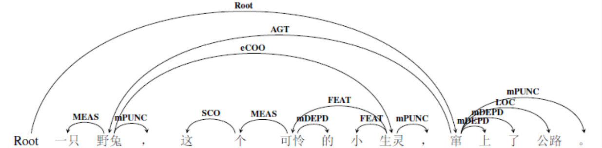

图 203同位结构示例3

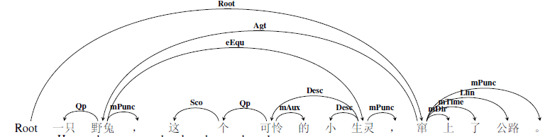

图 204同位结构示例4

7.8.引语结构
------------

引语就是引用别人说的话，又被称作是“言说结构”：即“说”类动词引导的结构。一般有两种方式：直接引语和间接引语。直接引语是直接引用别人原句，从形式上说，有冒号和引号作为提示；间接引语是用自己的话转述别人的话，不能用引号。

因为对于文本的分句是自动处理的，所以有时候直接引语里说话人引用的是很长的语篇结构，这给标注带来了很大的困难。所以，我们人工对于这样的句子进行一些虽然很粗糙但是很实用的处理：**放弃直接引语中的说话人信息，将引语按照句号等分隔符分开**。注意，有些结构中没有引号，但是有冒号，我们也会按照引语结构进行处理。

对于引语结构，不论是直接引语还是间接引语，引述的内容往往是一个完整的语义事件，我们将说话人引述的这个事件标注为降级语义事件。对于引语结构，我们可以这样用“N1+说类动词+……+V……”来表示，“说”类动词的主体角色N1一般是施事角色，而引述事件中的中枢论元V一般标注为降级客事角色，表示这是主体N1说讲述的内容。所以，标注范式如下：

图 205引语结构范式1

图 206引语结构范式2

> 例如：何飞飞喊着：“别听他的话。”（root，喊1）（喊1，听，降级客事dCont）

分析：本句是一个直接引语，将root指向“喊”，表示这是整个句子的中枢论元，而引述的部分是主体角色“喊”的内容，所以标注为降级客事角色，由“喊”指向“听”。剩下的待标成分按照实际语义关系进行标注。标注结果如下所示：

图 207引语结构示例1

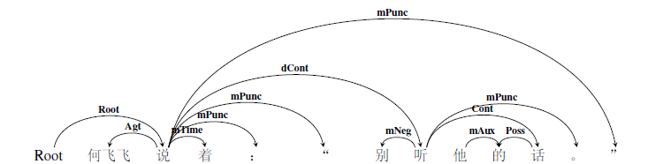

图 208引语结构示例2

> 再例如：澳外长说澳坚持一个中国政策。（root，说）（说，坚持，降级客事dCont）

分析：本句是一个间接引语，分析过程类似。“说”是中枢论元，而“澳坚持一个中国政策”都是主体角色“说”的内容，所以标注为降级客事事件。剩下的待标成分按照实际语义关系进行标注。标注结果如下所示：

图 209引语结构示例3

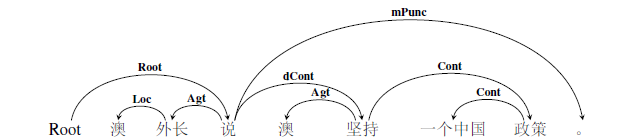

图 210引语结构示例4

7.9.古诗词结构
--------------

诗词是中文独有的一种文体，有特殊的格式及韵律。诗按照音律分，分为古体诗和近体诗两类。这是文学上的分类，在具体的操作中，我们将一些骈文结构也视为古诗词结构，例如《红楼梦》中，作者曹雪芹借不同的人物之手，写了很多的优秀的诗词，同时也有一些非常工整的骈文。《好了歌》是诗词，而对《好了歌》的解注是骈文。试对比：

> 1. 世人都晓神仙好，唯有功名王不了。

> 2. 陋室空堂，当年笏满床；衰草枯杨，曾为歌舞场。

句1是诗词，句2是骈文。主要有两个问题：一是分词；二是断句。由于现有的自动分词和分句工具都是主要针对现代汉语的，对于这些结构往往不能切出非常完美的结果，所以，这就需要标注员在标注之前检查并修改分词结果后再进行标注。对于第二个问题，由于古代文本中标点符号使用不甚规范，需要人工对于分词结果进行校对，在这个过程中，可以结合长度和语义，对于一些分句结果进行修改。

在我们的待标语句中，按照古诗词出现的“场合”的不同，分为两种情况。

**情况一，是古诗词作为引用部分。**

如果古诗词是作为引用部分出现的话，我们可以将它们标注为一个待标成分，结合它们在语义事件中的语义关系进行标注。这种情况可以扩大到一些成语、俗语、谚语等习惯用语中。

> 例如：苏东坡曾把这种放达称之为“老夫聊发少年狂”。（root，称）

分析：这个句子很长，其中出现了苏轼名句“老夫聊发少年狂”，这个句子可以视为把A称之为B的结构，“为”+“老夫聊发少年狂”整体上做了中枢论元“称”的降级客事角色，粗粒度标签为系事LINK。另外，本句中还有一个“之”字，它实际上复指“放达”，所以，也需要将它同“放达”用依存弧连接，标注为等同关系eEqu，粗粒度标签为并列eCOO。所以标注结果如下图所示：

图 211古诗词结构示例1

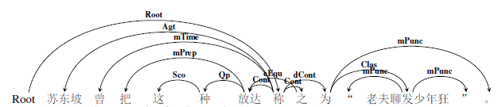

图 212古诗词结构示例2

**情况二，是古诗词单独出现。**

对于古诗词单独出现的情况，我们要结合实际语义情况，对待标语句进行修改。例如上述第2个例句：

> 陋室空堂，当年笏满床；衰草枯杨，曾为歌舞场。（root，满床）

分析：这是两个并列分句。中枢论元可以标注在第一个分句的述谓概念“满”上，“陋室、空堂、床”等概念都是空间角色，“当年”是时间角色，所以，结合上下文，“衰草、枯杨”应该也是标注为空间角色，因为它实际指代的是“破败的房间”。标注结果分别如下：

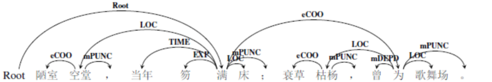

图 213古诗词结构示例3

图 214古诗词结构示例4

实际上，对于每一句诗词，都有可能出现不一样的标注情况。

1.  **分词结果。**如果对于分词结果不满意，是可以修改的。一般来讲，修改后的分词结果是越细越好。因为古代的文本以单音字节为主，每一个字的含义都非常丰富。不仅如此，有些现代汉语中的词，在古汉中时短语，例如：妻子。现代汉语是一个词，表示丈夫的配偶，而古汉是一个并列短语，表示“妻子和儿子”。所以，如果修改分词结果的话，我们鼓励修改后的分词颗粒度更细。

2.  **意象指代。**诗词为了表达的精美、韵律的和谐、意蕴的深远经常使用意象，这就加大了标注的难度。我们面临一种选择，是按照本义标注，抑或是按照这个意象指代的实际意义进行标注呢？针对这种情况，我们倾向于，如果确定知道这个意象的指代结果，我们就按照意象指代义标注，如果不知道，就按照本义标注。例如句2中，“衰草枯杨”，本义是“衰败的草”和“腐朽的杨树”，但是结合骈文特有的对偶的修辞手法，与“衰草枯杨”相对应的短句是“陋室空床”，可见，这个意象实际指代的一个空间场所，这也与后文的“歌舞场”相对应，需要标注为空间角色。

7.10.构式结构
-------------

构式语法（Construction Grammar）上个世纪80年代后期逐渐兴起的一种语法理论和适应几乎整个语言门类的研究方法和流派，本质上属于认知语言学的范畴。对构式的定义，目前以Goldberg的定义最为流行：当且仅当C是一个“形式—意义”的配对\<Fi,Si\>，且形式Fi的某些方面或意义Si的某些方面不能从C的构成成分或从其他已有的构式中得到严格意义上的预测，C便是一个构式。对于这个定义，有两点需要强调：其一构式的本质是形式和意义的配对；其二构式的特殊之处在于从构式成分不能预测整个构式的意义也就是说构式不是1+1=2的问题，而是1+1\>2的问题，结构会给“形式-意义”这个象征性单位增添新的意义。根据Goldberg的构式示例，可以从语言单位层级的角度分为四大类：

1.  语素；

2.  词——包括单纯词和复合词；

3.  习语——含完全固定的和部分固定的；

4.  格式——大致相当于句型。

构式语法的根本主张，是认为人们关于语言的知识其实就是一个庞大的构式网络的知识库。从这个角度看，上述讨论的所有结构性的内容都属于构式语法，这样说来，构式结构所包含的内容就太丰富了。所以，此处我们讨论的构式结构只包含两个内容：一是熟语；二是部分口语。

**先说熟语。**

熟语是人们常用的定型化了的固定短语。由于熟语具有凝固定型的性质，人们常常把它当做一个语言单位来使用。属于主要包括成语、谚语、惯用语和歇后语。

**成语**是一种相沿习用、含义丰富、具有书面语色彩的固定短语。对待标语料分词后，成语一般自成一个标注单位。在这种情况下，我们对于成语的标注只需按照它在该语义事件实