际的语义关系进行标注即可。

> 例如：我们要有愚公移山的精神。（root，有）

分析：“愚公移山”是一个成语，表达“不畏艰难、坚持不懈”之义，在这里作定语，修饰“精神”，所以标注为修饰角色。标注结果如下图所示：

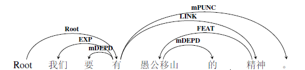

图 215构式结构示例1

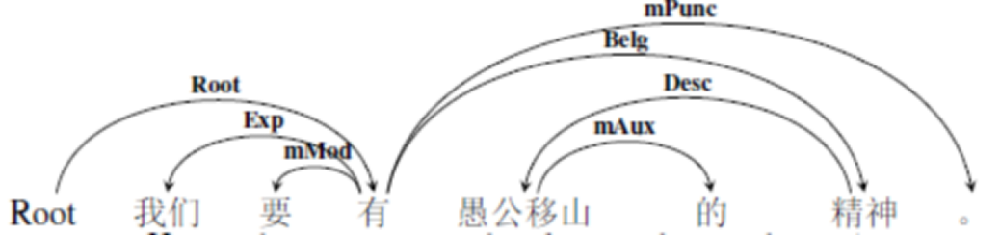

图 216构式结构示例2

**谚语**是群众口语中通俗精炼、含义深刻的固定语句。成语是固定短语，而谚语是固定语句。即从形式上看，谚语一般都是句子，例如：众人拾柴火焰高；开水不响，响水不开；少壮不努力，老大徒伤悲；水滴石穿等。这些谚语，由于口语性强，在书面语中出现的频率不高，多是作为直接引语出现。

**惯用语**是口语中短小定型的习用的短语，大都是三字的动宾短语，也有其他格式的，中间往往可以插入其他成分。例如：碰钉子、下马威、闭门羹等。

谚语和惯用语都是口语色彩浓厚的熟语，从形式上说，谚语一般比惯用语要长。对于它们的标注，在分词结果的基础上，有两种情况：

- 第一种，虽然含义深刻精炼，但是不完全脱离结构组合义，我们按照正常的标注方式进行标注。需要注意的是，这种情况一般都是谚语，因为语句比较长。

> 例如：众人拾柴火焰高。（root，拾）

分析：解释为众多人都往燃烧的火里添柴，火焰就必然很高，比喻人多力量大。从词义引申的角度来讲，其字面义和比喻义有隐喻关系，即在二者相似基础上的词义引申。在这个例句上，root是行为动作“拾”，“众人”是施事，“柴”是受事，引起的事件结果是“火焰高”。所以，标注结果如下图所示：

图 217构式结构示例3

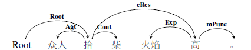

图 218构式结构示例4

- 第二种，谚语或者惯用语中会有一部分，其组合后形成的意义与比喻义相差很大，标注时需要把这个结构视为一个语义整体，放在整个语义事件去考察它与其他待标成分的语义关系。例如：碰钉子。这是一个动宾短语。例如下面一组句子：

> a)他一低头，碰在了一个钉子上。（root，低头）

> b)他在领导那里碰了一个大钉子。（root，碰）

分析：句a是碰钉子的字面义，“碰”是root，而“钉子”是客事角色，表示这是主体角色事件所涉及但是并未改变的客体。而句b则不一样，惯用语碰钉子的含义是遭到拒绝或者是受到挫折。与字面义差别甚远。在句b中，“碰钉子”表示主体角色他在涉事角色领导那里遇到的一个结果，即“碰钉子”是“他”在“领导”那里的一个结果，所以标注为结果角色。上述两个例子的标注结果如下图所示：

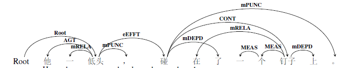

图 219构式结构示例5

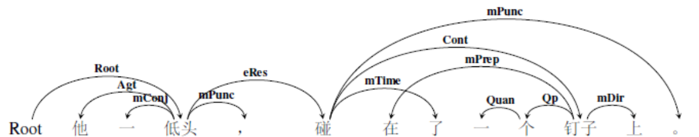

图 220构式结构示例6

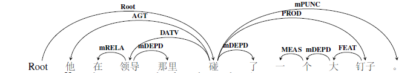

图 221构式结构示例7

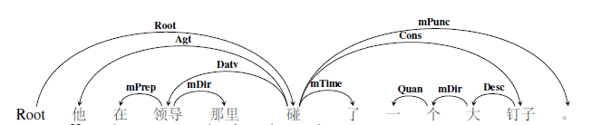

图 222构式结构示例8

**歇后语**是由近似于谜面、谜底的两部分组成的带有隐语性质的口头固定短语。例如“千里送鹅毛——礼轻人意重。”前一部分是比喻，即说以一个事物来打比方，像谜语里的“谜面”，后一部分像“谜底”，是真意所在。有时候，后面的谜底部分不说出来，让人猜想他的含义。基于此，对于歇后语的标注有两种情况：谜底部分出现的情况与谜底部分不出现的情况。

当谜底出现的时候，前后是一种可以视为一种固定的语义关系，即谜底是谜面的结果。所以，依存弧由谜面的语义中心指向谜底的结构中心，粗粒度标签标注为结局事件eEFFT，细粒度标签标注为结果事件关系eRes。

> 例如：千里送鹅毛——礼轻情意重。（root，送）（送，轻，eEFFT）

标注结果如下图所示：

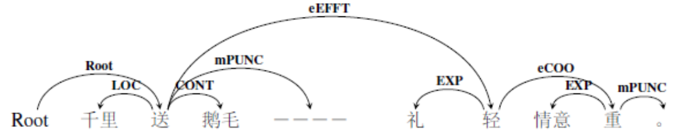

图 223构式结构示例9

图 224构式结构示例10

当谜底没有出现，只有谜面的时候，要按照实际的语义关系来处理。

> 例如：她就像腊月里的萝卜，再也由不得自己了。 （root，像）

分析：这句话中的“腊月里的萝卜”是一个歇后语的谜面，谜底是“动了心”，这句话的含义是“她对某人动了心，情不自禁了”。“像”是一个关系动词，所以将“萝卜”标注为系事角色。标注结果如下图所示：

![C:\\Users\\cheng\\Documents\\Tencent Files\\1501808365\\FileRecv\\MobileFile\\Image\\PS7P1P\~_6[B(834\`6VWF\$]K.png](media/10e53cffdb680c4d9fc5e6a13fcaed00.png)

图 225构式结构示例11

图 226构式结构示例12

其实我们发现，当只有谜面没有谜底的时候，歇后语常常出现在“像、似、仿佛”等关系动词的后面，这与它们有很强的比拟性有关。于是，对于它们语义角色的标注，大部分都是系事角色。

综上：对于熟语这种固定短语的标注，总得来说是两种情况，字面义与内涵义相差不大的，可以按照规律的标注方式进行标注；如果字面义与内涵义相差很大，则需要将这个熟语视为一个语义整体，放在整个语义事件中去考察它们之间的语义关系。

**再说口语。**

在我们已标注的语料以及待标语料中，涉及到口语的语料来源主要有微博语料、剧本语料以及部分教材语料。口语语料的典型特点是灵活多变，将口语语料记录下来后，会出现一些特别不规则的现象。例如：“糊涂的可以”、“胖不到哪里去”，对于这种情况，要在理解该口语结构整体含义后，找出结构中心，标注语义关系，其余的待标成分作为依附标记依附在结构中心上。“糊涂得可以”中，整体含义是“糊涂”，而“得”和“可以”并没有发挥它们的理性意义，所以，粗粒度标签标注为依附标记，细粒度标签标注为实词虚化标记，表示这些成分的实际语义都已经虚化了，依附在“糊涂”上。而“胖不到哪里”去，整体的语义是“不胖”，所以同上，将其余的待标成分作为依附标记，依附在“胖”上。上述两个例子的标注结果如下图所示：

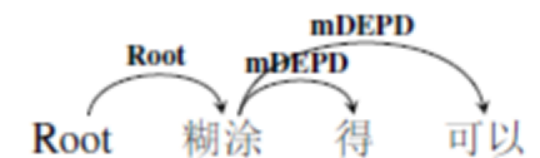

图 227构式结构示例13

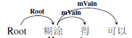

图 228构式结构示例14

![C:\\Users\\cheng\\Documents\\Tencent Files\\1501808365\\FileRecv\\MobileFile\\Image\\(_CR[]POPG2(4PXP\`TL{8PP.png](media/76fdcfa3128155b89242b154e2baef40.png)

图 229构式结构示例15

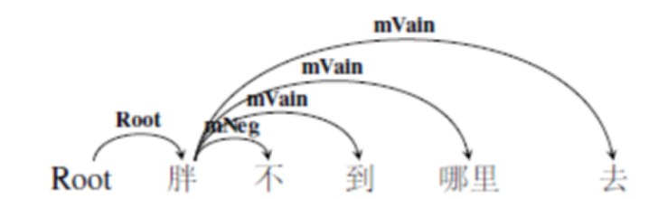

图 230构式结构示例16

注意，在一些网络语言中，用户对于标点的使用，似乎也形成了一种新的“构式”，例如：“/(ㄒoㄒ)/\~\~
”是由几个标点符号组合形成的一个表情符号，含义是“哭泣”。对于它的处理，我们是将这些标点符号的组合作为一个整体，在标注之前，可以修改分词结果，将它们作为一个整体进行标注。

7.11.紧缩结构
-------------

一般复句的分句之间都有语音停顿，紧缩句由复句紧缩而成。紧是紧凑，指语气上紧，隔开分句的语音停顿没有了；缩，是缩减，指结构上有些词语被压缩掉了。这是分句间没有语音停顿的特殊结构。简单来说，紧缩结构只限前后两部分，后部分的起语不能出现。两部分必有关联词语像联系，中间无停顿，如有停顿就是复句。从紧缩的程度来看，有两种情况。

- **情况一：形式上更像连谓句的情况。**

一部分紧缩句与单句中的连谓句相像，但不相同，主要区别在于结构上有无关联词以及意义上有无复句所具有的假设、条件等关系。例如：

> 1. 他一坐下来就看书。（root，坐）

> 2. 他坐下来看书。（root，坐）

句1是紧缩结构，有关联词语，前后有条件关系，而例2是连谓结构。对于例1这种情况，将这个紧缩结构按照事件关系标注即可。中枢论元是“坐”，“看书”是“坐”的后续事件关系eSucc。所以标注结果如下图所示：

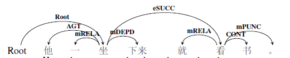

图 231紧缩结构示例1

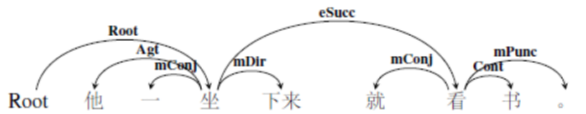

图 232紧缩结构示例2

- **情况二：形式上更像一种构式。**

这部分紧缩句常常在口语中使用，形式上简洁明快。常常成对或者单用一个关联词语表示分句间的联系，也可以没有关联词语。关联词语大都是起关联作用的副词。这些紧缩结构例如：不问不开口；再说也没有用；说了又说，看了又看；无私才能无畏；争气不争财等。对于这种情况，只能根据每个结构的实际情况，并结合更广阔的语言背景进行标注。

7.12.名词短语结构
-----------------

名词短语在现代语法描写中即指名词性的结构，既包括以名词为核心、句法表现相当于名词的短语，也包括并不以名词为核心、句法表现相当于名词的结构，如“的”字短语，还可以包括由单个名词或名词性代词构成的单位。名词短语属于短语的功能分类，相对应的结构可以是名词性联合结构、偏正结构、同位结构、方位结构等。结合实际标注情况，主要对以下三种情况进行标注说明：

- **情况一：“的”字短语。**

“的”字短语由两种，一种是D1短语，例如：我的\|买的\|找你的；一种是D2短语，例如：高高的\|仔仔细细的。主要区别在于D1短语去掉“的”字就不是“的”字短语，有“的”和没“的”的意义不一样。D2主要做谓语。这里我们讨论的主要是第一种的字短语，由助词“的”附着在实词或者短语后面组成，指称人或事物，属于名词性短语。例如：

> 1. 大的照顾小的。（形容词+“的”）

> 2. 少不了吃的。（动词+“的”）

> 3. 他听到的是海潮的声音。（短语+“的”）

如前面所提，在对“的”字结构进行标注的时候，将“的”字作为语义结构中心，充当整个语义事件的某个论元。例如例1，“照顾”是语义事件的中枢论元，“大的”实指“年纪大的人”，做施事角色，而“小的”实指“年纪小的人”，做受事角色，所以标注结果如下所示：

图 233名词短语示例1

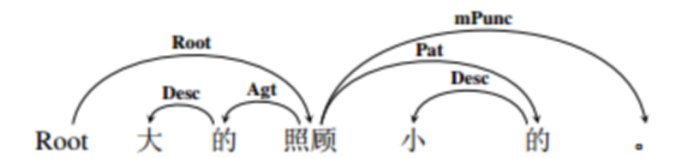

图 234名词短语示例2

注意，在体词性成分充当中枢论元一小节中（3.2节），我们介绍了“的”字短语充当中枢论元时的标注情况。此处的“的”字短语是它们充当语义角色时的标注情况。

- **情况二：“所”字结构。**

所字结构是由助词所加在动词前面组成，指称动作所支配或关涉的对象。一般来说，所字结构在成句时，仍旧要利用“的”字来组成的字短语。所字结构都是名词性短语。

> 例如：我所陈述的都是真实的。（root，是）

分析：“所”字结构的语义内部核心是动词“陈述”，本句中枢论元root是“是”，“是”的主体角色是“我所陈述的”，介词所依附在陈述上，细粒度标签标注为介词标记mPrep，粗粒度标签标注为依附标记mDEPD。注意客体成分“真实”是对主体成分的修饰，它与中枢论元“是”之间没有语义关系，而是与主语成分发生语义关系，所以，依附在“陈述”上。标注结果如下所示：

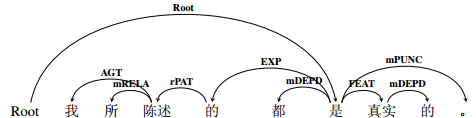

图 235名词短语示例3

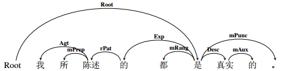

图 236名词短语示例4

- **情况三复合名词短语**

复合名词短语是一种特定类型的短语，它由相邻的名词序列组成，其功能整体相当于一个名词，如“电子警察、空气质量问题”等。这类名词短语内部结构复杂，相应的语义关系也是多种多样。但是，汉语的名词短语可以视为核心后置结构，所以我们将最后一个名词视为结构中心，对于其他待标成分，粗粒度标签统一标注为修饰成分。

> 例如：空气质量问题（root，问题）

标注结果如下图所示：

图 237名词短语示例5

如果按照细粒度标注标签，那就需要对这里的每一种语义关系进行详细的描述，名词短语标注原则：

1.  看是否是命名实体。命名实体内部标注Nmod。

2.  如果是一个表示地点、人名等专有名词修饰的非命名实体，之间的关系也标Nmod。

3.  如果是表示领属关系的，例如“他的书”，标注为领事角色Poss。

4.  普通的名词间修饰，看看是否为比较常见的角色如：材料角色（木头椅子）、空间角色（空中楼阁）、内容角色（教学笔记）、宿主角色（住房面积）等。

5.  不是以上角色就是描述角色（素食馆）。

其实，对于普通的名词短语（包括偏正结构等，有“的”以及没“的”的名词短语等），都可以上述的情况，对于名词短语进行标注。还是“空气质量问题”的的例子，“质量”是“空气”的内容角色，而“空气”是“质量”的范围角色，所以细粒度标注结果如下：

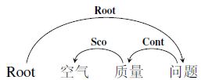

图 238名词短语示例6

7.13修辞结构
------------

修辞的本义是修饰言论，也就是在语言使用的过程中，利用多种语言手段以收到尽可能好的表达效果的一种语言活动。常见的修辞手法有很多：比喻、拟人、借代、排比、对比、对偶、双关、反语、夸张等。结合标注中常见的情况或者是比较特殊的修辞情况，对比喻、借代的情况进行特殊的说明。

**比喻**

所谓比喻就是打比方，是用本质不同又有相似点的事物描绘事物或说明道理的辞格。比喻里被比方的事物叫“本体”，用来打比方的事物叫“喻体”，联系二者的词语叫“喻词”。比喻按照构成要素的不同，可分为明喻、暗喻、借喻三类。在标注过程中，本体和喻体的出现对
于语义标注的意义很大，所以，按照本体喻体是否都出现，将标注分为两种情况。

- 情况一是明喻和暗喻。

明喻和暗喻的构成方式是本体、喻体都出现。但是暗喻的喻词更隐晦。明喻的喻词是“像、如、似、仿佛、犹如、一般、像……似的”等，而暗喻的喻词是“是、变成、成为、等于”等。虽然二者喻词不同，但是我们注意到，它们其实都是关系动词，所以一般情况下。本体和喻体之间的关系都可以用“当事-系事”来标注。例如：

> 1. 真理像星星一样闪出光亮，照亮一切。（root，像）

> 2. 中国是一只沉睡着的狮子。（root，是）

例1是明喻，“真理”是本体，标注为当事角色，“星星”是喻体，粗粒度标签标注为系事角色LINK，细粒度标签标注为类事角色Clas，“像”是中枢论元root，“一样”是“像”的结果，粗粒度标签标注为成事角色PROD，细粒度标签标注为结局角色Cons，而“闪出光亮照亮一切”是“像”的结果事件，所以标注结果如下所示。

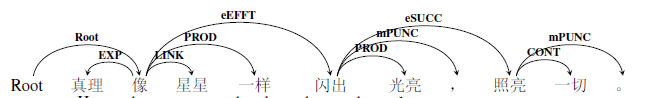

图 239修辞结构示例1

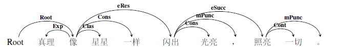

图 240修辞结构示例2

例2是暗喻，同理，“中国”是本体，标注为当事角色，“狮子”是喻体，标注为系事角色，“是”是中枢论元root。“一只沉睡着的”都是对“狮子”的修饰性成分，所以，标注结果如下所示：

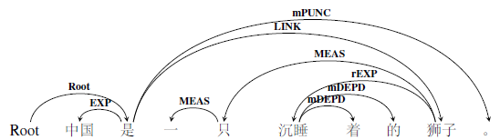

图 241修辞结构示例3

图 242修辞结构示例4

- 情况二是借喻。

所谓借喻，是不出现本体，而是借用喻体直接代替本体。也即喻体直接充当某一种语义角色。在标注时，要按照真实语义关系，进行标注。例如：

> 3. 鲁迅在一篇文章里，主张打落水狗。（落水狗是打的受事角色）

> 4. 看吧，狂风紧紧抱起一层层巨浪，恶狠狠地将它们甩到悬崖上，把这些大块的翡翠摔成尘雾和碎末。（翡翠是受事角色，尘雾和碎末是成事角色）

例3的标注结果如下所示：

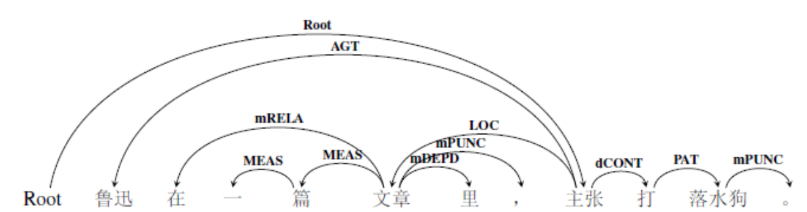

图 243修辞结构示例5

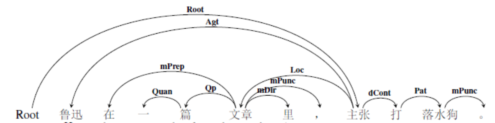

图 244修辞结构示例6

**借代**

借代是这样一种情况，不直说某人或某事物的名称，借同它密切相关的名称去代替。例如，用“红领巾”去代替少先队员等。借代重在事物的相关性，主要有五种类别：特征、标志代本体；专名代泛称；具体代抽象；部分代整体；结果代原因等。对借代成分进行标注的时候，应按照实际语义关系进行处理。例如：

> 1. 在这群光头、毡帽、长衫、马褂中间，他有种鹤立鸡群的气度。（特征代本体，本体是有这些特征的人，所以标注为涉事角色。）

> 2. 在中国共产党的领导下，中国人民用小米加步枪，打垮了帝国主义在中国的统治。（具体代抽象，本体是“军需供应”和“武器装备”，标注为工具角色。）

例1的标注结果如下图所示：

图 245修辞结构示例7

图 246修辞结构示例8

7.14省略结构
------------

省略是语言学界长期以来众说纷纭的话题。现代汉语的省略现象更是有其独特与复杂之处。以前的学者谈到省略的说法有很多：缩略、省略、隐含、暗示、删略、零形式、空位等。省略是语言各子系统在由其要素构成过程部分要素（或要素的部分）的从缺现象。

从语言的词汇系统、到句法系统再到语用系统都会出现省略。例如缩略语是词汇层级的一种省略，兼语句可视为是句法层级的一种省略等等。如果把这些都算进来，那么省略的内涵过于宽泛。所以，此小节我们所说的省略主要是句子级别同类项照应的省略以及篇章级别平行段落话题句的省略。

汉语中省略最多的主语，至于定语、宾语、状语、谓语等的省略，说法不一。这里我们举几个例子，说明我们的研究范围：

1.  我刚端起饭碗，还没吃呢？（宾语的省略）

2.  妈妈给她买了新的外套、鞋子。（定语的省略，“鞋子”前省略了定语“新的”）

3.  他从小不说谎，不骂人。（状语的省略，“不骂人”前省略了时间状语“从小”）

4.  今天星期一。（谓语的省略，“星期一”前省略了判断动词“是”）

由上述例子可以看出，首先，谓语的省略不在讨论范围之内。其次，定语和状语的省略一般也不在标注范围之内，因为如例2的“外套”、“鞋子”会被标注成为并列结构，“新”作为修饰成分，与“外套”连接即可。标注结果如下图所示：

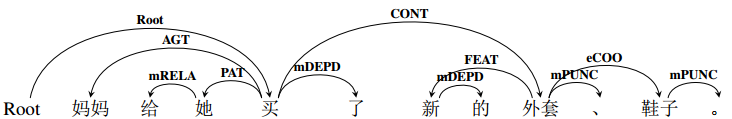

图 247省略结构示例1

图 248省略结构示例2

例3同理，“从小”作为一个时间状语，只与第一个“不说谎”连接，“不说谎”再与“不骂人”构成并列结构。

**所以说，省略结构的标注对象主要是承前省略中的中心语。**例如：

1.  前村有小汽车了，咱村也有了。（“有2”省略宾语“小汽车”）

2.  他俩从华西村来的，是富得流油的地方啊。（“是”前省略主语“华西村”）

3.  王老汉五十岁那年才添了儿子，现在都上小学了。（“现在”前省略主语“儿子”）

我们以例3为切入点，可知，后面从句中的主语是“儿子”，而非前一小句中的主语“王老汉”。所以，对于这种关系，需要重点标注出来。例3的标注结果如下图所示：

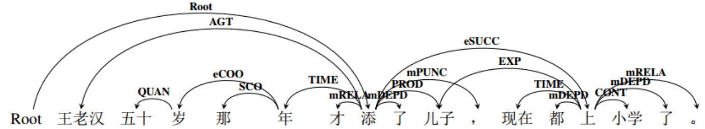

图 249省略结构示例3

![C:\\Users\\cheng\\Documents\\Tencent Files\\1501808365\\FileRecv\\MobileFile\\Image\\AX(Q7QLJF\@M[DLT16E7]30I.png](media/b2748a0021d3b31de646f778eb34a130.png)

图 250省略结构示例4

7.15零散问题集
--------------

本章主要是对标注过程中，标注员反馈之情况的总结与汇总。

 8结语
=========

真实语料可以说是保罗万象，非常复杂，故而对于文本语义内容的理解，是非常困难的。试图让计算机理解自然语言，更需要技巧与方法。为了全面理解每一个句子的深层语义，需要对不同的句法成分进行详细的标注。

本规范基于人类语言的复杂性以及计算机深层理解语言的需要，提出的文本语义依存图结构具有以下特点：

1.  创造性的提出文本依存图标注结构：在语义依存树的基础上，构建出语义依存图分析模型。语义依存图与语义依存树最大的不同在于，打破了单一父节点和不允许出现交叉弧这两个界限。根据语义关系与类型，将语义事件中每个成分进行语义标注。所以，语义依存图结构具有全面性的特点。

2.  确立了三类两级的标注体系：三种标注类型，指语义周边角色、语义结构关系和语义依附标记；级两级标注体系，指粗粒度标注标签集和细粒度标注标签集。三种标注类型对于语义事件中的核心论元、周边论元、结构关系以及依附标记分别进行了说明，所以，语义依存图结构具有层次性的特点。

3.  设定了角色类型的量化指标：为了保证标注的客观性以及实践的可操作性，我们对于每一种周边角色论元设定了衡量指标，根据角色特点，从语法、语义以及组合能力上进行了界定和说明，试图使标注规范更具科学性。并且，我们对于种种特殊结构都进行了依存关系的界定，对于一些有规律的结构，确定了标注范式。所以，语义依存图结构具有精确性的特点。

希望本规范说明能够进一步指导语料标注工作，为计算机的深层语义理解做好前提准备。

附录1：图表目录
===============

>   [图 1语义依存图示例1（粗粒度） 7](#_Toc504071369)

>   [图 2语义依存图示例2（细粒度） 7](#_Toc504071370)

>   [图 3语义依存图示例3（粗粒度） 8](#_Toc504071371)

>   [图 4语义依存图示例4（细粒度） 8](#_Toc504071372)

>   [图 5标注工具示例 13](#_Toc504071373)

>   [图 6语义关系框架 17](#_Toc504071374)

>   [图 7体词性成分做中枢论元示例1 22](#_Toc504071375)

>   [图 8体词性成分做中枢论元示例2 22](#_Toc504071376)

>   [图 9体词性成分做中枢论元示例3 23](#_Toc504071377)

>   [图 10体词性成分做中枢论元示例4 23](#_Toc504071378)

>   [图 11形容词充当中枢论元示例1 23](#_Toc504071379)

>   [图 12形容词充当中枢论元示例2 24](#_Toc504071380)

>   [图 13形容词充当中枢论元示例3 24](#_Toc504071381)

>   [图 14形容词充当中枢论元示例4 24](#_Toc504071382)

>   [图 15动词充当中枢论元示例1 25](#_Toc504071383)

>   [图 16动词充当中枢论元示例2 25](#_Toc504071384)

>   [图 17动词充当中枢论元示例3 25](#_Toc504071385)

>   [图 18动词充当中枢论元示例4 26](#_Toc504071386)

>   [图 19动词充当中枢论元示例5 26](#_Toc504071387)

>   [图 20动词充当中枢论元示例6 26](#_Toc504071388)

>   [图 21动词充当中枢论元示例7 26](#_Toc504071389)

>   [图 22动词充当中枢论元示例8 27](#_Toc504071390)

>   [图 23动词充当中枢论元示例9 27](#_Toc504071391)

>   [图 24动词充当中枢论元示例10 27](#_Toc504071392)

>   [图 25判断动词示例1 29](#_Toc504071393)

>   [图 26判断动词示例2 29](#_Toc504071394)

>   [图 27判断动词示例3 30](#_Toc504071395)

>   [图 28判断动词示例4 30](#_Toc504071396)

>   [图 29判断动词示例5 31](#_Toc504071397)

>   [图 30判断动词示例6 31](#_Toc504071398)

>   [图 31形式动词示例1 32](#_Toc504071399)

>   [图 32形式动词示例2 32](#_Toc504071400)

>   [图 33形式动词示例3 32](#_Toc504071401)

>   [图 34形式动词示例4 32](#_Toc504071402)

>   [图 35形式动词示例5 33](#_Toc504071403)

>   [图 36形式动词示例 33](#_Toc504071404)

>   [图 37趋向动词示例1 34](#_Toc504071405)

>   [图 38趋向动词示例2 34](#_Toc504071406)

>   [图 39趋向动词示例3 35](#_Toc504071407)

>   [图 40趋向动词示例4 35](#_Toc504071408)

>   [图 41趋向动词示例5 35](#_Toc504071409)

>   [图 42趋向动词示例6 35](#_Toc504071410)

>   [图 43心理活动动词示例1 36](#_Toc504071411)

>   [图 44心理活动动词示例2 36](#_Toc504071412)

>   [图 45心理活动动词示例3 37](#_Toc504071413)

>   [图 46心理活动动词示例4 37](#_Toc504071414)

>   [图 47心理活动动词示例5 37](#_Toc504071415)

>   [图 48心理活动动词示例6 37](#_Toc504071416)

>   [图 49能愿动词示例1 38](#_Toc504071417)

>   [图 50能愿动词示例2 38](#_Toc504071418)

>   [图 51能愿动词示例3 39](#_Toc504071419)

>   [图 52能愿动词示例4 39](#_Toc504071420)

>   [图 53重叠式范式1 40](#_Toc504071421)

>   [图 54重叠式范式2 40](#_Toc504071422)

>   [图 55重叠式范式3 40](#_Toc504071423)

>   [图 56重叠式范式4 40](#_Toc504071424)

>   [图 57重叠式示例1 40](#_Toc504071425)

>   [图 58重叠式示例2 41](#_Toc504071426)

>   [图 59重叠式范式5 41](#_Toc504071427)

>   [图 60重叠式范式6 41](#_Toc504071428)

>   [图 61重叠式示例3 41](#_Toc504071429)

>   [图 62重叠式示例4 41](#_Toc504071430)

>   [图 63重叠式示例5 42](#_Toc504071431)

>   [图 64重叠式示例6 42](#_Toc504071432)

>   [图 65离合式范式1 43](#_Toc504071433)

>   [图 66离合式范式2 43](#_Toc504071434)

>   [图 67离合式示例1 43](#_Toc504071435)

>   [图 68离合式示例2 43](#_Toc504071436)

>   [图 69离合式示例3 44](#_Toc504071437)

>   [图 70离合式示例4 44](#_Toc504071438)

>   [图 71离合式范式1 44](#_Toc504071439)

>   [图 72离合式范式2 44](#_Toc504071440)

>   [图 73并列式举例1 45](#_Toc504071441)

>   [图 74并列式举例2 45](#_Toc504071442)

>   [图 75并列式举例3 45](#_Toc504071443)

>   [图 76并列式范式1 45](#_Toc504071444)

>   [图 77并列式范式2 46](#_Toc504071445)

>   [图 78并列式范式3 46](#_Toc504071446)

>   [图 79并列式范式4 46](#_Toc504071447)

>   [图 80并列式范式5 46](#_Toc504071448)

>   [图 81并列式范式6 46](#_Toc504071449)

>   [图 82并列式示例1 46](#_Toc504071450)

>   [图 83并列式示例2 47](#_Toc504071451)

>   [图 84兼语式范式1 48](#_Toc504071452)

>   [图 85兼语式范式2 48](#_Toc504071453)

>   [图 86兼语式范式3 48](#_Toc504071454)

>   [图 87兼语式范式4 48](#_Toc504071455)

>   [图 88兼语式示例1 49](#_Toc504071456)

>   [图 89兼语式示例2 49](#_Toc504071457)

>   [图 90兼语式范式5 49](#_Toc504071458)

>   [图 91兼语式范式6 49](#_Toc504071459)

>   [图 92兼语式示例3 49](#_Toc504071460)

>   [图 93兼语式示例4 50](#_Toc504071461)

>   [图 94连谓式范式1 51](#_Toc504071462)

>   [图 95连谓式范式2 51](#_Toc504071463)

>   [图 96连谓式示例1 51](#_Toc504071464)

>   [图 97连谓式示例2 51](#_Toc504071465)

>   [图 98连谓式示例3 52](#_Toc504071466)

>   [图 99连谓式示例4 52](#_Toc504071467)

>   [图 100兼语连谓式范式1 52](#_Toc504071468)

>   [图 101兼语连谓式范式4 52](#_Toc504071469)

>   [图 102兼语连谓式示例1 52](#_Toc504071470)

>   [图 103兼语连谓式示例2 53](#_Toc504071471)

>   [图 104中补式范式1 54](#_Toc504071472)

>   [图 105中补式范式2 54](#_Toc504071473)

>   [图 106中补式示例1 54](#_Toc504071474)

>   [图 107中补式示例2 54](#_Toc504071475)

>   [图 108中补式示例3 55](#_Toc504071476)

>   [图 109中补式示例4 55](#_Toc504071477)

>   [图 110中补式示例5 55](#_Toc504071478)

>   [图 111中补式示例6 55](#_Toc504071479)

>   [图 112中补式示例7 55](#_Toc504071480)

>   [图 113中补式示例8 55](#_Toc504071481)

>   [图 114中补式示例9 55](#_Toc504071482)

>   [图 115中补式示例10 56](#_Toc504071483)

>   [图 116语义周边角色系统 57](#_Toc504071484)

>   [图 117数量角色示例1 78](#_Toc504071485)

>   [图 118数量角色示例2 79](#_Toc504071486)

>   [图 119数量角色范式1 79](#_Toc504071487)

>   [图 120数量角色范式2 79](#_Toc504071488)

>   [图 121反关系示例1 89](#_Toc504071489)

>   [图 122反关系示例2 89](#_Toc504071490)

>   [图 123嵌套事件关系示例1 92](#_Toc504071491)

>   [图 124嵌套事件关系示例2 92](#_Toc504071492)

>   [图 125嵌套事件关系示例3 93](#_Toc504071493)

>   [图 126嵌套事件关系示例4 93](#_Toc504071494)

>   [图 127嵌套事件关系示例5 93](#_Toc504071495)

>   [图 128嵌套事件关系示例6 94](#_Toc504071496)

>   [图 129嵌套事件关系示例7 94](#_Toc504071497)

>   [图 130嵌套事件关系示例8 95](#_Toc504071498)

>   [图 131并列关系示例1 99](#_Toc504071499)

>   [图 132并列关系示例2 100](#_Toc504071500)

>   [图 133选取关系示例1 101](#_Toc504071501)

>   [图 134选取关系示例2 101](#_Toc504071502)

>   [图 135割舍关系示例1 102](#_Toc504071503)

>   [图 136割舍关系示例2 102](#_Toc504071504)

>   [图 137选择关系示例1 102](#_Toc504071505)

>   [图 138选择关系示例2 102](#_Toc504071506)

>   [图 139后继事件关系示例1 106](#_Toc504071507)

>   [图 140后继事件关系示例2 107](#_Toc504071508)

>   [图 141先行事件关系示例1 107](#_Toc504071509)

>   [图 142先行事件关系示例2 107](#_Toc504071510)

>   [图 143后继事件关系示例3 107](#_Toc504071511)

>   [图 144后继事件关系示例4 107](#_Toc504071512)

>   [图 145先行事件关系示例3 107](#_Toc504071513)

>   [图 146先行事件关系示例4 108](#_Toc504071514)

>   [图 147总括事件关系示例1 108](#_Toc504071515)

>   [图 148总括事件关系示例2 108](#_Toc504071516)

>   [图 149语义标记示例1 115](#_Toc504071517)

>   [图 150语义标记示例2 115](#_Toc504071518)

>   [图 151双宾结构范式1 124](#_Toc504071519)

>   [图 152双宾结构范式2 124](#_Toc504071520)

>   [图 153双宾结构示例1 124](#_Toc504071521)

>   [图 154双宾结构示例2 124](#_Toc504071522)

>   [图 155双宾结构示例3 124](#_Toc504071523)

>   [图 156双宾结构示例4 125](#_Toc504071524)

>   [图 157把字结构范式1 125](#_Toc504071525)

>   [图 158把字结构范式2 126](#_Toc504071526)

>   [图 159把字结构示例1 126](#_Toc504071527)

>   [图 160把字结构示例2 126](#_Toc504071528)

>   [图 161把字结构范式3 126](#_Toc504071529)

>   [图 162把字结构范式4 127](#_Toc504071530)

>   [图 163把字结构示例3 127](#_Toc504071531)

>   [图 164把字结构示例4 127](#_Toc504071532)

>   [图 165被字结构范式1 128](#_Toc504071533)

>   [图 166被字结构范式2 128](#_Toc504071534)

>   [图 167被字结构范式3 128](#_Toc504071535)

>   [图 168被字结构范式4 128](#_Toc504071536)

>   [图 169被字结构示例1 128](#_Toc504071537)

>   [图 170被字结构示例2 128](#_Toc504071538)

>   [图 171被字结构范式5 129](#_Toc504071539)

>   [图 172被字结构范式6 129](#_Toc504071540)

>   [图 173被字结构示例3 129](#_Toc504071541)

>   [图 174被字结构示例4 129](#_Toc504071542)

>   [图 175比较结构示例1 130](#_Toc504071543)

>   [图 176比较结构示例2 131](#_Toc504071544)

>   [图 177比较结构示例3 131](#_Toc504071545)

>   [图 178比较结构示例4 131](#_Toc504071546)

>   [图 179比较结构示例5 131](#_Toc504071547)

>   [图 180比较结构示例6 131](#_Toc504071548)

>   [图 181话题结构示例1 133](#_Toc504071549)

>   [图 182话题结构示例2 133](#_Toc504071550)

>   [图 183话题结构示例3 134](#_Toc504071551)

>   [图 184话题结构示例4 134](#_Toc504071552)

>   [图 185介词结构示例1 135](#_Toc504071553)

>   [图 186介词结构示例2 135](#_Toc504071554)

>   [图 187介词结构示例3 135](#_Toc504071555)

>   [图 188介词结构示例4 136](#_Toc504071556)

>   [图 189介词结构示例5 136](#_Toc504071557)

>   [图 190介词结构示例6 136](#_Toc504071558)

>   [图 191介词结构示例7 136](#_Toc504071559)

>   [图 192介词结构示例8 137](#_Toc504071560)

>   [图 193介词结构示例9 137](#_Toc504071561)

>   [图 194介词结构示例10 137](#_Toc504071562)

>   [图 195介词结构范式1 138](#_Toc504071563)

>   [图 196介词结构范式2 138](#_Toc504071564)

>   [图 197介词结构示例11 138](#_Toc504071565)

>   [图 198介词结构示例12 138](#_Toc504071566)

>   [图 199同位结构范式1 139](#_Toc504071567)

>   [图 200同位结构范式2 139](#_Toc504071568)

>   [图 201同位结构示例1 139](#_Toc504071569)

>   [图 202同位结构示例2 139](#_Toc504071570)

>   [图 203同位结构示例3 139](#_Toc504071571)

>   [图 204同位结构示例4 140](#_Toc504071572)

>   [图 205引语结构范式1 140](#_Toc504071573)

>   [图 206引语结构范式2 140](#_Toc504071574)

>   [图 207引语结构示例1 141](#_Toc504071575)

>   [图 208引语结构示例2 141](#_Toc504071576)

>   [图 209引语结构示例3 141](#_Toc504071577)

>   [图 210引语结构示例4 141](#_Toc504071578)

>   [图 211古诗词结构示例1 142](#_Toc504071579)

>   [图 212古诗词结构示例2 143](#_Toc504071580)

>   [图 213古诗词结构示例3 143](#_Toc504071581)

>   [图 214古诗词结构示例4 143](#_Toc504071582)

>   [图 215构式结构示例1 145](#_Toc504071583)

>   [图 216构式结构示例2 145](#_Toc504071584)

>   [图 217构式结构示例3 146](#_Toc504071585)

>   [图 218构式结构示例4 146](#_Toc504071586)

>   [图 219构式结构示例5 146](#_Toc504071587)

>   [图 220构式结构示例6 146](#_Toc504071588)

>   [图 221构式结构示例7 147](#_Toc504071589)

>   [图 222构式结构示例8 147](#_Toc504071590)

>   [图 223构式结构示例9 147](#_Toc504071591)

>   [图 224构式结构示例10 147](#_Toc504071592)

>   [图 225构式结构示例11 148](#_Toc504071593)

>   [图 226构式结构示例12 148](#_Toc504071594)

>   [图 227构式结构示例13 149](#_Toc504071595)

>   [图 228构式结构示例14 149](#_Toc504071596)

>   [图 229构式结构示例15 149](#_Toc504071597)

>   [图 230构式结构示例16 149](#_Toc504071598)

>   [图 231紧缩结构示例1 150](#_Toc504071599)

>   [图 232紧缩结构示例2 150](#_Toc504071600)

>   [图 233名词短语示例1 151](#_Toc504071601)

>   [图 234名词短语示例2 151](#_Toc504071602)

>   [图 235名词短语示例3 152](#_Toc504071603)

>   [图 236名词短语示例4 152](#_Toc504071604)

>   [图 237名词短语示例5 152](#_Toc504071605)

>   [图 238名词短语示例6 153](#_Toc504071606)

>   [图 239修辞结构示例1 154](#_Toc504071607)

>   [图 240修辞结构示例2 154](#_Toc504071608)

>   [图 241修辞结构示例3 154](#_Toc504071609)

>   [图 242修辞结构示例4 154](#_Toc504071610)

>   [图 243修辞结构示例5 155](#_Toc504071611)

>   [图 244修辞结构示例6 155](#_Toc504071612)

>   [图 245修辞结构示例7 155](#_Toc504071613)

>   [图 246修辞结构示例8 156](#_Toc504071614)

>   [图 247省略结构示例1 156](#_Toc504071615)

>   [图 248省略结构示例2 157](#_Toc504071616)

>   [图 249省略结构示例3 157](#_Toc504071617)

>   [图 250省略结构示例4 157](#_Toc504071618)

 附录2：主要参考文献
=======================

1.  Chomsky N. Aspects of the theory of Syntax[M]. Massachusetts: Massachusetts
    Institute of Technology, 1965.

2.  Fillmore C. The Case for Case[C]. Bach and Harms Universals in Linguistic
    Theory. New York: Holt, Rinehart, and Winston, 1968.

3.  Fillmore, Charles J. and Collin F.Baker. FrameNet: Frame Semantics Meets the
    Corpus[D]. Poster presentation of 74th Annual Meeting of the Linguistics
    Society of America, 2000.

4.  Palmer. M., Gildea. D. and Kingsbury.P. The Proposition Bank: A Corpus
    Annotated with Semantic Roles[J]. Computational Linguistics, 2005, 31(1).

5.  Robinson, Dependency Structures and Transformation Rules. Language, 1970.

6.  Annotation on the tecto-grammatical level in the Prague Dependency
    Treebank.Annotation manual.TR-2006-30,UFAL MFF UK, Prague,2006

7.  B.Chen and D.Ji. Chinese Semantic parsing Based on dependency Graph[C].
    Proceedings of the First International Conference on Electronic & Mechanical
    Engineering and Information Technology (EMEIT), 2011.

8.  Qiang Dong and Zhendong Dong. Hownet and Computation of Meaning[M].
    Singapore: World Scientific Publishing Company, 2006.

9.  Shao Yanqiu , Zheng Lijuan. Deep Semantic Analysis: from Dependency Tree to
    Dependency graph. International Journal of Advanced Intelligence，Volume 8,
    Number 1, pp. 22-30, May, 2016.

10. Adele E.Goldberg. Constructions: A Construction Grammar Approach to Argument
    Structure 1995

11. 柴玉梅 张坤丽.人工智能[M]:机械工业出版社：2012

12. 鲁川.汉语语法的意合网络[M]:商务印书馆:2001

13. 黄伯荣 廖旭东.现代汉语[M]:高等教育出版社：2007

14. 徐烈炯.语义学[M]:语文出版社：1990

15. 方立.逻辑语义学[M]:北京语言大学出版社：2000

16. 杨成凯.汉语语法理论研究[M]:辽宁教育出版社:1996

17. 冯志伟.机器翻译研究[M]:中国对外翻译出版公司:2004

18. 冯志伟.中文信息处理与汉语研究[M]:商务出版社:1992.

19. 袁毓林.基于认知的汉语计算语言学研究[M]:北京大学出版社:2008

20. 袁毓林.汉语句子的焦点结构和语义解释[M]:商务印书馆:2012

21. 吕叔湘.汉语语法分析问题[M]:商务印书馆:1979

22. 郭锐.现代汉语词类研究[M]:商务印书馆：2010

23. 陆俭明.现代汉语语法研究教程[M].北京大学出版社, 2004.

24. 马丁·休伯特著，张国华译.构式语法教程：构式语法及其在英语中的应用[M].北京大学出版社.2016

25. 袁毓林，马辉，周韧，曹宏.汉语词类划分手册[M].北京语言大学出版社.2009

26. 顾明镝.认知构式语法的理论演绎与应用研究[M]:学林出版社.2013

27. 郭曙纶.信息社会汉语动词的语义分析与统计研究[M]:世界图书出版公司：2009

28. 宋玉柱. 现代汉语特殊句式[M].江西教育出版社, 1991.

29. 吴启主. 连动句﹒兼语句[M].人民教育出版社, 1990.

30. 邢欣. 现代汉语兼语句[M].北京广播学院出版社, 2004.

31. 袁毓林.一整套汉语动词论元的语法指标[J]:世界汉语教学：2003

32. 袁毓林.论元角色的层级关系和语义特征[J]:世界汉语教学：2002

33. 袁毓林.论元结构与句式变换[J]：中国语文：2004

34. 邵敬敏.语义特征的界定与提取方法[J]:外语教学与研究：2005

35. 鲁川.谓词的语义分类和语义组合模式[J]:汉语学习：1993

36. 鲁川.介词是汉语句子语义成分的重要标志[J]:语言教学与研究：1987

37. 鲁川, 林杏光.现代汉语的格关系[J]. 汉语学习, 1989

38. 刘顺. 现代汉语格系统的层级分类[J]. 河南教育学院学报, 2004.

39. 邵敬敏.“语义价”、“句法向”及其相互关系[J]. 汉语学习, 1996.

40. 周国光. 现代汉语里几种特殊的连动句式[J]. 安徽师范大学学报, 1985.

41. 周明,黄昌宁.面向语料库标注的汉语依存体系的探讨[J].中文信息学报,1994.

42. 邢富坤. 面向语言处理的语料库标注:回顾与反思[J].解放军外国语学院学报,2015.

43. 崔刚,盛永梅. 语料库中语料的标注[J].清华大学学报(哲学社会科学版),2000.

44. 王岩.语料库标注标准化综述[J]. 牡丹江大学学报,2008.

45. 鲁川,张秀梅,庄奇.谓语的语义分类和语义组合模式[J].汉语学习,1993.

46. 邵敬敏,周芍.语义特征的界定与提取方法[J]. 外语教学与研究,2005.

47. 邱震强,岳利民,钟丽华,杨利芳,周芳.组合、聚合关系对语义的制约[J].广西社会科学,2006.

48. 王丽萍.语义场中词义聚合、组合关系及其语篇衔接功能[J].山东师大外国语学院学报,2002.

49. 张文.汉语双宾句构成历时演变特点探析[J].古汉语研究.2014

50. 张伯江.现代汉语的双及物结构式[J].中国语文.1999

51. 詹卫东.从语言工程看“中心扩展条件”和“并列条件”[J].语言科学.2012

52. 詹卫东.论元结构与句式变换[J].中国语文.2004

53. 袁毓林.话题化及相关的语法过程[J].中国语文.1996

54. 陈平.汉语双项名词与话题-陈述结构[J].中国语文.2004

55. 陈平著，徐纠纠译.汉语中结构话题的语用解释和关系化[J].国外语言学.1996

56. 尚平.比较句系统研究综述[J].语言文字应用,2006.

57. 周红照,侯明午,侯敏,滕永林. 基于语义分类的比较句识别与比较要素抽取研究[J].
    中文信息学报,2014

58. 宋锐，林鸿飞，常富洋.中文比较句识别及比较关系抽取[J].中文信息学报,2009.

59. 陈珺，周小兵.比较句语法项目的选取与排序[J].语言教学与研究.2005

60. 李亚非.也谈汉语名词短语的内部结构[J].中国语文,2015

61. 王军辉.汉语名词短语的句法结构[J].语文学刊,2013

62. 游汝杰. 现代汉语兼语句的句法和语义特征[J]. 汉语学习, 2002.

63. 黄晓冬. 试论兼语短语的语义结构[J]. 四川师范大学学报, 2009.

64. 郑丽娟,邵艳秋,杨尔弘. 中文非投射语义依存现象分析研究[J].中文信息学报,2014.

65. 许小星. 基于标注语料库的现代汉语特殊句式语义分析[D].鲁东大学, 2007.

66. 丁宇.基于依存图的中文语义分析[D],哈尔滨工业大学：2013

67. 李艳翠.汉语篇章结构表示体系及资源构建情况[D],苏州大学:2015

68. 郑丽娟.基于语义依存图的汉语特殊句式句模研究[D].北京语言大学：2016

69. 何保荣.中文语义角色标注语料库的构建及统计分[D].鲁东大学:2017

70. 夏军.现代汉语省略系统研究[D].山西大学.2004

附录3：语义关系标注标签集
=========================

|              |              |                 |                                                              |
| ------------ | ------------ | --------------- | ------------------------------------------------------------ |
| 语义周边角色 | 主体角色     | 施事AGT；       | 施事Agt；感事Aft                                             |
|              |              | 当事EXP；       | 当事Exp；领事Poss                                            |
|              | 客体角色     | 受事PAT；       | 受事Pat                                                      |
|              |              | 客事CONT；      | 客事Cont                                                     |
|              |              | 成事PROD；      | 成事Prod；结局Cons                                           |
|              |              | 涉事DATV；      | 涉事Datv；比较Comp；源事Orig                                 |
|              |              | 系事LINK；      | 类事Clas；属事Belg                                           |
|              | 情境角色     | 工具TOOL；      | 工具Tool                                                     |
|              |              | 材料MATL；      | 材料Matl                                                     |
|              |              | 方式MANN；      | 方式Mann；依据Accd                                           |
|              |              | 范围SCO；       | 范围Sco                                                      |
|              |              | 缘由REAS；      | 缘故Reas；意图Int                                            |
|              |              | 时间TIME；      | 时间Time；时间起点Tini；时间终点Tfin；时段Tdur；时距Trang    |
|              |              | 空间LOC；       | 空间Loc；原处所Lini；终处所Lfin；通过处所Lthru；趋向Dir      |
|              |              | 度量MEAS；      | 数量Quan；起始量Nini；终止量Nfin；数量短语Qp；频率Freq；顺序Seq；变化量Nvar |
|              |              | 状态STAT；      | 状态Stat；起始状态Sini；终止状态Sfin；历经状态Sproc          |
|              |              | 修饰FEAT；      | 描写Desc；宿主Host；名词修饰语Nmod；时间修饰语Tmod           |
| 语义结构关系 | 反关系       | 反施事rAGT；    | 反施事rAgt；反感事rAft                                       |
|              |              | 反当事rEXP。    | 反当事rExp；反领事rPoss                                      |
|              |              | 反受事rPAT；    | 反受事rPat                                                   |
|              |              | 反客事rCONT；   | 反客事rCont                                                  |
|              |              | 反成事rPROD；   | 反成事rProd；反结局rCons                                     |
|              |              | 反涉事rDATV；   | 反涉事rDatv；反比较rComp；反源事rOrig                        |
|              |              | 反系事rLINK。   | 反类事rClas；反属事rBelg                                     |
|              |              | 反工具rTOOL；   | 反工具rTool                                                  |
|              |              | 反材料rMATL；   | 反材料rMatl                                                  |
|              |              | 反方式RMANN；   | 反方式rMann；反依据rAccd                                     |
|              |              | 反范围rSCO；    | 反范围rSco                                                   |
|              |              | 反缘由rREAS；   | 反缘故rReas；反意图rInt                                      |
|              |              | 反时间rTIME；   | 反时间rTime；反时间起点rTini；反时间终点rTfin；反时段rTdur；反时距rTrang |
|              |              | 反空间rLOC；    | 反空间rLoc；反原处所rLini；反终处所rLfin；反通过处所rLthru；反趋向rDir |
|              |              | 反度量rMEAS；   | 反数量rQuan；反起始量rNini；反终止量rNfin；反数量短语rQp；反频率rFreq；反顺序rSeq；反变化量rNvar |
|              |              | 反状态rSTAT；   | 反状态rStat；反起始状态rSini；反终止状态rSfin；反历经状态rSproc |
|              |              | 反修饰rFEAT；   | 反描写rDesc；反宿主rHost; 反名词修饰语rNmod; 反时间修饰语rTmod |
|              | 嵌套事件关系 | 嵌套施事dAGT；  | 嵌套施事dAgt；嵌套感事dAft                                   |
|              |              | 嵌套当事dEXP。  | 嵌套当事dExp；嵌套领事dPoss                                  |
|              |              | 嵌套受事dPAT；  | 嵌套受事dPat                                                 |
|              |              | 嵌套客事dCONT； | 嵌套客事dCont                                                |
|              |              | 嵌套成事dPROD； | 嵌套成事dProd；嵌套结局dCons                                 |
|              |              | 嵌套涉事dDATV； | 嵌套涉事dDatv；嵌套比较dComp；嵌套源事dOrig                  |
|              |              | 嵌套系事dLINK。 | 嵌套类事dClas；嵌套属事dBelg                                 |
|              |              | 嵌套工具dTOOL； | 嵌套工具dTool                                                |
|              |              | 嵌套材料dMATL； | 嵌套材料dMatl                                                |
|              |              | 嵌套方式dMANN； | 嵌套方式dMann；嵌套依据dAccd                                 |
|              |              | 嵌套范围dSCO；  | 嵌套范围dSco                                                 |
|              |              | 嵌套缘由dREAS； | 嵌套缘故dReas；嵌套意图dInt                                  |
|              |              | 嵌套时间dTIME； | 嵌套时间dTime；嵌套时间起点dTini；嵌套时间终点dTfin；嵌套时段dTdur；嵌套时距dTrang |
|              |              | 嵌套空间dLOC；  | 嵌套空间dLoc；嵌套原处所dLini；嵌套终处所dLfin；嵌套通过处所dLthru；嵌套趋向dDir |
|              |              | 嵌套度量dMEAS； | 嵌套数量dQuan；嵌套起始量dNini；嵌套终止量dNfin；嵌套数量短语dQp；嵌套频率dFreq；嵌套顺序dSeq；嵌套变化量dNvar |
|              |              | 嵌套状态dSTAT； | 嵌套状态dStat；嵌套起始状态dSini；嵌套终止状态dSfin；嵌套历经状态dSproc |
|              |              | 嵌套修饰dFEAT； | 嵌套描写dDesc；嵌套宿主dHost; 嵌套名词修饰语dNmod; 嵌套时间修饰语dTmod |
|              | 事件关系     | 并列关系eCOO；  | 并列eCoo；等同eEqu；分叙eRect；选择eSelt;割舍eAban；选取ePref；总括eSum |
|              |              | 先行关系ePREC； | 先行ePrec；原因eCau；条件eCond；假设eSupp；手段eMetd；让步eConc |
|              |              | 后继关系eSUCC； | 后继eSucc；递进eProg；转折 eAdvt；目的ePurp；结果eResu；推论eInf |
| 语义依附标记 | 标点标记     | 标点标记mPUNC； | 标点标记mPunc                                                |
|              | 依附标记     | 否定标记mNEG；  | 否定标记mNeg                                                 |
|              |              | 关系标记mRELA； | 连词标记mConj；介词标记mPrep                                 |
|              |              | 依附标记mDEPD； | 语气标记mTone；时间标记mTime;范围标记mRang；情态标记mMod； 频率标记mFreq；程度标记mDegr；趋向标记mDir；的字标记mAux； 多数标记mMaj；插入语标记mPars；离合标记mSepa；实词虚化标记mVain 重复标记mRept |