**语义依存图结构语义关系标注规范希望**

**北京语言大学应用语言学研究所**

 1语义依存图标注概述
=======================

1.1语义分析概述
---------------

语言具有三个重要层次：音、形、义。“音”指语音，是语言的声音表现形式；“形”主要指句法，是语言的构造方式；而“义”则为语义，代表语言的意义。这三个层面中，意义是最重要的一个层面，没有“意义”的语言是没有价值的，因为如果没有了意义，无论声音还是形体，都无法用其来进行交流，语言也就失去了价值。尤其对于汉语来讲，汉语的语法特性是以意义为基础、以语序以及虚词的运用为主要语法手段、以音律为辅助手段的。汉语语序灵活，以意义作为排列依据。传统的仅将句子分成若干个句法成分的句法研究在分析句子意义时是有一定局限性的，句义研究仅靠句法研究是不够的。多年来，人们对语音和句法的研究取得了很大的进展，但如何对语义知识进行表达与获取，一直都还是个难题。自然语言处理的核心任务就是使计算机能够像人一样知道每个词、每个句子、每个段落的“意思”，如何对语义知识进行正确表达和自动分析则是必经之路。

对句子进行语义分析，简单地说，就是指根据句子的句法结构和句中每个词的词义信息，将句子转化为某种可以表达句子意义的形式化表示。语言学界在面向自然语言处理的语义分析领域，也有多种知识描述形式的探索，包括语义分类、语义特征、语义聚合关系、语义组合限制等。目前在句义方面的研究主要集中在语义角色标注（Semantic Role Labeling,SRL）这种浅层语义分析的任务上，这种浅层语义分析对句子意义的理解不够深入，存在一定的局限性，进行更深层次的语义分析才是真正理解句义的唯一途径。

相较于语义角色标注，语义依存分析属于更深层次的语义分析。语义依存分析（Semantic Dependency Parsing）是建立在依存理论基础上的深层语义分析。它是一种融合了句子中的依存结构和语义信息的语义分析方法，更好地表达了句子的结构与语义关系。语义依存分析提取句子中所有的修饰词与核心词对间的语义关系，句子中的每一个词都有其核心节点（除了整个句子的核心节点外）。语义依存分析是处理词级别、短语级别、从句级别以及句子级别的语义结构的过程，是面向整个句子的深层分析，并且还含有非主要位于包含的语义信息，如数量（quantity）、属性（attribute）等。

对于语义依存分析，我们经历了由依存树结构向依存图结构发展的过程。语义依存树是单一父节点、无环、连通、可投射的，符合依存理论的四条公理。但是真实语言现象中经常会出现某个词语同时依存多个词语，即同时和句中其他多个词语发生语义关联从而拥有多个父节点的现象；也可能出现依存弧相互交叉的非投射现象。这些现象是传统的依存树结构无法表达的。为了将这些真实存在的语言现象显现出来，同时还能兼顾依存表达的优势，我们突破了原有的依存树结构表达的限制，提出了语义依存图结构。即在标注过程中，只要句子中的词与词之间存在语义关系，就将这两个词语节点用依存弧进行连接。

本规范将对语义依存图理论进行详细解释并介绍相应的语料库构建情况，同时对于标注细则进行全面的描述。一方面希望能够对语义知识进行全面而有效的描述；另一方面也希望能为提高机器自动语义标注提供更好的标注知识，从而提高语义自动标注的性能。

1.2相关理论简介
---------------

在语义依存图语料库建设过程中，用到的语言学理论以语义依存理论为主，兼参考谓词论元结构。

语义依存分析是绝对基础，主要是对语义事件进行依存关系分析。第一版语料库的标注全部都是基于语义依存关系的。后来，对数量庞大的语义依存关系标签进行粒度上的提升，形成了粗细两层标注颗粒度，其中粗粒度标注粒度主要是分析某一语义事件的谓词-论元结构，并对这个结构进行依存标注，也即对于一些依附性的成分进行了简化处理。所以说，理论基础仍然是语义依存理论，但是在粗粒度标注框架中，涉及到了对谓词-论元结构的分析与标注。

下面是对这两种语义理论的介绍。

### 1.2.1语义依存图理论简介

为了如何让计算机更好的理解人类自然语言所表达的丰富含义，我们采用语义依存图结构表达中文句子内部的语义依存关系。

语义依存分析是建立在依存语法（Dependency Grammar，DG）基础上，依存语法描述了句子中词与词之间的依存结构，法国语言学家Robinson将依存语法总结为以下四个公理：

1.  一个句子中只有一个成分是核心成分；

2.  其他成分直接依存于某一成分；

3.  任何成分不能依存于两个或两个以上的成分；

4.  依存成分之间不能有交叉。

相应地，语义依存分析是分析句子中所有词与词之间的结构关系以及有结构关系的词对间的语义关系，也即句子中的任何词语都有其父节点（整个句子的核心成分除外）它面向整个句子以及句子中所有的词。

> 例如：鲁迅写的《故乡》是一篇好文章。（root，是）

语义依存图标注结果如下图所示：第一个图是粗粒度[^1]标注标签示例，第二个图是细粒度标注标签示例。

[^1]: 图例：大写英文字母代号为粗粒度标注标签，首字母大写代号为细粒度标注标签，后文有详细解释。

图 1语义依存图示例1（粗粒度）

图 2语义依存图示例2（细粒度）

从例子中可以看出，一个句子经过了语义依存分析后，既可以得到句子的结构信息，比如知道了词与词的相互依存（如“好”依存于“文章”），短语和词的依存等（“一篇好文章”依存于“是”）；也可以得到语义信息，包括谓词和论元间的语义信息[^2]（如“是”和“文章”间的语义关系是类指关系Clas），也包括短语内部的语义信息（如“一篇”和“文章”是名量关系）。经过了语义依存分析后，一个句子被彻底“解构”，被彻底“分析”，是一种真正的深层语义分析。

[^2]: 语义信息：对于各种语义信息的名称如属事、类事和英文代号以及实际所指，后文有详细解释。

以往的语义依存研究大多基于依存树进行分析，但是根据大规模真实语料的实际，同时也考虑到中文灵活多变，经常出现连动、兼语、概念转位等现象，我们的标注结构从原来的依存树结构改为依存图结构。举例来说，现代汉语中经常会出现句子中的某个词语可以和句中多个词语发生语义关联的现象，间隔的词语对之间也会出现交叉关联的情况。例如：我有个妹妹很能干。从依存树分析的结果来看，“妹妹”的父节点是“有”表属事关系，但是“能干”与“妹妹”之间也有语义关系，却没有被标识出来。再比如：她心情不好，不愿意说话。依存树的分析中“她”的父节点是“心情”表示领属关系，但是“说话”与“她”之间也存在表示施事的语义关系，却没有表示出来，因此，语义依存树结构对汉语语义的刻画还存在一定局限性。

正是由于依存树结构在汉语语义研究上存在的不足，在体系结构设计方面，我们运用更加坚实的理论基础，结合汉语本身的特点和依存分析处理语言的优势，我们对依存树结构进行扩展，提出语义依存图体系。在依存图体系的标注中，打破了原来的树的标注限制，允许某个标注成分有多个父亲节点，允许不同的标注弧之间存在交叉，即只要句子中的词与词之间存在语义关系，就将它们相连接。

> 例如：他把杯子打破了。（root，打）

语义依存图结构分析结果如下：

图 3语义依存图示例3（粗粒度）

图 4语义依存图示例4（细粒度）

从例子中可以看出，这个句子经过了语义依存图分析后，“杯子”与“打”和“破”两个词语都有语义关系，即词语“杯子”存在两个父亲节点：“打”和“破”，分别表示受事和当事；另外，弧（打-\>他）与弧（破-\>杯子）也形成了交叉。从句意理解的角度来看，这样的多父亲节点和交叉弧都有其表达语义的真实价值，如果用依存树来表达，语义表达上就会不全面：以“打”为全句核心，依存树的语义标注情况为：（打-\>他，Agt),（打-\>杯子，Pat），（杯子-\>把，mPrep），（打-\>破，eResu），（破-\>杯子，Exp），（破-\>了，mTone），从而丢掉了“杯子”和“破”之间存在的真实语义关系。

通过对大量语言事实的分析和研究，我们在这里对传统的Robinson依存理论中所规定的公理进行了部分修订，突破了原有的依存树的局限性，构建依存图，以增强依存表达的生命力。依存图结构遵循如下公理：

1.  一个句子中只有一个成分是核心成分（唯一根节点）；

2.  其他成分直接依存于某一个成分；

3.  任何一个成分可以同时依存于两个或两个以上的成分（多父节点）；

4.  如果A成分直接依存于B成分，而C成分子啊句中位于A和B之间，那么C可以依存于A左边的成分或B右边的成分，即允许依存弧之间发生交叉（非投射）；

可见，语义依存图分析体系是对缘由语义分析理论的继承和发展，继承了依存树结构的核心思想（规则1和2），打破了语义依存树结构的限制（规则3和4）。

### 1.2.2谓词-论元结构简介

人类所有的语言在它们的语义结构的核心部分都有一种谓词论元排列的形式，叫做“谓词论元结构”（Predicate-argument Sturcture）。这种谓词论元结构表示了隐藏在构成句子的单词和短语的成分的底层之下的各个概念之间存在着的特定关系。

句子中必须包含或隐含谓词信息，而每一个谓词对应着一个或几个事件，事件的参与者就是它的论元。例如“张三走了”，“张三”就是谓词“走”的论元。

1.3语义依存图语料库建设
-----------------------

我们构建了两版语义依存分析语料库：BH-SDP-v1：第一版标注了1万句语义依存树库。采用了先自动转换CPB的语料，再进行人工标注的方式；BH-SDP-v2：第二版构建了一个包含2万个句子的语义依存图库，所有句子均为人工标注。这些语料都来自于不同的领域，包括新闻语料（10068）、中小学语文课本（10038）、新浪微博语料（5000）和用于机器翻译的语料（4900）。其中，微博语料的标注结果还有待进一步优化。

在标注过程中，也尝试了不同的词性规范体系，包括CTB（Chinese Penn Tree Bank）的词性体系和北京大学计算语言学研究所人民日报词性标注体系（PKU）。不同来源的数据的句子长度，词次和词性体系如下表所示。

表格 1第一版语料基本统计

|                    | 句子数量 | 词数量 | 句子平均长度 | 词性体系 |
|--------------------|----------|--------|--------------|----------|
| 新闻语料           | 10068    | 308383 | 30.63        | CTB      |
| 中小学语文课本语料 | 10038    | 101140 | 13.44        | CTB      |
| 微博语料           | 5000     | 160880 | 16           | CTB&PKU  |

1.4标注单位及内容
-----------------

### 1.4.1标注单位 

在标注时，将以句号、问号、惊叹号作为标注单位的分隔标志（类似于标题自成一行也可以作为一个标注单位）。每一个标注单位只含有一个独立的节点（即没有父节点的节点）。
试看以下几个例句：

> 1. 唱歌释放的是自己的感情。

> 2. （拔刀）有杀气！

> 3. 陋室空堂，当年笏满床；衰草枯杨，曾为歌舞场。

> 4. 走惯了远路的三毛唱道：“远方有多远，请你告诉我！”

例1来自中小学语文课本，以句号分隔成为一个标注单位。例2来自剧本，以冒号之后的语录作为标注单位，对于括号内部的状态修饰语也是待标内容。例3是来自《红楼梦》的古诗词，我们把句号分开的句子作为一个待标语句。例4是余秋雨的散文，其中涉及到了直接引语，直接引语作为一个整体，与说话人一起，作为一个标注单位。

### 1.4.2标注成分

标注成分是分词结果，每一个切分单位为一个标注成分，包括词和标点。采用的分词工具是哈工大语言云LTP。

例如：

> 1.张/老师/给/学生/讲/历史/。/

此句中的标注成分为：张，老师，给，学生，讲，历史，以及句号“。”，共计7个标注成分。

> 2.老师/是/新/来/的/，/不/知道/英子/的/情况/。/

此句中的标注成分为：老师，是，新，来，的，逗号“，”，不，知道，英子，的，情况，句号“。”共计12个标注成分。

### 1.4.3标注内容

标注内容是每两个标注成分之间的语义依存关系，包括以下两个部分：

（1）二者之间的管辖关系。即确定两个标注成分谁是中心成分，即父节点，谁是被辖（或称依存、修饰）成分，即子节点，它们之间存在一个依存弧，该弧的方向是由父节点指向子节点。

（2）二者之间的语义关系。它们由语义角色表示，例如施事、受事、当事、方式、时间、处所等，对于语义上并不存在关系只在句法上有关系的标注成分，须标上依附标记。

简而言之，标注内容主要指二元弧连接两个标注成分，以及两个标注成分之间的语义关系。

1.5标注工具（待更新）
---------------------

我们建立的网络在线标注工具，不仅免去标注工具的安装过程和标注工作语料分配回收过程，增加了工具使用便捷性。另外，在线标注工具增添了网络同步查询和修改等功能，增加了标注者之间的实时沟通。并方便标注管理者随时检查标注情况。标注工具包括的主要功能如下：

1）
修改句子分词错误。出现分词错误时，先点击按钮进入分词修改模式，修改分词，分词被修改后，依存树自动做相应修改。当分词修改完毕，需要用户点击按钮返回依存标注模式，再对分词被修改的部分重新标注依存关系。程序自动检查分词被改动的句子必须保持原句内容不变。

2）
修改句子词性标记错误。词性出现错误，也需要先进入分词修改模式，然后在错误词性上右键，从显示的词性列表中选择正确的词性即可。词性修改句子的依存结构保持不变。词性修改后仍需点击按钮返回依存标注界面。模式的切换，保证了依存标注流程的完整性，保证分词与词性修改的正确性。

3）
语义依存标注。依存标注分别左键点击两个词语，系统会自动在两个词语之间连接依存弧，弧的方向从第一个词指向第二个词。系统会默认给出弧的语义标签，如果标签错误，右键点击标签，再从弹出的标签列表中选择正确的语义标签即可。提交时，系统会自动检查标注完整性，也会做必要的错误检查，如果不满足依存图条件，系统给出相应错误提示。如果标注正确，系统则顺利提交并自动跳转到下一个句子。必要的错误检查包括，原句子是否被改变；是否每一个词都有父亲节点；是否每一条弧关系都具有依存关系；是否出现依存环结构。

4）
查询标注历史，并修改错误句子。点击标注界面右上角历史记录，即可进入标注历史显示页面。标注者可以检查自己历史标注情况，如果发现标注错误，可以点击句子进入修改页面进行修改。

5）
按关键字搜索已标注数据。搜索功能可以按句子关键字、语义标签、词性、标注时的备注及它们的组合进行搜索，搜索范围是自己的标注历史。对搜索返回的句子，同样可以点击句子进入修改页面进行修改。搜索功能方便标注者针对某一类错误进行查询和修改。另外，系统还提供在全部已标注数据中搜索以上内容，方便标注者针对标注中的疑问，从别人的标注数据里学习。但是这种搜索不能对搜索返回的句子进行修改。搜索界面如图19所示。

6）
管理员管理标注人员标注情况。管理员使用超级账号登陆后，系统会按管理员需求在每个标注者标注的句子中随机抽取一定数量的句子供管理员检查，管理员可以为每个句子标记是否标注正确并备注错误信息。这些信息系统会反馈给相应标注者。

标注工具的页面如下图所示：

图 5标注工具示例

1.6标注步骤
-----------

为保证标注规范的客观性以及标注的一致性，我们建议有以下六步操作规范：

1.  确定标注单位是否由多个事件(非紧缩句)组成，确定每个事件的中枢概念，或核心谓词；

2.  确定事件和事件间的语义关系，如并列、选择、假设等事件关系，若为单一事件，则略过此步骤；

3.  确定事件中与中枢概念相关的语义角色，包括所有的主体角色、客体角色以及情境角色；

4.  确定事件中与核心指称概念相关的语义角色，包括情境角色，以及事件中出现的反关系和嵌套事件关系

5.  确定标注单位中的语义依附标记，包括标点标记和所有的依附标记；

6.  整体检查：有无漏标、错标等现象。

1.7标注意义及难点
-----------------

当下的自然语言处理研究，统计方法处于主体地位，但是要想让统计方法发挥优势，必须有大规模的人工标注的语料库作为支撑。因此，基于统计的语义依存分析研究，也必须有大规模的语料库资源。所以，我们需要花费一定的人力、物力，进行语义依存资源的建设。而且，以往的经验告诉我们，大规模高质量的语料库资源往往能够极大地推动研究方向的进展。所以想要推广语义依存分析研究，也必须配以相应的语料库资源。

标注过程中，难点主要在于如何贯彻标注的一致性。标注一致性是衡量语料质量的重要指标，语料的自动标注对自动分析器十分重要。语义依存标注的一致性体现在相同的语言现象被标注为相同的依存结构。相同的依存结构指依存弧和依存关系都一致。我们进行过标注一致性实验，标注者在标注语料时很大程度上都取得一致结果。但是，仍然会存在某些词语对可标注多种依存关系的情况。所以，我们在制订标注规范的时候，会对不同依存关系的边界划分制定规则，使区分更加清晰。

难点之二在于对于汉语的复杂性。首先是结构的复杂性，汉语有并列、兼语、连动、比较等特殊结构，对于不同的结构，需要具体问题具体分析，要尽量将结构义表达出来。其次是口语语料的稀疏性。这是一个很宽泛的概念，剧本语料涉及到的口语语料、汉语中的一些谚语、俗语、歇后语等，都可以归入此类。比如说，俗语“碰钉子”与动宾短语“碰钉子”的含义不同，前者的含义是“比喻遭到拒绝或者斥责”，而后者是一个短语，“碰钉子”表达的是“碰到了钉子上”，在标注的时候，要将这一类情况进行区分。再比如，一些口语中的提示性话语，例如“你看”，有时候，“你看”并不是表达真正的“看”，而是提醒听话人注意接下来的内容，对于这样的情况，我们也要区别对待。

所以，针对这种情况，我们在本规范的第七章，对于各种特殊情况给出专门的标注细则，一方面能够指导标注工作，另一方面也是对语言知识的总结。

 2语义关系概述
=================

2.1语义单位层级
---------------

同语音、语法类似，语义也是由不同的语义单位组成的层级系统。在鲁川定义的汉语意合网络语义关系体系的基础上，本标注规范借鉴了其语义单位层级划分、语义组合的思想及语义关系标签集合，同时结合依存语法的由中心词驱动、易于提取词之间的关系等特点，构建了一套更加清晰的语义关系体系构架。

语义平面上的层级单位由大到小分别是事链、事件、论元、概念、标记。这些语义单位大致对应于句法单位的复句、小句、语块、实词、虚词。

1.  **事链**

事链表示一段密切相关的事件。一个事链通常由两个或两个以上的相关事件组成。与句法上的复句（包括紧缩句）相对应。

2. **事件**

事件是知识的基本单位。事件是以一个核心谓词为中枢论元，一个或多个相关的论元为周边的语义组合所反映的客观现实。事件是语义平面上的术语，相当于述谓结构。

当一个事件在语义功能上只相当于一个论元时，标注为嵌套事件关系。

> 例如：我在电视上看见*王军霞在跑五千米*。

“王军霞在跑五千米”这一事件在本句中是“看见”的宾语，其语义功能相当于述谓概念“看见”一个周边论元，在具体标注中，标注为嵌套事件关系。

3. **论元**

论元是构成事件的单元，也可称其为事元。分为中枢论元和周边论元。其中中枢论元代表所在的事件，相当于句法上的述谓语块VC，一个事件只能有一个中枢论元；周边论元与中枢论元相对，指事件中枢所关涉的处于周边的论元，相当于句法上的一个指称语块NC。

4. **概念**

事件网络中的一个结点所表示的知识元素，大致相当于句法上的一个实词。常用的概念分类以意义为标准，可以分为述谓概念和指称概念，其中述谓概念相当于句法上的谓词；指称概念相当于句法上的体词。

5. **标记**

标记指发话者传递语言信息时，在实体信息上所“标”的依附性信息的“记”号。例如一些语气词、标点符号等。

> 例如：这帮歹徒曾绑架过经理的女儿。

以本句为例，由大到小依次阐述语义单位。这个句子是一个单一事件；“曾绑架过”是句子的谓语部分，是整个事件的中枢论元；“这帮歹徒”和“经理的女儿”是周边论元；“绑架”是述谓概念，“这”“歹徒”、“经理”“女儿”是指称概念；而“曾、过、的”等是依附在实体信息之上的标记。

> 再例如：我有个妹妹很能干。

从句法上说，这是一个兼语句，从语义关系上讲，这是复杂语义事件，即由“我有个妹妹”以及“妹妹很能干”这两个事件组成的一个事链。

根据以上定义，可以对语义单位的层级进行一个小结：一个句子的语义由各个小句代表的事件构成的事链来表达；小句的语义由中枢事元及周边事元来表示，而中枢事元的语义由述谓概念来表达，周边事元由其他指称概念、界定概念等来表达；其中，概念之间会由一些标记相粘连。

2.2语义标签体系
---------------

我们确立了三类两级的标签体系：三种类型，指的是语义周边角色、语义结构关系和语义依附标记，这三种类型，分别对应三种语义关系框架；两级标注体系，指不同的标注粒度，分别是粗粒度标注标签集和细粒度标注标签集。

我们提出了粗细两种标注颗粒度，来对一个语义事件进行不同深度的加工。从细粒度标注层面上讲，我们要对一个语义事件中每项待标成分都进行详细的语义分析；相应地，从粗粒度标注层面上讲，我们主要是对一个语义事件的谓词-论元结构进行标注。这样的分层处理以应对不用的实际需要。

### 2.2.1语义关系框架

我们定义的语义关系框架有三类，分别对应了三种标注类型：语义周边角色、语义结构关系以及语义依附标记。

**语义周边角色的标注对象是与中枢论元有直接语义关系的周边论元。**又细分为主体角色、客体角色以及情境角色。主体角色是一切运动的主体，客体角色是除主体角色之外第二个参与的实体，情境角色是一系列外围角色，描写的是语义事件发生的场景性因素，比如时间、空间、范围等。

**语义结构关系的标注对象是更复杂的语义事件，针对的是除中枢论元外，出现在语义事件中的其他述谓概念。**细分为反关系、嵌套事件关系以及事件关系。反关系说的是述谓概念转位充当指称概念的情况，出现在定中结构中；嵌套事件关系也称为降级事件，指的是一个完整的事件降级作为一个论元；事件关系指的是多个完整的语义事件既不转位，也不降级，而是按照不同的语义关系连接在一起，句法上相当于复句。

**语义依附标记是对语义事件中依附性成分的标注。**它们实际意义较虚，而且鲜少单独出现，而是作为附加性成分紧紧依附在核心成分周围。这类成分数量齐全，种类多样，对句子的语义也有一定程度的影响。细分为标点标记和依附标记。标点标记是对语义事件中的标点符号做的标注，依附标记是对依附于其他论元或概念上的成分进行的标注。

完整的语义关系框架如下图所示：

图 6语义关系框架

### 2.2.2语义标注粒度

我们在设置语义标签时，第一要义是做到全面。目前，我们的体系和语义角色数量基本上可以满足语义分析的要求，但是全面设置语义角色之后，角色数量偏多的问题便显现出来。为了处理角色数量偏多的情况，采取的策略是：将语义标签按照粒度粗细划分为不同的层级。

划分的依据是各个标签内部的语义联系以及在语料库中的分布情况。我们对其中的一些对应关系进行一些说明。

首先，对于语义周边关系来说，变化不大。主要的区别在于对情境角色语义标签。情境角色表达的语义事件发生的场景性因素。细粒度标注标签中，对于每一种时间关系（时间起点、时段、时距等）、空间关系（位置、趋向、空间起点、空间终点等）、度量关系（数量、数量短语、顺序、频次等）、状态关系（状态、起始状态等）、修饰关系（名称修饰语、宿主角色等）都进行了详细的刻画，而在粗粒度标注体系中，将它们统一分别标注为时间、空间、度量、修饰。其他的主体角色和客体角色作为语义事件的核心参与者，变化不大。粗粒度标签采用大写的英文代号，而细粒度标注标签采用的是首字母大写的英文代号。此类对应关系如下：

表格 2语义周边角色标签体系

| 语义角色分类 | 粗粒度标签 | 细粒度标签                               |
| ------------ | ---------- | ---------------------------------------- |
| 主体角色     | 1施事AGT   | 1施事Agt；2感事Aft                       |
|              | 2当事EXP   | 3当事Exp；4领事Poss                      |
| 客体角色     | 3受事PAT   | 5受事Pat                                 |
|              | 4客事CONT  | 6客事Cont                                |
|              | 5成事PROD  | 7成事Prod；8结局Cons                     |
|              | 6涉事DATV  | 9涉事Datv；10比较Comp；11源事Orig        |
|              | 7系事BELG  | 12类事Clas；13属事Belg                   |
| 情境角色     | 8工具TOOL  | 14工具Tool                               |
|              | 9材料MATL  | 15材料Matl                               |
|              | 10方式MANN | 16方式Mann；17依据Accd                   |
|              | 11范围SCO  | 18范围Sco                                |
|              | 12缘由REAS | 19缘故Reas；20意图Int                    |
|              | 13时间TIME | 21时间Time；22时间起点Tini；             |
|              |            | 23时间终点Tfin；24时段Tdur；25时距Trang  |
|              | 14空间LOC  | 26空间Loc；27原处所Lini；28终处所Lfin；  |
|              |            | 29通过处所Lthru；30趋向Dir               |
|              | 15度量MEAS | 31数量Quan；32起始量Nini；33终止量Nfin； |
|              |            | 34数量短语Qp；35频率Freq；36顺序Seq；    |
|              |            | 37变化量Nvar                             |
|              | 16状态STAT | 38状态Stat；39起始状态Sini；             |
|              |            | 40终止状态Sfin；41历经状态Sproc          |
|              | 17修饰FEAT | 42描写Desc；43宿主Host；                 |
|              |            | 44名词修饰语Nmod；45时间修饰语Tmod       |

其中，粗粒度标注标签一共有17个，而细粒度标注标签有45个，从数量上讲，标签的数量大大减少。同时，需要注意的是，反关系和嵌套事件关系的语义标签设置是以语义周边角色为基础，原则上，有多少语义周边角色，就有多少种反关系和嵌套事件关系。所以，对于这两种语义结构关系的粗细粒度对应关系，可参照语义周边角色。

其次，是语义事件关系的语义标签。对于事件关系的整合力度非常大，主要依据的就是它们在第一版出料库中出现的频次，以及它们的内在语义联系。其中细粒度事件关系标签有19个，而粗粒度事件关系缩减到3个。对应关系如下：

表格 3事件关系标签体系

| 粗粒度事件关系标签 | 细粒度事件关系标签                      |
| ------------------ | --------------------------------------- |
| 1并列关系eCOO      | 1并列eCoo；2等同eEqu；3分叙eRect；      |
|                    | 4选择eSelt；5割舍eAban；6选取ePref；    |
|                    | 7总括eSum                               |
| 2先行关系ePREC     | 8先行eRrec；9原因eCau；10条件eCond；    |
|                    | 11假设eSupp；12手段eMetd；13让步eConc   |
| 3后继关系eSUCC     | 14后继eSucc；15递进eProg；16转折eAdvt； |
|                    | 17目的ePurp；18结果eResu；19推论eInf    |

最后，对于语义依附标记来说，其变化是最大的。细粒度语义依附标签数量庞大，语义分来非常细，但是鉴于粗粒度的标注层级主要是对谓词-论元关系进行的标注，所以，对于这些语义依附标记所附带的信息不再具体标明，只显示这是一个语义依附标记，表示的断句的标点标记、表示否定关系的否定关系保留，而表示语法关系的介词、连词标记都表示为关系标记。所以，粗粒度标记标签一共只有4种，而细粒度标记标签共有17种。对应关系如下表所示：

表格 4语义依附标记标签体系

| 语义依附标记粗粒度标签 | 语义依附标记细粒度标签                 |
| ---------------------- | -------------------------------------- |
| 1标点标记mPUNC         | 1标点标记mPunc                         |
| 2否定标记mNEG          | 2否定标记mNeg                          |
| 3关系标记mRELA         | 3连词标记mConj                         |
|                        | 4介词标记mPrep                         |
| 4依附标记mDEPD         | 5语气标记mTone；6时间标记mTime；       |
|                        | 7范围标记mRang；8情态标记mMod；        |
|                        | 9频率标记mFreq；10程度标记mDegr；      |
|                        | 11趋向标记mDir；12的字标记mAux；       |
|                        | 13多数标记mMaj；14插入语标记mPars；    |
|                        | 15实词虚化标记mVain；16重复标记mRept； |
|                        | 17离合标记mSepa                        |

我们对标签数量进行一个总结：

表格 5标签数量统计表

| **数量 分类**                         | **粗粒度标签（个）** | **细粒度标签（个）** |
| ------------------------------------- | -------------------- | -------------------- |
| **不含反关系/嵌套事件关系的标签数量** | 24                   | 81                   |
| **总量**                              | 58                   | 171                  |

由上表可以非常直观的看出，粗粒度标注标签是对细粒度标注标签数量上的大大减少。这两层标注粒度，能够针对不同的应用需要。语义关系框架全表请参见附录2.

 3中枢论元的标注细则
=======================

3.1总述
-------

中枢论元由核心述谓概念充当。标注时，用依存弧将root指向中枢论元，而并不标注中枢论元的具体语义角色。对于中枢论元的标注，简单总结，就是找出一个语义事件的核心述谓概念。

然而，中枢论元与述谓概念之间的关系并非简单的一一对应。有些语义事件，没有典型的核心述谓概念；有些语义事件，包含多个述谓概念。对于这两种情况，我们需要分开讨论。

从中枢论元的角度来看，在汉语句子里，谓词性成分和体词性成分都可以充当中枢论元，谓词性成分又可细分为两种类型：动词充当中枢论元的情况以及形容词充当中枢论元的情况。（详见3.2节与3.3.1节）

从述谓概念的角度来看，一个语义事件往往不止一个述谓概念，有的述谓概念是核心述谓概念，是root（详见3.3.2节）；而有些述谓概念不是核心述谓概念，比如有些形式动词、情态动词（详见3.4节）；有的述谓概念转位做指称概念（详见5.2节）；有的述谓概念激起的语义事件是一个更大语义事件的组成部分，即降级关系（详见5.3节），有的述谓概念组合形成语义事件链（详见5.4节）；；不同的述谓概念之间又组合形成特殊的结构类型，比如连谓、兼语等结构（详见3.5节）。每一种类型，都需要标注细则。

语义依存图标注体系需要对句子中的每一个成分进行分析，这个过程是对语义关系的解析与重组。关键步骤就是对语义事件中出现的谓词进行分析，确定谁是中枢论元；然后就是句子中间的其他成分进行分析，将有语义关系的词对用依存弧连接起来。

3.2体词性成分充当中枢论元
-------------------------

体词性成分包括体词和体词短语，从词类划分角度来说，包括名词、数词、量词以及人称代词。体词是与谓词相对的概念。体词性成分充当中枢论元，主要用来判断或说明事物的种类数量、时间性质、特点用途等。一般来说，体词性成分不能充当谓语，只有以下情况才可以：

1.  只能是肯定句，不能是否定句；

2.  只能是短句，不能是长句；

3.  一般只能是口语句式，不能是书面语句式；

4.  限于说明时间、天气、籍贯、年龄、容貌、数量等的口语短句。

从以上四种限制条件来看，体词性成分充当中枢论元时，主要包括三种类型：

1.  时间词作谓语；

2.  名词性偏正结构作谓语；

3.  数量词和数量名结构作谓语。

对于名词谓语句，root直接指向体词性成分的中心词。

> 例如：这孩子圆圆的脸蛋。（root，脸蛋）

分析：该句中，“脸蛋”是中心词，故将root指向它，而“孩子”，“圆圆”，“。”这三个成分与脸蛋有语义关系，所以用依存弧标示出来，其他成分之间的语义关系也要标注出来。

标注结果用依存图结构表示如下：

图 7体词性成分做中枢论元示例1

图 8体词性成分做中枢论元示例2

正是因为体词性成分充当中枢论元有诸多限制条件，所以形成的多是单一语义事件，易于标注。但是，有一种情况需要特殊注意，那就是“的”字短语充当中枢论元的情况。“的”字短语是由助词“的”附着在实词或短语后面组成，指称人或事物，属于名词性短语。“的”字短语一般作主语、宾语，但是也能出现在名词谓语句中。

> 例如：这本书\|\|新买的。（root，买）

分析：在这个句子里，“买的（V+的）”构成的是一个具有指称概念的名词短语，复指主语“这本书”。在对“的”字短语进行标注时，我们将“的”字作为结构中心，其他成分按照实际语义关系进行标注。这样处理的原因在于，“的”字结构中的“的”与普通的助词“的”的语义内涵不同，需要特殊标注出来。

标注结果用依存图结构形式表示如下：

图 9体词性成分做中枢论元示例3

图 10体词性成分做中枢论元示例4

3.3谓词性成分充当中枢论元
-------------------------

谓词性成分包括谓词和谓词短语，从词类划分的角度来说，包括动词、形容词和代替动词、形容词的代词。谓词是与体词相对的概念。谓词性成分充当中枢论元，主要指动词谓语句和形容词谓语句这两种情况。

### 3.3.1形容词充当中枢论元 

形容词充当中枢论元的情况在句法上体现出来的主要是形容词谓语句，用来描写人或物的形状、性质、特征等，以形容词为核心。当形容词充当中枢论元的时候，一般也不会出现复杂的长难句，所以在实际标注时，直接将root指向该形容词。

> 例如：宝塔很高。（root，高）

标注结果依存图结构表示如下：

图 11形容词充当中枢论元示例1

图 12形容词充当中枢论元示例2

简单来说，形容词充当中枢论元并构成简单语义事件的情况如上介绍所示。然而，形容词与动词的组合也会构成复杂语义事件，这个时候，需要判断不同述谓概念之间的语义联系。一般来说。如果句中出现多个形容词并列充当述谓概念时，将第一个形容词标注为中枢论元root，其余形容词标注按照语义关系与root形容词进行连接即可。

> 例如：她时而开心，时而忧愁，性格阴晴不定。（root，开心）

分析：这个句子中出现了三个形容词：“开心、忧愁、阴晴不定”，相当于三个语义事件。“开心”和“忧愁”是并列关系，而“阴晴不定”是对前两种关系的总结。我们将root指向第一个形容词“开心”。

标注结果如下所示：

图 13形容词充当中枢论元示例3

图 14形容词充当中枢论元示例4

### 3.3.2动词充当中枢论元

动词充当中枢论元选择中枢论元最复杂的一类情况。从句法上说，不仅涉及到单句，还涉及到复句、紧缩句等；从语义上说，不仅涉及到单一事件，还涉及到事链。主要用来叙述人或物的动作行为、发展变化等。下面我们分情况讨论事件中动词充当中枢论元的情况。

1.  **语义事件中只有一个动词的情况。**

当语义事件中只有一个动词时，将root指向这个动词。一般来讲，这个动词多是动作行为动词。

>   例如：公司处分了旷工者。（root，处分）

分析：该事件只有一个动词“处分”，所以将root指向“处分”，其余标注成分按照语义关系进行标注，标注结果用依存图形式表示如下：

图 15动词充当中枢论元示例1

图 16动词充当中枢论元示例2

2. **语义事件中有多个动词的情况。**

当语义事件中出现多个动词时，默认情况是将核心述谓概念作为中枢概念root的，但真实语言情况复杂多变，我们需要注意复杂的语言现象中找出核心的述谓概念。比如以下情况。

> 1. 现在着手进行一些小的调查。（root，着手）
> 2. 它们正在进行研究。（root，研究）

例1中有两个动词——“着手”和“进行”，进行的语义较虚，所以把root指向“着手”；同理，例2将root指向研究，尽管从语言学上讲，研究已经“名词化”了，但是相对于进行来说，它依然是这一语义事件的核心述谓概念。以例1为例，标注结果如下所示：

图 17动词充当中枢论元示例3

图 18动词充当中枢论元示例4

> 3. 他一边写作业，一边听歌。（root，写）

例3从句法上讲，是一个并列复句，从语义上讲，是一个事链。两个动词“写”和“听”对于这个事链的贡献值是一样的。所以，我们默认将root指向第一个述谓概念。标注结果如下所示：

![C:\\Users\\cheng\\Documents\\Tencent Files\\1501808365\\FileRecv\\MobileFile\\Image\\)RC[XVTJ0[N\@Q6(UP]H{RXB.png](media/9810256c0973054b50297caa726b6315.png)

图 19动词充当中枢论元示例5

图 20动词充当中枢论元示例6

> 4. 我希望他来。（root，希望）
> 5. 他来不来还不知道。（root，知道）

例4和例5都涉及到了主谓短语充当某一句法成分的情况。例4是主谓短语做宾语，例5是主谓短语做主语句。这时候，两个动词在语义事件上的地位是不平等的，即这个主谓短语是做了核心动词的一个论元，具体来说，就是“他来”是希望的一个客事角色。所以我们将root指向句子主干中的述谓概念，主谓短语中的述谓概念做降级关系处理。以例4为例，标注结果如下所示：

图 21动词充当中枢论元示例7

图 22动词充当中枢论元示例8

> 6. 他看着剪下来的地图。（root，看）

例6中也有两个动词，“看”和“剪”。但是动词“剪”在这里并不是一个述谓概念，而是转位做了指称概念，充当一个修饰成分，所以root指向“看”，而“剪”被标注为反关系。标注结果如下所示：

图 23动词充当中枢论元示例9

图 24动词充当中枢论元示例10

更详细的标注细则，在后文中皆有叙述。

3. **语义事件中既有动词也有形容词的情况。**

主要有两种情况：

如果句子是形容词和动词联合构成复杂语义事件时，我们将root指向第一个述谓概念。对比下面两个例句：

> 1. 他从小就很聪明，非常喜欢买书、读书。（root，聪明）
> 2. 孙中山长得像他的母亲，性格比较安静。（root，长）

例1中有四个述谓概念，分别是“聪明、喜欢、买、读书”，我们默认将root指向第一个述谓概念——形容词“聪明”。例（2）有两个述谓概念，分别是“长、安静”，我们默认将root指向第一个述谓概念——动词“长”。

也就是说，当语义事件中，同时出现形容词和动词并构成复杂语义事件时，谁是中枢论元不是按照词类确定的，主要看谁的位置在前。

3.4特殊谓词的标注细则
---------------------

上文已经提及，单一语义事件中也会出现多个动词的情况。在选定了中枢论元root后，如何对于剩余动词进行合理的标注，是一个亟待解决的问题。《现代汉语》将动词分为七种意义类别，分别是动作行为动词、心理活动动词、存在变化消失类、判断动词、能愿动词、趋向动词以及形式动词。动作行为动词一般表示主体的动作行为，经常做语义事件的中枢论元。在此，我们再举出几个例子：

> 1. 他送给我一本新词典。（root，送）
> 2. 一个游击队员突然说。（root，说）
> 3. 门关得严严的。（root，关）
> 4. 那件事原来是他搞的。（root，搞）

上述例（1）（2）（3），“送、说、关”等都是动作行为动词，我们将root指向这些动词。例（4）的“搞”虽然意义比较虚，我们还是将root指向它。

但是，我们再看几个例子：

> 5. 外商到中西部地区进行投资。
> 6. 他拿出一本书来。
> 7. 这可能会改变我们的生活。

这三个例子都是单一语义事件，但是都包含了不止一个动词，例（5）有形式动词“进行”，例（6）涉及到趋向动词“出来”，例（7）包括了能愿动词“可能”和“会”。结合语义我们得知，每一个语义事件的核心述谓概念都不是这些辅助性的动词，而是那些具有明显动作行为的动词。试比较下面两组句子：

> a)外商到中西部地区投资。               b) \*外商到中西部进行

>    他拿一本书。                                      \*他出一本书来。

>    这改变我们的生活。                          \*这可能会我们的生活。

a组和b组句子是例（5）到例（7）的变体，a组句子是将所有的心理活动动词、能愿动词去掉后的句子，我们发现，虽然句子的一些“情态义”消失了，但是句子的“命题义”并不受影响；b组句子是将动作行为动词去掉后的结果，我们发现，这些句子不能完整的表达一个清晰的语义事件。所以，我们将root指向那些动作行为动词。

接下来的问题是，对于表达一些“情态义”的述谓概念，我们如何标注。接下来，分别叙述判断动词、形式动词、趋向动词、心理活动动词以及能愿动词的标注细则。

### 3.4.1判断动词

判断动词“是”表示肯定，表示事物等于什么或属于什么；表示事物的特征、质料、情况等，也可以表示事物的存在。对于判断动词，我们需要注意一种特殊情况，即判断动词“是”与副词“是”之间的语义差别。

**1)判断动词“是”的标注情况。**

“是”字最常见的用法是放在两个名词（词或短语）中间，前面的名词是句子的主语。一般来说，判断动词出现在单一语义事件中，表达的含义简单清晰，“是”就是该语句的中枢论元，用依存弧将root指向“是”即可。例如：

> 1. 他是最好的老师。（root，是）
> 2. 这不是新书。（root，是）

这两个例句一肯一否，都是“是”作为判断动词的用法。“是”作为判断词，是一种特殊的动词，判断词加名词构成一个“合成谓语”。所以，“是”的客体角色是相对固定的，粗粒度标签是系事角色，细粒度标签为类事角色，而主体角色需要根据相应的语言情况进行标注。具体分析例2——“这”是一个范围角色，“书”是系事角色（类事角色），“新”是一个修饰角色，“不”是否定修饰。标注结果如下所示：

图 25判断动词示例1

图 26判断动词示例2

**2)副词“是”的标注情况。**

副词“是”常常用在谓语动词、形容词前，表示肯定的情况。这些情况中的“是”从语句语调的角度来看，需要重读，相当于“确实”的意思，不能省略。但是，“是”不重读的时候，可以省略，只表示一般的肯定，可以与句末语气词“的”配合构成“是……的”结构。不论重读还是轻读，副词“是”表示的都是语气上的含义。所以一般来说，我们将它的粗粒度标签标注为依附标记mDEPD，细粒度标注为情态标记mMod，依附在中枢论元上。例如：

> 1. 今天是很冷。（root，冷）
> 2. 他的家底老肖是知道的。（root，知道）

这两个例句分别是重读的“是”和轻读的“是”，都标注为依附标记。注意例（2）与“的”字短语的区别。

> 3. 他是卖菜的。（root，是）

例（2）与例（3）形式上都是“是……的”的结构，但是二者表达含义不同。例（2）是副词“是”，需要标注为依附标记，而例（3）是判断动词“是”，需要标注为中枢论元root。以例2为例，“老肖”是知道的主体角色（粗粒度为施事角色额，细粒度为感事角色），“他的家底”是“知道”的客体角色（粗细标签皆为当事角色），而“是”和“的”是依附标记。所以标注结果如下图所示：

图 27判断动词示例3

图 28判断动词示例4

**3)其他“是”的标注情况。**

有时候，“是”在语句中出现的时候，形式上看起来似乎像是判断动词或者是副词，而实际上，它们是连词“不是、而是、还是、就是”等。这种情况，我们要将它们的粗粒度标签标注为关系标记mRELA，细粒度标签标注为连词标记mConj,依附在每一个语义事件的核心述谓概念上。例如：

> 1. 他在休息的时候，不是看书，就是看报。（root，看1[^3]）

[^3]:表示句子中第一个“看”，下同。

> 2. 草地并不是金色的，而是绿色的。（root，是1）

例1中的“不是，就是”是表示选择关系的连词，我们将它们的粗粒度标签标注为关系标记mRELA，细粒度标签标注为连词标记mConj。例2中的“不是、而是”虽然从形式上看是连词，但是实际上是判断动词，真正的连词是“而”。第一个“是”是root，第二个“是”是表示选择关系的另一个事件，应该标注为eSelt（粗细粒度标签相同），依附在第一个“是”上。例2的标注结果如下所示：

图 29判断动词示例5

图 30判断动词示例6

**综上，“是”有三种标注情况：**

1.  判断动词“是”应该标注为中枢论元root；

2.  副词“是”标注为依附标记mDEPD（细粒度为mMod）

3.  由“是”构成的连词“不是、而是、就是”等标注为连词标记mConj。

### 3.4.2形式动词

形式动词一般是指“进行、加以、给以、给予、予以”等语义虚化的动词，它们是本身不具有实在意义而只能用动名词或以动名词为中心语的偏正短语作宾语的动词。从句法上说，“进行”的功能之一是将动词宾语名词化；而从语义上将，真正表示该语义事件动作行为的是形式动词后面的动词，而且后面动词的受事常常在前面。例如：对优秀员工进行表扬。实际的语义是“表扬优秀员工”。核心述谓概念是“表扬”而非“进行”，所以我们将root指向动词“表扬”，形式动词标注为依附标记mDEPD，细粒度标签为虚化标记mVain，依存于中枢论元上。例如：

> 1. 他们正在进行研究。（root，研究）
> 2. 此类活动必须予以制止。（root，制止）

分析：以句1为例，中枢论元是“研究”，“他们”是研究的主体，“正在”表示的是时间，而“进行”的作用是将研究名词化。所以，标注结果如下图所示：
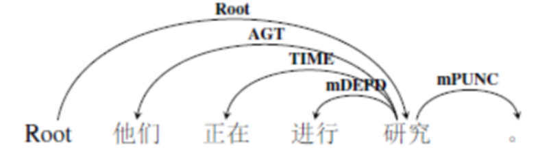

图 31形式动词示例1

图 32形式动词示例2

但是，有时候，这些形式动词可以“独当一面”，在语义事件中表达完整的动作，这个时候，我们把它们标注为root。例如：

> 1. 考试进行了三个小时。（root，进行）
> 2. 一切都在按计划进行。（root，进行）

分析：以句1为例，该句只有一个谓词，即进行，所以它被标注为中枢论元，考试是当事角色，三个小时是时间角色。所以，标注结果如下图所示：

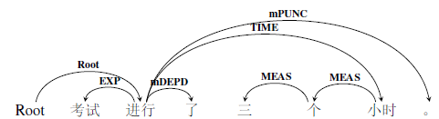

图 33形式动词示例3

图 34形式动词示例4

注意区分一种情况，“开始继续”类动词。这几个动词有实际意义，同时也有虚化的倾向，但是又没有虚化到像形式动词一样，可以省略或者被其他意义很虚的词替代的地步。所以，我们仍然将root指向它们。

> 例如：从明天开始干。（root，开始）

分析：“开始”和“干”都是动词，似乎都可以充当中枢论元，但是我们规定将root指向了“开始”，而“干”是“开始”的一个后继动作，所以标注为后继事件关系。标注结果用依存图结构表示如下：

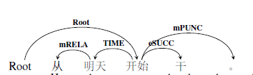

图 35形式动词示例5

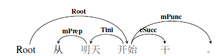

图 36形式动词示例

**综上，形式动词有两种标注情况：**

1.  形式动词与其他动词结合，意义虚化时，标注为依附标记mDDEPD，细粒度标签为虚化标记mVain，依存于中枢论元；

2.  形式动词单独出现，表达完整的语义，标注为root。

### 3.4.3趋向动词

趋向动词表示移动的趋向，可以单独作谓语或者谓语中心，但是经常用在别的动词或者形容词的后边表示趋向，作趋向补语。趋向动词是一个封闭的词类，有单音节的，也有多音节的，多音节的趋向动词可以合用，也可以连用。所有的趋向动词如下表所示：

表格 6趋向动词总表

 />

根据不同的用法，趋向动词也有不同的标注方法。

**1）单独作谓语或者谓语中心的情况。**

趋向动词单独作谓语或谓语中心的时候，我们将root指向这个趋向动词。

> 例如：月亮下去了，太阳还没有出来。（root，下去）

分析：本句中的“下去”和“出来”都是趋向动词，我们将root指向第一个趋向动词“下去”，而“出来”是前一句的一个后继事件，依附在“下去”上，标注为后继事件关系eSucc。标注结果如下所示：

图 37趋向动词示例1

图 38趋向动词示例2

**2）作趋向补语的情况。**

相比于趋向动词单独作谓语或者谓语中心的情况，趋向动词依附于别的谓词后面表示趋向补语，是更常见的情况。这种情况，按照粗粒度标注标签，统一标注为mDEPD，按照细粒度标注标签，根据不同的语义倾向，可以细分为趋向标记mDir，时间标记mTime等。且看如下一些例子：

> 1. 企业产权转让的收入，要集中\<起来\>再投资。（root，集中）
> 2. 没有任何资料显示他们破坏\<过\>这些资料。（root，显示）
> 3. 拿\<出来\>一本书 VS拿\<出\>一本书\<来\>（root，拿）

例1中的“起来”是趋向标记mDir，例2中的“过”是时间标记mTime。都依附于之前的动词做趋向补语，粗粒度标签为mDEPD。前文讲过，趋向补语可以分开使用，例3中当“出来”合用时，依存弧指向“拿”，当“出来”分开用时，将“出”指向“拿”，“来”指向“出”，粗粒度标签标注为依附标记mDEPD，细粒度标签分别标注为趋向标记mDir和离合标记mSepa。有时候趋向动词做补语时意义非常虚化，例如口语中常说的“说起来、谈起来、想起来”等，我们也都将粗粒度标签标注为mDEPD，细粒度标注为虚化标记mVain。以句3为例，标注结果如下图所示：

图 39趋向动词示例3

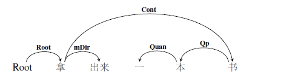

图 40趋向动词示例4

图 41趋向动词示例5

图 42趋向动词示例6

**综上，趋向动词有两种标注情况：**

1.  单独作谓语或者谓语中心时，标注为中枢论元root；

2.  跟在谓词后作趋向补语时，标注为依附标记mDepd，细粒度标签根据实际语义情况，可以是时间标记mTime、趋向标记mDir等。

### 3.4.4心理活动动词

心理活动动词是表示心理活动的动词，其中一些又有一定感情色彩，例如“爱、怕、恨、喜欢、羡慕、讨厌、敬佩、希望”等。心理活动动词与一般的动作行为动词相比，除了能受程度副词修饰之外，还有带宾语能力的不同。汉语中根据动词带宾语能力的不同，将只能带名词性宾语的动词称为“名宾动词”，把既能带名词性宾语，又能带为谓词性宾语的动词称为“名谓宾动词”。心理活动动词就是一种名谓宾动词。也正是因为这种可以带谓词性宾语的能力，使得心理活动动词常常会出现在兼语结构中。

实际上，如何对心理活动动词进行标注并不困难，直接将root指向它们即可，而且它们的主体角色一般都是感事角色Aft（粗粒度标注为施事角色AGT），复杂的是对心理活动动词后的其他成分的标注。有三种情况：

**1）心理活动动词带名词性宾语的情况。**

这种情况就是“主语+谓语+宾语（SVO）”的简单句，当谓语是心理活动动词是，主语一般是感事角色Aft，宾语是客事角色Cont，表达的是主体对于某一种事物的主观态度。

> 例如：台湾人平时都喜欢哪一类的音乐？（root，喜欢）

分析：本句中，“喜欢”是中枢论元root，而“台湾人”是“喜欢”的主体感事角色Aft，“音乐”是“喜欢”的客事Cont，需要提出的是，疑问代词“哪”依附在类上，表示的是类别的范围，所以标注为范围角色。标注结果如下所示：

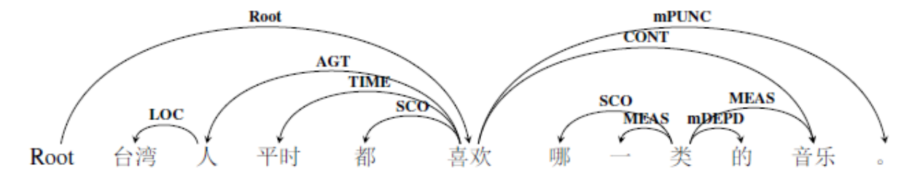

图 43心理活动动词示例1

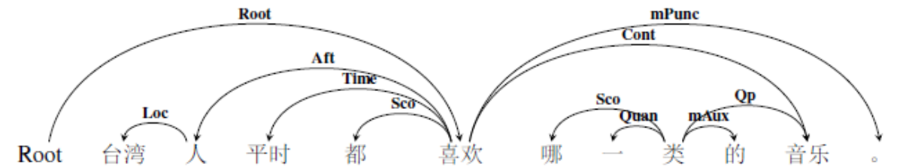

图 44心理活动动词示例2

**2）心理活动动词带谓词性宾语的情况。**

谓词性宾语往往是一个动宾结构的短语，整句的结构是“主语+谓语+动宾短语”，这时候一个语义事件中出现了多个谓词，其中，动宾短语整体是降级作了心理活动动词的宾语，所以标注时要将这种结构关系表示出来。

> 例如：我喜欢写作业。（root，喜欢）

分析：本句中，“喜欢”是中枢论元root，而“我”是喜欢的主体感事角色Aft，动宾短语“写作业”是“喜欢”的客事角色，又因为是降级关系，所以依存弧由“写”指向“喜欢”，标签为dCont，表示降级客事关系，而“作业”是“写”的客事角色Cont。标注写过如下所示：

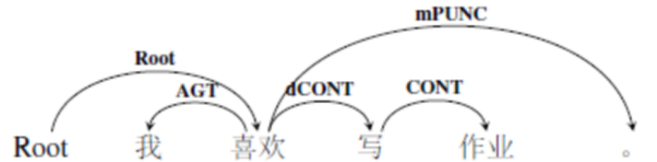
 />

图 45心理活动动词示例3

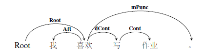

图 46心理活动动词示例4

**3）心理活动动词出现在兼语结构中的情况。**

兼语结构有多种类型，心理活动动词是其中的一种情况。构成的句法结构是“主语N1+谓语V1+主语/宾语N2+谓语V2”。N2既是V1的宾语，又是V2的主语，我们可以理解为兼语，那么出现了多父亲节点的特殊现象；也可以理解为主谓短语做宾语，那么就出现了嵌套事件关系。标注的时候，我们要将这些语言知识表达出来。

> 例如：我喜欢她聪明。（root，喜欢）

分析：本句中，“喜欢”是中枢论元root，而“我”是喜欢“”的主体角色，“喜欢”的客事是一个主谓短语“她聪明”，所以标注为dCont，依存弧由“喜欢”指向“聪明”，同时，“她”是“喜欢”的客事Cont，“她”又是“聪明”的主体当事角色Exp。完整的标注结构如下所示：

![C:\\Users\\cheng\\Documents\\Tencent Files\\1501808365\\FileRecv\\MobileFile\\Image\\6V0JEN[MGAC8OXF]%M32)XP.png](media/7de69bf6c7f4c3a8bf7215a2f74e543d.png)

图 47心理活动动词示例5

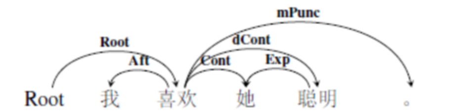

图 48心理活动动词示例6

综上，对于心理活动动词的标注很简单，直接将中枢论元root指向它即可，对于心理活动动词后的待标成分，需要重点分析。

### 3.4.5能愿动词

能愿动词又叫助动词，能用在动词、形容词前边表示客观的可能性、必要性和人的主观意愿，主要作用是评议动词、形容词。表可能的能愿动词有：能、能够、会、可能、可以、可等；表必要的能愿动词有：要、应、应该、应当等；表意愿的能愿动词有：肯、敢、要、愿、愿意等。要注意区别一种情况：有部分能愿动词除了能够用在动作行为动词之前做状语外，还可兼类作一般动词，例如“会说英文”VS“会英文”，前者中的“会”是能愿动词，表示可能性，整个短语的语义中心在“说”上面，而“会”只表示一种情态上的意义；后者中的“会”是一般动词，表示能力，能够。对于这种形式上易混淆的情况，我们分别进行说明。

能愿动词出现在动词、形容词前，一般做状语，整个语义事件的中枢论元是后面的谓词而非能愿动词，所以，我们将root指向后面的核心述谓概念，而将能愿动词指向核心述谓概念，粗粒度标签标注为依附标记mDEPD，细粒度标注标签为情态标记mMod。例如：

> 1. 他很快就要退休了。（root，退休）
> 2. 你敢不敢答应我。（root，答应）

分析：以句1为例，root为“退休”，“要”依附在“退休”上，标注为mDepd，表示这是一个依附性成分。标注结果如下所示：

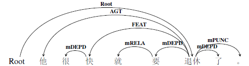

图 49能愿动词示例1

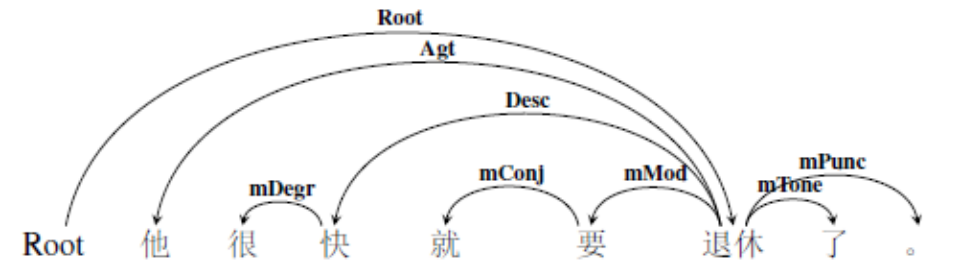

图 50能愿动词示例2

对于兼类的能愿动词作一般的动作行为动词时，我们根据实际语义关系，按照一般动词的情况进行标注即可。例如：

> 1. 我要一杯茶。（root，要）
> 2. 他会英文、法文、希腊文等三种外文。（root，会）

分析：本句中的“要”在这里是一个一般性的动作行为动词，标注为中枢论元root，“我”是主体角色，“茶”是客体角色。对应的标注结果如下图所示：

图 51能愿动词示例3

图 52能愿动词示例4

综上，对于能愿动词，由于它们在语义事件中主要表达的是主体的一种主观态度，所以，我们不把root指向它们，而是将它们标注为依附标记。

3.5谓词特殊结构的标注细则
-------------------------

除了需要对特殊的动词进行必要的标注说明外，谓词也会构成一些特殊结构，这些特殊结构也需要规范化的细则。我们从两方面来说：

首先从谓词的内部结构看。汉语是一种缺乏形态变化的孤立语，但是有些动词会出现一些形态上的变化，主要是重叠以及离合。

其次从谓词的外部组合看。不同的谓词可以构成并列结构、兼语结构、连谓结构、中补结构。

对于上述各种特殊结构，接下来，我们逐一进行说明。

### 3.5.1重叠式

有些动词可以重叠，表示短暂、轻微的含义。

单音节动词的重叠式为“AA式”，例如：“想想”、“说说”等。变体形式为“A一A式”或者“A了A式”。在实际待标语句中，由于分词结果，AA式重叠常常被分成一个词语，可以单独作一个述谓概念，而“A一A式”以及“A了A式”，在分词时常常被分成三个待标成分。标注时，我们把第一个A作为核心，依存弧指向第二个A，标注为语义依附标记mDEPD，细粒度标注标签为重复标记mRept，表示第二个A和第一个A实际是一个词，中间的插入成分粗粒度标签标注为依附标记mDEPD，细粒度标签标注为时间标记mTime（了）或者频次标记mFreq（一），也是依附在第一个A上。标注范式如下图：

图 53重叠式范式1

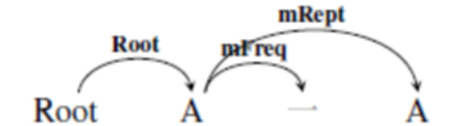

图 54重叠式范式2

图 55重叠式范式3

图 56重叠式范式4

> 例如：他说了说他的想法。（root，说1）

分析：本句中root指向第一个“说”，而“他”和“他的想法”分别是“说”的主客体角色。标注结果如下所示：

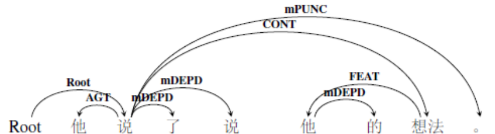

图 57重叠式示例1

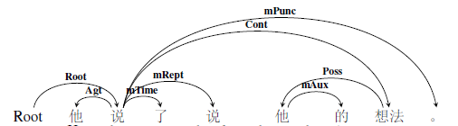

图 58重叠式示例2

双音节动词的重叠式为“ABAB式”，例如：“研究研究”、“打扫打扫”等。分词的结果通常是AB/AB，，我们把第一个AB作为核心，第二个AB依附在其上，粗粒度标签标注为依附标记mDEPD，细粒度标注标签为重复标记mRept，表示这是一个重复性的话语。标注范式如下：

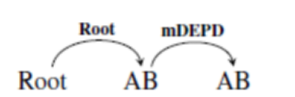

图 59重叠式范式5

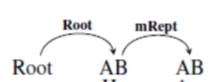

图 60重叠式范式6

> 例如：我研究研究这个课题。（root，研究1）

分析：本句中，“研究1”是句子的中枢论元，“我”和“这个课题”分别是研究的主客体角色。标注结果如下所示：

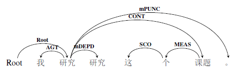

图 61重叠式示例3

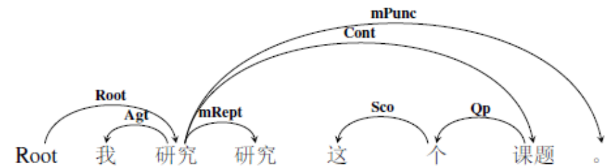

图 62重叠式示例4

在部分口语语料中，会遇到这样的情况。动宾短语加上语气，形成一个祈使句，并重复使用，表示一种呼喊或者命令。

> 例如：开会了，开会了！（root，开会1）

分析：我们同样把第二个“开会”作为第一个“开会”的重复成分，标注为标注重复标记mRept，粗粒度标签为依附标记mDEPD。结果如下所示：

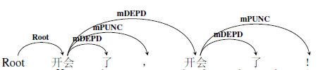

图 63重叠式示例5

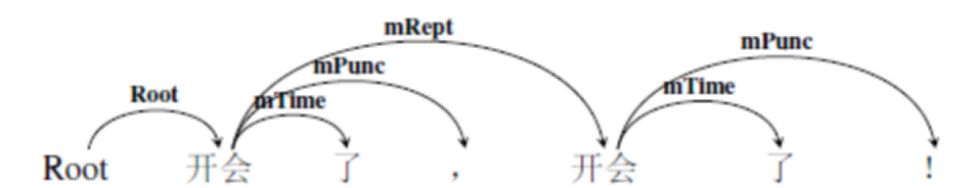

图 64重叠式示例6

综上：动词的重叠式标注，无论是单音节重叠，还是双音节重叠，或者是口语中国句子的重叠，我们都将第二个重叠成分作为第一个成分的重复标记，粗粒度标注标签为mDEDP，细粒度标注标签mRept，依存弧由第一个成分指向第二个成分。

### 3.5.2离合式

离合词在语法研究上一直都是重点，比如“毕业、见面、游泳、散步”等，合用时是一个词，分开时是一个动宾短语，所以有人认为是短语，有人认为是词，还有人认为离则为短语，合则为词。正是由于离合词的可离可合的特点，在标注时也有不同的情况。

当离合词合用的时候，依据分词结果，是一个待标成分，不存在标注存疑的情况。

当离合词分开使用的时候，中间可以添加其他成分，例如“洗澡”、“洗个澡”、“洗个热水澡”等动宾短语，从语义上说，一般宾语是动词的客事角色，但是，在标注的时候，我们不将动词支配的宾语标注为该动词的离合标记mSepa。这是因为，离合标记连接的两个成分一定是动宾短语，而如果我们标注为普通动宾短语的话，就难以抽取出离合短语应有的结构特征。但是将细粒度标签升级为粗粒度标签的时候，要将离合标记升级成为客事角色CONT。这样的处理策略，既能在粗粒度标签体系下体现离合短语动宾结构的特征，又能在细粒度标签体系下对离合短语进行特殊化处理，彰显出汉语离合短语的特殊性。如果我们可以将离合词AB的形式表示为“A……B”的话，那么标注范式为：

图 65离合式范式1

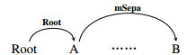

图 66离合式范式2

例如下面两个例句：

> 1. 我想洗个热水澡。（root，想）
> 2. 我想洗澡。（root，想）

分析：句1是离合词分开使用的情况，句2是离合词合用的情况。对于句1来说，“洗个热水澡”是“想”的降级客事角色dCont，中间添加的成分按照实际语义关系进行标注，比如“个”是“洗”的依附成分，“热水”是“澡”的修饰成分；而句2中“洗澡”合用，是“想”的客事角色。句1的标注结果如下图所示：

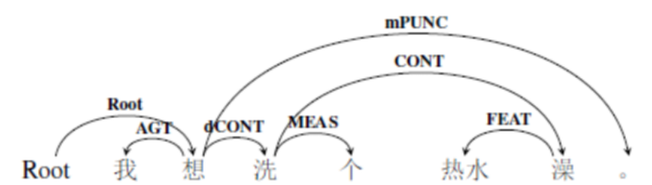

图 67离合式示例1

图 68离合式示例2

句2的标注结果如下图所示：

图 69离合式示例3

图 70离合式示例4

注意，离合式动宾短语的重叠形式是AAB，例如：洗洗澡，散散步。综合重叠式和并列式的标注细则，那么标注范式是：

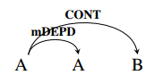

图 71离合式范式1

图 72离合式范式2

综上，动词的离合式，粗粒度标签标注为客事角色CONT，细粒度标签标注为离合标记mSepa。

### 3.5.3并列式

两个或两个以上意义相关、层次相同、句法功能相同、由并列连词连接起来的语法结构成为“并列结构”。很多词类都可以并列出现，而且可以出现在各种句法位置上，表达各种语义关系或充当各种语义角色。并列的各项之间可以互换位置，它们在逻辑上不互相依赖。例如，名词的并列可以作主体角色、客体角色，形容词的并列可以作修饰角色等。在这里，我们以动词的并列为例，对于并列式结构进行一个标准化的标注制订。

根据并列结构的定义，我们可以总结出几个关键性的成分：并列成分ABC等（至少两个），连词（以“和”为代表）、标点符号（以“、”为代表）。所以，并列结构可以表示为按照并列成分的多少以及种类分为以下三种情况：

**1.A、B**

**2.A和B**

**3.A、B和C。**

事实上，很多标注规范都对并列结构进行了详细的描述，标注的方法不尽相同，主要有以下几种形式:

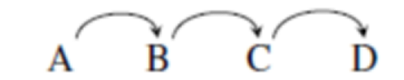

图 73并列式举例1

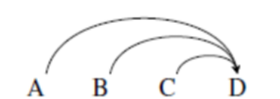

图 74并列式举例2

图 75并列式举例3

由图可见，争议点主要在于并列的成分中，谁是核心成分、标点依附于谁，连词又依附于谁的问题上。针对这些问题，**我们规定：**

1.  **并列式中的第一个成分为核心成分，其他并列成分依次依附于前一个并列成分，粗粒度标签标注为并列事件关系eCOO，细粒度标签为eCoo；**

2.  **标点依附于前一个成分，粗粒度标签为mPUNC，细粒度标签为mPunc；**

3.  **连词依附于后一个成分，粗粒度标签为mRELA，细粒度标签为mConj。**

所以上述三种情况的标注范式分别为：

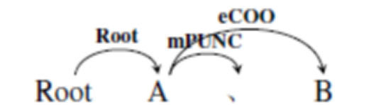

图 76并列式范式1

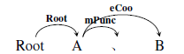

图 77并列式范式2

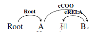

图 78并列式范式3

图 79并列式范式4

![C:\\Users\\cheng\\Documents\\Tencent Files\\1501808365\\FileRecv\\MobileFile\\Image\\RO5ERM(Y[%2NU\@0NWR]FX7T.png](media/f0d4b9cac657dd6bcccc03ce7b5f6da9.png)

图 80并列式范式5

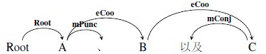

图 81并列式范式6

> 例如：他一个人吃饭、喝水以及睡觉。（root，吃饭）

分析：这个句子属于并列式的第三种类型，其中，“吃饭”是核心，标注为root，“喝水”依附在“吃饭”上，“睡觉”依附在“喝水”上，“顿号”依附在“吃饭”上，“以及”依附在“睡觉”上。不能忘记的是，“吃饭”、“喝水”以及“睡觉”的主体角色都是“他”，即“他”是一个多父亲节点的节点，实际上，并列结构常常会出现交叉弧现象。另外还有一个标注难点：“他”和“一个人”的关系——“一个人”是对“他”的复指，相当于同位关系，所以细粒度标签标注为等同关系eEqu，而粗粒度标签标注为并列关系eCOO。所以标注结果如下所示：

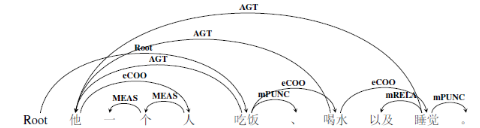
 />

图 82并列式示例1

图 83并列式示例2

注意：并列相可以是词、短语也可以是句子。虽然严格来说。并列式短语与并列事件关系不是一回事，但是为节约语义标签，我们将它们都标注为eCoo，关于并列事件关系的标注，详见5.4小节。

### 3.5.4兼语式

兼语式是这样一种结构：由前一动词到的宾语兼做后一谓语的主语，即动宾短语的宾语和主谓短语的主语套叠，形成一个有宾语兼主语双重身份的“兼语”。有兼语的短语叫做兼语短语，由兼语短语充当谓语或独立成句的句子叫做兼语句。根据兼语前一动词的语义，常见的兼语句有以下几种：

表格 7兼语式类型表

| 句式类型 | 常见动词                                                                                                   | 表达含义                                                                                             |
|----------|------------------------------------------------------------------------------------------------------------|------------------------------------------------------------------------------------------------------|
| 爱恨式   | “称赞，表扬，夸，笑，骂，爱，恨，嫌，喜欢，感谢，埋怨”等心理活动的及物动词。                               | 前一动词是表示赞许、责怪或心理活动的及物动词，它是由兼语后面的动作或性状引起的，前后谓词有因果关系。 |
| 使令式   | “请，使，叫，让，派，催，逼，求，托，命令，吩咐，动员，促使，发动，组织，鼓励，号召”等具有致使意义的动词。 | 前一动词有使动意义，能够引起一定的结果。                                                             |
| 选定式   | 具有“选聘，称，说”意义的动词。                                                                             | 前一动词有“选聘”等意义，兼语后头的动词有“为，当，做，是”等。                                         |
| “有”字式 | “有，轮”等表示存在或领有的动词。                                                                           | 前一动词用“有，轮”等表示领有或存在等。                                                               |

我们用“N1+V1+N2+V2”来表示兼语句句式特征。对于兼语句的标注，主要有两个方面的特征一定要标注出来：

1.  **N2与V1和V2的语义关系**。兼语式的特征之一就是N2节点出现了多父亲节节点的现象。

2.  **V1和V2之间的语义关系。**这两个述谓概念也会构成一定的语义联系，需要标注出来。

前文在讲述心理活动动词是，对于爱恨事兼语的标注有了解释，由于“爱恨式”的N1有很强的主观施动性，所以我们把“N2+V2”结构视为V1的降级客事角色，而N1的语义角色也相对固定，细粒度标签为感事角色Aft，粗粒度标签为施事角色AGT，而其他待标成分之间的语义关系需要结合语境。具体例子可参照心理活动动词示例。标注范式为：

图 84兼语式范式1

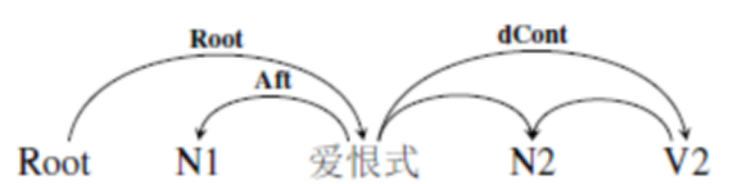

图 85兼语式范式2

对于使令式的兼语，一般来说，由于使令式的动词都具有主观施动性，所以N2是V1的受事角色PAT（细粒度标签也是受事角色），N2是V2的主体角色，而V2是V1的一种结果，所以我们标注为结果事件关系eEFFT，细粒度标签为eRes，其他待标成分之间的语义关系需要结合语境。标注范式为：

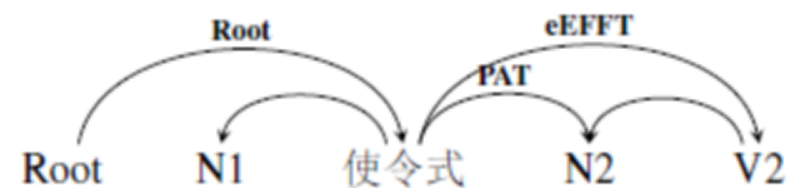

图 86兼语式范式3

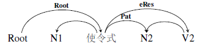

图 87兼语式范式4

> 例如：微笑使你年轻。（root，使）

分析：微笑是使的当事角色，你是使的受事角色，同时也是年轻的当事角色。所以标注结果如下图所示：

图 88兼语式示例1

图 89兼语式示例2

对于选定式和“有”字式的兼语，一般来说，由于这类兼语的前一动词多是对客观情况的描述、动作性不强，所以我们标注为后继事件关系eSUCC，细粒度标签标注为eSucc，其他待标成分需要结合具体语境，所以标注范式为：

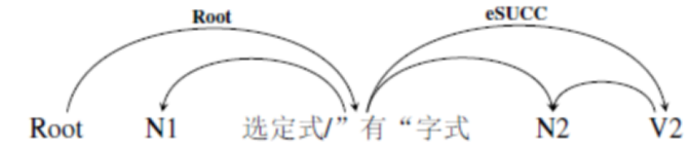

图 90兼语式范式5

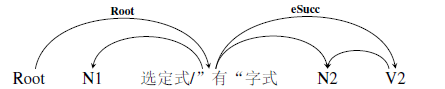

图 91兼语式范式6

例如下面两个例句分别是选定式和“有”字式：

> 1. 大家选他当班长。（root，选）
> 2. 他有个妹妹很能干。（root，有）

分析：以句1为例，“大家”是“选”的施事角色，“他”是“当”的当事角色，“班长”是“当”的成事角色。所以，标注结果如下图所示：

图 92兼语式示例3

![C:\\Users\\cheng\\Documents\\Tencent Files\\1501808365\\FileRecv\\MobileFile\\Image\\1UF0MKK[SLB\~_2U(NMA2]Z3.png](media/3d97b5247c9113fb7a98573b9d92b301.png)

图 93兼语式示例4

**综上，对于兼语式，根据V1和V2的关系，一共出现了三种标注情况：**

1.  爱恨式。依存弧由V1指向V2，是降级客事关系，粗粒度标签为dCONT，细粒度标签为dCont；

2.  使令式。依存弧由V1指向V2，是结果事件关系，粗粒度标签为eEFFT，细粒度标签为eRes；

3.  选定式和“有”字式。依存弧由V1指向V2，是后继事件辊系，粗粒度标签标注为eSUCC，细粒度标签标注为eSucc。

对比上述三种标注类型，我们发现，依存弧的指向是一致的，只是语义关系不同，这与V1表达的语义有很大的关系。除了上述四种基本的类型之外，还有一些其他类型的兼语句分类标准，但是上述三种标注方式基本能包含所有的兼语句类型，例如，“协助类、陪伴类”等的兼语可以按照第三种标注方式标注。所以，此处对于其他语义类型的兼语句式就不做细说。

### 3.5.5连谓式

连谓式是这样一种结构：由多项谓词性成分连用、谓词性成分之间没有语音停顿，也不用任何关联词语的短语叫做连谓短语，由连谓短语充当谓语或者独立成句的句子叫做连谓句。对于连谓句的语义依存图标注，必须要标注说明的是：

1.  主语与不同谓词之间的关系；

2.  不同谓词之间的关系。

连谓句可以表示多种语义关系，例如：

> 1. 他低着头不动。——前一动作是后一动作的方式。
> 2. 金山取了笔记本走了。——表示动作发生的先后顺序。
> 3. 他看书看累了。——前后两个动作表示因果关系。

等等。

但是连谓式内部的几个谓词不管内部语义如何，排列顺序大部分都是按照时间先后。后一动作是前一动作的继续，粗粒度标签标注为后继事件关系eSUCC，细粒度标签标注为eSucc。如果将连谓式的结构表示为“N1+V1+V2”的话，同时我们要注意，一般情况下，这两个谓词都与主体角色N1有关，这两个词之间的语义依存关系也需要表示出来，而语义标签信息需要结合具体语境。所以标注范式如下：

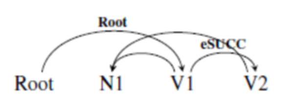

图 94连谓式范式1

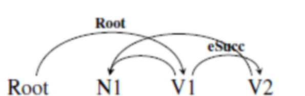

图 95连谓式范式2

>   例如：金山取了笔记本走了。（root，取）

分析：本句两个动作分别是“取”和“走”。“走”是“取”的后继事件关系，同时“取”和“走”的主体角色都是“金山”。所以标注结果如下图所示：

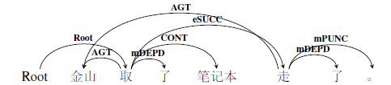

图 96连谓式示例1

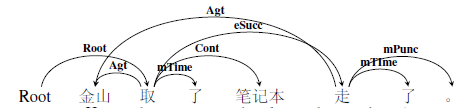

图 97连谓式示例2

注意，有时候，N1可能不是后一动作的发出者，而是后一动作造成结果的直接体验者。（详见3.5.6中补式）。

> 例如：他看书看累了。（root，看1）

分析：本句中有三个谓词性成分：“看1”，“看2”以及“累”。其中“累”是“看2”的结果，“累”也是主体他的状态。所以，标注结果如下图所示：

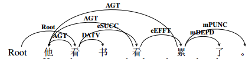

图 98连谓式示例3

图 99连谓式示例4

有一种复杂的情况，即兼语连谓兼用句。我们可以将兼语连谓句用“N1+V1+N2+V2”表示，由于兼语连谓句中的V1多是陪伴协助类的动作，所以将V1和V2的关系标注为后继事件关系eSUCC（细粒度标签为eSucc），其他词对之间的语义关系结合具体语境进行标注。所以标注范式为：

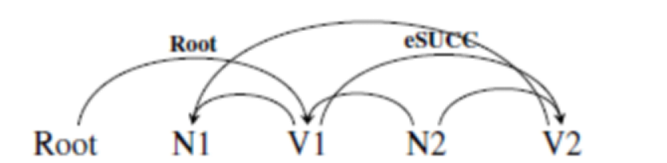

图 100兼语连谓式范式1

图 101兼语连谓式范式4

> 例如：我陪他上楼。（root，陪）

分析：这个句子涵盖了三个语义事件，分别是：“我上楼”，“他上楼”，“我陪他”，标注的时候要将这些情况标注出来。标注结果用依存图展示如下：

图 102兼语连谓式示例1

图 103兼语连谓式示例2

其实通常来说，连谓式结构有语义上的轻重，很多连谓式是前轻后重型的，例如：坐车回家\|赶着做活，结构内部的语义重心在后面的“回家”和“做活”上；也有前重后轻型的，例如：买菜去\|说着玩儿，结构内部的语义重心在前面的动词“买”和“说”上；还有一部分连谓结构无法分出语义上的前后差别，例如：躺着不动\|喝酒喝醉了，这样的连谓式很难说清楚前后哪一个动词才是结构内部的重心。所以也是鉴于此，标注时默认的情况是将连谓结构的第一个动词作为结构中心。

### 3.5.6中补式

中补式是这样一种结构：由补充关系的两个成分组成，前面被补充的成分是中心语，由谓词充当，后头补充成分是补语，可以由谓词充当，例如“打\<伤\>”、“打\<死\>”；也可以由数量短语、介词短语充当，例如“踢了\<三下\>”、“学\<到天黑\>”；也可以由副词充当，例如“好\<极\>了”等，又叫动结式。对于中补式的标注，关键点在于补语跟句子中的哪一个待标成分具有语义上的关系。关键点在于补充成分是否跟主语或者宾语发生语义关系。

试比较以下例句：

> 1. 他打\<伤\>了导演。（root，打）
> 2. 他作业写得\<好\>极了。（root，写）
> 3. 他又踢了\<三次\>足球。（root，踢）

句1和句2的补语，从语义关系上讲，不仅与谓语中心有语义关系，而且与周边角色发生语义关系。句1“伤”的是“导演”，句2“好”的主体是“作业”而非“他”，但是句3中的补语是只与谓语中心语义关系。所以，以此为标准，可以将中补式的标注方式分成两种情况：

**1.补充成分与谓语中心和主客体角色发生语义关系。**

关于补充成分和谓语中心的关系，我们将依存弧由谓语中心指向补语，粗粒度标签标注为结果事件关系eEFFT，细粒度标签标注为eRes。同时这个补充成分作为一个新产生的动作结果，也是语义事件中某个参与者的某种状态，所以，它又依存于该参与者，与主客体角色发生语义关系。用“N1+V+VC+N2”组合来表示这种结构，VC表示补语，其中N2的位置不定，可以出现在中补结构之后，也可以由介词“把”引出，放在谓语中心之前，也可以是N2的一个附属成分。当参与者N2位置提前的时候，就会出现依存弧交叉的情况。要注意VC依附于哪一个成分上。所以标注范式如下图所示：

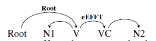

图 104中补式范式1

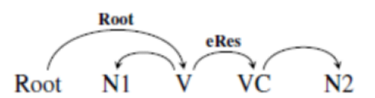

图 105中补式范式2

> 例如：他把导演哭哭了。（root，哭1）

分析：本句中，第一个“哭”是谓语中心，“他”是这个“哭1”的施事角色；“哭2”是“哭1”的结果，同时“哭2”的动作发出这是“导演”。这个句子解构出来的两个语义事件是：“他哭”和“导演哭”。所以，标注结果显示如下：

图 106中补式示例1

图 107中补式示例2

> 再例如：他作业写得好极了。（root，写）

分析：本句有两层中补式。第一层是“写”的结果补语\<好\>，第二层是“好”的程度补语\<极\>。该语义事件的中枢论元root是“写”，“写”的结果是“好”，“好”的程度是“极”，“他”是“写”的施事，“作业”是“好”的当事。也就是说，这个句子解构出来的两个语义事件是：“他写作业”和“作业好极了”。标注结果用依存图显示如下：

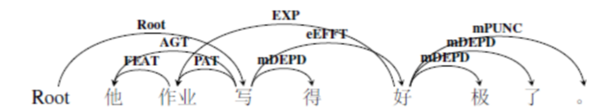

图 108中补式示例3

图 109中补式示例4

**2 补充成分只与谓语中心发生语义关系。**

当补语由数量短语或者介词短语充当的时候，补语成分往往充当某一种语义角色。例如“踢了＜两脚＞”、“走＜到天涯海角＞”、“学＜到深夜＞”，分别表示的是谓语中心的数量关系、位置关系、时间关系，所以我们将它们标注为度量，空间角色以及时间角色。依存弧由谓语中心指向补语成分。

对上述三个短语的标注示例分别如下：

图 110中补式示例5

图 111中补式示例6

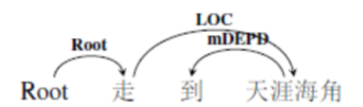

图 112中补式示例7

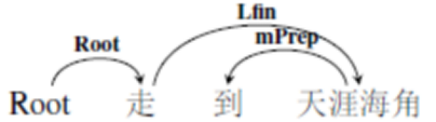

图 113中补式示例8

图 114中补式示例9

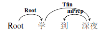

图 115中补式示例10

在具体的语言环境中，也可能会出现其他的语义角色，这三种是比较常见的情况。总的来说，当补语中表达的是明确的数量、时间、空间等关系的时候，我们将它们标注为语义周边角色。

3.6小结
-------

综上就是关于中枢论元的标注细则。主要涉及到两个问题：

1.  如何确定某一语义事件中的中枢论元；

2.  如何处理中枢论元同其他述谓概念之间的关系。

对于第一个问题，我们要找到语义事件中最核心的述谓概念。

对于第二个问题，我们要对每一个述谓概念、每一种结构进行语义分析，然后再确定他们之间的语义关系。

中枢论元是一个语义事件的“纲”，找出它之后，我们就可以以此为切入点，开始对句子中其他成分进行标注了。

 4.语义周边角色的标注细则
============================

4.1总述
-------

语义周边角色，就是语义事件的参与者角色，也即语义角色，这里的“周边”，是与中枢论元相对而言，强调语义周边角色的标注对象是与中枢论元有语义关系的周边论元。语义周边角色常常由指称概念充当。

我们对原有语义依存体系的改进，体现在两方面：一是在结构上从依存树结构突破到依存图结构，二是理论基础出发进行了再整理和分层归类，也确定了一整套新的语义角色标签集合。以董振东和鲁川的体系为基础，结合袁毓林的语义体系，确定出了一套全面、简单、实用，同时能适应自然语言处理高层应用要求的语义依存关系体系。语义周边角色分为了三类，分别是主体角色、客体角色以及情境角色。每一类有粗粒两个颗粒度的待标角色，粗粒度角色共有17个，细粒度角色共45有个。下表是我们的语义周边角色系统中所有的层级以及相应语义角色：

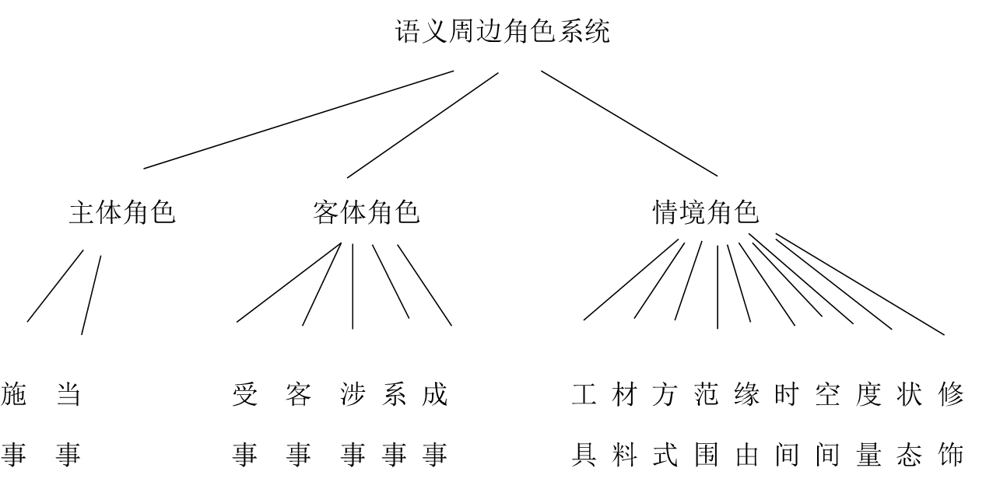

图 116语义周边角色系统

所以，在接下来的4.2、4.3、4.4小节中，将分别详细叙述每一类的标注细则，包括定义、分类、例句以及易混淆对比等，尤其是对于一些角色的可操作性划分处理，将给出一定的句法语义标准。

对于例句语义关系的表示，主要采取三元组形式——（父节点，子节点，语义关系）。其中父节点指向子节点，这是依存弧的指向问题；语义关系是依存标签的问题，除非特殊说明，统一展示的是细粒度标注标签。

最后，在4.5小节中，将结合对第一版语料库的标注数据统计，对整体语义周边角色的标注细则进行一个总结。

4.2主体角色
-----------

主体是一切运动的主体，是作为静态的和动态的各种运动的主体之事物。主要有施事角色和当事角色两大类。

### 4.2.1施事AGT

施事AGT(agent)是**发出具体行为动作的主体或动作持续以及表现心理活动的有意识的主体，具有主观能动性。**一般来说，有生命的物体可以充当施事角色，可以是人，也可以是动物等；句法变换进行提问时，可以用“谁、什么人”等进行提问；在句法配位上，基本情况是出现在动词之前，但是也可以出现在动词之后，例如：畜牧场跑了一群羊。“一群羊”作为施事角色，出现在动词“跑”的后面。

从细粒度标注集来说，施事角色可以细分为施事角色（Agt）和感事角色（Aft）。

#### 4.2.1.1施事Agt

施事角色Agt有以下两种类型：

1.  表现具体行为动作的有意识的主体。

>   ①我一定在九点之前把文件送到。（送到，我，施事Agt）

>   ②明天我将去看他。（看，我，施事Agt）

2. 表现动作持续的有意识的主体。

>   ①去年他在非洲工作。（工作，他，施事Agt）

>   ②经理在思索问题。（思索，经理，施事Agt）

#### 4.2.1.2感事Aft

感事角色Aft（afffection）表现心理活动的有意识的主体。同样作为有意识的主体，感事在动词的选择上与施事不同，主要是心理活动类动词。主要包括以下两类。

1.  “情感”的主体。

> ①我讨厌伦敦。（讨厌，我，感事Aft）

> ②他们从不吃惊。（吃惊，他们，感事Aft）

2.  “感知”的主体。

>   ①难民听到了炮声。（听，难免，感事Aft）

>   ②刑警懂得了密码的含义。（懂得，刑警，感事Aft）

### 4.2.2当事EXP

当事角色EXP(experiencer)是**非行为动作的发出者，不具有主观能动性**，这是与施事的最大不同。具体来说，包括无意识运动的主体、非可控运动的主体以及各种关系的主体。具体包括当事角色Exp、领事角色Poss。

#### 4.2.2.1当事Exp

当事角色Exp有以下几种类型：

1.  静止状态的主体。

>   ①宝塔很高。（高，宝塔，当事Exp）

>   ②猫在床下面。（在，猫，当事Exp）

2. 自身变化的主体。

>   ①苹果树正在开花。（开花，苹果树，当事Exp）

>   ②柳条还没绿呢？（绿，柳条，当事Exp）

3. 非可控运动变化的主体。

>   ①主席台设在天安门城楼上。（设，主席台，当事Exp）

>   ②病人疼得哭了起来。（疼，病人，当事Exp）

4. 表判断的主体。

>   ①他是最好的老师。（是，他，当事Exp）

>   ②这不是新书。（是，这，当事Exp）

5. 交代事件观点的非有意识主体。

>   ①研究表明人的睡眠必须满足一天8个小时。（表明，研究，当事Exp）

>   ②报告显示病人的病情有缓和。（显示，报告，当事Exp）

#### 4.2.2.2领事Poss

领事角色Poss（possessor）表示领属关系的主体或整体部分关系的整体。分为以下两类。

1.  领属关系的主体。

>   ①他有一个养鸡场。（有，他，领事Poss）

>   ②他今天还有很多工作要做。（有，他，领事Poss）

2. 整分关系的整体。

>   ①螃蟹长着八条腿。（长，螃蟹，领事Poss）

>   ②土壤含有水分和养料。（含有，土壤，领事Poss）

3. 发出行为的主体，描述所发出的行为事件一般用的是抽象名词，与主体之间用“的”连接。

>   ①你的错误会使其他人承担严重的后果。

>   ②总统的演说振奋人心。

注意，领事除了可以表示语义周边角色与中枢论元之间的关系外，还可以表示周边角色之间的领属关系或整分关系。注意，对于这种用法，在使用粗粒度标签的时候，采用的是修饰角色FEAT。这是因为，它们与中心语之间表示句法上的定中关系，而定中关系都可以表示为修饰角色FEAT。例如：

> ①敌人的暴行令人发指。（暴行，敌人，领事Poss）/（暴行，敌人，修饰FEAT）

> ②男孩的妈妈来了。（妈妈，男孩，领事Poss）/（妈妈，男孩。修饰FEAT）

### 4.2.3主体角色小结

从粗粒度标注标签集来说，主体角色包含两类：施事角色Agt和当事角色Exp，二者主要区别在于施事具有主观能动性而当事不具备这种特性。施事对应的中枢论元一般是动作行为动词，而当事对应的中枢论元一般是心理活动动词、判断等表关系、情状的动词。从细粒度标注标签集来说，主体角色包含四类：施事Agt、感事Aft、当事Exp以及领事Poss。为了维护标注规范的客观性以及保证标注规范的可操作性，接下来将从聚合标准、组合标准以及语义标准对主体角色进行一系列的界定，也可称作评估标准或衡量标准。

其中，聚合标准指主体角色能出现在什么样的句型中以及能充当什么样的句法成分；组合标准指的是主体角色能够与特殊动词、介词或者副词的组合能力；语义标准指的是与经常与主体角色共现的中枢论元所具有的语义特征。

下表是主体角色聚合标准：

表格 8主体角色聚合标准

| 聚合标准     | 施事 | 当事 | 感事 | 领事 |
|--------------|------|------|------|------|
| 作主语       | \+   | \+   | \+   | \+   |
| 作定语       | \-   | \-   | \-   | \+   |
| 形容词谓语句 | \-   | \+   | \-   | \+   |
| 名词谓语句   | \-   | \+   | \-   | \+   |

从句法成分上讲，主体角色都能作主语，特殊之处在于，领事角色可以作定语。例如：

> ①*老虎·伍兹*的招牌笑容是球迷的最爱。（招牌，老虎·伍兹，领事Poss）

> ②她把孩子从*父亲*怀里抢了过去。（怀里，父亲，领事Poss）

句1“老虎·伍兹”是“笑容”的领属，句2“父亲”与“怀里”是整体与部分的关系，所以领事角色可以作定语。

从句型上讲，主体角色都可以出现在动词谓语句中，所以动词谓语句不作为区别特征，而当事角色可以出现在形容词谓语句中，因为形容词做谓语是对主体性质或情状的描述。例如：

> ①*宝塔*很高。（高，宝塔，当事Exp）

> ②*海风*特别凉爽。（凉爽，海风，当事Exp）

其中，领事角色也可以出现在形容词谓语句中，这主要出现在当领事角色Poss表达修饰关系的时候，例如：

> ①*他*的眼睛很亮。（亮，眼睛，当事Exp）（眼睛，他，领事Poss）

严格来说，这个句子并不是由领事角色充当谓词的主体角色的，但是它作为句子的一部分也确实出现在了形容词谓语句中，所以我们把领事角色的出现环境加了形容词谓语句。但是在粗粒度标签集中，充当修饰成分的领事角色被标注为FEAT，归属为情境角色。这也是我们根据功能，将领事角色提升到不同类别的周边的原因，因为出现的环境是不同的。

而当事角色和领事角色可以出现在名词谓语句中。从意义上说，名词谓语句限于说明时间、天气、籍贯、年龄、容貌、数量等的口语短句，其主体多是当事角色和领事角色。如：

> *①潘老太太*刚好八十八岁。（岁，潘老太太，当事Exp）

> ②*她*大眼睛，红脸蛋。（眼睛，她，领事Poss）

下表是主体角色组合标准：

表格 9主体角色组合标准

| 组合标准                     | 施事 | 当事 | 感事 | 领事 |
|------------------------------|------|------|------|------|
| 出现在动作行为动词前         | \+   | \-   | \-   | \-   |
| 出现在心理活动动词前         | \-   | \-   | \+   | \-   |
| 出现在存在动词前             | \-   | \+   | \-   | \+   |
| 出现在判断动词前             | \-   | \+   | \-   | \-   |
| 出现在“不+V”形式前           | \+   | \+   | \+   | \-   |
| 出现在“没有+V”动词前         | \+   | \+   | \-   | \+   |
| 出现在“V（了/一/不）V”形式前 | \+   | \+   | \-   | \-   |
| 出现在“V+成/完”形式前        | \+   | \+   | \+   | \-   |
| 出现在介词“把”前或“被”后     | \+   | \-   | \-   | \-   |

施事角色一般出现在行为动词前面，而动作行为动词可以受否定词“不/没有”的修饰，可以重叠，也可以出现在“把字句/被字句”中。例句不表。

当事角色可以出现存在动词、判断动词前，这些动词可以受“不/没有”的修饰，可以重叠，也可以生成一种结果，例如：

> ①*大厦*有30层高。（高，大厦，当事Exp）

> ②*弟弟*不是中学生。（是，弟弟。当事Exp）

> ③*桌子*上没有灰尘。（有，桌子，当事Exp）

> ④*弟弟*像不像爸爸。（像，弟弟，当事Exp）

> ⑤*水管*锈成实心的了。（锈，水管，当事Exp）

我们定义的感事角色有两种情况：“感知”的主体和“情感”的主体。所以，感事角色主要出现在心理活动动词前，能受否定词“不”的修饰；同时，一部分感知的主体可以感知得到一种结果。例如：

> ①*小明*崇拜周杰伦。（崇拜，小明，感事Aft）

> ②*小明*不喜欢数学。（喜欢，小明，感事Aft）

> ③*小明*听完了报告。（听。小明，感事Aft）

领事角色主要表示领属以及整体与部分的关系，所以主要出现在存在动词前，受否定副词“没有”的修饰。例如：

> ①*螃蟹*有八条腿。（有，螃蟹，领事Poss）

下表是主体角色语义标准：

表格 10主体角色语义标准

| 语义标准 | 施事 | 当事 | 感事 | 领事 |
|----------|------|------|------|------|
| 主动     | \+   | \-   | \+   | \-   |
| 致使     | \+   | \-   | \-   | \-   |
| 属性     | \-   | \+   | \-   | \-   |
| 心理     | \-   | \-   | \+   | \-   |
| 变化     | \-   | \+   | \-   | \-   |
| 相关     | \-   | \+   | \-   | \+   |

[主动]指主体参与者能够主动地对客体施加动作及影响；[致使]指事件主体请求、命令客体状态变化的活动；[属性]指谓词描述的是事物主体自身的属性；[心理]指主体内心的动态活动喜好憎恶等；[变化]指事件主体自发的由一种状态到另一种状态的变化或进展；[相关]指谓词描述的是主客体之间的关系。

施事角色具有[主动+][致使+]特征，例如：

> *齿鲸*主要吃大鱼和海兽。（吃，齿鲸，施事Agt）

当事角色具有[属性+][变化+][相关+]特征，例如：

> *骄傲*是他垮台的原因。（是，骄傲，当事Exp）

感事角色具有[主动+][心理+]特征，例如：

> *他*把那件事给忘了。（忘，他，感事Aft）

领事角色具有[相关+]特征，例如：

> *我们*今天仍有这种感觉。（有，我们，领事Poss）

4.3客体角色
-----------

客体角色是事件主体之外的第二个参与的实体。根据不同的语义特征，客体角色有受事PAT、客事CONT、涉事DATV、系事LINK和成事PROD五类。

### 4.3.1受事PAT

受事角色是**受主体的行为动作所改变的直接客体。**受事一般与施事相对应，是受施事影响而导致位置、性质、结果等发生改变的对象，最明显的语义特征是具有被动性。对应的细粒度标注标签集只有受事Pat一种。

#### 4.3.1.1受事Pat

受事Pat（Patient）作为受主体直接影响的对象，主要有以下几种语义类别。

1.  某个动作发生后，消失或转移的客体。

>   ①字典是从日本买的。（买，字典，受事Pat）

>   ②从桌子上把书拿走。（拿走，书，受事Pat）

2. 受动作支配的客体。

>   ①他的衣服被雨淋湿了。（淋湿，衣服，受事Pat）

>   ②怎样解决这个难题？（解决，难题，受事Pat）

3. “给予”或“获取”等行动改变所有权的客体。

>   ①他赠弟弟一支笔。（赠，笔，受事Pat）

>   ②我军缴获了敌人四辆坦克。（缴获，坦克，受事Pat）

### 4.3.2客事CONT

**客事是事件所涉及但是并未改变的客体。**客事一般与当事相对应。与受事最大的语义差别在于受到了主体的影响但是并没有发生变化。对应的细粒度标注标签集只有客事一种。

#### 4.3.2.1客事Cont

客事角色Cont（content）主要有四种语义类别，一种是客观的信息类，这种信息可以被学习、被感知、被传播、被查询、被参阅、被借鉴，但是不能被改变，所以是客事；第二种是主观的情感类，这种情感是主体自身的一种感受，与他人无关，不涉及动作行为的变化，所以也是客事；还有一类就是表示客观事物的具体内容语义；最后一类指的是被作用于某种动作但本身未受任何改变的客观事物。

1.  信息类。

>   ①你要多学点知识。（学，知识，客事Cont）

>   ②我相信苏珊的话。（相信，话，客事Cont）

>   ③他说出了每个工人的心愿。（说，心愿，客事Cont）

>   ④你在申请延长签证时遇到什么困难了吗？（延长，签证，客事Cont）

>   ⑤详情请参阅语法章。（参阅，语法章，客事Cont）

2. 情感类。

>   ①老师对她的学生感到满意。（感到，满意，客事Cont）

>   ②我渴望幸福。（渴望，幸福，客事Cont）

3. 内容类。

>   ①这种药物具有止咳功能。（功能，止咳，客事Cont）

>   ②手册里有用法说明。（说明，用法，客事Cont）

4. 受到某种作用但本身不受改变的客观事物。

>   ①教育对国民发展起着重要作用。（作用，起着，客事Cont）

>   ②被告未提交答辩状。（答辩状，提交，客事Cont）

### 4.3.3涉事DATV

涉事角色DATV也称与事，是动作行为的非主动参与者，有人也说，涉事角色是语义事件的第三方参与者。从语义上说，是事件接受者、伴随者、来源者以及比较的基准等等；从句法上说，经常出现在双宾语句中的间接宾语位置。对应的细粒度标注标签集有涉事（Datv）、源事（Origin）以及比较（Comp）三种。

#### 4.3.3.1涉事Datv

典型的涉事Datv（Dative）与受事、客事相比，最主要的语义特征在于它的参与性，它不是与施事、当事直接相关的周边角色。经常由介词引出。具体来说，可以有以下语义类别。

1.  信息或实体的接受者。

>   ①班长给他一套工具。（给，他，涉事Datv）

>   ②大家都叫他毛伯伯。（叫，他，涉事Datv）

2. 事件过程中出现的伴随者或共现者。也即有些语法书上讲的“共同施事”。

>   ①他同王芳结婚了。（结婚，王芳，涉事Datv）

>   ②他邀请评论家来参观。（邀请，评论家，涉事Datv）

注：在“A+‘和、跟、与’+B +v”的句型中，v的语义如果是需多人参与才能进行的，标B为涉事，例如“合作、结婚、打球”等。如果v的动作语义一个人单独也能完成，且A和B的位置可以互换，那么认为“和、跟、与”是连词，标A和B是并列关系。详见5.4.2并列关系的说明。

3. 所关涉的对象。

>   ①妈妈为女儿着想。（着想，女儿，涉事Datv）

>   ②你对流行音乐很有欣赏力。（有，音乐，涉事Datv）

#### 4.3.3.2源事Orig

源事角色Orig（Origin）也是事件中的参与者，它特指事件中客体来源的邻体。一般都要由介词“向、从”引入。例如：

> ①大家向教授请教问题。（请教，教授，源事Orig）

> ②湿润的风从南方吹来。（吹，南方，源事Orig）

#### 4.3.3.3比较Comp

比较Comp（compare）也是事件中的参与者，它特指事件中与主题进行比较的基准。一般都要由比较标记词“比“引入。例如：

> ①月球比地球小。（小，地球，比较Comp）

> ②老李比他师父更好。（好，师父，比较Comp）

### 4.3.4成事PROD

成事PROD是动作行为产生的结果。对应的细粒度标注标签集有成事和结局两种类型。

#### 4.3.4.1成事Prod

成事Prod（product）特指主体所创建或产生的新事物。成事是由无到有的一个具象的事物或行为，其对应的主体可以是有意识的事物，也可以是无意识的事物。

1.  有意识主体创建的事物。

>   ①他写了一本小说。（写，小说，成事Prod）

>   ②中国与美国建立了新型的外交关系。（建立，关系，成事Prod）

2. 无意识主体产生的事物。

>   ①那棵树结了很多果实。（结，果实，成事Prod）

>   ②树木生出了新的枝条。（生，枝条，成事Prod）

#### 4.3.4.2结局Cons

结局Cons（consequence）与成事不同，更注重事件状态的转变过程。例如：

> ①工厂爆炸造成污染。（造成，污染，结局Cons）

> ②这件事导致谣言丛生。（导致，谣言，结局Cons）

结局Cons角色与成事Prod角色类同，都表现新的事物、新的状态，但是成事一般表示的产生了一个新的具象事物，而结局表示的是某事件所发生的状态变化结果。

### 4.3.5系事LINK

系事LINK是跟事件的参与者有关系的客体。一般由表示某种关联的动词连接主客体，表达主客体之间的某种具体的、或抽象的关系。中枢论元一般是判断动词或者“有、像”等表示关系的谓词。对应的细粒度标注标签集有属事和类事两种。

#### 4.3.5.1属事Belg

属事Belg（belongings）表达的是领属关系中的所属者。

1.  所属对象有具体的实体。比如亲属、财务、事物的构成部分等。

>   ①他有一个妹妹。（有，妹妹，属事Belg）

>   ②奶奶有一根拐杖。（有，拐杖，属事Belg）

>   ③螃蟹有八条腿。（有，腿，属事Belg）

>   ④土壤含有水分和养料。（含有，水分，属事Belg）

2. 所属对象是抽象的性质。

>   ①他很有志气。（有，志气，属事Belg）

>   ②人生有痛苦也有欢乐。（有，痛苦，属事Belg）

#### 4.3.5.2类事Clas

类事Clas（classification）是事件中主体进行判断或隐性比较的对象、事件主体最终归类的状态。。

1.  事件主体进行判断或隐性比较的对象。

>   ①弟弟是中学生。（是，中学生，类事Clas）

>   ②这就是西部大开发的标志性工程青藏铁路。（是，工程，类事Clas）

>   ③哥哥像狐狸。（像，狐狸，类事Clas）

2. 事件主体最终归类的状态。

>   ①雪化成了水。（化，水，类事Clas）

>   ②新厂长拜老工人为师。（拜，师，类事Clas）

### 4.3.6客体角色小结

客体角色是与主体角色相对应的角色，是语义事件中另一个重要的参与实体。从粗粒度标注标签集来说，文本语义依存图标注规范规定了五种客体角色，分别是：受事PAT、客事CONT、涉事DATV、成事PROD、系事LINK。从细粒度标注标签集来说，规定了九种客体角色，分别是：受事Pat、客事Cont、涉事Datv、源事Orig、比较Comp、成事Prod、结局Cons、属事Belg以及类事Clas。

综上，我们已经对每一种客体角色的选取进行了分析，同样，我们将从聚合标准、组合标准以及语义标准对客体角色进行一系列的界定。由于细粒度标注标签集涉及到的语义角色数量多，不易进行区别性特征的比较，所以我们对客体角色的粗粒度标签进行比较。

下表是客体角色聚合标准：

表格 11客体角色聚合标准

| 聚合标准     | 受事 | 客事 | 涉事 | 成事 | 系事 |
|--------------|------|------|------|------|------|
| 作宾语       | \+   | \+   | \+   | \+   | \+   |
| 形容词谓语句 | \-   | \-   | \+   | \-   | \-   |

所有客体角色都能作宾语，这是相对于主体角色都能作主语而言，并不在内部具有区别特征。客体角色都能出现在动词谓语句中，而形容词谓语句情况略有不同。其中，涉事角色可以出现在形容词谓语句中，特指引入的比较对象，例如：

> 月亮比*地球*小。

下表是客体角色组合标准：

表格 12客体角色组合标准

| 组合标准                     | 受事 | 客事 | 涉事 | 成事 | 系事 |
|------------------------------|------|------|------|------|------|
| 出现在介宾结构中             | \-   | \-   | \+   | \-   | \+   |
| 作句子的近宾语               | \-   | \-   | \+   | \-   | \-   |
| 作句子的远宾语               | \-   | \+   | \-   | \-   | \+   |
| 出现在心理活动动词后         | \-   | \+   | \-   | \-   | \-   |
| 出现在“V+成/完”形式后        | \-   | \-   | \-   | \+   | \+   |
| 出现在“V（了/一/不）V”形式后 | \+   | \+   | \-   | \-   | \-   |
| 出现在介词“把”后或“被”前     | \+   | \-   | \-   | \-   | \-   |

受事角色能够出现在上述6、7等句法环境中，例如：

> ①英子写不写*作业*？（写，作业，受事PAT）

> ②英子把*作业*写了。（写，作业，受事PAT）

> ③*作业*被英子写了。（写，作业，受事PAT）

客事角色能够出现在上述3、4、6等句法环境中，例如：

> ①张老师给学生讲*历史*。（讲，历史，客事CONT）

> ②姐姐喜欢*文学作品*。（喜欢，作品，客事CONT）

> ③主席给大家讲了讲*今年的工作任务*。（讲，任务，客事CONT）

涉事角色能够出现在上述1、2等句法环境中，例如：

> ①张老师给*学生*讲历史。（讲，学生，涉事DATV）

成事角色能够出现在上述5等句法环境中，例如：

> ①姐姐写完了一本*小说*。（写，小说，成事PROD）

系事角色能够出现在上述①③⑤等句法环境中，例如:

> ①新厂长拜老工人为*师*。（拜，师，系事LINK）

下表是客体角色语义标准：

表格 13客体角色语义标准

| 语义标准 | 受事 | 客事 | 涉事 | 成事 | 系事 |
|----------|------|------|------|------|------|
| 被动     | \+   | \+   | \-   | \-   | \-   |
| 变化     | \+   | \-   | \-   | \+   | \-   |
| 完成     | \+   | \-   | \-   | \+   | \-   |
| 相关     | \-   | \-   | \+   | \-   | \+   |
| 来源     | \-   | \-   | \+   | \-   | \-   |

[被动]指客体参与者受支配，[完成]指客体参与者在受支配之后有完成一件事或者某个动作产生了某种结果，[来源]指客体参与者是动作行为的起初拥有者。

受事角色具有[被动+][变化+][完成+]特征，例如：

> ①不要嘲笑*他*。（嘲笑，他，受事PAT）

> ②他赠*弟弟*一支笔。（赠，弟弟，受事PAT）

客事角色具有[被动+]特征，例如：

> ①张老师给学生讲*历史*。（讲，历史，客事CONT）

> ②难民听到了*炮声*。（听，炮声，客事CONT）

涉事角色具有[相关+][来源+]特征，例如：

> ①张老师给*学生*讲历史。（学生，讲，涉事DATV）

成事角色具有[变化+][完成+]特征，例如：

> ①他写了一本*小说*。（写，小说，PROD）

系事角色具有[相关+]特征，例如：

> ①小宋有*很多朋友*。（有，朋友，系事LINK）

4.4情境角色
-----------

情境角色是事件涉及到的外围角色。在一个事件中，除了主体、客体等参与者之外，还有一些列情境因素，例如主体使用的工具、材料，事件发生的时间、空间，引起事件发生的原因、目的等。情境角色就是详细描述这些场景的角色。从粗粒度标标签集出发，共涉及十种情境角色，分别是：工具、材料、方式、范围、缘由、时间、空间、度量、状态以及修饰。

### 4.4.1工具TOOL

工具TOOL相对应的细粒度标注标签集只有工具Tool一种。

#### 4.4.1.1工具Tool

工具角色Tool（Tool）是事件中所使用的工具。典型的工具角色由介词“用”等引出，也可不用介词引入，工具格通常是由物体充当，但是一些有生命的、或者是抽象的事物也可以作为事件所凭借的工具。例如：

> ①妈妈用砂锅熬稀饭。（熬，砂锅，工具Tool）

> ②绑匪用人质要挟。（要挟，人质，工具Tool）

> ③医生建议药物治疗。（治疗，药物，工具Tool）

### 4.4.2材料MATL

材料角色MATL相对应的细粒度标注标签集只有材料Matl一种。

#### 4.4.2.1材料Matl

材料角色Matl（material）是事件中所使用的材料。典型的材料角色由介词“用”等引出，也可不用介词引入。例如：

> ①妈妈用小米熬稀饭。（熬，小米，材料Matl）

> ②学生们用纸折飞机。（折，纸，材料Matl）

注意：材料与工具不同，工具是事件发生的凭借，等事件结束后，其自身不受影响，不发生性质或位置的转变；而材料会发生变化。例如“妈妈用小米熬稀饭”中的“小米”是材料，因为，当“稀饭熬成”之后，“小米”的性质已经发生变化，而“妈妈用砂锅熬稀饭”中的“砂锅”是工具，因为当“稀饭熬成”后，“砂锅”自身并没有变化。

### 4.4.3方式MANN

方式角色MANN相对应的细粒度标注标签集有方式Mann和依据Accd两种。

#### 4.4.3.1方式Mann

方式角色Mann（Manner）角色是事件中出现的方式、方法。典型的方式角色由介词“用、以”等引出，也可不用介词。可以表示主体的态度或方法，也可以表示行动的情形或样式。可以回答主体角色“怎么样”或者动作“怎么样”这一类的问题。

1.  事件主体的态度或方法。

>   ①妈妈用小火熬稀饭。（熬，小火，方式Mann）

>   ②哥哥高高兴兴地走进门。（走，高高兴兴，方式Mann）

2. 事件行动的情形或样式。

>   ①诸葛亮吩咐军士齐声高喊。（高喊，齐声，方式Mann）

> ②足球慢慢地滚进空门。（滚，慢慢，方式Mann）

#### 4.4.3.2依据Accd

依据角色Accd（according）角色是事件所依照的根据、凭借。典型的依据角色由“依照、按照”等词引出，并做为一个话题，放在句首。

> ①按照中国的传统观念，玉是圣洁的象征。（是，观念，依据Accd）

> ②依照说明书，他把电扇组装好了。（组装，说明书，依据Accd）

### 4.4.4范围SCO

范围SCO角色相对应的细粒度标注标签集只有范围Sco一种。

#### 4.4.4.1范围Sco

范围Sco（scope）指的是事件中所关涉的方面、限定的界限、被审视的角度、发生作用的范围，通常都为抽象名词。根据不同的语义关系，一般由不同的介词引出，一般可以出现在“在……方面”、“在……角度上”、“在……中”的结构中。例如

>   ①数学方面他是专家。（是，方面，范围Sco）

>   ②这项技术在世界范围内得到应用。（得到，范围，范围Sco）

>   ③临床上称其为肿瘤骨。（称，临床，范围Sco）

>   ④染色体易位是造血系统肿瘤中常见的致病机制。（常见，造血系统肿瘤，范围Sco）

>   ⑤此药主要用于重症和危重症。（用于，重症，范围Sco）

注意，范围角色不仅可以连接中枢论元和周边论元，也可以是周边论元之间的语义关系。有下面两种情况：

1.  由指示代词“这、那”进行的限定或疑问代词“哪、什么”指代的范围。

>   ①这场比赛处在最终阶段。（场，这，范围Sco）

>   ②他把那笔钱打进我的银行了。（笔，那，范围Sco）

>   ③走哪条路呢？（条，哪，范围Sco）

>   ④那儿什么工具都有。（工具，什么，范围Sco）

2. “整”+数词/量词 表达足的意思时。

>   ①明天我整40岁了。（岁，整，范围Sco）

>   ②整整十本书。（本，整整，范围Sco）

### 4.4.5缘由REAS

缘由REAS角色相对应的细粒度标注标签集有缘故Reas和意图Int两种。

#### 4.4.5.1缘故Reas

缘故Reas（reason）是引起事件发生或发展变化的原因。原因和结果都出现在一个单句中（以期与事件关系进行区别），原因一般由介词“由于、以”或连词“因为”引出。例如：

> ①我的脸由于羞愧涨得通红。（涨，羞愧，缘故Reas）

> ②他因为堵车迟到了。（迟到，堵车，缘故Reas）

> ③美沙酮中毒。（中毒，美沙酮，缘故Reas）

注意：这里的缘故角色主要是名词性短语充当的引起事件的原因，如果一个事件是另一个事件发生的原因，我们用事件关系来表达。详见5.3节。

#### 4.4.5.2意图Int

意图Int（intention）是事件所要达到的目的。一般有介词“为了”引出。例如：

> ①他为了自己的健康，搬到海淀区居住。（搬，健康，意图Int）

> ②为了金牌他拼尽全力。（拼，金牌，意图Int）

注意：这里的意图角色主要是名词短语充当的引起事件的目的，如果一个事件是另一个事件发生的目的，我们用事件关系来标注。

### 4.4.6时间TIME

时间TIME事件发生的时间。在实际生活场景中，事件发生所涉及到的时间因素情形各异。所以，时间对应的细粒度标注标签集有5个，分别是：时间Time、时间起点Tini、时间终点Tfin、时段Tdur、时距Trang。

#### 4.4.6.1时间Time

时间Time（time）指的是事件发生的时点或日期。可以变换成“……时”。

1.  事件发生的时点。

>   ①住校生6点吃饭。（吃饭，6点，时间Time）

>   ②周一早上升旗。（升旗，早上，时间Time）

2. 事件发生的日期。

>   ①去年夏天，我从上海乘船到外婆家。（乘船，夏天，时间Time）

>   ②该车建造于1885年。（建造，1885年，时间Time）

3. 事件发生的时间频率。

>   ①他有时给我干点儿零活。（干，有时，时间Time）

#### 4.4.6.2时间起点Tini

时间起点Tini（Initial time）指的是事件起始的时间。经常由介词“从”引出，可以变换成“从……起”或者“……以来”。例如：

> ①从明天起，做一个幸福的人。（做，明天，时间起点Tini）

> ②建国以来政治运动就几乎没有停止过。（停止，建国，时间起点Tini）

#### 4.4.6.3时间终点Tfin

时间终点Tfin（Final Time）指的是事件结束的事件。经常由介词“到、至”引出。例如：

> ①我们一直谈到深夜。（谈到，深夜，时间终点Tfin）

> ②昨天他从2点至5点跑了3小时。（跑，5点，时间终点Tfin）

#### 4.4.6.4时段Tdur

时段Tdur（Time Duration）指的是事件进程所持续的时间段。例如：

> ①他当兵三年了（当兵，三年，时段Tdur）

> ②台湾近八年物价一直在上涨。（上涨，近八年，时段Tdur）

#### 4.4.6.5时距Trang

时距Trang（Time Range）指的是自说话时间起到事件发生的时间段。注意时距与时段的区别，从时态逻辑上来讲，时距讲的是从说话时间起之后的时间，属于将来时态；而时段指过去的时间到现在，是过去时态。

> ①你两天后来取结果。（取，两天，时距Trang）

> ②再有三天学校就开学了。（开学，三天，时距Trang）

小结：根据场景的不同，时间TIME可以细化为多个语义角色。例如下句：

> 昨天，他从2点至5点跑了3个小时，今天还要再跑4个小时。

其中：“昨天”和“今天”是时间Time，“2点”是时间起点Tini，“5点”是时间终点Tfin，“3个小时”是时段Tdur，“4个小时”是时距Trang。但是在粗粒度标注层级上，都将它们标注为时间角色TIME。

### 4.4.7空间LOC

空间LOC是与事件发生时的处所。在实际生活场景中，事件所涉及到的空间因素情形多样。所以，相对应的细粒度标注标签集有5个，分别是：空间Loc、原处所Lini、终处所Lfin、通过处所Lthru、趋向Dir。

#### 4.4.7.1空间Loc

空间Loc（location）指的是事件所在的自然空间。通常由介词“在”引出，并且可以变换为“在……上/里/内”等结构。例如：

> ①我在大学学习三年了。（学习，大学，空间Loc）

> ②暴风雨时我正在树下躲避。（躲避，树下，空间Loc）

注：空间标签通常会与范围标记同现，例如“病房附近的房间空着”（房间，病房，空间Loc）（病房，附近，范围标记mRang）

#### 4.4.7.2原处所Lini

原处所Lini（Initial Location）表示空间位置改变时，事件发生的初始位置，一般由介词“从”引出。例如：

> ①我把他送出家门。（送出，家门，原处所Lini）

> ②从美国进口了一台计算机。（进口，美国，原处所Lini）

#### 4.4.7.3终处所Lfin

终处所Lfin（Final Location）表示空间位置改变时，事件发生的结束位置，一般由介词“到”引出。例如：

> ①我明天去哈尔滨。（去，哈尔滨，终处所Lfin）

> ②代表团抵达雅典。（抵达，雅典，终处所Lfin）

#### 4.4.7.4通过处所Lthru

通过处所Lthru（Location through）表示空间位置改变时，事件发生时从初始位置移动到结束位置之间的空间，一般出现在动词“经、过”等的后边。例如：

> ①他从北京经上海飞到香港。（经，上海，通过处所Lthru）

> ②火车正在过长江大桥。（过，长江大桥，通过处所Lthru）

#### 4.4.7.5趋向Dir

趋向Dir（direction）表示空间位置改变时，事件中主体所面对的方向或者移动所趋向的方向，一般出现在“对、向。朝着”等词的后边。

1.  静态主体所对的方向。

>   ①这房子朝南。（朝，南，趋向Dir）

>   ②天安门对着人民英雄纪念碑。（对，人民英雄纪念碑，趋向Dir）

2. 动态主体运动的方向。

>   ①客机飞向图书馆。（飞，图书馆，趋向Dir）

>   ②部队奔向前方。（奔，前方，趋向Dir）

小结：根据场景的不同，空间3_Loc可以细化为不同的语义角色。例如下句：

他一路向南，从北京经上海飞到香港，在那里参加一场慈善拍卖会。

在这个句子中，“南”是趋向Dir，“北京”是原处所Lini，“上海”是通过处所Lthru，“香港”是终处所Lfin，“那”里是空间Loc。但是在粗粒度标签层级上都标注为空间角色LOC。

### 4.4.8度量MEAS

度量角色MEAS指事件中的数量，名量或动量。数词一律表示为数量角色，量词表示为数量短语。且数量短语的核心为量词，但是注意，只有在句子中，数量短语充当的近视数量词，才标为数量短语，若是数量短语担任其他主客体角色，则量词标为其他主客体角色。

相对应的细粒度标注标签集有7个，分别是：数量Quan、数量词组Qp、起始量Nini、终止量Nfin、变化量Nvar、频率Freq、顺序Seq。

#### 4.4.8.1数量Quan

数量Quan（Quantity）指的是事件中主客体的数。就汉语的情况，可以是单纯的数值，也可以是数量短语。

1.  单纯的没有量词的数值。

>   ①一年有365天。（天，365，数量Quan）

>   ②教室里有200人。（人，200，数量Quan ）

2. 名量词表数值。

>   ①弟弟跑了四百米。（米，四百，数量Quan）

>   ②同学们栽了三百捆树苗。（捆，三百，数量Quan）

3. 动量词表次数。

>   ①他来回跑了四趟。（趟，四，数量Quan）

>   ②这部电影他看了三遍。（遍，三，数量Quan）

对于数量Quan的标注，有以下两点注意事项：

1. 量词分为物量词和动量词两大类，其中物量词表示人和事物的计算单位，动量词表示动作次数和发生的时间。对于语义事件中的有些借用动量词，它们有可能会充当其他语义角色，例如：踢了两脚，“两脚”是“踢”的次数，同时也是“用脚踢”，即“脚”是“踢”的工具。但是由于依存弧上不可能标注为两个语义标签，所以，我们确立一个规则，即把它们标注为相应的语义角色。例如：

>   ①公爵抽了农奴两鞭子。（抽，鞭子，工具Tool），（鞭子，两，数量角色Quan）

语义依存图标注结果如下图所示：

 />

图 117数量角色示例1

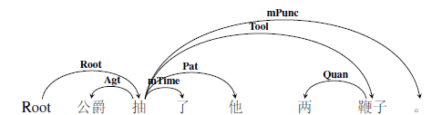

图 118数量角色示例2

2. 对于省略了数词仅有量词的情况，量词和所修饰核心词之间应标为数量词组。例如：

   > ①我买了本书。(买，书，客事Pat)，（书，本，数量词组Qp）

#### 4.4.8.2数量词组Qp

数量词组Qp（quantity phrase）是由数词加上量词组成的表数量的短语。数量词组的核心词是量词。对于完整的数量短语“数词+量词+中心语”来说，中心语一般依附在结构外的核心成分上，而量词依附在中心语上，数词依附在量词上，细粒度标注标签分别为Qp和Quan，而粗粒度标签为MEAS。标注范式为：

图 119数量角色范式1

图 120数量角色范式2

数量词组往往会省略数词，只保留量词，我们依然将量词标注为数量词组角色Qp。例如：

> ①我买了本书。（书，本，数量词组Qp）

#### 4.4.8.3起始量Nini

起始量Nini（initial number）表示数量、频率、顺序等变化的起始值。可以是基数词、也可以是序数词。

1.  基数词表示起始量。

>   ①产量从100吨增长到200吨。（增长，100吨，起始量Nini）

2. 序数词表示起始量。

>   ①成绩从第一降到第五。（降，第一，起始量Nini）

#### 4.4.8.4终止量Nfin

终止量Nfin（final number）表示数量、频率、顺序等变化的终止值。可以是基数词，也可以是序数词。

1.  基数词表示终止量。

>   ①产量从100吨增长到200吨。（增长，200吨，终止量Nfin）

2. 序数词表示终止量。

>   ①成绩从第一降到第五。（降，第五，终止量Nfin）

#### 4.4.8.5变化量Nvar

变化量Nvar（variable number）表示增加或减少的量。一般有基数词担任。

1.  表示增加的变化量。

>   ①产量从100吨增长到200吨，增加了100吨。（增加，100吨，变化量Nvar）

2. 表示减少的变化量。

>   ①成绩从第一降到第五，下降了4名。（下降，4名，变化量Nvar）

#### 4.4.8.6频率Freq

频率Freq（Frequency）表示时间发生的频次。由一些副词或者是每+数量短语作为标记，表示频率。例如：

> ①他经常来我家。（来，经常，频率Freq）

> ②这个药每六小时服一片。（服，六小时，频率Freq）

#### 4.4.8.7顺序Seq

顺序Seq（Sequence）是表示事件发生的顺序或所处的阶段。一般有序数词或表阶段性的词语担任顺序角色。例如：

> ①他第一个到达终点。（个，第一，顺序Seq）

> ②他跑第一。（跑，第一，顺序Seq）

> ③这种疗法初步显示出抗癌性。（显示，初步，顺序Seq）

### 4.4.9状态STAT

状态STAT角色表示事件发生时的情形、状态等。相对应的细粒度标注标签集有4个，分别是：状态Stat、起始状态Sini、终止状态Sfin以及历经状态Sproc。

#### 4.4.9.1状态Stat

状态Stat（state）表示实体在事件发生时所处的自身状态或外部环境境况。常出现在“在……中”结构中。例如：

> ①他在逆境中拼搏。（拼搏，逆境，状态Stat）

> ②许多女工生活在水深火热之中。（生活，水深火热，状态Stat）

> ③正常情况下是可以痊愈的。（痊愈，情况，状态Stat）

#### 4.4.9.2起始状态Sini

起始状态Sini（Initial State）是事件发生的初始状态。常由介词“从”引出。例如：

> ①人类是从类人猿进化来的吗？（进化，类人猿，起始状态Sini）

> ②计算机把英语翻译成汉语。（翻译，英语，起始状态Sini）

#### 4.4.9.3终止状态Sfin

终止状态Sfin（Final State）是事件发生的结束状态。例如：

> ①计算机把英语翻译成汉语。（翻译，汉语，终止状态Sfin）

> ②这是一条从失败到胜利的路。（到，胜利，终止状态Sfin）

#### 4.4.9.4历经状态Sproc

历经状态Sproc（State Process）是事件发生时所处的状态或经历的所有状态。例如：

> ①他经过考试被录用了。（录用，考试，历经状态Sproc）

> ②他经历了千辛万苦终于到达山顶。（到达，千辛万苦，历经状态Sproc）

> ③治疗的过程中呈黄色。（呈，过程，历经状态Sproc）

### 4.4.10修饰FEAT

修饰角色FEAT（feature）与上述角色不同。上述角色描写的基本上都是周边论元与中枢论元的关系，但是修饰角色不是。严格来说，修饰角色不属于周边论元，但是在实际标注工作中，这些成分对于整个事件的语义也有影响，经过我们的总结归纳，修饰角色对应的细粒度标注标签集四种，分别是：描写Desc、宿主Host、名词修饰语Nmod和时间修饰语Tmod。

#### 4.4.10.1描写角色Desc

描写角色Desc（description）表达的是一种特征。具体来说，有以下语义类别：

1.  一些出现在动词后面充当补语的成分，经常用来描述谓词状态，主体的特征等。

>   ①他长得很胖。（长，胖，描写Desc）

> ②张红跑得很快。（跑，快，描写Desc）

2. 如果周边论元的添加部分是描述事物特征的形容词，也标为Feat.

>   ①漂亮的女孩。（女孩，漂亮，描写Desc）

>   ②绿色的书包。（书包，绿色，描写Desc）

3. 专门的界定概念，核心部分是指称概念，添加部分的角色都是“描写”。多为区别词。

>   ①大型机床。（机床，大型，描写Desc）

>   ②慢性疾病。（疾病，慢性，描写Desc）

> ③重度烧伤。（烧伤，重度，描写Desc）

> ④相应的措施。（措施，相应，描写Desc）

#### 4.4.10.2宿主角色Host

宿主角色Host（Host）是属性的主体，或带有意义、功能、作用、价值的主体，通常出现的名词短语中。

> ①桌子的高度。（高度，桌子，宿主Host）

> ②住房面积。（面积，住房，宿主Host）

>   ③教育的意义是让人找到自身的价值。（意义，教育，宿主Host）（价值，自身，宿主Host）

>   ④关节功能。（功能，关节，宿主Host）

#### 4.4.10.3名称修饰语Nmod

名称修饰语Nmod（Name Modified）通常指带有特定名字的修饰语，多是对命名实体的标注。例如：

> ①果戈里大街。（大街，果戈里，名称修饰语Nmod）

> ②史密斯先生。（先生，史密斯，名称修饰语Nmod）

#### 4.4.10.4时间修饰语Tmod

时间修饰语Tmod（Time Modified）指出现在时间短语中的修饰成分。例如：

> ①十一月三十日。（三十日，十一月，时间修饰语Tmod）

> ②星期一上午。（上午，星期一，时间修饰语Tmod）

### 4.4.11情境角色小结

情境角色是对现实世界的细致描绘，想要细致的了解句子语义事件所包含的意义，必须对各种场景进行标注，才能达到使计算机深层理解人类语言的目的。同样，我们也对情境角色进行了三个层面上的比较。在聚合标准和语义标准的层面上，情境角色之间虽然差别不大，但是不易混淆，在组合标准上，情境角色之间的主要差异在于和介词的搭配。

第一组：方式、工具、材料、范围、缘由。

表格 14情境角色组合标准1

| 组合标准         | 方式 | 工具 | 材料 | 范围 | 缘由 |
|------------------|------|------|------|------|------|
| 出现在介词“用”后 | \+   | \+   | \+   | \-   | \-   |
| 出现在介词“在”后 | \-   | \-   | \-   | \+   | \-   |
| 出现在介词“为”后 | \-   | \-   | \-   | \-   | \+   |

“在+范围”和“为+缘由”以介词为标记，区别特征明显，但是方式角色、工具角色和材料角色都可以出现在介词“用”的后边，三者差异不显著。在实际语料中，方式角色、工具角色以及材料角色还有其他出现的语言特征，这里我们只对介词后的情况进行对比。

第二组：状态、起始状态、终止状态、历经状态。

表格 15情境角色组合标准2

| 组合标准            | 状态 | 起始状态 | 终止状态 | 历经状态 |
|---------------------|------|----------|----------|----------|
| 出现在介词“在”后    | \+   | \-       | \-       | \-       |
| 出现在介词“自/从”后 | \-   | \+       | \-       | \-       |
| 出现在介词“到”后    | \-   | \-       | \+       | \-       |

由表可知，这些不同状态差异明显，“在+状态”，“从+起始状态”，“到+终止状态”，历经状态没有介词标记。同理，这三类介词标记可以拓展到时间角色（时间、时间起点，时间终点，时距）、空间角色（空间、原处所、终处所、通过处所）、度量（数量、起始量、终止量、数量短语）。

4.5小结
-------

综上所述，是文本语义依存图结构标注规范关于语义周边角色标注细则的说明。我们需要在这里对一些需要强调的地方进行再进行一次总结说明：

1.  语义周边角色的标注细则，主要讲述的是在文本语义事件中，每一种周边论元的界定以及它们与中枢论元存在何种语义关系；

2.  我们规定的语义周边角色有一个整体框架：即主体角色、客体角色以及情境角色。分为两个颗粒度：其中粗粒度标注标签集有17种，细粒度标注标签集有45种。详情请参见附表。

3.  对于一些易混淆的语义角色，从三个角度对它们进行了区分，分别是聚合标准、组合标准和语义标准，以期在语义标签界限不甚分明的时候，能够起到区分作用。

对于第一版语料库中各语义周边角色的分布状态，我们也做了统计，相应的出现频次如下表：

表格 16语义周边角色频次统计表

| 语义周边角色标签 | 频次  | 语义周边角色标签 | 频次  |
|------------------|-------|------------------|-------|
| 施事             | 23582 | 时间             | 7407  |
| 当事             | 24697 | 时间起点         | 218   |
| 感事             | 4728  | 时间终点         | 223   |
| 领事             | 12571 | 时距             | 1655  |
| 受事             | 8907  | 时段             | 37    |
| 客事             | 11222 | 空间             | 9755  |
| 成事             | 2173  | 原处所           | 441   |
| 源事             | 292   | 终处所           | 1721  |
| 涉事             | 8212  | 通过处所         | 248   |
| 比较             | 736   | 趋向             | 1505  |
| 属事             | 2720  | 范围             | 8191  |
| 类事             | 6267  | 数量             | 13268 |
| 结局             | 823   | 数量短语         | 10078 |
| 依据             | 514   | 变化量           | 190   |
| 缘由             | 740   | 起始量           | 46    |
| 意图             | 34    | 终止量           | 181   |
| 方式             | 5883  | 频率             | 424   |
| 工具             | 623   | 顺序             | 1331  |
| 材料             | 299   | 修饰             | 29069 |
| 状态             | 294   | 宿主             | 846   |
| 起始状态         | 157   | 名称修饰语       | 7845  |
| 终止状态         | 122   | 时间修饰语       | 1211  |
| 历经状态         | 176   |                  |       |

语义周边角色是对语义事件事件中的参与者等成分进行的标注，它十分重要。对于它的标注，是整个标注过程的关键部分，是语义理解的直接体现，也是对于反关系、嵌套事件关系标注的基础。

 5语义结构关系的标注细则
===========================

5.1总述
-------

语义结构关系的标注对象是更复杂的语义事件，标注对象是不同述谓概念之间形成的各种结构关系。举一个例子：

> 关押的犯人跑了。

这个句子有两个动词，“关押”和“跑”，从语义上讲“跑”是中枢论元，要标记为root，相应地，此处的“关押”不表示动作，而是表达被关押的那个人，即述谓概念转位做了指称概念。实际上，这样的语义事件很多，单纯用语义周边角色以及中枢论元并不能完整表现各种各样的语义事件。

语义结构关系共包含三部分内容：反关系、嵌套事件关系以及事件关系。上述例子就是**反关系**的例句，即述谓概念转位充当指称概念，从句法上说，多出现在定中结构中；**嵌套事件关系**也成为降级事件，指的是一个完整的事件降级作为一个论元，从句法上说，这个事件充当谓语的主语或者宾语；**事件关系**指的是多个完整的语义事件既不转位，也不降级，而是按照不同的语义关系连接在一起，句法上相当于复句。

反关系和嵌套事件关系的标注标签以语义周边角色为基础，其中，反关系标注为r+语义周边角色（r-reverse），嵌套事件关系标注为d+语义周边角色，（d-degrade）数量和名称以及颗粒度保持一致。而事件关系则有独立的标注标签体系，也包含粗粒度与细粒度两层标注粒度。

接下来的5.2、5.3与5.4小节中，我们将对上述三种语义结构关系的标注规范进行详细的说明。

5.2反关系
---------

### 5.2.1反关系概述

反关系表达的是这样一种语义结构关系，当述谓概念转位修饰指称概念时，其述谓性质消失，增添了修饰性质，与中心语的关系相当于句法上的定中关系。需要注意的是，虽反关系的句法结构虽然有变化，但是在待标成分所充当的语义角色却是相同的。

举例来说：

> ①选手受伤了。（受伤，选手，当事Exp）

> ②受伤的选手。（选手，受伤，反当事rExp）

分析：句1和句2结构不同。句1是主谓结构，句2是定中结构。但是“选手”是“受伤”的当事，这一层语义关系没有变化。所以，标注的时候，将“选手”用依存弧指向“受伤”，即中心语指向修饰语，并且在该语义关系前面加rExp表示反当事关系，标明该事件是一个反关系事件。

在下面的举例中，以细粒度标签为例，相应的粗粒度标签不再进行特别说明。

### 5.2.2反关系标注示例

语义周边角色中的所有语义角色都有可能出现在反关系中。

举例来说：

>   关押的犯人（犯人，关押，反受事rPat）

>   听到的歌声（歌声，听到，反客事rCont）

>   拥有的财产（财产，拥有，反属事rBelg）

> 担任的职务（职务，担任，反类事rClas）

>   飞翔的白鸽（白鸽，飞翔，反施事rAgt）

>   耸立的山峰（山峰，耸立，反当事rExp）

>   研制的火箭（火箭，研制，反成事rProd）

>   征税的企业（企业，征税，反源事rOrig）

>   运输的车辆（车辆，运输，反工具rTool）

>   ……

上述众多语义周边角色，一旦述谓概念转位成为修饰指称概念，那么我们就在修饰成分和核心词之间标注反关系。

> 例如：当时受伤的选手正从比赛场地被抬出。（root，抬）

分析：“抬”是整个语义事件的中枢论元，root指向“抬”，“受伤”原本是个述谓概念，但在这里，做了“选手”的定语，转位做了指称概念，所以依存弧由“选手”指向“受伤”，语义标签为rExp（反当事）。标注结果用依存图结构表示如下：

图 121反关系示例1

图 122反关系示例2

反关系比较简单，它实质上是一种修饰关系，特殊的是其修饰成分是一个转位后的述谓概念，变化的是句法关系而非语义关系。实际上，这也是语义依存图能够深度刻画自然语言的一个体现。

### 5.2.3反关系标注小结

前文讲到，反关系的语义标签体系以语义周边角色为基础。所以从理论上讲，二者的标签数量应该是一致的，但是在真实语料中，有些述谓概念不会转位充当指称概念，做修饰成分
，也即有些反关系标签是不会出现的，或者出现的频次非常小。我们可以对第一版语料库的标注数据中，语义周边角色和反关系角色出现的频次进行一个比较。

可见，从实际语料中可见，反关系的标注数量远没有语义角色的标注数量多，而且有些语义标签并没有出现。下表是第一版语料库中反关系出现的频次表：

表格 17语义周边角色VS反关系频次统计表

| 语义角色标签 | 频次  | 反关系标签   | 频次 |
|--------------|-------|--------------|------|
| 施事         | 23582 | 反施事       | 1146 |
| 当事         | 24697 | 反当事       | 1780 |
| 感事         | 4728  | 反感事       | 104  |
| 领事         | 12571 | 反领事       | 286  |
| 受事         | 8907  | 反受事       | 730  |
| 客事         | 11222 | 反客事       | 941  |
| 成事         | 2173  | 反成事       | 358  |
| 源事         | 292   | 反源事       | 6    |
| 涉事         | 8212  | 反涉事       | 202  |
| 比较         | 736   | 反比较       | 0    |
| 属事         | 2720  | 反属事       | 84   |
| 类事         | 6267  | 反类事       | 26   |
| 结局         | 823   | 反结局       | 29   |
| 依据         | 514   | 反依据       | 8    |
| 缘由         | 740   | 反缘由       | 69   |
| 意图         | 34    | 反意图       | 18   |
| 方式         | 5883  | 反方式       | 83   |
| 工具         | 623   | 反工具       | 60   |
| 材料         | 299   | 反材料       | 7    |
| 状态         | 294   | 反状态       | 1    |
| 起始状态     | 157   | 反起始状态   | 1    |
| 终止状态     | 122   | 反终止状态   | 1    |
| 历经状态     | 176   | 反历经状态   | 6    |
| 时间         | 7407  | 反时间       | 330  |
| 时间起点     | 218   | 反时间起点   | 0    |
| 时间终点     | 223   | 反时间终点   | 1    |
| 时距         | 1655  | 反时距       | 44   |
| 时段         | 37    | 反时段       | 2    |
| 空间         | 9755  | 反空间       | 250  |
| 原处所       | 441   | 反原处所     | 1    |
| 终处所       | 1721  | 反终处所     | 5    |
| 通过处所     | 248   | 反通过处所   | 7    |
| 趋向         | 1505  | 反趋向       | 29   |
| 范围         | 8191  | 反范围       | 14   |
| 数量         | 13268 | 反数量       | 19   |
| 数量短语     | 10078 | 反数量短语   | 2    |
| 变化量       | 190   | 反变化量     | 0    |
| 起始量       | 46    | 反起始量     | 0    |
| 终止量       | 181   | 反终止量     | 1    |
| 频率         | 424   | 反频率       | 0    |
| 顺序         | 1331  | 反顺序       | 0    |
| 修饰         | 29069 | 反修饰       | 10   |
| 宿主         | 846   | 反宿主       | 0    |
| 名称修饰语   | 7845  | 反名称修饰语 | 0    |
| 时间修饰语   | 1211  | 反时间修饰语 | 0    |

由此表可知，反关系语义标签并没有完全用到，有些出现频次为0，且主客体角色的反关系标签出现频次远远高于情境角色，其中反当事角色出现次数最多（1780次），其次是施事角色（1146次）。其实这也很好理解，因为情境角色已经是对整个语义事件的修饰了，它们几乎不需要转位后再来充当修饰性成分了。

5.3嵌套事件关系
---------------

### 5.3.1嵌套事件关系概述

嵌套事件关系描述的是这样一种语义结构，一个事件作为一个整体概念被嵌套进另一个主体事件内，被嵌套的事件称为“降级”事件。嵌套事件关系可以有以下两种情况：

1.  被嵌套的事件相当于一个论元。

>   ①爷爷看见小孙女在操作计算机。（root，看见）（看见，操作，嵌套客事dCont）

2. 被嵌套的事件相当于一个修饰成分。

>   ①爷爷拍摄了小孙女在操作计算机的照片。（root，拍摄）（照片，操作，嵌套客事dCont）
### 5.3.2嵌套事件关系标注示例

根据嵌套事件关系中的“降级”事件在句子中的语义功用，对于嵌套事件的标注有以下四种情形。

1.  **降级事件充当一个周边论元。**

在该降级事件的核心词和全句事件谓词之间连线，标注语义关系，在该语义关系前面加d（degrade）表示嵌套，标明该事件是一个嵌套事件。例如

> ①爷爷看见小孙女在操作计算机。（root，看见）（看见，操作，dCont）

分析：“小孙女在操作计算机”这个语义事件是句子中枢论元“看见”的一个客事角色，也即句法上讲的作宾语成分。这种情况的标注十分简单。标注结果用依存图结构表示如下：

图 123嵌套事件关系示例1

![C:\\Users\\cheng\\Documents\\Tencent Files\\1501808365\\FileRecv\\MobileFile\\Image\\9%10ICI0SGC[_XH5F(R8]\~E.png](media/1bcf66f434d964af3dca299d4312f093.png)

图 124嵌套事件关系示例2

2. **降级事件作为修饰成分，所修饰的核心词不是该降级事件中的周边论元。**

在降级事件的核心词与其所修饰的核心词之间的语义关系，在该语义关系前加前缀缀d，标明该事件是一个嵌套（降级）事件。例如：

> ②爷爷拍摄了小孙女在操作计算机的照片。（root，拍摄）（照片，操作，嵌套修饰dDesc）

分析：这个句子的主干部分是“爷爷拍摄照片”，而“小孙女在操作计算机”是降级做了修饰成分，所以标注结果用依存图结构表示如下：

图 125嵌套事件关系示例3

图 126嵌套事件关系示例4

3. **降级事件作为修饰成分，所修饰的核心词同时还是该降级事件中的周边论元。**

在降级事件的核心词和修饰词之间如果是反关系，直接标反关系不再标注嵌套关系。例如：

> ③爷爷拍摄了操作计算机的小孙女的照片。（root，拍摄）（孙女，操作，rAgt）

分析：本句中，“操作计算机”是一个述谓概念，但是转位做了指称概念，修饰小孙女，同时，小孙女是该降级事件中的施事角色，这个结构解析出来是“操作计算机的小孙女”，与“关押的犯人”等是相同的的结构，所以标注为反关系。标注结果用依存图结构表示如下：

图 127嵌套事件关系示例5

图 128嵌套事件关系示例6

4. **多个动词组成的降级事件作为修饰成分。**

降级事件由多个动词组成，可能是连动、兼语或主谓短语作宾语等等复杂情况，该降级事件中的核心动词并不直接和被修饰的中心语发生语义关系，而是非核心动词与其发生关系，那么，被修饰的核心词仍然指向该降级事件中的核心动词，，标注为降级修饰关系dDesc，而和被修饰的核心词存在语义关系的降级事件中的非核心动词也要指向其修饰的核心词，标注为反关系。以下面这个句子为例：

> ④维多利亚一直是我想去参观的城市。（root，是）（城市，想，降级修饰dDesc）（城市，参观，反客事rCont）

分析：本句结构出来是两个事件——“维多利亚是城市”和“我想去参观（城市）”，其中，事件一成为了句子的主干，而事件二成为了修饰成分，跟第二种情况相同。但复杂的是，修饰成分“我想去参观”又包含了三个动词——“想”，“去”和“参观”，所以我们依次将它们标注为嵌套客事角色，即“想”的客事是“去参观”，“去”的客事是“参观”，而同时，“参观”和句子主干中的“城市”是反客事的关系。综上，这个句子标注结果用依存图结构表示如下：

图 129嵌套事件关系示例7

图 130嵌套事件关系示例8

### 5.3.3嵌套事件关系小结

同反关系一样，嵌套事件关系的语义标签也是以语义角色为基础的。理论上讲，二者的语义标签数量也应该是一致的，但是与反关系一样，有些语义标签并没有出现。下面是对语义周边角色、反关系和嵌套事件关系的语义标签的数量对比。

表格 18语义周边角色VS反关系VS嵌套事件关系频次统计表

| 语义角色标签 | 频次  | 反关系标签   | 频次 | 降级事件关系标签 | 频次     |
| ------------ | ----- | ------------ | ---- | ---------------- | -------- |
| 施事         | 23582 | 反施事       | 1146 | 降级施事         | 2        |
| 当事         | 24697 | 反当事       | 1780 | 降级当事         | 1356     |
| 感事         | 4728  | 反感事       | 104  | 降级感事         | 1        |
| 领事         | 12571 | 反领事       | 286  | 降级领事         | 44       |
| 受事         | 8907  | 反受事       | 730  | 降级受事         | 133      |
| 客事         | 11222 | 反客事       | 941  | **降级客事**     | **7922** |
| 成事         | 2173  | 反成事       | 358  | 降级成事         | 10       |
| 源事         | 292   | 反源事       | 6    | 降级源事         | 64       |
| 涉事         | 8212  | 反涉事       | 202  | 降级涉事         | 209      |
| 比较         | 736   | 反比较       | 0    | 降级比较         | 36       |
| 属事         | 2720  | 反属事       | 84   | 降级属事         | 33       |
| 类事         | 6267  | 反类事       | 26   | 降级类事         | 753      |
| 结局         | 823   | 反结局       | 29   | 降级结局         | 118      |
| 依据         | 514   | 反依据       | 8    | 降级依据         | 54       |
| 缘由         | 740   | 反缘由       | 69   | 降级缘由         | 17       |
| 意图         | 34    | 反意图       | 18   | 降级意图         | 18       |
| 方式         | 5883  | 反方式       | 83   | 降级方式         | 501      |
| 工具         | 623   | 反工具       | 60   | 降级工具         | 3        |
| 材料         | 299   | 反材料       | 7    | 降级材料         | 2        |
| 状态         | 294   | 反状态       | 1    | 降级状态         | 63       |
| 起始状态     | 157   | 反起始状态   | 1    | 降级起始状态     | 24       |
| 终止状态     | 122   | 反终止状态   | 1    | 降级终止状态     | 14       |
| 历经状态     | 176   | 反历经状态   | 6    | 降级历经状态     | 0        |
| 时间         | 7407  | 反时间       | 330  | 降级时间         | 1301     |
| 时间起点     | 218   | 反时间起点   | 0    | 降级时间起点     | 47       |
| 时间终点     | 223   | 反时间终点   | 1    | 降级时间终点     | 8        |
| 时距         | 1655  | 反时距       | 44   | 降级时距         | 16       |
| 时段         | 37    | 反时段       | 2    | 降级时段         | 2        |
| 空间         | 9755  | 反空间       | 250  | 降级空间         | 90       |
| 原处所       | 441   | 反原处所     | 1    | 降级原处所       | 0        |
| 终处所       | 1721  | 反终处所     | 5    | 降级终处所       | 2        |
| 通过处所     | 248   | 反通过处所   | 7    | 降级通过处所     | 0        |
| 趋向         | 1505  | 反趋向       | 29   | 降级趋向         | 21       |
| 范围         | 8191  | 反范围       | 14   | 降级范围         | 18       |
| 数量         | 13268 | 反数量       | 19   | 降级数量         | 0        |
| 数量短语     | 10078 | 反数量短语   | 2    | 降级数量短语     | 0        |
| 变化量       | 190   | 反变化量     | 0    | 降级变化量       | 0        |
| 起始量       | 46    | 反起始量     | 0    | 降级起始量       | 3        |
| 终止量       | 181   | 反终止量     | 1    | 降级终止量       | 4        |
| 频率         | 424   | 反频率       | 0    | 降级频率         | 6        |
| 顺序         | 1331  | 反顺序       | 0    | 降级顺序         | 0        |
| 修饰         | 29069 | 反修饰       | 10   | **降级修饰**     | **2526** |
| 宿主         | 846   | 反宿主       | 0    | 降级宿主         | 22       |
| 名称修饰语   | 7845  | 反名称修饰语 | 0    | 降级名称修饰语   | 0        |
| 时间修饰语   | 1211  | 反时间修饰语 | 0    | 降级时间修饰语   | 0        |

在降级事件标签中，降级客事角色（7922次）和降级修饰（2526）是出现频次最高的两种标签。这与降级事件可以谓词的一个论元、还可以充当指称概念做修饰成分息息相关。可见不同的语义角色在不同的结构关系中的分布是很不一样的

5.4事件关系
-----------

### 5.4.1事件关系概述

事件关系表达的是这样一种语义结构关系：如果多个述谓概念既没有出现转位现象，也没有出现嵌套降级现象，而是不同的事件形成一个有语义关系的事链，我们将这种语义关系标注为事件关系。例如：

> ①我打算去颐和园。（这是嵌套事件，“去颐和园”是“打算”的降级客事论元。）

> ②如果星期六天气好，我就去颐和园。（没有降级关系，功能上仍然是事件，前者是后者的假设，后者是前者的推论）

所有的事件关系的标号都以e开头，表明这是一个事件关系，同样，事件关系也分粗粒度和细粒度两层标注粒度。

### 5.4.2并列关系eCOO

并列关系eCOO表达的是两个或多个平行的语义事件。对应的细粒度标注标签集有三种，分别是：并列关系eCoo、等同关系eEqu以及分叙关系eRect。

#### 5.4.2.1并列eCoo

并列eCoo（coordinate）表示的是：前后两个事件或多个事件分别叙述或描写一个事链或一个事物的几个方面，表示平行的语义关系。例如：

> ①大家一会儿吃西瓜，一会儿喝汽水。（root，吃）（吃，喝，并列eCoo）

> ②兄弟俩边走边说。（root，走）（走，说，并列eCoo）

并列关系有一些标记词：

表格 19并列关系标记词

| 单用 | 和、与、及、同、跟、并、且、并且、连同、以及 |
|------|----------------------------------------------|
| 合用 | 又…又，既…又，一会…一会，边…边，一面…一面    |

注：单用的标记词在一定语境中是介词，此时前后主体的语义角色并不相同，语义上也不平行，所以不能标为并列。判断标准是看前后主体是否可以互换位置而语义保持不变，若不能互换，则为介词，可以互换，认为并列时事件关系。

注意：在实际标注过程中，有些概念之间也有并列的关系。所以，我们也将概念的并列标注为事件关系。例如：

> ①爸爸买了一些报纸和杂志。（买，报纸，客事Cont）（报纸，杂志，并列eCoo）

#### 5.4.2.2等同eEqu

等同eEqu（equivalent）是对于同一个事物的复指或注释。通常会出现指示代词“这、那”或人称代词对该成分进行复指。例如：

> ①女儿要离婚，妈妈对这坚决不同意。（root，离婚）（离婚，这，eEqu）

等同关系有一些标记词：即、就是、也称、也叫做、就是说、指的是等。

注意，一些概念间也可形成等同关系，故而，我们也把概念间的复指标注为等同关系。概念间的等同关系可以用代词复指，也可意合而成，即句法上说的同位关系。

> ①这把刀我打算用它剁骨头。（刀，它，等同eEqu）

> ②首都北京。（首都，北京，等同eEqu）

#### 5.4.2.3分叙关系eRect

分叙eRect（recount）是对要总括的事件尽心分别叙述的分叙性事件。例如：

> ①参与会议的国家有很多，比如美国，日本，韩国等。（国家，美国，eRect）

典型的分叙标记词有：例如，比方，比如说，此外，另外，还有等。

并列关系eCOO在语义事件中出现的频率很高，细粒度标签分别是并列关系eCoo，等同关系eEqu和分叙关系eRect，其中并列事件是同类概念或动作的并列，分叙关系是对一个概念或动作的分别叙述，经常与并列关系连用，而等同关系则是从两个或多个角度对同一概念或动作的表述。这三种细粒度标签可以共现。例如：

> ①他们一行人越过崇山峻岭，将中国的养蚕、缫丝、造纸等技术带向中亚、西亚和欧洲。（root，越过）

分析：这个句子中“他们”和“一行人”是等同关系eEqu，而“养蚕”、“缫丝”、“造纸”与“技术”是分叙关系，它们四个是“技术”的具体表现形式，“中亚”、“西亚”和“欧洲”是并列关系。细粒度标签能体现这种差异，而粗粒度标签都标注为eCOO。该语义事件中主要有两个动作行为——“越过”和“带向”，其中“带向”是“越过”的一个结果事件。所以该例句的语义依存图表示如下：

图 131并列关系示例1

图 132并列关系示例2

### 5.4.3选择关系eSELT

选择关系eSELT表达的是可选性事件之间的关系，有割舍的事件，也有选取的事件。对应的细粒度标注标签有三个，分别是选择eSelt，割舍eAban和选取ePref。

#### 5.4.3.1选择eSelt

选择eSelt指的是在两种或几种可能的情况让人从中进行选择。选择关系eSelt与句法关系中的选择复句内涵不同，略等同与选择复句中的未定选择，可以是数者选一或二者选一。例如：

> ①您是喝茶，还是喝咖啡？（root，喝1）（喝1，喝2，eSelt）

> ②或者你去上海，或者你去南京，或者你哪里都不去。（去，root）（去，去，eSelt）（去，去，eSelt）

选择关系也有一些标记词：

表格 20选择关系标记词

| 单用 | 或，或者，还是                 |
|------|--------------------------------|
| 合用 | 或……或，不是……就是，要么……要么 |

注意，概念之间也有选择关系。我们也将概念的选择标注为选择关系eSelt。例如：

> ①学还是研究。（root，学，选择eSelt）（学，研究，选择eSelt）

#### 5.4.3.2割舍eAban

割舍eAban（abandonment）指为选取有利事件而舍去的另一个可选性事件。割舍的可以是前一个事件，也可以是后一个事件。又由于默认事件关系中第一个述谓概念是中枢论元，所以，当前一个事件是割舍的事件时，后一个事件要标注为选取事件ePref（5.4.3.3）例如：

> ①我宁愿饿死，也不愿讨饭。（root，饿）（饿，讨饭，割舍eAban）

> ②上课时与其坐着讲，不如站着讲。（root，坐）（坐，站，选取ePref）

典型的割舍标记词为：与其、也不、不等。

#### 5.4.3.3选取ePref

选取ePref（preference）指舍去一个可选事件而选择有利的可选性事件。选取的可以是前一个事件，也可以是后一个事件。与割舍相同，如果前一个事件是选取的事件，那么后一个事件要标注为割舍事件关系。例如：

> ① 你让我猜，还不如让我直接看呢。（root，猜）（猜，看，选取ePref）

典型的选取标记词为：不如，还不如，倒不如，宁可，宁愿，宁等。

对于粗粒度的选择关系eSELT，又细分成选择eSelt、割舍eAban，选取ePref。其中，选择关系eSelt不涉及主体角色的主观倾向，单纯的给出不同的选择事件，而割舍和选取都是包含着主体主观态度的选择事件。我们举三个例子进行说明：

> ①上课时与其坐着讲，不如站着讲。（root，讲1）（讲1，讲2，选取ePref）

> ②我宁愿饿死，也不愿讨饭。（root，饿）（饿，讨饭，割舍eAban）

> ③学还是研究？（root，学）（学，研究，选择eSelt）

分析：句1是先割舍后选取的事件链，句2是先选取后割舍的事件链，句3是不涉及主体主观态度的事件链。细粒度标签标不同，而粗粒度标签相同。所以，标注结果分别如下图所示：

图 133选取关系示例1

图 134选取关系示例2

 />

图 135割舍关系示例1

图 136割舍关系示例2

图 137选择关系示例1

图 138选择关系示例2

### 5.4.4先行关系ePREC

先行关系ePREC指按时间、空间或逻辑上顺序说出的发生在前的动作或相关的情况。顺承关系与句结构上的顺承复句内涵不同。结合标注经验，先行关系对应的细粒度标注标签集有6个，分别是：先行ePrec，原因eCau，条件eCond，假设eSupp，手段eMetd和让步eConc。从名称上看，我们是把能作为前提出现的事件都提升为先行关系ePREC了。这是因为，这些作为前提出现的事件，本质上就是后一事件发生的基础。

表示先行关系ePREC的事件从位置上讲，可以置前，也可以置后。但默认情况下是将第一个述谓概念标注为语义中枢论元root，所以，只有当表先行关系的事件置后的时候，才会被标注为先行关系。接下来对这6种关系进行解释。

#### 5.4.4.1先行ePrec

先行ePrec（precedent）指时间上或逻辑上发生在前的先行性事件。例如：

> ①明天天气一定会很好，看现在的天空就知道。（root，好）（好，看，ePrec）（看，知道，推论eInf）

分析：本句中有三个谓语动词——“好”，“看”以及“知道”。后一句子是前一个句子的前提基础，即根据“当下的天空”得出“明天天气好”的结论，所以，后一事件被标注为前一事件的先行ePrec。

典型的先行标记词：首先，先。

#### 5.4.4.2原因eCau

原因eCau（cause）是造成某种成事或导致另一事件的引发性事件。例如：

> ①今年春天来得晚，到现在柳条还没绿呢？（root，来）（来，绿，eCau）

典型的原因标记词有：因为，由于，正因为，既然，鉴于等。

#### 5.4.4.3条件eCond

条件eCond（condition）是影响事件进展的必要的或充分的前提性事件。例如：

> ①要想成功，就要努力。（root，成功）（成功，努力，eCond）

> ②这个病症是能痊愈的，只要坚持治疗。（root，痊愈）（痊愈，治疗，eCond）

典型的条件标记词有：只有，只要，除非，无论，不论，不管，别管，任凭等。

#### 5.4.4.4假设eSupp

假设eSupp（suppose）是对事件进展有所推断而提出的假设性条件。例如：

> ①你会怎么办，如果你处在他的位置上？（root，办）（办，处，eSupp）

典型的假设标记词有：如果，若，如，倘若，假如，假使，要是……话等。

#### 5.4.4.5手段eMetd

手段eMetd（method）是为了达到某种目的而采取的措施性事件。例如：

> ①为争取全人类的自由，就必然有牺牲。（root，实现）（实现，牺牲，eMetd）

#### 5.4.4.6让步eConc

让步eConc（concession）是跟转折事件形成对比而提出的让步性事件，实质上是转折关系的前件。例如：

> ①我们团队都不怕，纵然创业会面临各种各样的困难。（root，怕）（怕，面临，eConc）

典型的让步标记词有：虽然，纵然，纵使，尽管，哪怕，就是，即使，即便等。

### 5.4.5后继关系eSUCC

后继关系eSUCC表达的是按时间、空间或逻辑上顺序说出的发生在后的动作或相关的情况。也即后继关系主要描述的是时间线上靠后发生的事件，细粒度标签有两个，分别是后继eSucc和递进eProg。其中。后继eSucc是接着先行事件发生的事件，递进eProg是接着先行事件更进一步发生的动作。

#### 5.4.5.1后继eSucc

后继eSucc（succession）指先行时间上或逻辑上或空间上发生在后的后续性事件。例如：

> ①瑞恩羞涩地走下车去，不好意思地向大家打招呼。（root，走下）（走下，打，后继eSucc）

> ②坑挖好了，他把一个木匣放进坑里。（root，挖）（挖，放，后继eSucc）

> ③有人闯红灯。（root，有）（有，闯，后继eSucc）
> 空间主语省略的存现兼语句，体现空间上的存在先后顺序。

有时候句子语义上的时间性并不凸显，例如“他坐着看书”，由于没有关联词连接两个动词，我们将其统一标为后继，以期与并列区分开来。在标注时还得判断发生先后的动词之间是否有因果关系，后一动作的发生是不是由前一动作导致的，有的话，根据句中跟节点的位置标成原因事件关系或结果事件关系。

典型的后继标记词有：然后，接着，随后，从而，于是，就，便，这才等。

#### 5.4.5.2递进eProg

递进eProg（progression）指某方面比先行事件更进一层的后续性事件。与后继eSucc相比，二者都是先行事件后发生的事件，不同的是递进有更进一层的含义。例如：

> ①他将于今天晚上达到，并准备住上几天。（root，到达）（到达，准备，eProg）

典型的递进标记词有：还，而且，何况，并且，况且，进而，就是等。

### 5.4.6结局关系eEFFT

结局关系eEFFT是前提事件的后续结果，是在先行关系ePREC事件的影响下产生的一系列结果，或实现的目的，或得出的结论。对应的细粒度标注标签集有三个，分别是：目的ePurp，结果eResu，推论eInf。

#### 5.4.6.1目的ePurp

目的ePurp（purpose）是通过某些手段而要达到的目的性事件。例如：

> ①明天我将去看他。（root，去）（去，看，目的ePurp）

> ②他走到她跟前，请她跳个舞。（root，走）（走，请，ePurp）

典型的目的标记词有：为了，为的是，好，以便，以免，免得，省得等。

#### 5.4.6.2结果eRes

结果eResu（result）是由于某种原因或条件所造成的结局性事件。例如：

> ①小岛远离大陆，没有蜜蜂。（root，远离）（远离，没有，eResu）

> ②土壤含有水分和养料，所以作物能生长。（root，含有）（含有，生长，eResu）

典型的结果标记词有：所以，因而，因此，以致，就，只好等。

#### 5.4.6.3推论eInf

推论eInf（inference）是根据某种原因或假设而得出的推论性事件。例如

> ①眼看你们的身子一天比一天虚弱，说不定就会起不来。（root，虚弱）（虚弱，起，推论eInf）

典型的推论标记词有：就，才，则，也，便，都，那么，可见，否则。

注意，先行事件关系ePREC分别与后继事件关系eSUCC和结局事件关系eEFFT配对使用。一般来说，只要有了先行事件，那么一定会有一个后续事件发生，这个后续的事件，如果在时间线上顺承发生或者递进发生，那么它就是后继事件关系eSUCC，而如果在这个先行事件的基础上，产生了一系列结果推论等，那么它就是结局事件关系eEFFT。

标注时，应该注意到，不论是先行和后继，先行和结局，这两对关系的标注会根据小句位置的变化而变化。例如下面的例子（三元组表示语义关系是只描述细粒度标签）：

> ①只要坚持治疗，这个病是会痊愈的。（root，治疗）（治疗，痊愈，后继eSucc）

> ②这个病是会痊愈的，只要坚持治疗。(root ,治疗)（痊愈，治疗，条件eCond）

> ③土壤含有水分和养料，所以作物能生长。（root，含有）（含有，生长，结果eRes）

> ④作物能生长，因为土壤含有水分和养料。（root，生长）（生长，含有，原因eCau）

分析：句1和句2是相同的语义事件，句3和句4也是相同的语义事件，区别在于出现的位置发生了变化。句1的中枢论元是坚持，而后一事件痊愈是它的一个后继发生的情况；句2的中枢论元是痊愈，治疗是痊愈的先行事件。句3句4是同样的道理。细粒度标签能够体现住具体的先行、后继、结局关系，而粗粒度标签是对基本的逻辑关系进行描述。所以，标注结果下图所示：

图 139后继事件关系示例1

![C:\\Users\\cheng\\Documents\\Tencent Files\\1501808365\\FileRecv\\MobileFile\\Image\\\`13\`7%[]B9B_2%L(SEI39E6.png](media/8d2afbb58ddda46a362ab631ddbf2fe4.png)

图 140后继事件关系示例2

图 141先行事件关系示例1

图 142先行事件关系示例2

图 143后继事件关系示例3

图 144后继事件关系示例4

图 145先行事件关系示例3

图 146先行事件关系示例4

### 5.4.7总括关系eSUM

总括关系eSUM指事件之间是总体与部分的解说性关系或总结性关系。对应的细粒度标注标签集有一个，分别是：总括eSumm。

#### 5.4.7.1总括eSum

总括eSum（summary）是对要分叙的事件进行总结概括的总括性事件。例如：

> ①春天有红的花，绿的草，微凉的风，总之，我喜欢春天。（root，有）（有，喜欢eSum）

典型的总括标记词有：总之，总而言之，总起来看。

总括关系标注非常简单，如上述例子的依存图标注结果如下所示：

图 147总括事件关系示例1

图 148总括事件关系示例2

### 5.4.8事件关系小结

综上所述，事件关系描述的是复杂语义事件，即多个事件相连所形成的语义关系。我们一共提取了6个粗粒度标注标签集，并列关系和选择关系类似平行事件，区别在于它们对于主体的意义不同；后继关系是与先行事件有时间上的线性联系的语义事件，而结局关系是超时间的线性联系的语义事件，先行关系标签的存在是为了解决标注实践上的一些问题；而总括关系则与事件类型中的整体与部分有关系。

**需要对转折关系进行一下说明。**

转折关系是这样一种语义关系：前后分句的意思相反或者相对，即后面分句不是顺着前面分句的意思说下去，而是突然转成同前面分句意思相反或相对的说法，后面分句是说话人所要表达的正义。前后前后分句的意思相反、相对程度的强弱，转折关系分为重转、轻转、弱转。在原来的标注体系中，对于转折关系的标注是单列一个标签，并且出现的频次并不算低。但是对转折关系细究起来，逃不脱与先行事件在时间上存在的某种关系，所以，可以将重转可以合并到结局关系中，轻转和弱转可以合并到后继关系中。例如：

1.  虽然二诸葛说是千合适万合适，小二黑却不认账。（重转，后续事件是前一个事件的一个结果。）

2.  事情到了后头，他倒不干了。（轻转，可以标注为后继事件。）

在第一版语料库中，这19个事件关系语义标签出现的频次如下表所示：

表格 21事件关系频次统计表

| 并列eCoo  | 13110 |
|-----------|-------|
| 等同eEqu  | 2732  |
| 选择eSelt | 697   |
| 割舍eAban | 41    |
| 选取ePref | 234   |
| 先行ePrec | 96    |
| 后继eSucc | 15208 |
| 递进eProg | 1820  |
| 转折eAdvt | 1957  |
| 让步eConc | 407   |
| 原因eCau  | 1185  |
| 条件eCond | 282   |
| 假设eSupp | 725   |
| 手段eMetd | 13    |
| 目的ePurp | 2198  |
| 结果eRes  | 2683  |
| 推论eInf  | 236   |
| 总括eSum  | 73    |
| 分叙eRect | 254   |

5.5小结
-------

本章节主要介绍了语义结构关系，有三类：反关系、嵌套事件关系以及事件关系。

反关系和嵌套事件关系的语义标签语义周边角色为基础，在语义周边角色前加“r”表示这是反关系角色，加“d”表示这是嵌套事件关系。对于事件关系的标注，我们规定了6个粗粒度标注标签集以及18个细粒度标注标签集。

总体来说，与语义周边角色相比，语义结构关系更为复杂。对于句中有多个谓词的情况，反关系处理的是谓词转位充当修饰成分的情况，嵌套时间关系处理的是谓词“降级”嵌套进一个主要事件的情况，事件关系处理的是多个事件发生的情况。通过语义结构关系标注系统，将实现对更广阔的现代汉语句法语义的标注。

 6.语义依附标记的标注细则
============================

6.1总述
-------

语义依附标记是对语义事件中依附性成分的标注。虽然它们实际意义较虚，而且鲜少单纯出现，而是作为附加性成分紧紧依附在核心成分周围。这类成分数量齐全，种类多样，对句子的语义也有一定程度的影响。比如：“逗号”表示语义的停顿，“句号”表示语义的完结，“的”是定中标记等。所以，我们也需要对这一类依附性成分进行标注说明。

> 例如：①贸易是大多数现代国家的生命线。（root，是）

这句话是一个语义事件，root是“是”，“贸易”是当事Exp，“生命线”是类事Clas，“大多数现代国家”是“生命线”的修饰成分，“大多数”是数量Quan角色，“现代”是修饰Feat角色，“国家”是领事Poss角色。除此之外，还有两个成分没有标注：“的”和句号“。”

> ②我们不但不能骄傲自满，而且要继续努力。（root，骄傲）

这是一个事链，包含两个事件，root是“骄傲自满”，“我们”是当事Exp，“努力”是客事Cont，“继续”是“骄傲自满”的递进事件关系eProg。除此之外，还有“不但”，“不能”，“逗号”，“而且”，“要”，“句号”等6个成分没有标注。

我们规定了2种类型分别是标点标记和依附标记，内部包含4种粗粒度标注标签集以及18种细粒度标注标签集。英文代号统一以“m”开始，表示这是一个语义依附标记。

6.2标点标记
-----------

标点标记是对语义事件中的出现的标点符号的标注。标点标记在框架结构以及粗细标注颗粒度上的标注细则一致，相对应的粗粒度标注标签集为标点标记mPUNC，对应的细粒度标注标签集是标点标记mPunc。所以，我们直接对细粒度标点标记进行说明。

### 6.2.1标点标记mPUNC

标点标记mPUNC（punctuation）是对一个语义事件中出现的所有标点进行的标注。相应的细粒度标签为mPunc。

1.  句中只有一个标点时，中枢论元指向句尾标点。例如：

>   ①士兵在黑夜的掩护下向前爬行。（root，爬行）（爬行，句号。，mPunc）

2. 句中有不只一个标点时，每一语义事件核心谓词指向距离自身最近的一个标点。例如：

>   ①碰了钉子后，他收敛多了。（root，碰）（碰，逗号，，mPunc）（碰，收敛，eSucc）（收敛，句号。，mPunc）

6.3依附标记
-----------

依附标记主要是指由各种标记表示的语义依附成分。分为三种类型，分别是：否定标记mNEG，关系标记mRELA以及依附标记mDEPD。

### 6.3.1否定标记mNEG

否定标记mNEG（negative）是对事件中否定关系的标记。相对应的细粒度标注标签集只有一个，即否定标记mNeg。

#### 6.3.1.1否定标记mNeg

否定标记mNeg（negative）主要是对句中否定词的标注。在具体标注时，将核心词指向否定词，并标注否定标记。在现代汉语中，主要的否定词是“不”和“没有”，另外，一些含有否定含义的副词。例如：

> ①她不像她母亲。（root，像）（像，不，mNeg）

> ②但是我还没有放弃多看书的决心。（root，放弃）（放弃，没有，mNeg）

> ③除了他，大家都来了。（他，除，mNeg）

否定标记对于全句意义的影响重大，常见的否定标记mNeg有：没、别、不、休、莫、未、无从等。

### 6.3.2关系标记mRELA

关系标记mRELA（relation）是对句法事件中各种关系的标记。对应的细粒度标注标签集有两种类型，分别是：连词标记mConj和介词标记mPrep。

#### 6.3.2.1连词标记mConj

连词标记mConj（conjunction）是对句法事件中连词的标注。连词标记mConj一般出现在事件关系类型中。各种事件关系的典型标记词都需要标注为连词标记mConj。在实际标注时，把结构中心成分指向关联词语，并标记为mConj。例如：

> ①但是我还没有放弃看很多书的决心。（root，放弃）（放弃，但是，mConj）

> ②许多人喜欢住在农村而不喜欢住在城市。（root，喜欢）（喜欢，而，mConj）

对于连词标记mConj的标注，除了连词之外，还有一部分表示关联作用的副词等。所以常见的连词标记有：并，且，并且，而，和，及，连同，同，以及，与，还是，或，或者，要么，首先，不但，不仅，按说，接着，随后，于是，便，这才，还，而且，况且，进而，就是，甚至，但是，不过，却，可，然而，反而，因为，由于，既然，鉴于，所以，因此，于是，以致，只好，只有，只要，就，才，便，可见，否则，除非，无论，不管，任凭，如果，倘若，加入，要是，的话，，虽然，纵然，尽管，哪怕就是，即使，为了，好，免得，省得，与其，也不，不如，还不如，倒不如，宁可，宁愿，总之，总而言之，总起来看，例如，比方，另外，还有…..

#### 6.3.2.2介词标记mPrep

介词标记mPrep（preposition）是对句法事件中介词的标注。在实际标注时，将介词所关涉的对象用依存弧指向该介词，并标注为mPrep。例如：

> ①山上的小溪正好从我家门前流过。（家，从，mPrep）

> ②他在外国学习了六个月。（外国，在，mPrep）

> ③这样就能更好地把理论应用于实践。（理论，把，mPrep）

但是在实际上，除了介词之外，还有少部分起到介词作用的词也标记为mPrep，例如：陪、论等。常见的介词标记mPrep有：首先，不但，不仅，按说，接着，随后，于是，便，这才，还，而且，况且，进而，就是，甚至，但是，不过，却，可，然而，反而，因为，由于，既然，鉴于，所以，因此，于是，以致，只好，只有，只要，就，才，便，可见，否则，除非，无论，不管，任凭，如果，倘若，加入，要是，的话，，虽然，纵然，尽管，哪怕就是，即使，为了，好，免得，省得，与其，也不，不如，还不如，倒不如，宁可，宁愿，总之，总而言之，总起来看，例如，比方，另外，还有…..

### 6.3.3依附标记mDEPD

依附标记mDEPD（dependency）是概念或事件的语义依附的形式标记。相对应的细粒度标注标签集共有14种。

#### 6.3.3.1语气标记mTone

语气标记mTone（tone）指对句中语气词的标注。汉语最基本的语气词实际上只有六个：的，了，呢，吧，吗，啊。在实际标注的时候，不仅要对基本语气助词进行标注，还要对语气助词的一些变体进行标注。标注的时候，将语气成分所标记的成分用依存弧指向该语气助词，并标记为mTone。例如：

> ①这真是一条伟大的路呀。（root，是）（是，呀，mTone）

> ②我可以先看看吗？（root，看看）（看看，吗，mTone）

#### 6.3.3.2时间标记mTime

时间标记mTime是对句中一些时间副词以及动态助词的标注。注意时间标记mTime与情境角色中的时间角色Time不同。一般所说的时间副词，比如“刚、已经、马上、正在、终于、常常”等，事实上不是表示时间的，是表示时态的，所以不能标记为时间角色。在实际标注时，要将所标记的成分指向时间标记。

1.  **时间副词作为事件标记mTime。**

> ①月光正照在她那恬静的脸上。（照，正，mTime）

> ②不料森林却从此遭了殃。（遭，从此，mTime）

2. **动态助词作为时间标记mTime。**

> ①大家过着“日出而作日落而息”的生活。（过，着，mTime）

> ②不料森林却从此遭了殃。（遭，了，mTime）

除了以上两种最为典型时间标记之外，一些表示开始、持续、完成的词如“起来（如：吵起来），上了（如：好上了），开了（如：玩开了），下去，出来了，成，下来，到”等也要标注为时间标记mTime；一些表时间的情态动词如“快要，就要，即将”也标注为时间标记mTime。

注意，现代汉语中，助词“了“字有两种用法，动态助词和句末语气词，对这两种的用法，在标注的时候，要有所区别。例如：

> ①他走了。（走，了，mTone）

分析：这是“了”作为句末语气词的用法。了在句末作为结尾词的时候，一般都是动词助词与语气词兼用的情况，即语法书的所说的了，这个时候，我们统一标注为语气助词mTone。

> ②这家博物馆收藏了很多珍品。（收藏，了，mTime）

分析：这是“了”作为句中动态助词的用法。

> ③安娜在这里住了六十年了。（住，了1，mTime）（住，了2，mTone）

分析：这是“了”的两种用法在一个句中的共现的情况。本句用依存图结构表示如下：

图 149语义标记示例1

图 150语义标记示例2

#### 6.3.3.3范围标记mRang

范围标记mRang（range）是对句中表示范围的词进行的标注。这样的词可以是对空间范围、时间范围或者是所指对象的范围进行的标记。在标注的时候，将表范围的词所标记的对象用依存弧指向范围词，这样的词有“都、到处、一律”等，另外一些在介词短语中出现的、表示空间方位的词也标注为范围标记。例如：

> ①村里的人都围上去看。（围，都，mRang）

> ②墙上有一幅画。（墙，上，mRang）

常见的范围标记mRang有：都、全、总、总共、共、到处，处处，统统、仅仅、只、光、净、一概、一律、一齐、单、单单、百分百、附近、周围……

#### 6.3.3.4情态标记mMod

情态标记mMod（Modal）是对句中表示情态的词进行的标注。这样的词表达的是主体的一种情形状态，比如惊讶、疑问、感叹或者是能力、猜测等。从词类上说，可以是一些表示方式情态的副词，例如“居然、突然、偏偏、难道”等，也可以是一些情态动词，例如“会、能、可以”等。在实际标注时，要将情态所标记的主体用依存弧指向情态词。

1.  方式情态副词作为情态标记。

> ①老王突然感到不踏实了。（感到，突然，mMod）

> ②难道要违背人类的真理吗？（要，难道。mMod）

2. 情态动词作为情态标记。

> ①也许他跑到花园里了吧。（跑到，也许，mMod）——表示猜测

> ②甚至能透过厚实的门和窗看到东西。（透过，能，mMod）——表示能力。另外这句话中的“甚至”也是一个情态标记。

常见的情态标记mMod有以下类别：

1.  表示必然的：必，总，必然，毕竟，迟早，当然，当真，到底，反正，果然，果真，横竖，究竟，势必，早晚，终归，终究，终于，自然，总归，总是……

2.  表示肯定的：定，准，的确，分明，明明，难怪，难免，其实，确实，实在，无非，显然，一定，一准，准保，着呢……

3.  表示照常的：照，仍，还，也，本来，原来，仍旧，仍然，依旧，依然，照常，照旧，照例，照样，通常……

4.  表示反常的：反，偏，倒，岂，竟，不料，倒是，反倒，反而，竟然，居然，难道，偏偏，唯独，相反，异常，想不到，没料到，哪想到，哪知道……

5.  表示遗憾的：姑且，何尝，可惜，暂且，只得，只好，恨不得，由不得……

6.  表示幸好的：恰，刚好，好在，可巧，恰好，恰恰，恰巧，正巧，多亏，幸而，幸亏……

7.  表示礼貌的：请，费心，谢谢，好吗，借光，久仰，劳驾，哪里，岂敢，请问，失敬，失陪，有劳，对不起，打扰一下，麻烦一下……

8.  表示揣测的：约，会，可能，不定，大概，大约，大致，未必，多半，仿佛，兴许，也许，约莫，左右，好像，或许，前后，上下，似乎，恐怕，看起来，看样子，是否……

9.  表示能够、理应的：会，能，可以，能够，得，应，该，得，必，按理，必得，必须，理应，务必，务须，应当，应该，不能不……

10. 表示评价的：配，好，可，便于，不愧，不屑，敢于，难以，难于，善于，适于，宜于，值得，来得及，来不及……

根据意义分，表示情态的词实际上可以有更多的种类，在实际标注时，只要是表示方式情态的词，都可以根据实际语义标注为情态标记mMod。下面来区别一个字：“都”。

在现代汉语中，“都”有三种意思，分别是①全部；②甚至；③已经。根据意义，我们对“都”有两种标注方法，表示全部义的“都”要标为范围标记，表示甚至、已经义的“都”要标为情态标记。但是在粗粒度标注层级上，具体充当哪一种语义标记不再做区分。例如：

> ①村里的人都围上去看。（围，都，mRang）——这是表全部义的都。

> ②我们死都不怕，何况困难？（怕，都，mMod）——这是表甚至义的都。

#### 6.3.3.5频率标记mFreq

频率标记mFreq（frequency）是对句中表示频率的词进行的标注。这种词主要是表频率的副词，“常常、时时、往往、渐渐、又、再、屡次”等。在实际标注的时候，将频率所修饰的成分用依存弧指向该频率词，并标记为mFreq例如：

> ①我妈妈通常在晚上煮一顿热饭。（煮，通常，mFreq）

> ②女儿睡觉之前，我总讲故事给她听。（讲，总，mFreq）

常见的频率标记mFreq有：还、再、又、也、常常、往往、一再、再三、屡次、来回、反复、每，隔……

有些副词的功能是多样的，要在具体的语义上下文中，判定其语义标记类型，例如：

> ①深夜里他还在工作。（“还”是情态标记mMod ）

> ②我还要去一次。（“还”是频率标记mFreq）

> ③我再也不相信他的话了。（“再”是时间标记mTime）

> ④我得再去一次。（“再”是频率标记mFreq）

下面分析一下“每”字的标注细则，每有两种标记形式：

1.  每+名词，标注为范围角色Sco。

>   ①每一本书。（书，本，Qp）（本，一，Quan）（本，每，Sco）

>   ②只见每峰骆驼的背上都驮着两个大包袱。（峰，每，Sco）

2. 每+动词，标注为频率标记mFreq。

>   ①每隔一天。（隔，每，mFreq）

>   ②每完成一项任务。（完成，每，mFreq）

#### 6.3.3.6程度标记mDegr

程度标记mDegr（degree）是对句中表示程度的词进行的标注。这种词主要是表程度的副词，“很、最、极、太、非常”等。在实际标注的时候，将程度所修饰的成分用依存弧指向该程度词，并标记为mDegr。例如;

> ①妈妈真小气。（小气，真，mDegr）

> ②蓝天白云下的风火山，分外妖娆。（妖娆，分外，mDegr）

常见的程度标记mDegr有：很、非常、极、十分、相当、最、顶、太、更、挺、极其、格外、分外、更加、越、越发、有点儿、稍、稍微、略微、几乎、过于、尤其、比较、极、狠、透、慌、死、坏、过，毫，极，尤，绝，全，过分，过于，极度，及其，简直，断然，干脆，根本，绝对，全然，丝毫，索性，透顶，尤其……

#### 6.3.3.7趋向标记mDir

趋向标记mDir（direction）是对句中表示趋向的词进行的标注。这种词主要趋向动词“来、去、上、下、进、出”等。在标注的时候，将核心动词指向趋向词并标记为mDir。例如：

> ①我被父亲从车上赶了下来。（赶，下来，mDir）

> ②小胖墩儿跳起来了。（跳，起来，mDir）

要注意区别范围标记中的空间范围词与趋向标记的区别，例如下句：

> ①她从墙上把画取了下来。（墙，上，mRang）（取，下来，mDir）

在这个句子中，“上”是“墙”的范围标记，表示“画在墙上”，“下来”是动作“取”的趋向标记。可以看出，范围标记标注的内容是周边论元，而趋向标记标注的内容是中枢论元。

####  6.3.3.8的字标记mAux

的字标记mAux（auxiliary）是对句中出现的结构助词“的、地、得”进行的标注。汉语中，“的”是定中关系的标记，“地”是状中关系的标记，“得”是中补关系的标记，除此之外，古汉语沿用至今的结构助词“之”也标注为mAux。在实际标注时，将结构助词前面的成分用依存弧指向结构助词。例如：

> ①熊猫是珍贵的动物。（珍贵，的，mAux）

> ②我们全家都诚心诚意地欢迎他。（诚心诚意，地，mAux）

> ③家里清静得很。（清静，得，mAux）

注意，现代汉语中“的”有两种用法，一种是结构助词，一种是语气助词，但是在进行语义依存图标注时，都标注为的字标记mAux。

#### 6.3.3.9多数标记mMaj

多数标记mMaj（majority）是对句中指称概念的所述依附标记，主要有：“们”、“多”、“等”以及“什么的”等。标注时，将它们之前的成分用依存弧指向表示多数它们。一般来说，复数人称代词如“你们、我们”等在分词时都是一个词语，无需标注。但是对由“们”构成的短语需要标注。例如：

> ①在小朋友们的面前是一件非常神气的事。（朋友，们，mMaj）

> ②妈妈买了三斤多鸡蛋。（斤，多，mMaj）

> ③参会的国家有美国、加拿大、澳大利亚等。（澳大利亚，等，mMaj）

> ④你去买点西瓜什么的来招待客人。（西瓜，什么的，mMaj）

#### 6.3.3.10插入语标记mPars

插入语mPars（parenthesis）是对句子内的插入语成分进行的标注。汉语中的一些俗语经常用来作为插入语成分。标注时，将它们作为一个整体，中枢论元指向它们，并标注为mPars。例如：

> ①这样一来，火车上山就容易得多了。（上，这样一来，mPars）

> ②的确，伯父就是这样一个人。（是，的确，mPars）
常见的插入语标记mPars有：常言道，众所周知，总的来说，据了解，对他来说，这样一来……

#### 6.3.3.11实词虚化标记mVain

实词虚化标记mVain（vain）是对句中虚化的实词成分进行的标注。在实际标注时，主要是对形式动词“予以、加以”等以及动词前“有”的标注。例如：

> ①终于有一天，父亲望着饭桌上总也盛不满的菜碗，说要重新开一块菜地。（望，有，mVain）

> ②北京有我家乡十倍大。（大，有，mVain）

> ③这份报纸对那件事进行了如实的报道。（报道，进行，mVain）

注：“要是……的话”中“的”和“话”分开进行标注原始词性，因为没有承担实质性意义，分别标为助词标记（mAux）和实词虚化标记（mVain）

#### 6.3.3.12重复标记mRept

重复标记mRept（repeat）是对句中重复的成分进行的标注。在真实语料中，会出现后一成分对前一成分重复的现象。例如：

> 开会了，开会了。（开1，开2，mRept）

#### 6.3.3.13离合标记mSepa

离合标记mSepa（separate）是对句中离合短语分开使用时宾语的标注。例如：

> 我去洗个澡。（洗，澡，mSepa）

关于离合标记的标注范式详见3.5.2小节中的标注图示。

6.4小结
-------

语义依附标记是对句中出现的标记性的成分进行的标注说明。通过上述说明，我们也能发现语义依附标记的特点：

1.  包含种类多。

从句法结构上说，语义依附标记涉及到了动词如形式动词、情态动词，名词如方位名词、时间名词，副词以及虚词等，甚至还有一些常用习语。从数量上说，语义依附标记有4个粗粒度标注标签集以及17个粗粒度标注标签集。汇总结果如下表：

2. 出现频率高。

综上所述，在每一个语义事件中，都有很多语义依附性成分。也许某一类别中具体所指没有很多，但是出现频率很高。比如说：的字标记mAux具体所指是“的、地、得”以及“之”等少数几个词，但是作为结构助词，出现频率极高。同样，一个语义事件中，可以同时涉及到多种多样的语义依附标记。在第一版语料库中，各语义依附标签出现的频次如下表所示：

表格 22语义依附标记频次统计表

| 语义依附标记 | 频次  |
|--------------|-------|
| 标点标记     | 76482 |
| 否定标记     | 5329  |
| 连词标记     | 11237 |
| 介词标记     | 17389 |
| 语气标记     | 4589  |
| 时间标记     | 13487 |
| 范围标记     | 8965  |
| 情态标记     | 16953 |
| 频率标记     | 2121  |
| 程度标记     | 6045  |
| 趋向标记     | 2041  |
| 的字标记     | 25454 |
| 多数标记     | 920   |
| 插入语标记   | 927   |
| 离合标记     | 174   |
| 实词虚化标记 | 1202  |
| 重复标记     | 7     |

从粗粒度标注层面上讲，简化后的语义依附标记对于整句意义的标注作用不大，相当于指对整个语义事件的谓词-论元角色进行了标注，抓住了事件的主干部分；从细粒度标注层面来说，对于语义依附标记的语义看似轻巧虚化，实际上对整个句义的影响很大，对它们进行详细的标注说明是非常有必要的。

 7特殊结构标注集
===================

7.1双宾结构
-----------

双宾结构一般是指一个动词带两个宾语的结构，两个宾语意义上前一个一般指人，可叫做指人宾语或近宾语；后一个宾语一般指物或者事情，可叫指物宾语或者远宾语。

对于双宾结构，有很多不同的讨论。汉语学界对双宾结构的定义和分析主要是两个方向：一是根据结构理论，偏重句法分析；一是根据题元理论，偏重语义分析。每一种分析角度都又有“宽”和“严”两种方向的处理。

从句法分析的角度上讲，按照“宽”的方向看，一个动词后有两个宾语的情况都是双宾结构，即符合“V+N+N”结构的都是双宾结构。例如：“送你一朵小红花”、“落树上一只小鸟”、“等你十分钟”等，都可以视为双宾结构；而按照“严”的方向来看，只有动词是“给予类”的时候，才是严格意义上的双宾结构，即这个动词可以支配任何一个宾语。上述例子中“送你一朵小红花”是严格意义上的双宾结构，可以分开说成“送你”和“送小红花”，但是“落树上一只小鸟”，不可以分开说成“落树上”，“\*一只小鸟”，所以它不是严格意义上的双宾结构。

从语义分析的角度上讲，按照“宽”的方向看，双宾结构其实是双及物结构，即某个动词能够联系三个论元。而从“严”的方向看，只有带有“与事（涉事）角色”的才是双宾结构。

而对于双宾结构的两个宾语的成分，也有不同的看法。近宾语一般是人，回答“谁”的问题，靠近动词，中间无语音间歇，常常由代词、名词充当；远宾语一般指事物，回答“什么”的问题，远离动词，前头可以有语音间歇或逗号，一般比较复杂，由名词、短语等组成。虽然有些学者认为远宾语可以由谓词性的成分充当（黄伯荣、张志公等），例如：“告诉爸爸要出国”。但是我们把它视为连谓结构而非双
宾结构，按照连谓式的标注方式进行标注。不作为双宾结构处理。

所以，为了标注上的整齐划一，我们对于双宾结构的按照严格的方向来界定，只有带“与事（涉事）角色”的才是双宾结构。标注方式为：

图 151双宾结构范式1

图 152双宾结构范式2

> 例如：他赠弟弟一支笔。（root，赠）

分析：“赠”是“给予类”的动词，“他”是“赠”的施事，“弟弟”是“赠”的涉事，“笔”是“赠”的受事。标注结果如下所示。

图 153双宾结构示例1

图 154双宾结构示例2

注意，有些双宾句可以变为非双宾句同义句，操作方式是将宾语提起那，上述例子变为：

> 他把一支笔赠给弟弟。（root，赠）

分析：这句话在句法上已经不是双宾结构，但是在语义上，这个动词仍然支配了三个论元并且其中一个论元是“与事”角色，即词对之间的语义关系不变。这其实也是深层语义表示超越句法限制的一种体现。标注结果如下图所示：

图 155双宾结构示例3

图 156双宾结构示例4

7.2.把字结构
------------

“把”字结构是这样一种结构，在谓语动词前头用介词“把”引出受事并对受事加以处置的一种主动句，在书面语言中，有时用“将”来替代“把”，但仍然称之为“把”字句。“把”字结构有明显的处置性，就是谓语动词为“把”引出的人或事物有施加影响，使它产生某种结果，发生某种变化，或者处于某种状态。“把”字结构有以下三个明显的特点：

1.  动词有明显的处置性，因此，不及物动词、能愿动词、趋向动词和“有”等不能用来做谓语动词；

2.  动词一般不能单独出现，通常后面有补语、宾语、动态助词，至少也是动词的重叠形式；

3.  有时候，把字引出的成分与谓语中心没有什么语义联系，而是跟动词后面的动补结构有语义上的联系。例如：“把眼睛哭肿了”。与“眼睛”有语义联系的词不是“哭”，而是“肿”。

基于上述三个特征，对于“把”字结构有两种标注方式：

**1）“把”引出的成分与谓语中心有语义联系。**

由于动词有明显的处置性，所以，主体成分一般是施事角色，“把”字后面引出受事。介词把依附在引出的成分上，并标注为介词标记mPrep，粗粒度标签为依附标记mDEPD，所以标注范式为：

图 157把字结构范式1

图 158把字结构范式2

> 例如：农民伯伯把庄稼种上了。（root，种）

分析：中枢论元root是“种”，“农民伯伯”是“种”的施事，而“农民”是“伯伯”的名称修饰语Nmod，“庄稼”是“庄稼”的受事，而介词“把”依存在“庄稼”上，“上”是“种”的一个依附标记。所以，标注结果如下图所示：

图 159把字结构示例1

图 160把字结构示例2

**2）“把”引出的成分与谓语补语由语义联系。**

与上述情况的主要差别在于：介词“把”引出的成分不仅仅是谓语中心的受事，也是谓语补语成分的当事角色。这时候，就会出现语义依存弧交叉的情况。如果用“N1+把+N2+V+VC”来表示这种结构的话（VC是补充成分），那么标注范式如下：

图 161把字结构范式3

图 162把字结构范式4

> 例如：她把眼睛哭肿了。（root，哭）

分析：这个句子可以解构出三个关键信息：她哭了；眼睛肿了；哭肿了。我们要将这些语义信息都表示出来，所以标注结果如下图所示：

图 163把字结构示例3

图 164把字结构示例4

7.3.被字结构
------------

“被”字结构是指在谓语动词前面，用介词“被”引出施事或者单独使用“被”的被动结构。其中，被字可以替换成“给、叫、让”等。“被”字句用在两种事物的名称之间,表示后者处置前者。例如:我被老师批评了。其中，谓语动词也是具有明显动作行为的处置式动词，表达主语位置上的受事角色所遭受的某个动作。而且被字引出的施事主语经常不出现。即“我被批评了”。施受共现的被字句可以用“N1+被+N2+V”表示，施事隐现的被字句可以用“N1+被+V”表示。需要注意的是，如果施事出现的话，那么“被”字依附在N2上，如果施事不出现的话，那么“被”字依附在V上。所以，“被”字结构的标注范式为：

图 165被字结构范式1

图 166被字结构范式2

图 167被字结构范式3

图 168被字结构范式4

> 例如：我被老师批评了。（root，批评）

分析：这个句子的深层语义结构是“老师批评了我。”所以，此句的语义依存图标注如下：

图 169被字结构示例1

图 170被字结构示例2

与把字结构类似，被字结构的谓语中心所带的补语，也有可能与受事主语发生语义联系。这时候的被字结构可以用“N1+被+N2+V+VC”表示，VC不仅与V有语义上的关系，也与N1有语义联系，所以这时候标注范式为：

图 171被字结构范式5

图 172被字结构范式6

> 例如：树叶被风吹跑了。（root，吹）

分析：谓语的补充成为“跑”不仅是吹的结果事件，同时其主体是树叶。我们要将这种语义关系也都标注出来。所以，标注结果用依存图表示如下：

图 173被字结构示例3

图 174被字结构示例4

7.4.比较结构
------------

比较结构是用来比较人和事物的异同的。含有比较结构的句子就是比较句。邵敬敏说过：究其差异、体现比较结果是比较句的基本语义要求。对于比较句的研究，也可以从句法和语义两个角度谈起。

从句法的角度来看，主要是对各种比较句式进行的研究。有很多分类，比如“比”字句——指含有“比”字介词短语作状语的句子；“没”字比较句和“不如”比较句——专指用“没有”或“不如”表示对它前后两个事物进行比较的句子；“和”字比较句，指用“和”字表示比较的句子。除此之外，还对比较句其他各种位置上，能够出现的句法成分进行了很多的研究。

从语义的角度来看，对比较句的语义分类，有二分的，也有三分的，也有更为细致的分类方法。吕叔湘将比较句分为异同比和高下比两种；《马氏文通》将比较句分为平比、差比、极比三种；也有学者分为同比、异比、差比和极比四种，也有学者借鉴外语，将汉语比较句分为最高级、比较级、等同级和相差级四种等等。

对于比较句的标注，很多标注规范采用了特殊处理的方式。虽然比较句式有很多种，例如陈珺、周小兵（2005）等归纳总结了28个比较句式，但是比较要素却是有限的。一般来说，比较结构有比较主体、比较客体、比较词、比较点以及比较结果，其中比较点指的是比较主体和比较客体的相同点，比较结果由比较属性和比较差值组成，例如：今年的收成比去年好。比较点是“收成”，比较主体是“今年”，比较客体是“去年”，比较结果是“好”。

一般来说，比较主体是当事角色，比较客体是涉事角色（细粒度标注标签为比较Comp），比较结果是整个句子的谓语中心。在出现同样的比较要素的情况下，比较句式可以多变。即表层形式可以有多种变化，但是深层语义是一致的。例如：

> 1. 今年的收成比去年好。
> 2. 今年的收成比去年的好。
> 3. 今年的收成比去年的收成好。
> 4. 今年比去年收成好。

这四个句子虽然句式不同，但是基本的比较要素是一致的。所以，标注时，将比较客体指向比较主体上，粗粒度标签标注为涉事角色DATV，细粒度标签标注为比较角色Comp比较点依附在比较结果上，一般是当事角色Exp，而比较词“比”依附在比较客体上，细粒度标签标注为介词标记mPrep，粗粒度标签标注为依附标记mDEPD。以例1和例4为例，将标注结果展示如下：

图 175比较结构示例1

图 176比较结构示例2

图 177比较结构示例3

图 178比较结构示例4

与比较相关的有一种易混淆的修辞手法，即比喻。比喻是一种形象的修辞手法，包括本体和喻体，比喻跟比较不同，比喻是基于两个事物的相似性，比较是为了对两个事物进行差异化描述。

> 例如：这个工地有如田径场般大。（root，大）

分析：在这个短语中，“田径场”是对“工地”面积的一种形象化的表示，而非将“工地”与“田径场”进行比较。像、类似、如等是关系动词。所以，我们将它的细粒度标签标注为类事角色Clas，粗粒度标签标注为系事角色LINK。标注结果如下所示：

图 179比较结构示例5

图 180比较结构示例6

7.5.话题结构
------------

话题结构指的是由话题和说明两部分组成的语法结构，话题在前，说明在后，对话题进行进一步的解释，又可以叫作话题-陈述结构，或者话题-述题结构。从语用上看，汉语的主谓谓语句具有明显的“话题－说明”结构。有学者认为（LI&Thompson，1976），虽然汉语中并存着“主语－谓语”和“话题－说明”两种语法关系，但是后者更具有类型学价值。汉语被称为话题凸显的语言，除了典型的SVO语序外，汉语还允许两种变异语序——SOV和OSV。主谓谓语句是“话题－说明”结构的基本句式。

主谓短语充当谓语的句子叫做主谓谓语句。这类句子的出现，需要一定的语义组合限制，黄伯荣，廖序东按照全句的主语（大主语）和主谓短语里的主语（小主语）是施事还是受事等语义关系来看，分为五种：

1.  大主语是受事，小主语是施事。全句的语义关系类型是：受事｜｜施事——动作。

>   例如：任何困难｜他都能克服。

2. 大主语是施事，小主语是受事。全句的语义关系类型是：施事｜｜受事——动作。

>   例如：他｜任何困难都能克服。

3. 大主语和小主语有广义的领属关系。

>   例如：他｜一向态度和蔼。

4. 谓语里有复指大主语的复指成分。

>   例如：这孩子，｜我也疼他。

5. 大主语前暗含一个介词“对、对于、关于”等。大主语前如果加上介词，就变成了句首状语了。

>   例如：这件事｜中国人的经验太多了。

为了简化分类，以便更简洁的对话题结构进行标注，我们借鉴袁毓林（1996）对于主谓谓语句的语义连结模式的分类。他将大主语标记为S，小主语标注为S’，所以主谓谓语句可以表示为“S+S’+VP”结构。S/S’跟VP的语义连结有两种模式：

- S/S’受到VP的格框架的支配，即S/S‘是VP的一个格。一般来说，S/S’可以是VP的施事、受事、与事、系事、工具等语义格。

- S/S’受不到VP的格框架的支配，是从属于句子框架的环境成分，例如时间空间等。

基于上述两种分类，我们按照S/S’是充当主客体角色或者是情境角色，分为两类：

1. S/S’充当主客体角色，大主语可以是VP结构的施事、受事、涉事等语义角色。例如：

>   1. 他｜任何困难都能克服。（root，克服）（克服，他，施事Agt）

>   2. 任何困难｜他都能克服。（root，克服）（克服，困难，受事Pat）

>   3. 结婚的\|我总送这个。（root，送）（送，结婚，涉事Datv）

>   4. 快乐\|他感受不到。（root，感受）（感受，快乐，客事Cont）

2. S/S’充当情境角色，大主语描述的是整个语义事件发生的时间、空间、工具等场景性因素。例如：

> 1. 这把刀\|我剁排骨。（root，剁）（剁，刀，工具Tool）

> 2. 昨天\|小王去上海了。（root，去）（去，昨天，时间Time）

> 3. 屋里\|大伙儿正开会呢。（root，开会）（开会，屋里，空间Loc）

综上是对话题结构的标注说明。话题结构是从语用角度分析出来的语法结构。对于这种结构的标注方式，本质上还是按照实际的语义关系来处理，即无论表层结构是什么形式的，其深层的语义关系是不变的。所以，在标注的时候按照实际语义关系进行标注即可。分别以上述两个例句为例：

> 1. 他｜任何困难都能克服。（root，克服）（克服，他，施事Agt）

> 2. 任何困难｜他都能克服。（root，克服）（克服，困难，受事Pat）

分析：句1和句2的深层语义关系是一致的，“他”为施事角色，“困难”是受事角色，“克服”是整个句子的中枢论元。但是句1是将施事角色作为话题置于句首，而句2是将受事角色作为话题置于句首，标注时，仍按照真实语义关系进行标注，没有固定的标注范式。所以标注结果如下所示：

图 181话题结构示例1

图 182话题结构示例2

图 183话题结构示例3

图 184话题结构示例4

7.6.介词结构
------------

介词起标记作用，依附在实词或者短语前面共同构成“介词短语”，整体主要起修饰、补充谓词性词语，标明跟动作、性状有关的时间、处所、方式、原因、目的、施事、受事、对象等。

根据定义，我们知道介词的主要功能是起标记作用，所以，我们对于介词一律标注为介词标记mPrep，粗粒度标注标签为关系标记mRELA，依附在介词后面的实词上。同时，根据介词的不同，我们可以很容易的对介词引出的成分进行标注。例如：

介词“把”引出施事角色（详见7.2节）；

介词“被”引出施事角色（详见7.3节）；

介词“按照、通过、用”用等引出方法、工具角色等；

介词“从、到”等引出时间、空间等角色。

但是，有些介词短语已经抽象出一些固定词组，对于这些固定用法，我们说明一下标注细则：

1. **在……上/下：**多标注为“**介词标记+范围角色+依附标记**”。将介词结构内部的中心语与整个语义事件中与该短语由依存关系的词语连接，并标注为范围角色。例如：

   > 1. **在运行机制上**与保税区配套。（root，配套）

分析：这个介词结构中，“在运行机制上”是“配套”的范围，“保税区”是一个涉事角色，“运行机制”中，“机制”是中心语，“运行”是“机制”的内容角色，“在”是一个介词标记，而“上”是一个依附标记。所以，最终的标注结果如下所示：

图 185介词结构示例1

图 186介词结构示例2

2. **在……时候：**多标注为“**介词标记+时间角色+依附标记**”。在这个结构里，无论中间是什么成分，它都是句子的时间状语，也即整个语义事件的时间角色。所以，我们将结构内部的中心标注为时间角色，并与结构外部的谓语中心相连接。而“时候”则依附在内部语义中心上，粗粒度标签标注为依附标记mDEPD，细粒度标签标注为时间标记mTime。注意，这种结构也可以缩写为“V+时”。

- **a)当中间插入的成分是单独一个谓词时：**

>   例如：在吃饭的时候，爸爸回来了。（root，回来）（回来，吃饭，时间角色Time）

分析：根据分词结果，单独的一个动作会被切成一个待标成分，我们把“回来”指向“吃饭”。“吃饭”指向“时候”，标注为依附标记。标注结果如下图所示：

图 187介词结构示例3

图 188介词结构示例4

该例句可以缩写为：

> 吃饭时，爸爸回来了。

标注结果如下所示：

图 189介词结构示例5

图 190介词结构示例6

- **b)当中间插入的成分是一个形容词时：**

>   例如：在我们满头雾水的时候，他想出了一个好主意。（root，想）（想，满头雾水，时间角色Time）

分析：“满头雾水”是一个形容词，是这个介词结构内部的语义中心，将“想”指向“满头雾水”，标注为时间角色，“满头雾水”指向“时候”，标注为依附标记。标注结果如下图所示：

图 191介词结构示例7

图 192介词结构示例8

- **c)当中间插入的成分是一个语义事件时：**

>   例如：就在决定结束三星堆工作站的时候，传来了振奋人心的消息。（root，传来）（传来，结束，时间角色Time）

分析：结构内部是一个完整的语义事件，“结束”是其语义中心，所以，将“传来”指向“结束”，标注为时间角色，剩下的成分按照其语义关系进行标注。标注结果如下图所示：

图 193介词结构示例9

图 194介词结构示例10

3. **以A为B：**这个结构中，“以”是一个介词，而“为”是一个表示关系类的动词，通常情况下，A是一个名词短语，B也是一个名词短语。以A为B，也就是把A当作B，所以，我们把A标注为受事角色，把B标注为系事角色，细粒度标签标注为类事角色Clas。这样相似的结构还有“把A当作B”、“把A称之为B”等，即“**介词+A+关系动词+B**”的结构。标注范式为：

图 195介词结构范式1

图 196介词结构范式2

>   例如：经济发展会不会以社会公平为代价？（root，为）

分析：“经济发展”是当事角色，“社会公平”是受事，而“代价”是一个系事角色。注意，本句中的“会不会”是一个选择关系（eSelt）的语义情态标记。标注结果如下图所示：

 />

图 197介词结构示例11

图 198介词结构示例12

7.7.同位结构
------------

同位结构多由两项组成，前项和后项的词语不同，但所指是同一事物。在更大的机构中，前后项共作一个成分，因前后语法地位相同，故名同位短语；又因前后项有互相说明的复指关系，故又名复指短语。因为同位的两个或多个成分指代的是同一事物，所以，我们将它们标注为等同关系eEqu（粗粒度标签为并列关系eCOO）。如果将同位结构用“N1+N2”表示的话，N1是结构中心，与整个语义事件的中枢论元root连接。所以，同位结构的标注范式是：

图 199同位结构范式1

图 200同位结构范式2

同位结构可以中间有停顿，也可以中间无停顿。例如：

> ①首都北京（首都，北京，等同eEqu）

> ②一只野兔，这个可怜的小生灵，窜上了公路。（root，窜）（窜，野兔，施事Agt）（野兔，生灵，等同eEqu）

分析：句1是一个同位短语，只需将首都与北京相连接，标注为等同关系即可。句2
是一个语义事件，中枢论元root是窜，而野兔和生灵是同位关系，标注为等同关系eEqu，而窜需要和野兔连接。标注结果如下图所示：

图 201同位结构示例1

图 202同位结构示例2

图 203同位结构示例3

图 204同位结构示例4

7.8.引语结构
------------

引语就是引用别人说的话，又被称作是“言说结构”：即“说”类动词引导的结构。一般有两种方式：直接引语和间接引语。直接引语是直接引用别人原句，从形式上说，有冒号和引号作为提示；间接引语是用自己的话转述别人的话，不能用引号。

因为对于文本的分句是自动处理的，所以有时候直接引语里说话人引用的是很长的语篇结构，这给标注带来了很大的困难。所以，我们人工对于这样的句子进行一些虽然很粗糙但是很实用的处理：**放弃直接引语中的说话人信息，将引语按照句号等分隔符分开**。注意，有些结构中没有引号，但是有冒号，我们也会按照引语结构进行处理。

对于引语结构，不论是直接引语还是间接引语，引述的内容往往是一个完整的语义事件，我们将说话人引述的这个事件标注为降级语义事件。对于引语结构，我们可以这样用“N1+说类动词+……+V……”来表示，“说”类动词的主体角色N1一般是施事角色，而引述事件中的中枢论元V一般标注为降级客事角色，表示这是主体N1说讲述的内容。所以，标注范式如下：

图 205引语结构范式1

图 206引语结构范式2

> 例如：何飞飞喊着：“别听他的话。”（root，喊1）（喊1，听，降级客事dCont）

分析：本句是一个直接引语，将root指向“喊”，表示这是整个句子的中枢论元，而引述的部分是主体角色“喊”的内容，所以标注为降级客事角色，由“喊”指向“听”。剩下的待标成分按照实际语义关系进行标注。标注结果如下所示：

图 207引语结构示例1

图 208引语结构示例2

> 再例如：澳外长说澳坚持一个中国政策。（root，说）（说，坚持，降级客事dCont）

分析：本句是一个间接引语，分析过程类似。“说”是中枢论元，而“澳坚持一个中国政策”都是主体角色“说”的内容，所以标注为降级客事事件。剩下的待标成分按照实际语义关系进行标注。标注结果如下所示：

图 209引语结构示例3

图 210引语结构示例4

7.9.古诗词结构
--------------

诗词是中文独有的一种文体，有特殊的格式及韵律。诗按照音律分，分为古体诗和近体诗两类。这是文学上的分类，在具体的操作中，我们将一些骈文结构也视为古诗词结构，例如《红楼梦》中，作者曹雪芹借不同的人物之手，写了很多的优秀的诗词，同时也有一些非常工整的骈文。《好了歌》是诗词，而对《好了歌》的解注是骈文。试对比：

> 1. 世人都晓神仙好，唯有功名王不了。

> 2. 陋室空堂，当年笏满床；衰草枯杨，曾为歌舞场。

句1是诗词，句2是骈文。主要有两个问题：一是分词；二是断句。由于现有的自动分词和分句工具都是主要针对现代汉语的，对于这些结构往往不能切出非常完美的结果，所以，这就需要标注员在标注之前检查并修改分词结果后再进行标注。对于第二个问题，由于古代文本中标点符号使用不甚规范，需要人工对于分词结果进行校对，在这个过程中，可以结合长度和语义，对于一些分句结果进行修改。

在我们的待标语句中，按照古诗词出现的“场合”的不同，分为两种情况。

**情况一，是古诗词作为引用部分。**

如果古诗词是作为引用部分出现的话，我们可以将它们标注为一个待标成分，结合它们在语义事件中的语义关系进行标注。这种情况可以扩大到一些成语、俗语、谚语等习惯用语中。

> 例如：苏东坡曾把这种放达称之为“老夫聊发少年狂”。（root，称）

分析：这个句子很长，其中出现了苏轼名句“老夫聊发少年狂”，这个句子可以视为把A称之为B的结构，“为”+“老夫聊发少年狂”整体上做了中枢论元“称”的降级客事角色，粗粒度标签为系事LINK。另外，本句中还有一个“之”字，它实际上复指“放达”，所以，也需要将它同“放达”用依存弧连接，标注为等同关系eEqu，粗粒度标签为并列eCOO。所以标注结果如下图所示：

图 211古诗词结构示例1

图 212古诗词结构示例2

**情况二，是古诗词单独出现。**

对于古诗词单独出现的情况，我们要结合实际语义情况，对待标语句进行修改。例如上述第2个例句：

> 陋室空堂，当年笏满床；衰草枯杨，曾为歌舞场。（root，满床）

分析：这是两个并列分句。中枢论元可以标注在第一个分句的述谓概念“满”上，“陋室、空堂、床”等概念都是空间角色，“当年”是时间角色，所以，结合上下文，“衰草、枯杨”应该也是标注为空间角色，因为它实际指代的是“破败的房间”。标注结果分别如下：

图 213古诗词结构示例3

图 214古诗词结构示例4

实际上，对于每一句诗词，都有可能出现不一样的标注情况。

1.  **分词结果。**如果对于分词结果不满意，是可以修改的。一般来讲，修改后的分词结果是越细越好。因为古代的文本以单音字节为主，每一个字的含义都非常丰富。不仅如此，有些现代汉语中的词，在古汉中时短语，例如：妻子。现代汉语是一个词，表示丈夫的配偶，而古汉是一个并列短语，表示“妻子和儿子”。所以，如果修改分词结果的话，我们鼓励修改后的分词颗粒度更细。

2.  **意象指代。**诗词为了表达的精美、韵律的和谐、意蕴的深远经常使用意象，这就加大了标注的难度。我们面临一种选择，是按照本义标注，抑或是按照这个意象指代的实际意义进行标注呢？针对这种情况，我们倾向于，如果确定知道这个意象的指代结果，我们就按照意象指代义标注，如果不知道，就按照本义标注。例如句2中，“衰草枯杨”，本义是“衰败的草”和“腐朽的杨树”，但是结合骈文特有的对偶的修辞手法，与“衰草枯杨”相对应的短句是“陋室空床”，可见，这个意象实际指代的一个空间场所，这也与后文的“歌舞场”相对应，需要标注为空间角色。

7.10.构式结构
-------------

构式语法（Construction Grammar）上个世纪80年代后期逐渐兴起的一种语法理论和适应几乎整个语言门类的研究方法和流派，本质上属于认知语言学的范畴。对构式的定义，目前以Goldberg的定义最为流行：当且仅当C是一个“形式—意义”的配对\<Fi,Si\>，且形式Fi的某些方面或意义Si的某些方面不能从C的构成成分或从其他已有的构式中得到严格意义上的预测，C便是一个构式。对于这个定义，有两点需要强调：其一构式的本质是形式和意义的配对；其二构式的特殊之处在于从构式成分不能预测整个构式的意义也就是说构式不是1+1=2的问题，而是1+1\>2的问题，结构会给“形式-意义”这个象征性单位增添新的意义。根据Goldberg的构式示例，可以从语言单位层级的角度分为四大类：

1.  语素；

2.  词——包括单纯词和复合词；

3.  习语——含完全固定的和部分固定的；

4.  格式——大致相当于句型。

构式语法的根本主张，是认为人们关于语言的知识其实就是一个庞大的构式网络的知识库。从这个角度看，上述讨论的所有结构性的内容都属于构式语法，这样说来，构式结构所包含的内容就太丰富了。所以，此处我们讨论的构式结构只包含两个内容：一是熟语；二是部分口语。

**先说熟语。**

熟语是人们常用的定型化了的固定短语。由于熟语具有凝固定型的性质，人们常常把它当做一个语言单位来使用。属于主要包括成语、谚语、惯用语和歇后语。

**成语**是一种相沿习用、含义丰富、具有书面语色彩的固定短语。对待标语料分词后，成语一般自成一个标注单位。在这种情况下，我们对于成语的标注只需按照它在该语义事件实际的语义关系进行标注即可。

> 例如：我们要有愚公移山的精神。（root，有）

分析：“愚公移山”是一个成语，表达“不畏艰难、坚持不懈”之义，在这里作定语，修饰“精神”，所以标注为修饰角色。标注结果如下图所示：

图 215构式结构示例1

图 216构式结构示例2

**谚语**是群众口语中通俗精炼、含义深刻的固定语句。成语是固定短语，而谚语是固定语句。即从形式上看，谚语一般都是句子，例如：众人拾柴火焰高；开水不响，响水不开；少壮不努力，老大徒伤悲；水滴石穿等。这些谚语，由于口语性强，在书面语中出现的频率不高，多是作为直接引语出现。

**惯用语**是口语中短小定型的习用的短语，大都是三字的动宾短语，也有其他格式的，中间往往可以插入其他成分。例如：碰钉子、下马威、闭门羹等。

谚语和惯用语都是口语色彩浓厚的熟语，从形式上说，谚语一般比惯用语要长。对于它们的标注，在分词结果的基础上，有两种情况：

- 第一种，虽然含义深刻精炼，但是不完全脱离结构组合义，我们按照正常的标注方式进行标注。需要注意的是，这种情况一般都是谚语，因为语句比较长。

> 例如：众人拾柴火焰高。（root，拾）

分析：解释为众多人都往燃烧的火里添柴，火焰就必然很高，比喻人多力量大。从词义引申的角度来讲，其字面义和比喻义有隐喻关系，即在二者相似基础上的词义引申。在这个例句上，root是行为动作“拾”，“众人”是施事，“柴”是受事，引起的事件结果是“火焰高”。所以，标注结果如下图所示：

图 217构式结构示例3

图 218构式结构示例4

- 第二种，谚语或者惯用语中会有一部分，其组合后形成的意义与比喻义相差很大，标注时需要把这个结构视为一个语义整体，放在整个语义事件去考察它与其他待标成分的语义关系。例如：碰钉子。这是一个动宾短语。例如下面一组句子：

> a)他一低头，碰在了一个钉子上。（root，低头）

> b)他在领导那里碰了一个大钉子。（root，碰）

分析：句a是碰钉子的字面义，“碰”是root，而“钉子”是客事角色，表示这是主体角色事件所涉及但是并未改变的客体。而句b则不一样，惯用语碰钉子的含义是遭到拒绝或者是受到挫折。与字面义差别甚远。在句b中，“碰钉子”表示主体角色他在涉事角色领导那里遇到的一个结果，即“碰钉子”是“他”在“领导”那里的一个结果，所以标注为结果角色。上述两个例子的标注结果如下图所示：

图 219构式结构示例5

图 220构式结构示例6

图 221构式结构示例7

图 222构式结构示例8

**歇后语**是由近似于谜面、谜底的两部分组成的带有隐语性质的口头固定短语。例如“千里送鹅毛——礼轻人意重。”前一部分是比喻，即说以一个事物来打比方，像谜语里的“谜面”，后一部分像“谜底”，是真意所在。有时候，后面的谜底部分不说出来，让人猜想他的含义。基于此，对于歇后语的标注有两种情况：谜底部分出现的情况与谜底部分不出现的情况。

当谜底出现的时候，前后是一种可以视为一种固定的语义关系，即谜底是谜面的结果。所以，依存弧由谜面的语义中心指向谜底的结构中心，粗粒度标签标注为结局事件eEFFT，细粒度标签标注为结果事件关系eRes。

> 例如：千里送鹅毛——礼轻情意重。（root，送）（送，轻，eEFFT）

标注结果如下图所示：

 />

图 223构式结构示例9

图 224构式结构示例10

当谜底没有出现，只有谜面的时候，要按照实际的语义关系来处理。

> 例如：她就像腊月里的萝卜，再也由不得自己了。 （root，像）

分析：这句话中的“腊月里的萝卜”是一个歇后语的谜面，谜底是“动了心”，这句话的含义是“她对某人动了心，情不自禁了”。“像”是一个关系动词，所以将“萝卜”标注为系事角色。标注结果如下图所示：

![C:\\Users\\cheng\\Documents\\Tencent Files\\1501808365\\FileRecv\\MobileFile\\Image\\PS7P1P\~_6[B(834\`6VWF\$]K.png](media/10e53cffdb680c4d9fc5e6a13fcaed00.png)

图 225构式结构示例11

图 226构式结构示例12

其实我们发现，当只有谜面没有谜底的时候，歇后语常常出现在“像、似、仿佛”等关系动词的后面，这与它们有很强的比拟性有关。于是，对于它们语义角色的标注，大部分都是系事角色。

综上：对于熟语这种固定短语的标注，总得来说是两种情况，字面义与内涵义相差不大的，可以按照规律的标注方式进行标注；如果字面义与内涵义相差很大，则需要将这个熟语视为一个语义整体，放在整个语义事件中去考察它们之间的语义关系。

**再说口语。**

在我们已标注的语料以及待标语料中，涉及到口语的语料来源主要有微博语料、剧本语料以及部分教材语料。口语语料的典型特点是灵活多变，将口语语料记录下来后，会出现一些特别不规则的现象。例如：“糊涂的可以”、“胖不到哪里去”，对于这种情况，要在理解该口语结构整体含义后，找出结构中心，标注语义关系，其余的待标成分作为依附标记依附在结构中心上。“糊涂得可以”中，整体含义是“糊涂”，而“得”和“可以”并没有发挥它们的理性意义，所以，粗粒度标签标注为依附标记，细粒度标签标注为实词虚化标记，表示这些成分的实际语义都已经虚化了，依附在“糊涂”上。而“胖不到哪里”去，整体的语义是“不胖”，所以同上，将其余的待标成分作为依附标记，依附在“胖”上。上述两个例子的标注结果如下图所示：

图 227构式结构示例13

图 228构式结构示例14

![C:\\Users\\cheng\\Documents\\Tencent Files\\1501808365\\FileRecv\\MobileFile\\Image\\(_CR[]POPG2(4PXP\`TL{8PP.png](media/76fdcfa3128155b89242b154e2baef40.png)

图 229构式结构示例15

图 230构式结构示例16

注意，在一些网络语言中，用户对于标点的使用，似乎也形成了一种新的“构式”，例如：“/(ㄒoㄒ)/\~\~
”是由几个标点符号组合形成的一个表情符号，含义是“哭泣”。对于它的处理，我们是将这些标点符号的组合作为一个整体，在标注之前，可以修改分词结果，将它们作为一个整体进行标注。

7.11.紧缩结构
-------------

一般复句的分句之间都有语音停顿，紧缩句由复句紧缩而成。紧是紧凑，指语气上紧，隔开分句的语音停顿没有了；缩，是缩减，指结构上有些词语被压缩掉了。这是分句间没有语音停顿的特殊结构。简单来说，紧缩结构只限前后两部分，后部分的起语不能出现。两部分必有关联词语像联系，中间无停顿，如有停顿就是复句。从紧缩的程度来看，有两种情况。

- **情况一：形式上更像连谓句的情况。**

一部分紧缩句与单句中的连谓句相像，但不相同，主要区别在于结构上有无关联词以及意义上有无复句所具有的假设、条件等关系。例如：

> 1. 他一坐下来就看书。（root，坐）

> 2. 他坐下来看书。（root，坐）

句1是紧缩结构，有关联词语，前后有条件关系，而例2是连谓结构。对于例1这种情况，将这个紧缩结构按照事件关系标注即可。中枢论元是“坐”，“看书”是“坐”的后续事件关系eSucc。所以标注结果如下图所示：

图 231紧缩结构示例1

图 232紧缩结构示例2

- **情况二：形式上更像一种构式。**

这部分紧缩句常常在口语中使用，形式上简洁明快。常常成对或者单用一个关联词语表示分句间的联系，也可以没有关联词语。关联词语大都是起关联作用的副词。这些紧缩结构例如：不问不开口；再说也没有用；说了又说，看了又看；无私才能无畏；争气不争财等。对于这种情况，只能根据每个结构的实际情况，并结合更广阔的语言背景进行标注。

7.12.名词短语结构
-----------------

名词短语在现代语法描写中即指名词性的结构，既包括以名词为核心、句法表现相当于名词的短语，也包括并不以名词为核心、句法表现相当于名词的结构，如“的”字短语，还可以包括由单个名词或名词性代词构成的单位。名词短语属于短语的功能分类，相对应的结构可以是名词性联合结构、偏正结构、同位结构、方位结构等。结合实际标注情况，主要对以下三种情况进行标注说明：

- **情况一：“的”字短语。**

“的”字短语由两种，一种是D1短语，例如：我的\|买的\|找你的；一种是D2短语，例如：高高的\|仔仔细细的。主要区别在于D1短语去掉“的”字就不是“的”字短语，有“的”和没“的”的意义不一样。D2主要做谓语。这里我们讨论的主要是第一种的字短语，由助词“的”附着在实词或者短语后面组成，指称人或事物，属于名词性短语。例如：

> 1. 大的照顾小的。（形容词+“的”）

> 2. 少不了吃的。（动词+“的”）

> 3. 他听到的是海潮的声音。（短语+“的”）

如前面所提，在对“的”字结构进行标注的时候，将“的”字作为语义结构中心，充当整个语义事件的某个论元。例如例1，“照顾”是语义事件的中枢论元，“大的”实指“年纪大的人”，做施事角色，而“小的”实指“年纪小的人”，做受事角色，所以标注结果如下所示：

图 233名词短语示例1

图 234名词短语示例2

注意，在体词性成分充当中枢论元一小节中（3.2节），我们介绍了“的”字短语充当中枢论元时的标注情况。此处的“的”字短语是它们充当语义角色时的标注情况。

- **情况二：“所”字结构。**

所字结构是由助词所加在动词前面组成，指称动作所支配或关涉的对象。一般来说，所字结构在成句时，仍旧要利用“的”字来组成的字短语。所字结构都是名词性短语。

> 例如：我所陈述的都是真实的。（root，是）

分析：“所”字结构的语义内部核心是动词“陈述”，本句中枢论元root是“是”，“是”的主体角色是“我所陈述的”，介词所依附在陈述上，细粒度标签标注为介词标记mPrep，粗粒度标签标注为依附标记mDEPD。注意客体成分“真实”是对主体成分的修饰，它与中枢论元“是”之间没有语义关系，而是与主语成分发生语义关系，所以，依附在“陈述”上。标注结果如下所示：

图 235名词短语示例3

图 236名词短语示例4

- **情况三复合名词短语**

复合名词短语是一种特定类型的短语，它由相邻的名词序列组成，其功能整体相当于一个名词，如“电子警察、空气质量问题”等。这类名词短语内部结构复杂，相应的语义关系也是多种多样。但是，汉语的名词短语可以视为核心后置结构，所以我们将最后一个名词视为结构中心，对于其他待标成分，粗粒度标签统一标注为修饰成分。

> 例如：空气质量问题（root，问题）

标注结果如下图所示：

图 237名词短语示例5

如果按照细粒度标注标签，那就需要对这里的每一种语义关系进行详细的描述，名词短语标注原则：

1.  看是否是命名实体。命名实体内部标注Nmod。

2.  如果是一个表示地点、人名等专有名词修饰的非命名实体，之间的关系也标Nmod。

3.  如果是表示领属关系的，例如“他的书”，标注为领事角色Poss。

4.  普通的名词间修饰，看看是否为比较常见的角色如：材料角色（木头椅子）、空间角色（空中楼阁）、内容角色（教学笔记）、宿主角色（住房面积）等。

5.  不是以上角色就是描述角色（素食馆）。

其实，对于普通的名词短语（包括偏正结构等，有“的”以及没“的”的名词短语等），都可以上述的情况，对于名词短语进行标注。还是“空气质量问题”的的例子，“质量”是“空气”的内容角色，而“空气”是“质量”的范围角色，所以细粒度标注结果如下：

图 238名词短语示例6

7.13修辞结构
------------

修辞的本义是修饰言论，也就是在语言使用的过程中，利用多种语言手段以收到尽可能好的表达效果的一种语言活动。常见的修辞手法有很多：比喻、拟人、借代、排比、对比、对偶、双关、反语、夸张等。结合标注中常见的情况或者是比较特殊的修辞情况，对比喻、借代的情况进行特殊的说明。

**比喻**

所谓比喻就是打比方，是用本质不同又有相似点的事物描绘事物或说明道理的辞格。比喻里被比方的事物叫“本体”，用来打比方的事物叫“喻体”，联系二者的词语叫“喻词”。比喻按照构成要素的不同，可分为明喻、暗喻、借喻三类。在标注过程中，本体和喻体的出现对
于语义标注的意义很大，所以，按照本体喻体是否都出现，将标注分为两种情况。

- 情况一是明喻和暗喻。

明喻和暗喻的构成方式是本体、喻体都出现。但是暗喻的喻词更隐晦。明喻的喻词是“像、如、似、仿佛、犹如、一般、像……似的”等，而暗喻的喻词是“是、变成、成为、等于”等。虽然二者喻词不同，但是我们注意到，它们其实都是关系动词，所以一般情况下。本体和喻体之间的关系都可以用“当事-系事”来标注。例如：

> 1. 真理像星星一样闪出光亮，照亮一切。（root，像）

> 2. 中国是一只沉睡着的狮子。（root，是）

例1是明喻，“真理”是本体，标注为当事角色，“星星”是喻体，粗粒度标签标注为系事角色LINK，细粒度标签标注为类事角色Clas，“像”是中枢论元root，“一样”是“像”的结果，粗粒度标签标注为成事角色PROD，细粒度标签标注为结局角色Cons，而“闪出光亮照亮一切”是“像”的结果事件，所以标注结果如下所示。

图 239修辞结构示例1

图 240修辞结构示例2

例2是暗喻，同理，“中国”是本体，标注为当事角色，“狮子”是喻体，标注为系事角色，“是”是中枢论元root。“一只沉睡着的”都是对“狮子”的修饰性成分，所以，标注结果如下所示：

图 241修辞结构示例3

图 242修辞结构示例4

- 情况二是借喻。

所谓借喻，是不出现本体，而是借用喻体直接代替本体。也即喻体直接充当某一种语义角色。在标注时，要按照真实语义关系，进行标注。例如：

> 3. 鲁迅在一篇文章里，主张打落水狗。（落水狗是打的受事角色）

> 4. 看吧，狂风紧紧抱起一层层巨浪，恶狠狠地将它们甩到悬崖上，把这些大块的翡翠摔成尘雾和碎末。（翡翠是受事角色，尘雾和碎末是成事角色）

例3的标注结果如下所示：

图 243修辞结构示例5

图 244修辞结构示例6

**借代**

借代是这样一种情况，不直说某人或某事物的名称，借同它密切相关的名称去代替。例如，用“红领巾”去代替少先队员等。借代重在事物的相关性，主要有五种类别：特征、标志代本体；专名代泛称；具体代抽象；部分代整体；结果代原因等。对借代成分进行标注的时候，应按照实际语义关系进行处理。例如：

> 1. 在这群光头、毡帽、长衫、马褂中间，他有种鹤立鸡群的气度。（特征代本体，本体是有这些特征的人，所以标注为涉事角色。）

> 2. 在中国共产党的领导下，中国人民用小米加步枪，打垮了帝国主义在中国的统治。（具体代抽象，本体是“军需供应”和“武器装备”，标注为工具角色。）

例1的标注结果如下图所示：

图 245修辞结构示例7

图 246修辞结构示例8

7.14省略结构
------------

省略是语言学界长期以来众说纷纭的话题。现代汉语的省略现象更是有其独特与复杂之处。以前的学者谈到省略的说法有很多：缩略、省略、隐含、暗示、删略、零形式、空位等。省略是语言各子系统在由其要素构成过程部分要素（或要素的部分）的从缺现象。

从语言的词汇系统、到句法系统再到语用系统都会出现省略。例如缩略语是词汇层级的一种省略，兼语句可视为是句法层级的一种省略等等。如果把这些都算进来，那么省略的内涵过于宽泛。所以，此小节我们所说的省略主要是句子级别同类项照应的省略以及篇章级别平行段落话题句的省略。

汉语中省略最多的主语，至于定语、宾语、状语、谓语等的省略，说法不一。这里我们举几个例子，说明我们的研究范围：

1.  我刚端起饭碗，还没吃呢？（宾语的省略）

2.  妈妈给她买了新的外套、鞋子。（定语的省略，“鞋子”前省略了定语“新的”）

3.  他从小不说谎，不骂人。（状语的省略，“不骂人”前省略了时间状语“从小”）

4.  今天星期一。（谓语的省略，“星期一”前省略了判断动词“是”）

由上述例子可以看出，首先，谓语的省略不在讨论范围之内。其次，定语和状语的省略一般也不在标注范围之内，因为如例2的“外套”、“鞋子”会被标注成为并列结构，“新”作为修饰成分，与“外套”连接即可。标注结果如下图所示：

图 247省略结构示例1

图 248省略结构示例2

例3同理，“从小”作为一个时间状语，只与第一个“不说谎”连接，“不说谎”再与“不骂人”构成并列结构。

**所以说，省略结构的标注对象主要是承前省略中的中心语。**例如：

1.  前村有小汽车了，咱村也有了。（“有2”省略宾语“小汽车”）

2.  他俩从华西村来的，是富得流油的地方啊。（“是”前省略主语“华西村”）

3.  王老汉五十岁那年才添了儿子，现在都上小学了。（“现在”前省略主语“儿子”）

我们以例3为切入点，可知，后面从句中的主语是“儿子”，而非前一小句中的主语“王老汉”。所以，对于这种关系，需要重点标注出来。例3的标注结果如下图所示：

图 249省略结构示例3

![C:\\Users\\cheng\\Documents\\Tencent Files\\1501808365\\FileRecv\\MobileFile\\Image\\AX(Q7QLJF\@M[DLT16E7]30I.png](media/b2748a0021d3b31de646f778eb34a130.png)

图 250省略结构示例4

7.15零散问题集
--------------

本章主要是对标注过程中，标注员反馈之情况的总结与汇总。

 8结语
=========

真实语料可以说是保罗万象，非常复杂，故而对于文本语义内容的理解，是非常困难的。试图让计算机理解自然语言，更需要技巧与方法。为了全面理解每一个句子的深层语义，需要对不同的句法成分进行详细的标注。

本规范基于人类语言的复杂性以及计算机深层理解语言的需要，提出的文本语义依存图结构具有以下特点：

1.  创造性的提出文本依存图标注结构：在语义依存树的基础上，构建出语义依存图分析模型。语义依存图与语义依存树最大的不同在于，打破了单一父节点和不允许出现交叉弧这两个界限。根据语义关系与类型，将语义事件中每个成分进行语义标注。所以，语义依存图结构具有全面性的特点。

2.  确立了三类两级的标注体系：三种标注类型，指语义周边角色、语义结构关系和语义依附标记；级两级标注体系，指粗粒度标注标签集和细粒度标注标签集。三种标注类型对于语义事件中的核心论元、周边论元、结构关系以及依附标记分别进行了说明，所以，语义依存图结构具有层次性的特点。

3.  设定了角色类型的量化指标：为了保证标注的客观性以及实践的可操作性，我们对于每一种周边角色论元设定了衡量指标，根据角色特点，从语法、语义以及组合能力上进行了界定和说明，试图使标注规范更具科学性。并且，我们对于种种特殊结构都进行了依存关系的界定，对于一些有规律的结构，确定了标注范式。所以，语义依存图结构具有精确性的特点。

希望本规范说明能够进一步指导语料标注工作，为计算机的深层语义理解做好前提准备。

附录1：图表目录
===============

>   
图 1语义依存图示例1（粗粒度）
 7](#_Toc504071369)

>   
图 2语义依存图示例2（细粒度）
 7](#_Toc504071370)

>   
图 3语义依存图示例3（粗粒度）
 8](#_Toc504071371)

>   
图 4语义依存图示例4（细粒度）
 8](#_Toc504071372)

>   
图 5标注工具示例
 13](#_Toc504071373)

>   
图 6语义关系框架
 17](#_Toc504071374)

>   
图 7体词性成分做中枢论元示例1
 22](#_Toc504071375)

>   
图 8体词性成分做中枢论元示例2
 22](#_Toc504071376)

>   
图 9体词性成分做中枢论元示例3
 23](#_Toc504071377)

>   
图 10体词性成分做中枢论元示例4
 23](#_Toc504071378)

>   
图 11形容词充当中枢论元示例1
 23](#_Toc504071379)

>   
图 12形容词充当中枢论元示例2
 24](#_Toc504071380)

>   
图 13形容词充当中枢论元示例3
 24](#_Toc504071381)

>   
图 14形容词充当中枢论元示例4
 24](#_Toc504071382)

>   
图 15动词充当中枢论元示例1
 25](#_Toc504071383)

>   
图 16动词充当中枢论元示例2
 25](#_Toc504071384)

>   
图 17动词充当中枢论元示例3
 25](#_Toc504071385)

>   
图 18动词充当中枢论元示例4
 26](#_Toc504071386)

>   
图 19动词充当中枢论元示例5
 26](#_Toc504071387)

>   
图 20动词充当中枢论元示例6
 26](#_Toc504071388)

>   
图 21动词充当中枢论元示例7
 26](#_Toc504071389)

>   
图 22动词充当中枢论元示例8
 27](#_Toc504071390)

>   
图 23动词充当中枢论元示例9
 27](#_Toc504071391)

>   
图 24动词充当中枢论元示例10
 27](#_Toc504071392)

>   
图 25判断动词示例1
 29](#_Toc504071393)

>   
图 26判断动词示例2
 29](#_Toc504071394)

>   
图 27判断动词示例3
 30](#_Toc504071395)

>   
图 28判断动词示例4
 30](#_Toc504071396)

>   
图 29判断动词示例5
 31](#_Toc504071397)

>   
图 30判断动词示例6
 31](#_Toc504071398)

>   
图 31形式动词示例1
 32](#_Toc504071399)

>   
图 32形式动词示例2
 32](#_Toc504071400)

>   
图 33形式动词示例3
 32](#_Toc504071401)

>   
图 34形式动词示例4
 32](#_Toc504071402)

>   
图 35形式动词示例5
 33](#_Toc504071403)

>   
图 36形式动词示例
 33](#_Toc504071404)

>   
图 37趋向动词示例1
 34](#_Toc504071405)

>   
图 38趋向动词示例2
 34](#_Toc504071406)

>   
图 39趋向动词示例3
 35](#_Toc504071407)

>   
图 40趋向动词示例4
 35](#_Toc504071408)

>   
图 41趋向动词示例5
 35](#_Toc504071409)

>   
图 42趋向动词示例6
 35](#_Toc504071410)

>   
图 43心理活动动词示例1
 36](#_Toc504071411)

>   
图 44心理活动动词示例2
 36](#_Toc504071412)

>   
图 45心理活动动词示例3
 37](#_Toc504071413)

>   
图 46心理活动动词示例4
 37](#_Toc504071414)

>   
图 47心理活动动词示例5
 37](#_Toc504071415)

>   
图 48心理活动动词示例6
 37](#_Toc504071416)

>   
图 49能愿动词示例1
 38](#_Toc504071417)

>   
图 50能愿动词示例2
 38](#_Toc504071418)

>   
图 51能愿动词示例3
 39](#_Toc504071419)

>   
图 52能愿动词示例4
 39](#_Toc504071420)

>   
图 53重叠式范式1
 40](#_Toc504071421)

>   
图 54重叠式范式2
 40](#_Toc504071422)

>   
图 55重叠式范式3
 40](#_Toc504071423)

>   
图 56重叠式范式4
 40](#_Toc504071424)

>   
图 57重叠式示例1
 40](#_Toc504071425)

>   
图 58重叠式示例2
 41](#_Toc504071426)

>   
图 59重叠式范式5
 41](#_Toc504071427)

>   
图 60重叠式范式6
 41](#_Toc504071428)

>   
图 61重叠式示例3
 41](#_Toc504071429)

>   
图 62重叠式示例4
 41](#_Toc504071430)

>   
图 63重叠式示例5
 42](#_Toc504071431)

>   
图 64重叠式示例6
 42](#_Toc504071432)

>   
图 65离合式范式1
 43](#_Toc504071433)

>   
图 66离合式范式2
 43](#_Toc504071434)

>   
图 67离合式示例1
 43](#_Toc504071435)

>   
图 68离合式示例2
 43](#_Toc504071436)

>   
图 69离合式示例3
 44](#_Toc504071437)

>   
图 70离合式示例4
 44](#_Toc504071438)

>   
图 71离合式范式1
 44](#_Toc504071439)

>   
图 72离合式范式2
 44](#_Toc504071440)

>   
图 73并列式举例1
 45](#_Toc504071441)

>   
图 74并列式举例2
 45](#_Toc504071442)

>   
图 75并列式举例3
 45](#_Toc504071443)

>   
图 76并列式范式1
 45](#_Toc504071444)

>   
图 77并列式范式2
 46](#_Toc504071445)

>   
图 78并列式范式3
 46](#_Toc504071446)

>   
图 79并列式范式4
 46](#_Toc504071447)

>   
图 80并列式范式5
 46](#_Toc504071448)

>   
图 81并列式范式6
 46](#_Toc504071449)

>   
图 82并列式示例1
 46](#_Toc504071450)

>   
图 83并列式示例2
 47](#_Toc504071451)

>   
图 84兼语式范式1
 48](#_Toc504071452)

>   
图 85兼语式范式2
 48](#_Toc504071453)

>   
图 86兼语式范式3
 48](#_Toc504071454)

>   
图 87兼语式范式4
 48](#_Toc504071455)

>   
图 88兼语式示例1
 49](#_Toc504071456)

>   
图 89兼语式示例2
 49](#_Toc504071457)

>   
图 90兼语式范式5
 49](#_Toc504071458)

>   
图 91兼语式范式6
 49](#_Toc504071459)

>   
图 92兼语式示例3
 49](#_Toc504071460)

>   
图 93兼语式示例4
 50](#_Toc504071461)

>   
图 94连谓式范式1
 51](#_Toc504071462)

>   
图 95连谓式范式2
 51](#_Toc504071463)

>   
图 96连谓式示例1
 51](#_Toc504071464)

>   
图 97连谓式示例2
 51](#_Toc504071465)

>   
图 98连谓式示例3
 52](#_Toc504071466)

>   
图 99连谓式示例4
 52](#_Toc504071467)

>   
图 100兼语连谓式范式1
 52](#_Toc504071468)

>   
图 101兼语连谓式范式4
 52](#_Toc504071469)

>   
图 102兼语连谓式示例1
 52](#_Toc504071470)

>   
图 103兼语连谓式示例2
 53](#_Toc504071471)

>   
图 104中补式范式1
 54](#_Toc504071472)

>   
图 105中补式范式2
 54](#_Toc504071473)

>   
图 106中补式示例1
 54](#_Toc504071474)

>   
图 107中补式示例2
 54](#_Toc504071475)

>   
图 108中补式示例3
 55](#_Toc504071476)

>   
图 109中补式示例4
 55](#_Toc504071477)

>   
图 110中补式示例5
 55](#_Toc504071478)

>   
图 111中补式示例6
 55](#_Toc504071479)

>   
图 112中补式示例7
 55](#_Toc504071480)

>   
图 113中补式示例8
 55](#_Toc504071481)

>   
图 114中补式示例9
 55](#_Toc504071482)

>   
图 115中补式示例10
 56](#_Toc504071483)

>   
图 116语义周边角色系统
 57](#_Toc504071484)

>   
图 117数量角色示例1
 78](#_Toc504071485)

>   
图 118数量角色示例2
 79](#_Toc504071486)

>   
图 119数量角色范式1
 79](#_Toc504071487)

>   
图 120数量角色范式2
 79](#_Toc504071488)

>   
图 121反关系示例1
 89](#_Toc504071489)

>   
图 122反关系示例2
 89](#_Toc504071490)

>   
图 123嵌套事件关系示例1
 92](#_Toc504071491)

>   
图 124嵌套事件关系示例2
 92](#_Toc504071492)

>   
图 125嵌套事件关系示例3
 93](#_Toc504071493)

>   
图 126嵌套事件关系示例4
 93](#_Toc504071494)

>   
图 127嵌套事件关系示例5
 93](#_Toc504071495)

>   
图 128嵌套事件关系示例6
 94](#_Toc504071496)

>   
图 129嵌套事件关系示例7
 94](#_Toc504071497)

>   
图 130嵌套事件关系示例8
 95](#_Toc504071498)

>   
图 131并列关系示例1
 99](#_Toc504071499)

>   
图 132并列关系示例2
 100](#_Toc504071500)

>   
图 133选取关系示例1
 101](#_Toc504071501)

>   
图 134选取关系示例2
 101](#_Toc504071502)

>   
图 135割舍关系示例1
 102](#_Toc504071503)

>   
图 136割舍关系示例2
 102](#_Toc504071504)

>   
图 137选择关系示例1
 102](#_Toc504071505)

>   
图 138选择关系示例2
 102](#_Toc504071506)

>   
图 139后继事件关系示例1
 106](#_Toc504071507)

>   
图 140后继事件关系示例2
 107](#_Toc504071508)

>   
图 141先行事件关系示例1
 107](#_Toc504071509)

>   
图 142先行事件关系示例2
 107](#_Toc504071510)

>   
图 143后继事件关系示例3
 107](#_Toc504071511)

>   
图 144后继事件关系示例4
 107](#_Toc504071512)

>   
图 145先行事件关系示例3
 107](#_Toc504071513)

>   
图 146先行事件关系示例4
 108](#_Toc504071514)

>   
图 147总括事件关系示例1
 108](#_Toc504071515)

>   
图 148总括事件关系示例2
 108](#_Toc504071516)

>   
图 149语义标记示例1
 115](#_Toc504071517)

>   
图 150语义标记示例2
 115](#_Toc504071518)

>   
图 151双宾结构范式1
 124](#_Toc504071519)

>   
图 152双宾结构范式2
 124](#_Toc504071520)

>   
图 153双宾结构示例1
 124](#_Toc504071521)

>   
图 154双宾结构示例2
 124](#_Toc504071522)

>   
图 155双宾结构示例3
 124](#_Toc504071523)

>   
图 156双宾结构示例4
 125](#_Toc504071524)

>   
图 157把字结构范式1
 125](#_Toc504071525)

>   
图 158把字结构范式2
 126](#_Toc504071526)

>   
图 159把字结构示例1
 126](#_Toc504071527)

>   
图 160把字结构示例2
 126](#_Toc504071528)

>   
图 161把字结构范式3
 126](#_Toc504071529)

>   
图 162把字结构范式4
 127](#_Toc504071530)

>   
图 163把字结构示例3
 127](#_Toc504071531)

>   
图 164把字结构示例4
 127](#_Toc504071532)

>   
图 165被字结构范式1
 128](#_Toc504071533)

>   
图 166被字结构范式2
 128](#_Toc504071534)

>   
图 167被字结构范式3
 128](#_Toc504071535)

>   
图 168被字结构范式4
 128](#_Toc504071536)

>   
图 169被字结构示例1
 128](#_Toc504071537)

>   
图 170被字结构示例2
 128](#_Toc504071538)

>   
图 171被字结构范式5
 129](#_Toc504071539)

>   
图 172被字结构范式6
 129](#_Toc504071540)

>   
图 173被字结构示例3
 129](#_Toc504071541)

>   
图 174被字结构示例4
 129](#_Toc504071542)

>   
图 175比较结构示例1
 130](#_Toc504071543)

>   
图 176比较结构示例2
 131](#_Toc504071544)

>   
图 177比较结构示例3
 131](#_Toc504071545)

>   
图 178比较结构示例4
 131](#_Toc504071546)

>   
图 179比较结构示例5
 131](#_Toc504071547)

>   
图 180比较结构示例6
 131](#_Toc504071548)

>   
图 181话题结构示例1
 133](#_Toc504071549)

>   
图 182话题结构示例2
 133](#_Toc504071550)

>   
图 183话题结构示例3
 134](#_Toc504071551)

>   
图 184话题结构示例4
 134](#_Toc504071552)

>   
图 185介词结构示例1
 135](#_Toc504071553)

>   
图 186介词结构示例2
 135](#_Toc504071554)

>   
图 187介词结构示例3
 135](#_Toc504071555)

>   
图 188介词结构示例4
 136](#_Toc504071556)

>   
图 189介词结构示例5
 136](#_Toc504071557)

>   
图 190介词结构示例6
 136](#_Toc504071558)

>   
图 191介词结构示例7
 136](#_Toc504071559)

>   
图 192介词结构示例8
 137](#_Toc504071560)

>   
图 193介词结构示例9
 137](#_Toc504071561)

>   
图 194介词结构示例10
 137](#_Toc504071562)

>   
图 195介词结构范式1
 138](#_Toc504071563)

>   
图 196介词结构范式2
 138](#_Toc504071564)

>   
图 197介词结构示例11
 138](#_Toc504071565)

>   
图 198介词结构示例12
 138](#_Toc504071566)

>   
图 199同位结构范式1
 139](#_Toc504071567)

>   
图 200同位结构范式2
 139](#_Toc504071568)

>   
图 201同位结构示例1
 139](#_Toc504071569)

>   
图 202同位结构示例2
 139](#_Toc504071570)

>   
图 203同位结构示例3
 139](#_Toc504071571)

>   
图 204同位结构示例4
 140](#_Toc504071572)

>   
图 205引语结构范式1
 140](#_Toc504071573)

>   
图 206引语结构范式2
 140](#_Toc504071574)

>   
图 207引语结构示例1
 141](#_Toc504071575)

>   
图 208引语结构示例2
 141](#_Toc504071576)

>   
图 209引语结构示例3
 141](#_Toc504071577)

>   
图 210引语结构示例4
 141](#_Toc504071578)

>   
图 211古诗词结构示例1
 142](#_Toc504071579)

>   
图 212古诗词结构示例2
 143](#_Toc504071580)

>   
图 213古诗词结构示例3
 143](#_Toc504071581)

>   
图 214古诗词结构示例4
 143](#_Toc504071582)

>   
图 215构式结构示例1
 145](#_Toc504071583)

>   
图 216构式结构示例2
 145](#_Toc504071584)

>   
图 217构式结构示例3
 146](#_Toc504071585)

>   
图 218构式结构示例4
 146](#_Toc504071586)

>   
图 219构式结构示例5
 146](#_Toc504071587)

>   
图 220构式结构示例6
 146](#_Toc504071588)

>   
图 221构式结构示例7
 147](#_Toc504071589)

>   
图 222构式结构示例8
 147](#_Toc504071590)

>   
图 223构式结构示例9
 147](#_Toc504071591)

>   
图 224构式结构示例10
 147](#_Toc504071592)

>   
图 225构式结构示例11
 148](#_Toc504071593)

>   
图 226构式结构示例12
 148](#_Toc504071594)

>   
图 227构式结构示例13
 149](#_Toc504071595)

>   
图 228构式结构示例14
 149](#_Toc504071596)

>   
图 229构式结构示例15
 149](#_Toc504071597)

>   
图 230构式结构示例16
 149](#_Toc504071598)

>   
图 231紧缩结构示例1
 150](#_Toc504071599)

>   
图 232紧缩结构示例2
 150](#_Toc504071600)

>   
图 233名词短语示例1
 151](#_Toc504071601)

>   
图 234名词短语示例2
 151](#_Toc504071602)

>   
图 235名词短语示例3
 152](#_Toc504071603)

>   
图 236名词短语示例4
 152](#_Toc504071604)

>   
图 237名词短语示例5
 152](#_Toc504071605)

>   
图 238名词短语示例6
 153](#_Toc504071606)

>   
图 239修辞结构示例1
 154](#_Toc504071607)

>   
图 240修辞结构示例2
 154](#_Toc504071608)

>   
图 241修辞结构示例3
 154](#_Toc504071609)

>   
图 242修辞结构示例4
 154](#_Toc504071610)

>   
图 243修辞结构示例5
 155](#_Toc504071611)

>   
图 244修辞结构示例6
 155](#_Toc504071612)

>   
图 245修辞结构示例7
 155](#_Toc504071613)

>   
图 246修辞结构示例8
 156](#_Toc504071614)

>   
图 247省略结构示例1
 156](#_Toc504071615)

>   
图 248省略结构示例2
 157](#_Toc504071616)

>   
图 249省略结构示例3
 157](#_Toc504071617)

>   
图 250省略结构示例4
 157](#_Toc504071618)

 附录2：主要参考文献
=======================

1.  Chomsky N. Aspects of the theory of Syntax[M]. Massachusetts: Massachusetts
    Institute of Technology, 1965.

2.  Fillmore C. The Case for Case[C]. Bach and Harms Universals in Linguistic
    Theory. New York: Holt, Rinehart, and Winston, 1968.

3.  Fillmore, Charles J. and Collin F.Baker. FrameNet: Frame Semantics Meets the
    Corpus[D]. Poster presentation of 74th Annual Meeting of the Linguistics
    Society of America, 2000.

4.  Palmer. M., Gildea. D. and Kingsbury.P. The Proposition Bank: A Corpus
    Annotated with Semantic Roles[J]. Computational Linguistics, 2005, 31(1).

5.  Robinson, Dependency Structures and Transformation Rules. Language, 1970.

6.  Annotation on the tecto-grammatical level in the Prague Dependency
    Treebank.Annotation manual.TR-2006-30,UFAL MFF UK, Prague,2006

7.  B.Chen and D.Ji. Chinese Semantic parsing Based on dependency Graph[C].
    Proceedings of the First International Conference on Electronic & Mechanical
    Engineering and Information Technology (EMEIT), 2011.

8.  Qiang Dong and Zhendong Dong. Hownet and Computation of Meaning[M].
    Singapore: World Scientific Publishing Company, 2006.

9.  Shao Yanqiu , Zheng Lijuan. Deep Semantic Analysis: from Dependency Tree to
    Dependency graph. International Journal of Advanced Intelligence，Volume 8,
    Number 1, pp. 22-30, May, 2016.

10. Adele E.Goldberg. Constructions: A Construction Grammar Approach to Argument
    Structure 1995

11. 柴玉梅 张坤丽.人工智能[M]:机械工业出版社：2012

12. 鲁川.汉语语法的意合网络[M]:商务印书馆:2001

13. 黄伯荣 廖旭东.现代汉语[M]:高等教育出版社：2007

14. 徐烈炯.语义学[M]:语文出版社：1990

15. 方立.逻辑语义学[M]:北京语言大学出版社：2000

16. 杨成凯.汉语语法理论研究[M]:辽宁教育出版社:1996

17. 冯志伟.机器翻译研究[M]:中国对外翻译出版公司:2004

18. 冯志伟.中文信息处理与汉语研究[M]:商务出版社:1992.

19. 袁毓林.基于认知的汉语计算语言学研究[M]:北京大学出版社:2008

20. 袁毓林.汉语句子的焦点结构和语义解释[M]:商务印书馆:2012

21. 吕叔湘.汉语语法分析问题[M]:商务印书馆:1979

22. 郭锐.现代汉语词类研究[M]:商务印书馆：2010

23. 陆俭明.现代汉语语法研究教程[M].北京大学出版社, 2004.

24. 马丁·休伯特著，张国华译.构式语法教程：构式语法及其在英语中的应用[M].北京大学出版社.2016

25. 袁毓林，马辉，周韧，曹宏.汉语词类划分手册[M].北京语言大学出版社.2009

26. 顾明镝.认知构式语法的理论演绎与应用研究[M]:学林出版社.2013

27. 郭曙纶.信息社会汉语动词的语义分析与统计研究[M]:世界图书出版公司：2009

28. 宋玉柱. 现代汉语特殊句式[M].江西教育出版社, 1991.

29. 吴启主. 连动句﹒兼语句[M].人民教育出版社, 1990.

30. 邢欣. 现代汉语兼语句[M].北京广播学院出版社, 2004.

31. 袁毓林.一整套汉语动词论元的语法指标[J]:世界汉语教学：2003

32. 袁毓林.论元角色的层级关系和语义特征[J]:世界汉语教学：2002

33. 袁毓林.论元结构与句式变换[J]：中国语文：2004

34. 邵敬敏.语义特征的界定与提取方法[J]:外语教学与研究：2005

35. 鲁川.谓词的语义分类和语义组合模式[J]:汉语学习：1993

36. 鲁川.介词是汉语句子语义成分的重要标志[J]:语言教学与研究：1987

37. 鲁川, 林杏光.现代汉语的格关系[J]. 汉语学习, 1989

38. 刘顺. 现代汉语格系统的层级分类[J]. 河南教育学院学报, 2004.

39. 邵敬敏.“语义价”、“句法向”及其相互关系[J]. 汉语学习, 1996.

40. 周国光. 现代汉语里几种特殊的连动句式[J]. 安徽师范大学学报, 1985.

41. 周明,黄昌宁.面向语料库标注的汉语依存体系的探讨[J].中文信息学报,1994.

42. 邢富坤. 面向语言处理的语料库标注:回顾与反思[J].解放军外国语学院学报,2015.

43. 崔刚,盛永梅. 语料库中语料的标注[J].清华大学学报(哲学社会科学版),2000.

44. 王岩.语料库标注标准化综述[J]. 牡丹江大学学报,2008.

45. 鲁川,张秀梅,庄奇.谓语的语义分类和语义组合模式[J].汉语学习,1993.

46. 邵敬敏,周芍.语义特征的界定与提取方法[J]. 外语教学与研究,2005.

47. 邱震强,岳利民,钟丽华,杨利芳,周芳.组合、聚合关系对语义的制约[J].广西社会科学,2006.

48. 王丽萍.语义场中词义聚合、组合关系及其语篇衔接功能[J].山东师大外国语学院学报,2002.

49. 张文.汉语双宾句构成历时演变特点探析[J].古汉语研究.2014

50. 张伯江.现代汉语的双及物结构式[J].中国语文.1999

51. 詹卫东.从语言工程看“中心扩展条件”和“并列条件”[J].语言科学.2012

52. 詹卫东.论元结构与句式变换[J].中国语文.2004

53. 袁毓林.话题化及相关的语法过程[J].中国语文.1996

54. 陈平.汉语双项名词与话题-陈述结构[J].中国语文.2004

55. 陈平著，徐纠纠译.汉语中结构话题的语用解释和关系化[J].国外语言学.1996

56. 尚平.比较句系统研究综述[J].语言文字应用,2006.

57. 周红照,侯明午,侯敏,滕永林. 基于语义分类的比较句识别与比较要素抽取研究[J].
    中文信息学报,2014

58. 宋锐，林鸿飞，常富洋.中文比较句识别及比较关系抽取[J].中文信息学报,2009.

59. 陈珺，周小兵.比较句语法项目的选取与排序[J].语言教学与研究.2005

60. 李亚非.也谈汉语名词短语的内部结构[J].中国语文,2015

61. 王军辉.汉语名词短语的句法结构[J].语文学刊,2013

62. 游汝杰. 现代汉语兼语句的句法和语义特征[J]. 汉语学习, 2002.

63. 黄晓冬. 试论兼语短语的语义结构[J]. 四川师范大学学报, 2009.

64. 郑丽娟,邵艳秋,杨尔弘. 中文非投射语义依存现象分析研究[J].中文信息学报,2014.

65. 许小星. 基于标注语料库的现代汉语特殊句式语义分析[D].鲁东大学, 2007.

66. 丁宇.基于依存图的中文语义分析[D],哈尔滨工业大学：2013

67. 李艳翠.汉语篇章结构表示体系及资源构建情况[D],苏州大学:2015

68. 郑丽娟.基于语义依存图的汉语特殊句式句模研究[D].北京语言大学：2016

69. 何保荣.中文语义角色标注语料库的构建及统计分[D].鲁东大学:2017

70. 夏军.现代汉语省略系统研究[D].山西大学.2004

附录3：语义关系标注标签集
=========================

|              |              |                 |                                                              |
| ------------ | ------------ | --------------- | ------------------------------------------------------------ |
| 语义周边角色 | 主体角色     | 施事AGT；       | 施事Agt；感事Aft                                             |
|              |              | 当事EXP；       | 当事Exp；领事Poss                                            |
|              | 客体角色     | 受事PAT；       | 受事Pat                                                      |
|              |              | 客事CONT；      | 客事Cont                                                     |
|              |              | 成事PROD；      | 成事Prod；结局Cons                                           |
|              |              | 涉事DATV；      | 涉事Datv；比较Comp；源事Orig                                 |
|              |              | 系事LINK；      | 类事Clas；属事Belg                                           |
|              | 情境角色     | 工具TOOL；      | 工具Tool                                                     |
|              |              | 材料MATL；      | 材料Matl                                                     |
|              |              | 方式MANN；      | 方式Mann；依据Accd                                           |
|              |              | 范围SCO；       | 范围Sco                                                      |
|              |              | 缘由REAS；      | 缘故Reas；意图Int                                            |
|              |              | 时间TIME；      | 时间Time；时间起点Tini；时间终点Tfin；时段Tdur；时距Trang    |
|              |              | 空间LOC；       | 空间Loc；原处所Lini；终处所Lfin；通过处所Lthru；趋向Dir      |
|              |              | 度量MEAS；      | 数量Quan；起始量Nini；终止量Nfin；数量短语Qp；频率Freq；顺序Seq；变化量Nvar |
|              |              | 状态STAT；      | 状态Stat；起始状态Sini；终止状态Sfin；历经状态Sproc          |
|              |              | 修饰FEAT；      | 描写Desc；宿主Host；名词修饰语Nmod；时间修饰语Tmod           |
| 语义结构关系 | 反关系       | 反施事rAGT；    | 反施事rAgt；反感事rAft                                       |
|              |              | 反当事rEXP。    | 反当事rExp；反领事rPoss                                      |
|              |              | 反受事rPAT；    | 反受事rPat                                                   |
|              |              | 反客事rCONT；   | 反客事rCont                                                  |
|              |              | 反成事rPROD；   | 反成事rProd；反结局rCons                                     |
|              |              | 反涉事rDATV；   | 反涉事rDatv；反比较rComp；反源事rOrig                        |
|              |              | 反系事rLINK。   | 反类事rClas；反属事rBelg                                     |
|              |              | 反工具rTOOL；   | 反工具rTool                                                  |
|              |              | 反材料rMATL；   | 反材料rMatl                                                  |
|              |              | 反方式RMANN；   | 反方式rMann；反依据rAccd                                     |
|              |              | 反范围rSCO；    | 反范围rSco                                                   |
|              |              | 反缘由rREAS；   | 反缘故rReas；反意图rInt                                      |
|              |              | 反时间rTIME；   | 反时间rTime；反时间起点rTini；反时间终点rTfin；反时段rTdur；反时距rTrang |
|              |              | 反空间rLOC；    | 反空间rLoc；反原处所rLini；反终处所rLfin；反通过处所rLthru；反趋向rDir |
|              |              | 反度量rMEAS；   | 反数量rQuan；反起始量rNini；反终止量rNfin；反数量短语rQp；反频率rFreq；反顺序rSeq；反变化量rNvar |
|              |              | 反状态rSTAT；   | 反状态rStat；反起始状态rSini；反终止状态rSfin；反历经状态rSproc |
|              |              | 反修饰rFEAT；   | 反描写rDesc；反宿主rHost; 反名词修饰语rNmod; 反时间修饰语rTmod |
|              | 嵌套事件关系 | 嵌套施事dAGT；  | 嵌套施事dAgt；嵌套感事dAft                                   |
|              |              | 嵌套当事dEXP。  | 嵌套当事dExp；嵌套领事dPoss                                  |
|              |              | 嵌套受事dPAT；  | 嵌套受事dPat                                                 |
|              |              | 嵌套客事dCONT； | 嵌套客事dCont                                                |
|              |              | 嵌套成事dPROD； | 嵌套成事dProd；嵌套结局dCons                                 |
|              |              | 嵌套涉事dDATV； | 嵌套涉事dDatv；嵌套比较dComp；嵌套源事dOrig                  |
|              |              | 嵌套系事dLINK。 | 嵌套类事dClas；嵌套属事dBelg                                 |
|              |              | 嵌套工具dTOOL； | 嵌套工具dTool                                                |
|              |              | 嵌套材料dMATL； | 嵌套材料dMatl                                                |
|              |              | 嵌套方式dMANN； | 嵌套方式dMann；嵌套依据dAccd                                 |
|              |              | 嵌套范围dSCO；  | 嵌套范围dSco                                                 |
|              |              | 嵌套缘由dREAS； | 嵌套缘故dReas；嵌套意图dInt                                  |
|              |              | 嵌套时间dTIME； | 嵌套时间dTime；嵌套时间起点dTini；嵌套时间终点dTfin；嵌套时段dTdur；嵌套时距dTrang |
|              |              | 嵌套空间dLOC；  | 嵌套空间dLoc；嵌套原处所dLini；嵌套终处所dLfin；嵌套通过处所dLthru；嵌套趋向dDir |
|              |              | 嵌套度量dMEAS； | 嵌套数量dQuan；嵌套起始量dNini；嵌套终止量dNfin；嵌套数量短语dQp；嵌套频率dFreq；嵌套顺序dSeq；嵌套变化量dNvar |
|              |              | 嵌套状态dSTAT； | 嵌套状态dStat；嵌套起始状态dSini；嵌套终止状态dSfin；嵌套历经状态dSproc |
|              |              | 嵌套修饰dFEAT； | 嵌套描写dDesc；嵌套宿主dHost; 嵌套名词修饰语dNmod; 嵌套时间修饰语dTmod |
|              | 事件关系     | 并列关系eCOO；  | 并列eCoo；等同eEqu；分叙eRect；选择eSelt;割舍eAban；选取ePref；总括eSum |
|              |              | 先行关系ePREC； | 先行ePrec；原因eCau；条件eCond；假设eSupp；手段eMetd；让步eConc |
|              |              | 后继关系eSUCC； | 后继eSucc；递进eProg；转折 eAdvt；目的ePurp；结果eResu；推论eInf |
| 语义依附标记 | 标点标记     | 标点标记mPUNC； | 标点标记mPunc                                                |
|              | 依附标记     | 否定标记mNEG；  | 否定标记mNeg                                                 |
|              |              | 关系标记mRELA； | 连词标记mConj；介词标记mPrep                                 |
|              |              | 依附标记mDEPD； | 语气标记mTone；时间标记mTime;范围标记mRang；情态标记mMod； 频率标记mFreq；程度标记mDegr；趋向标记mDir；的字标记mAux； 多数标记mMaj；插入语标记mPars；离合标记mSepa；实词虚化标记mVain 重复标记mRept |

