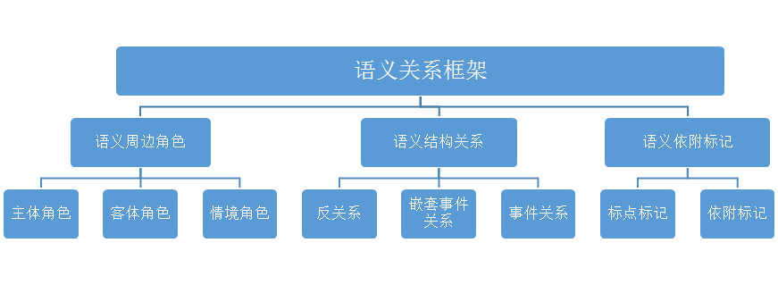

 2语义关系概述
=================

2.1语义单位层级
---------------

同语音、语法类似，语义也是由不同的语义单位组成的层级系统。在鲁川定义的汉语意合网络语义关系体系的基础上，本标注规范借鉴了其语义单位层级划分、语义组合的思想及语义关系标签集合，同时结合依存语法的由中心词驱动、易于提取词之间的关系等特点，构建了一套更加清晰的语义关系体系构架。

语义平面上的层级单位由大到小分别是事链、事件、论元、概念、标记。这些语义单位大致对应于句法单位的复句、小句、语块、实词、虚词。

   1. **事链**

      事链表示一段密切相关的事件。一个事链通常由两个或两个以上的相关事件组成。与句法上的复句（包括紧缩句）相对应。

   2. **事件**

      事件是知识的基本单位。事件是以一个核心谓词为中枢论元，一个或多个相关的论元为周边的语义组合所反映的客观现实。事件是语义平面上的术语，相当于述谓结构。

      当一个事件在语义功能上只相当于一个论元时，标注为嵌套事件关系。

      例如：
            
         我在电视上看见王军霞在跑五千米。

      “王军霞在跑五千米”这一事件在本句中是“看见”的宾语，其语义功能相当于述谓概念“看见”一个周边论元，在具体标注中，标注为嵌套事件关系。

   3. **论元**

      论元是构成事件的单元，也可称其为事元。分为中枢论元和周边论元。其中中枢论元代表所在的事件，相当于句法上的述谓语块VC，一个事件只能有一个中枢论元；周边论元与中枢论元相对，指事件中枢所关涉的处于周边的论元，相当于句法上的一个指称语块NC。

   4. **概念**
      

      事件网络中的一个结点所表示的知识元素，大致相当于句法上的一个实词。常用的概念分类以意义为标准，可以分为述谓概念和指称概念，其中述谓概念相当于句法上的谓词；指称概念相当于句法上的体词。

   5. **标记**

      标记指发话者传递语言信息时，在实体信息上所“标”的依附性信息的“记”号。例如一些语气词、标点符号等。

      例如:
      
        这帮歹徒曾绑架过经理的女儿。
         
      以本句为例，由大到小依次阐述语义单位。这个句子是一个单一事件；“曾绑架过”是句子的谓语部分，是整个事件的中枢论元；“这帮歹徒”和“经理的女儿”是周边论元；“绑架”是述谓概念，“这”“歹徒”、“经理”“女儿”是指称概念；而“曾、过、的”等是依附在实体信息之上的标记。
      
      再例如:
      
        我有个妹妹很能干。
         
      从句法上说，这是一个兼语句，从语义关系上讲，这是复杂语义事件，即由“我有个妹妹”以及“妹妹很能干”这两个事件组成的一个事链。

根据以上定义，可以对语义单位的层级进行一个小结：一个句子的语义由各个小句代表的事件构成的事链来表达；小句的语义由中枢事元及周边事元来表示，而中枢事元的语义由述谓概念来表达，周边事元由其他指称概念、界定概念等来表达；其中，概念之间会由一些标记相粘连。

2.2语义标签体系
---------------

我们确立了三类两级的标签体系：三种类型，指的是**语义周边角色**、**语义结构关系**和**语义依附标记**，这三种类型，分别对应三种语义关系框架；两级标注体系，指不同的标注粒度，分别是**粗粒度标注标签集**和**细粒度标注标签集**。

我们提出了粗细两种标注颗粒度，来对一个语义事件进行不同深度的加工。从细粒度标注层面上讲，我们要对一个语义事件中每项待标成分都进行详细的语义分析；相应地，从粗粒度标注层面上讲，我们主要是对一个语义事件的谓词-论元结构进行标注。这样的分层处理以应对不用的实际需要。

### 2.2.1语义关系框架

我们定义的语义关系框架有三类，分别对应了三种标注类型：语义周边角色、语义结构关系以及语义依附标记。

**语义周边角色的标注对象是与中枢论元有直接语义关系的周边论元。** 又细分为主体角色、客体角色以及情境角色。主体角色是一切运动的主体，客体角色是除主体角色之外第二个参与的实体，情境角色是一系列外围角色，描写的是语义事件发生的场景性因素，比如时间、空间、范围等。

**语义结构关系的标注对象是更复杂的语义事件，针对的是除中枢论元外，出现在语义事件中的其他述谓概念。** 细分为反关系、嵌套事件关系以及事件关系。反关系说的是述谓概念转位充当指称概念的情况，出现在定中结构中；嵌套事件关系也称为降级事件，指的是一个完整的事件降级作为一个论元；事件关系指的是多个完整的语义事件既不转位，也不降级，而是按照不同的语义关系连接在一起，句法上相当于复句。

**语义依附标记是对语义事件中依附性成分的标注。** 它们实际意义较虚，而且鲜少单独出现，而是作为附加性成分紧紧依附在核心成分周围。这类成分数量齐全，种类多样，对句子的语义也有一定程度的影响。细分为标点标记和依附标记。标点标记是对语义事件中的标点符号做的标注，依附标记是对依附于其他论元或概念上的成分进行的标注。

完整的语义关系框架如下图所示：

图 6语义关系框架

### 2.2.2语义标注粒度

我们在设置语义标签时，第一要义是做到全面。目前，我们的体系和语义角色数量基本上可以满足语义分析的要求，但是全面设置语义角色之后，角色数量偏多的问题便显现出来。为了处理角色数量偏多的情况，采取的策略是：将语义标签按照粒度粗细划分为不同的层级。

划分的依据是各个标签内部的语义联系以及在语料库中的分布情况。我们对其中的一些对应关系进行一些说明。

首先，对于语义周边关系来说，变化不大。主要的区别在于对情境角色语义标签。情境角色表达的语义事件发生的场景性因素。细粒度标注标签中，对于每一种时间关系（时间起点、时段、时距等）、空间关系（位置、趋向、空间起点、空间终点等）、度量关系（数量、数量短语、顺序、频次等）、状态关系（状态、起始状态等）、修饰关系（名称修饰语、宿主角色等）都进行了详细的刻画，而在粗粒度标注体系中，将它们统一分别标注为时间、空间、度量、修饰。其他的主体角色和客体角色作为语义事件的核心参与者，变化不大。粗粒度标签采用大写的英文代号，而细粒度标注标签采用的是首字母大写的英文代号。此类对应关系如下：

**表格 2语义周边角色标签体系**

| 语义角色分类 | 粗粒度标签 | 细粒度标签                               |
| ------------ | ---------- | ---------------------------------------- |
| 主体角色     | 1施事AGT   | 1施事Agt；2感事Aft                       |
|              | 2当事EXP   | 3当事Exp；4领事Poss                      |
| 客体角色     | 3受事PAT   | 5受事Pat                                 |
|              | 4客事CONT  | 6客事Cont；7成事Prod；8结局Cons          |
|              | 5涉事DATV  | 9涉事Datv；10比较Comp；11源事Orig        |
|              | 6系事BELG  | 12类事Clas；13属事Belg                   |
| 情境角色     | 7工具TOOL  | 14工具Tool                               |
|              | 8材料MATL  | 15材料Matl                               |
|              | 9方式MANN  | 16方式Mann；17依据Accd                   |
|              | 10范围SCO  | 18范围Sco                                |
|              | 11缘由REAS | 19缘故Reas；20意图Int                    |
|              | 12时间TIME | 21时间Time；22时间起点Tini；             |
|              |            | 23时间终点Tfin；24时段Tdur；25时距Trang  |
|              | 13空间LOC  | 26空间Loc；27原处所Lini；28终处所Lfin；  |
|              |            | 29通过处所Lthru；30趋向Dir               |
|              | 14度量MEAS | 31数量Quan；32起始量Nini；33终止量Nfin； |
|              |            | 34数量短语Qp；35频率Freq；36顺序Seq；    |
|              |            | 37变化量Nvar                             |
|              | 15状态STAT | 38状态Stat；39起始状态Sini；             |
|              |            | 40终止状态Sfin；41历经状态Sproc          |
|              | 16修饰FEAT | 42描写Desc；43宿主Host；                 |
|              |            | 44名词修饰语Nmod；45时间修饰语Tmod       |

其中，粗粒度标注标签一共有16个，而细粒度标注标签有45个，从数量上讲，标签的数量大大减少。同时，需要注意的是，反关系和嵌套事件关系的语义标签设置是以语义周边角色为基础，原则上，有多少语义周边角色，就有多少种反关系和嵌套事件关系。所以，对于这两种语义结构关系的粗细粒度对应关系，可参照语义周边角色。

其次，是语义事件关系的语义标签。对于事件关系的整合力度非常大，主要依据的就是它们在第一版出料库中出现的频次，以及它们的内在语义联系。其中细粒度事件关系标签有19个，而粗粒度事件关系缩减到3个。对应关系如下：

**表格 3事件关系标签体系**

| 粗粒度事件关系标签 | 细粒度事件关系标签                      |
| ------------------ | --------------------------------------- |
| 1并列关系eCOO      | 1并列eCoo；2等同eEqu；3分叙eRect；      |
|                    | 4选择eSelt；5割舍eAban；6选取ePref；    |
|                    | 7总括eSum                               |
| 2先行关系ePREC     | 8先行eRrec；9原因eCau；10条件eCond；    |
|                    | 11假设eSupp；12手段eMetd；13让步eConc   |
| 3后继关系eSUCC     | 14后继eSucc；15递进eProg；16转折eAdvt； |
|                    | 17目的ePurp；18结果eResu；19推论eInf    |

最后，对于语义依附标记来说，其变化是最大的。细粒度语义依附标签数量庞大，语义分来非常细，但是鉴于粗粒度的标注层级主要是对谓词-论元关系进行的标注，所以，对于这些语义依附标记所附带的信息不再具体标明，只显示这是一个语义依附标记，表示的断句的标点标记、表示否定关系的否定关系保留，而表示语法关系的介词、连词标记都表示为关系标记。所以，粗粒度标记标签一共只有4种，而细粒度标记标签共有17种。对应关系如下表所示：

**表格 4语义依附标记标签体系**

| 语义依附标记粗粒度标签 | 语义依附标记细粒度标签                 |
| ---------------------- | -------------------------------------- |
| 1标点标记mPUNC         | 1标点标记mPunc                         |
| 2否定标记mNEG          | 2否定标记mNeg                          |
| 3关系标记mRELA         | 3连词标记mConj                         |
|                        | 4介词标记mPrep                         |
| 4依附标记mDEPD         | 5语气标记mTone；6时间标记mTime；       |
|                        | 7范围标记mRang；8情态标记mMod；        |
|                        | 9频率标记mFreq；10程度标记mDegr；      |
|                        | 11趋向标记mDir；12的字标记mAux；       |
|                        | 13多数标记mMaj；14插入语标记mPars；    |
|                        | 15实词虚化标记mVain；16重复标记mRept； |
|                        | 17离合标记mSepa                        |

我们对标签数量进行一个总结：

**表格 5标签数量统计表**

| **数量 分类**                         | **粗粒度标签（个）** | **细粒度标签（个）** |
| ------------------------------------- | -------------------- | -------------------- |
| **不含反关系/嵌套事件关系的标签数量** | 23                   | 81                   |
| **总量**                              | 55                   | 171                  |

由上表可以非常直观的看出，粗粒度标注标签是对细粒度标注标签数量上的大大减少。这两层标注粒度，能够针对不同的应用需要。
