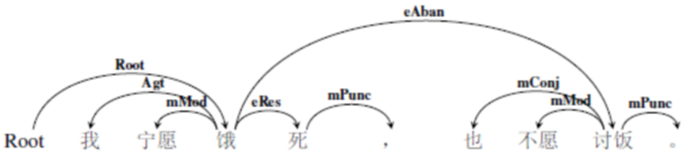

 5语义结构关系的标注细则
===========================

5.1总述
-------

语义结构关系的标注对象是更复杂的语义事件，标注对象是不同述谓概念之间形成的各种结构关系。举一个例子：

> 关押的犯人跑了。

这个句子有两个动词，“关押”和“跑”，从语义上讲“跑”是中枢论元，要标记为root，相应地，此处的“关押”不表示动作，而是表达被关押的那个人，即述谓概念转位做了指称概念。实际上，这样的语义事件很多，单纯用语义周边角色以及中枢论元并不能完整表现各种各样的语义事件。

语义结构关系共包含三部分内容：反关系、嵌套事件关系以及事件关系。上述例子就是**反关系**的例句，即述谓概念转位充当指称概念，从句法上说，多出现在定中结构中；**嵌套事件关系**也成为降级事件，指的是一个完整的事件降级作为一个论元，从句法上说，这个事件充当谓语的主语或者宾语；**事件关系**指的是多个完整的语义事件既不转位，也不降级，而是按照不同的语义关系连接在一起，句法上相当于复句。

反关系和嵌套事件关系的标注标签以语义周边角色为基础，其中，反关系标注为r+语义周边角色（r-reverse），嵌套事件关系标注为d+语义周边角色，（d-degrade）数量和名称以及颗粒度保持一致。而事件关系则有独立的标注标签体系，也包含粗粒度与细粒度两层标注粒度。

接下来的5.2、5.3与5.4小节中，我们将对上述三种语义结构关系的标注规范进行详细的说明。

5.2反关系
---------

### 5.2.1反关系概述

反关系表达的是这样一种语义结构关系，当述谓概念转位修饰指称概念时，其述谓性质消失，增添了修饰性质，与中心语的关系相当于句法上的定中关系。需要注意的是，虽反关系的句法结构虽然有变化，但是在待标成分所充当的语义角色却是相同的。

举例来说：

   > ①选手受伤了。（受伤，选手，当事Exp）

   > ②受伤的选手。（选手，受伤，反当事rExp）

分析：句1和句2结构不同。句1是主谓结构，句2是定中结构。但是“选手”是“受伤”的当事，这一层语义关系没有变化。所以，标注的时候，将“选手”用依存弧指向“受伤”，即中心语指向修饰语，并且在该语义关系前面加rExp表示反当事关系，标明该事件是一个反关系事件。

在下面的举例中，以细粒度标签为例，相应的粗粒度标签不再进行特别说明。

### 5.2.2反关系标注示例

语义周边角色中的所有语义角色都有可能出现在反关系中。

举例来说：

>   关押的犯人（犯人，关押，反受事rPat）

>   听到的歌声（歌声，听到，反客事rCont）

>   拥有的财产（财产，拥有，反属事rBelg）

> 担任的职务（职务，担任，反类事rClas）

>   飞翔的白鸽（白鸽，飞翔，反施事rAgt）

>   耸立的山峰（山峰，耸立，反当事rExp）

>   研制的火箭（火箭，研制，反成事rProd）

>   征税的企业（企业，征税，反源事rOrig）

>   运输的车辆（车辆，运输，反工具rTool）

>   ……

上述众多语义周边角色，一旦述谓概念转位成为修饰指称概念，那么我们就在修饰成分和核心词之间标注反关系。

> 例如：当时受伤的选手正从比赛场地被抬出。（root，抬）

分析：“抬”是整个语义事件的中枢论元，root指向“抬”，“受伤”原本是个述谓概念，但在这里，做了“选手”的定语，转位做了指称概念，所以依存弧由“选手”指向“受伤”，语义标签为rExp（反当事）。标注结果用依存图结构表示如下：

图 121反关系示例1

图 122反关系示例2

反关系比较简单，它实质上是一种修饰关系，特殊的是其修饰成分是一个转位后的述谓概念，变化的是句法关系而非语义关系。实际上，这也是语义依存图能够深度刻画自然语言的一个体现。

### 5.2.3反关系标注小结

前文讲到，反关系的语义标签体系以语义周边角色为基础。所以从理论上讲，二者的标签数量应该是一致的，但是在真实语料中，有些述谓概念不会转位充当指称概念，做修饰成分
，也即有些反关系标签是不会出现的，或者出现的频次非常小。我们可以对第一版语料库的标注数据中，语义周边角色和反关系角色出现的频次进行一个比较。

可见，从实际语料中可见，反关系的标注数量远没有语义角色的标注数量多，而且有些语义标签并没有出现。下表是第一版语料库中反关系出现的频次表：

**表格 17语义周边角色VS反关系频次统计表**

| 语义角色标签 | 频次  | 反关系标签   | 频次 |
|--------------|-------|--------------|------|
| 施事         | 23582 | 反施事       | 1146 |
| 当事         | 24697 | 反当事       | 1780 |
| 感事         | 4728  | 反感事       | 104  |
| 领事         | 12571 | 反领事       | 286  |
| 受事         | 8907  | 反受事       | 730  |
| 客事         | 11222 | 反客事       | 941  |
| 成事         | 2173  | 反成事       | 358  |
| 源事         | 292   | 反源事       | 6    |
| 涉事         | 8212  | 反涉事       | 202  |
| 比较         | 736   | 反比较       | 0    |
| 属事         | 2720  | 反属事       | 84   |
| 类事         | 6267  | 反类事       | 26   |
| 结局         | 823   | 反结局       | 29   |
| 依据         | 514   | 反依据       | 8    |
| 缘由         | 740   | 反缘由       | 69   |
| 意图         | 34    | 反意图       | 18   |
| 方式         | 5883  | 反方式       | 83   |
| 工具         | 623   | 反工具       | 60   |
| 材料         | 299   | 反材料       | 7    |
| 状态         | 294   | 反状态       | 1    |
| 起始状态     | 157   | 反起始状态   | 1    |
| 终止状态     | 122   | 反终止状态   | 1    |
| 历经状态     | 176   | 反历经状态   | 6    |
| 时间         | 7407  | 反时间       | 330  |
| 时间起点     | 218   | 反时间起点   | 0    |
| 时间终点     | 223   | 反时间终点   | 1    |
| 时距         | 1655  | 反时距       | 44   |
| 时段         | 37    | 反时段       | 2    |
| 空间         | 9755  | 反空间       | 250  |
| 原处所       | 441   | 反原处所     | 1    |
| 终处所       | 1721  | 反终处所     | 5    |
| 通过处所     | 248   | 反通过处所   | 7    |
| 趋向         | 1505  | 反趋向       | 29   |
| 范围         | 8191  | 反范围       | 14   |
| 数量         | 13268 | 反数量       | 19   |
| 数量短语     | 10078 | 反数量短语   | 2    |
| 变化量       | 190   | 反变化量     | 0    |
| 起始量       | 46    | 反起始量     | 0    |
| 终止量       | 181   | 反终止量     | 1    |
| 频率         | 424   | 反频率       | 0    |
| 顺序         | 1331  | 反顺序       | 0    |
| 修饰         | 29069 | 反修饰       | 10   |
| 宿主         | 846   | 反宿主       | 0    |
| 名称修饰语   | 7845  | 反名称修饰语 | 0    |
| 时间修饰语   | 1211  | 反时间修饰语 | 0    |

由此表可知，反关系语义标签并没有完全用到，有些出现频次为0，且主客体角色的反关系标签出现频次远远高于情境角色，其中反当事角色出现次数最多（1780次），其次是施事角色（1146次）。其实这也很好理解，因为情境角色已经是对整个语义事件的修饰了，它们几乎不需要转位后再来充当修饰性成分了。

5.3嵌套事件关系
---------------

### 5.3.1嵌套事件关系概述

嵌套事件关系描述的是这样一种语义结构，一个事件作为一个整体概念被嵌套进另一个主体事件内，被嵌套的事件称为“降级”事件。嵌套事件关系可以有以下两种情况：

   1. 被嵌套的事件相当于一个论元。

      > ①爷爷看见小孙女在操作计算机。（root，看见）（看见，操作，嵌套客事dCont）

   2. 被嵌套的事件相当于一个修饰成分。

      > ①爷爷拍摄了小孙女在操作计算机的照片。（root，拍摄）（照片，操作，嵌套客事dCont）

### 5.3.2嵌套事件关系标注示例

根据嵌套事件关系中的“降级”事件在句子中的语义功用，对于嵌套事件的标注有以下四种情形。

1 **降级事件充当一个周边论元。**

   在该降级事件的核心词和全句事件谓词之间连线，标注语义关系，在该语义关系前面加d（degrade）表示嵌套，标明该事件是一个嵌套事件。例如

   > ①爷爷看见小孙女在操作计算机。（root，看见）（看见，操作，dCont）

   分析：“小孙女在操作计算机”这个语义事件是句子中枢论元“看见”的一个客事角色，也即句法上讲的作宾语成分。这种情况的标注十分简单。标注结果用依存图结构表示如下：

   

   
   
图 123嵌套事件关系示例1

   
   

   
   
图 124嵌套事件关系示例2

   

2 **降级事件作为修饰成分，所修饰的核心词不是该降级事件中的周边论元。**

   在降级事件的核心词与其所修饰的核心词之间的语义关系，在该语义关系前加前缀缀d，标明该事件是一个嵌套（降级）事件。例如：

   > ②爷爷拍摄了小孙女在操作计算机的照片。（root，拍摄）（照片，操作，嵌套修饰dDesc）

   分析：这个句子的主干部分是“爷爷拍摄照片”，而“小孙女在操作计算机”是降级做了修饰成分，所以标注结果用依存图结构表示如下：

   

   

图 125嵌套事件关系示例3

   

   
   
图 126嵌套事件关系示例4

   
   
3 **降级事件作为修饰成分，所修饰的核心词同时还是该降级事件中的周边论元。**

   在降级事件的核心词和修饰词之间如果是反关系，直接标反关系不再标注嵌套关系。例如：

   > ③爷爷拍摄了操作计算机的小孙女的照片。（root，拍摄）（孙女，操作，rAgt）

   分析：本句中，“操作计算机”是一个述谓概念，但是转位做了指称概念，修饰小孙女，同时，小孙女是该降级事件中的施事角色，这个结构解析出来是“操作计算机的小孙女”，与“关押的犯人”等是相同的的结构，所以标注为反关系。标注结果用依存图结构表示如下：

   

   

图 127嵌套事件关系示例5

   

   
   
图 128嵌套事件关系示例6

   
   
4 **多个动词组成的降级事件作为修饰成分。**

降级事件由多个动词组成，可能是连动、兼语或主谓短语作宾语等等复杂情况，该降级事件中的核心动词并不直接和被修饰的中心语发生语义关系，而是非核心动词与其发生关系，那么，被修饰的核心词仍然指向该降级事件中的核心动词，，标注为降级修饰关系dDesc，而和被修饰的核心词存在语义关系的降级事件中的非核心动词也要指向其修饰的核心词，标注为反关系。以下面这个句子为例：

> ④维多利亚一直是我想去参观的城市。（root，是）（城市，想，降级修饰dDesc）（城市，参观，反客事rCont）

分析：本句结构出来是两个事件——“维多利亚是城市”和“我想去参观（城市）”，其中，事件一成为了句子的主干，而事件二成为了修饰成分，跟第二种情况相同。但复杂的是，修饰成分“我想去参观”又包含了三个动词——“想”，“去”和“参观”，所以我们依次将它们标注为嵌套客事角色，即“想”的客事是“去参观”，“去”的客事是“参观”，而同时，“参观”和句子主干中的“城市”是反客事的关系。综上，这个句子标注结果用依存图结构表示如下：

图 129嵌套事件关系示例7

图 130嵌套事件关系示例8

### 5.3.3嵌套事件关系小结

同反关系一样，嵌套事件关系的语义标签也是以语义角色为基础的。理论上讲，二者的语义标签数量也应该是一致的，但是与反关系一样，有些语义标签并没有出现。下面是对语义周边角色、反关系和嵌套事件关系的语义标签的数量对比。

**表格 18语义周边角色VS反关系VS嵌套事件关系频次统计表**

| 语义角色标签 | 频次  | 反关系标签   | 频次 | 降级事件关系标签 | 频次     |
| ------------ | ----- | ------------ | ---- | ---------------- | -------- |
| 施事         | 23582 | 反施事       | 1146 | 降级施事         | 2        |
| 当事         | 24697 | 反当事       | 1780 | 降级当事         | 1356     |
| 感事         | 4728  | 反感事       | 104  | 降级感事         | 1        |
| 领事         | 12571 | 反领事       | 286  | 降级领事         | 44       |
| 受事         | 8907  | 反受事       | 730  | 降级受事         | 133      |
| 客事         | 11222 | 反客事       | 941  | **降级客事**     | **7922** |
| 成事         | 2173  | 反成事       | 358  | 降级成事         | 10       |
| 源事         | 292   | 反源事       | 6    | 降级源事         | 64       |
| 涉事         | 8212  | 反涉事       | 202  | 降级涉事         | 209      |
| 比较         | 736   | 反比较       | 0    | 降级比较         | 36       |
| 属事         | 2720  | 反属事       | 84   | 降级属事         | 33       |
| 类事         | 6267  | 反类事       | 26   | 降级类事         | 753      |
| 结局         | 823   | 反结局       | 29   | 降级结局         | 118      |
| 依据         | 514   | 反依据       | 8    | 降级依据         | 54       |
| 缘由         | 740   | 反缘由       | 69   | 降级缘由         | 17       |
| 意图         | 34    | 反意图       | 18   | 降级意图         | 18       |
| 方式         | 5883  | 反方式       | 83   | 降级方式         | 501      |
| 工具         | 623   | 反工具       | 60   | 降级工具         | 3        |
| 材料         | 299   | 反材料       | 7    | 降级材料         | 2        |
| 状态         | 294   | 反状态       | 1    | 降级状态         | 63       |
| 起始状态     | 157   | 反起始状态   | 1    | 降级起始状态     | 24       |
| 终止状态     | 122   | 反终止状态   | 1    | 降级终止状态     | 14       |
| 历经状态     | 176   | 反历经状态   | 6    | 降级历经状态     | 0        |
| 时间         | 7407  | 反时间       | 330  | 降级时间         | 1301     |
| 时间起点     | 218   | 反时间起点   | 0    | 降级时间起点     | 47       |
| 时间终点     | 223   | 反时间终点   | 1    | 降级时间终点     | 8        |
| 时距         | 1655  | 反时距       | 44   | 降级时距         | 16       |
| 时段         | 37    | 反时段       | 2    | 降级时段         | 2        |
| 空间         | 9755  | 反空间       | 250  | 降级空间         | 90       |
| 原处所       | 441   | 反原处所     | 1    | 降级原处所       | 0        |
| 终处所       | 1721  | 反终处所     | 5    | 降级终处所       | 2        |
| 通过处所     | 248   | 反通过处所   | 7    | 降级通过处所     | 0        |
| 趋向         | 1505  | 反趋向       | 29   | 降级趋向         | 21       |
| 范围         | 8191  | 反范围       | 14   | 降级范围         | 18       |
| 数量         | 13268 | 反数量       | 19   | 降级数量         | 0        |
| 数量短语     | 10078 | 反数量短语   | 2    | 降级数量短语     | 0        |
| 变化量       | 190   | 反变化量     | 0    | 降级变化量       | 0        |
| 起始量       | 46    | 反起始量     | 0    | 降级起始量       | 3        |
| 终止量       | 181   | 反终止量     | 1    | 降级终止量       | 4        |
| 频率         | 424   | 反频率       | 0    | 降级频率         | 6        |
| 顺序         | 1331  | 反顺序       | 0    | 降级顺序         | 0        |
| 修饰         | 29069 | 反修饰       | 10   | **降级修饰**     | **2526** |
| 宿主         | 846   | 反宿主       | 0    | 降级宿主         | 22       |
| 名称修饰语   | 7845  | 反名称修饰语 | 0    | 降级名称修饰语   | 0        |
| 时间修饰语   | 1211  | 反时间修饰语 | 0    | 降级时间修饰语   | 0        |

在降级事件标签中，降级客事角色（7922次）和降级修饰（2526）是出现频次最高的两种标签。这与降级事件可以谓词的一个论元、还可以充当指称概念做修饰成分息息相关。可见不同的语义角色在不同的结构关系中的分布是很不一样的

5.4事件关系
-----------

### 5.4.1事件关系概述

事件关系表达的是这样一种语义结构关系：如果多个述谓概念既没有出现转位现象，也没有出现嵌套降级现象，而是不同的事件形成一个有语义关系的事链，我们将这种语义关系标注为事件关系。例如：

  > ①我打算去颐和园。（这是嵌套事件，“去颐和园”是“打算”的降级客事论元。）

  > ②如果星期六天气好，我就去颐和园。（没有降级关系，功能上仍然是事件，前者是后者的假设，后者是前者的推论）

所有的事件关系的标号都以e开头，表明这是一个事件关系，同样，事件关系也分粗粒度和细粒度两层标注粒度。

### 5.4.2并列关系eCOO

并列关系eCOO表达的是两个或多个平行的语义事件，重在叙述和描写。对应的细粒度标注标签集有七种，分别是：并列eCoo、等同eEqu、分叙eRect、总括eSum、选择eSelt、割舍eAban和选取ePref。

#### 5.4.2.1并列eCoo

并列eCoo（coordinate）表示的是：前后两个事件或多个事件分别叙述或描写一个事链或一个事物的几个方面，表示平行的语义关系。例如：

   > ①大家一会儿吃西瓜，一会儿喝汽水。（root，吃）（吃，喝，并列eCoo）

   > ②兄弟俩边走边说。（root，走）（走，说，并列eCoo）

并列关系有一些标记词：

**表格 19并列关系标记词**

| 单用 | 和、与、及、同、跟、并、且、并且、连同、以及 |
|------|----------------------------------------------|
| 合用 | 又…又，既…又，一会…一会，边…边，一面…一面    |

注：单用的标记词在一定语境中是介词，此时前后主体的语义角色并不相同，语义上也不平行，所以不能标为并列。判断标准是看前后主体是否可以互换位置而语义保持不变，若不能互换，则为介词，可以互换，认为并列时事件关系。

注意：在实际标注过程中，有些概念之间也有并列的关系。所以，我们也将概念的并列标注为事件关系。例如：

> ①爸爸买了一些报纸和杂志。（买，报纸，客事Cont）（报纸，杂志，并列eCoo）

#### 5.4.2.2等同eEqu

等同eEqu（equivalent）是对于同一个事物的复指或注释。通常会出现指示代词“这、那”或人称代词对该成分进行复指。例如：

   > ①女儿要离婚，妈妈对这坚决不同意。（root，离婚）（离婚，这，eEqu）

等同关系有一些标记词：即、就是、也称、也叫做、就是说、指的是等。

注意，一些概念间也可形成等同关系，故而，我们也把概念间的复指标注为等同关系。概念间的等同关系可以用代词复指，也可意合而成，即句法上说的同位关系。

   > ①这把刀我打算用它剁骨头。（刀，它，等同eEqu）

   > ②首都北京。（首都，北京，等同eEqu）

#### 5.4.2.3分叙关系eRect

分叙eRect（recount）是对要总括的事件尽心分别叙述的分叙性事件。例如：

> ①很多国家参与会议，比如美国，日本，韩国等。（root,参与）（国家，美国，eRect）

典型的分叙标记词有：例如，比方，比如说，此外，另外，还有等。

并列关系eCOO在语义事件中出现的频率很高，细粒度标签分别是并列关系eCoo，等同关系eEqu和分叙关系eRect，其中并列事件是同类概念或动作的并列，分叙关系是对一个概念或动作的分别叙述，经常与并列关系连用，而等同关系则是从两个或多个角度对同一概念或动作的表述。这三种细粒度标签可以共现。例如：

> ①他们一行人越过崇山峻岭，将中国的养蚕、缫丝、造纸等技术带向中亚、西亚和欧洲。（root，越过）

分析：这个句子中“他们”和“一行人”是等同关系eEqu，而“养蚕”、“缫丝”、“造纸”与“技术”是分叙关系，它们四个是“技术”的具体表现形式，“中亚”、“西亚”和“欧洲”是并列关系。细粒度标签能体现这种差异，而粗粒度标签都标注为eCOO。该语义事件中主要有两个动作行为——“越过”和“带向”，其中“带向”是“越过”的一个结果事件。所以该例句的语义依存图表示如下：

图131 并列关系示例1

图132 并列关系示例2

#### 5.4.2.4选择eSelt

选择eSelt指的是在两种或几种可能的情况让人从中进行选择。选择关系eSelt与句法关系中的选择复句内涵不同，略等同与选择复句中的未定选择，可以是数者选一或二者选一。例如：

   > ①您是喝茶，还是喝咖啡？（root，喝1）（喝1，喝2，eSelt）

   > ②或者你去上海，或者你去南京，或者你哪里都不去。（去，root）（去[上海]，去[南京]，eSelt）（去[南京]，[不]去，eSelt）
   
选择关系也有一些标记词：

**表格 20选择关系标记词**

| 单用 | 或，或者，还是                 |
|------|--------------------------------|
| 合用 | 或……或，不是……就是，要么……要么 |

注意，概念之间也有选择关系。我们也将概念的选择标注为选择关系eSelt。例如：

   > ①学还是研究。（root，学，选择eSelt）（学，研究，选择eSelt）

#### 5.4.2.5割舍eAban

割舍eAban（abandonment）指为选取有利事件而舍去的另一个可选性事件。割舍的可以是前一个事件，也可以是后一个事件。又由于默认事件关系中第一个述谓概念是中枢论元，所以，当前一个事件是割舍的事件时，后一个事件要标注为选取事件ePref（5.4.3.3）例如：

   > ①我宁愿饿死，也不愿讨饭。（root，饿）（饿，讨饭，割舍eAban）

   > ②上课时与其坐着讲，不如站着讲。（root，坐）（坐，站，选取ePref）

典型的割舍标记词为：与其、也不、不等。

#### 5.4.2.6选取ePref

选取ePref（preference）指舍去一个可选事件而选择有利的可选性事件。选取的可以是前一个事件，也可以是后一个事件。与割舍相同，如果前一个事件是选取的事件，那么后一个事件要标注为割舍事件关系。例如：

   > ① 你让我猜，还不如让我直接看呢。（root，猜）（猜，看，选取ePref）

典型的选取标记词为：不如，还不如，倒不如，宁可，宁愿，宁等。

对于粗粒度的选择关系eSELT，又细分成选择eSelt、割舍eAban，选取ePref。其中，选择关系eSelt不涉及主体角色的主观倾向，单纯的给出不同的选择事件，而割舍和选取都是包含着主体主观态度的选择事件。我们举三个例子进行说明：

   > ①上课时与其坐着讲，不如站着讲。（root，讲1）（讲1，讲2，选取ePref）

   > ②我宁愿饿死，也不愿讨饭。（root，饿）（饿，讨饭，割舍eAban）

   > ③学还是研究？（root，学）（学，研究，选择eSelt）

分析：句1是先割舍后选取的事件链，句2是先选取后割舍的事件链，句3是不涉及主体主观态度的事件链。细粒度标签标不同，而粗粒度标签相同。所以，标注结果分别如下图所示：

图 133选取关系示例1

图 134选取关系示例2

图 135割舍关系示例1

图 136割舍关系示例2

图 137选择关系示例1

图 138选择关系示例2

#### 5.4.2.7 总括eSum

总括eSum（summary）是对要分叙的事件进行总结概括的总括性事件。例如：

   > ①春天有红的花，绿的草，微凉的风，总之，我喜欢春天。（root，有）（有，喜欢eSum）

典型的总括标记词有：总之，总而言之，总起来看。

总括关系标注非常简单，如上述例子的依存图标注结果如下所示：

图147 总括事件关系示例1

图148 总括事件关系示例2

### 5.4.3 先行关系ePREC

先行关系ePREC指在时间、空间上发生有序的事件或在逻辑、语义上关联性较强的先行发生的动作或相关的情况。顺承关系与句结构上的顺承复句内涵不同。结合标注经验，先行关系对应的细粒度标注标签集有6个，分别是：先行ePrec，原因eCau，条件eCond，假设eSupp，手段eMetd和让步eConc。从名称上看，我们是把能作为前提出现的事件都提升为先行关系ePREC了。这是因为，这些作为前提出现的事件，本质上就是后一事件发生的基础。

表示先行关系ePREC的事件从位置上讲，可以置前，也可以置后。但默认情况下是将第一个述谓概念标注为语义中枢论元root，所以，只有当表先行关系的事件置后的时候，才会被标注为先行关系。接下来对这6种关系进行解释。

#### 5.4.3.1先行ePrec

先行ePrec（precedent）指时间上或逻辑上发生在前的先行性事件。例如：

   > ①明天天气一定会很好，看现在的天空就知道。（root，好）（好，看，ePrec）（看，知道，推论eInf）

分析：本句中有三个谓语动词——“好”，“看”以及“知道”。后一句子是前一个句子的前提基础，即根据“当下的天空”得出“明天天气好”的结论，所以，后一事件被标注为前一事件的先行ePrec。

典型的先行标记词：首先，先。

#### 5.4.3.2原因eCau

原因eCau（cause）是造成某种成事或导致另一事件的引发性事件。例如：

   > ①今年春天来得晚，到现在柳条还没绿呢？（root，来）（来，绿，eCau）

典型的原因标记词有：因为，由于，正因为，既然，鉴于等。

#### 5.4.3.3条件eCond

条件eCond（condition）是影响事件进展的必要的或充分的前提性事件。例如：

   > ①要想成功，就要努力。（root，成功）（成功，努力，eCond）

   > ②这个病症是能痊愈的，只要坚持治疗。（root，痊愈）（痊愈，治疗，eCond）

典型的条件标记词有：只有，只要，除非，无论，不论，不管，别管，任凭等。

#### 5.4.3.4假设eSupp

假设eSupp（suppose）是对事件进展有所推断而提出的假设性条件。例如：

   > ①你会怎么办，如果你处在他的位置上？（root，办）（办，处，eSupp）

典型的假设标记词有：如果，若，如，倘若，假如，假使，要是……话等。

#### 5.4.3.5手段eMetd

手段eMetd（method）是为了达到某种目的而采取的措施性事件。例如：

   > ①为争取全人类的自由，就必然有牺牲。（root，实现）（实现，牺牲，eMetd）

#### 5.4.3.6让步eConc

让步eConc（concession）是跟转折事件形成对比而提出的让步性事件，实质上是转折关系的前件。例如：

   > ①我们团队都不怕，纵然创业会面临各种各样的困难。（root，怕）（怕，面临，eConc）

典型的让步标记词有：虽然，纵然，纵使，尽管，哪怕，就是，即使，即便等。

### 5.4.4后继关系eSUCC

后继关系eSUCC主要描述语义上更进一步的结果类事件，包括时间、空间或逻辑、语义上后续发生的动作或相关的情况或事件,细粒度标签有六个，细粒度标签有六个，分别是后继eSucc、递进eProg、目的ePurp、结果eResu、推论eInf。

#### 5.4.4.1后继eSucc

后继eSucc（succession）指接着先行事件发生的事件，在时间上或逻辑上或空间上发生在后的后续性事件。例如：

   > ①瑞恩羞涩地走下车去，不好意思地向大家打招呼。（root，走下）（走下，打，后继eSucc）

   > ②坑挖好了，他把一个木匣放进坑里。（root，挖）（挖，放，后继eSucc）

   > ③有人闯红灯。（root，有）（有，闯，后继eSucc）

   > 空间主语省略的存现兼语句，体现空间上的存在先后顺序。

有时候句子语义上的时间性并不凸显，例如“他坐着看书”，由于没有关联词连接两个动词，我们将其统一标为后继，以期与并列区分开来。在标注时还得判断发生先后的动词之间是否有因果关系，后一动作的发生是不是由前一动作导致的，有的话，根据句中跟节点的位置标成原因事件关系或结果事件关系。

典型的后继标记词有：然后，接着，随后，从而，于是，就，便，这才等。

#### 5.4.4.2递进eProg

递进eProg（progression）指某方面比先行事件更进一层的后续性事件。与后继eSucc相比，二者都是先行事件后发生的事件，不同的是递进有更进一层的含义。例如：

   > ①他将于今天晚上达到，并准备住上几天。（root，到达）（到达，准备，eProg）

典型的递进标记词有：还，而且，何况，并且，况且，进而，就是等。

#### 5.4.4.3目的ePurp

目的ePurp（purpose）是通过某些手段而要达到的目的性事件。例如：

   > ①明天我将去看他。（root，去）（去，看，目的ePurp）

   > ②他走到她跟前，请她跳个舞。（root，走）（走，请，ePurp）

典型的目的标记词有：为了，为的是，好，以便，以免，免得，省得等。

#### 5.4.4.4结果eResu

结果eResu（result）是由于某种原因或条件所造成的结局性事件。例如：

   > ①小岛远离大陆，没有蜜蜂。（root，远离）（远离，没有，eResu）

   > ②土壤含有水分和养料，所以作物能生长。（root，含有）（含有，生长，eResu）

典型的结果标记词有：所以，因而，因此，以致，就，只好等。

#### 5.4.4.5推论eInf

推论eInf（inference）是根据某种原因或假设而得出的推论性事件。例如

   > ①眼看你们的身子一天比一天虚弱，说不定就会起不来。（root，虚弱）（虚弱，起，推论eInf）

典型的推论标记词有：就，才，则，也，便，都，那么，可见，否则。

注意，先行事件关系ePREC分别与后继事件关系eSUCC配对使用。一般来说，只要有了先行事件，那么一定会有一个后续事件发生。

图 139后继事件关系示例1

图 140后继事件关系示例2

图 141先行事件关系示例1

图 142先行事件关系示例2

图 143后继事件关系示例3

图144 后继事件关系示例4

图145 先行事件关系示例3

图146 先行事件关系示例4

#### 5.4.4.6 转折eAdvt

转折关系：前后分句的意思相反或者相对，即后面分句不是顺着前面分句的意思说下去，而是突然转成同前面分句意思相反或相对的说法，后面分句是说话人所要表达的正义。前后前后分句的意思相反、相对程度的强弱，转折关系分为重转、轻转、弱转。在原来的标注体系中，对于转折关系的标注是单列一个标签，并且出现的频次并不算低。但是对转折关系细究起来，逃不脱与先行事件在时间上存在的某种关系，所以，将转折关系合并到后继关系中。例如：

   > 1. 虽然二诸葛说是千合适万合适，小二黑却不认账。（重转，后续事件是前一个事件的一个结果。）
   > 2. 事情到了后头，他倒不干了。（轻转，可以标注为后继事件。）

### 5.4.5事件关系小结

综上所述，事件关系描述的是复杂语义事件，即多个事件相连所形成的语义关系。我们一共提取了3个粗粒度标注标签集，并列关系类似平行事件；后继关系是与先行事件有时间上或超时间上的线性联系的语义事件，先行关系标签的存在是为了解决标注实践上的一些问题。

在第一版语料库中，这19个事件关系语义标签出现的频次如下表所示：

**表格 21事件关系频次统计表**

| 并列eCoo  | 13110 |
| --------- | ----- |
| 等同eEqu  | 2732  |
| 选择eSelt | 697   |
| 割舍eAban | 41    |
| 选取ePref | 234   |
| 先行ePrec | 96    |
| 后继eSucc | 15208 |
| 递进eProg | 1820  |
| 转折eAdvt | 1957  |
| 让步eConc | 407   |
| 原因eCau  | 1185  |
| 条件eCond | 282   |
| 假设eSupp | 725   |
| 手段eMetd | 13    |
| 目的ePurp | 2198  |
| 结果eResu | 2683  |
| 推论eInf  | 236   |
| 总括eSum  | 73    |
| 分叙eRect | 254   |

5.5小结
-------

本章节主要介绍了语义结构关系，有三类：反关系、嵌套事件关系以及事件关系。

反关系和嵌套事件关系的语义标签语义周边角色为基础，在语义周边角色前加“r”表示这是反关系角色，加“d”表示这是嵌套事件关系。对于事件关系的标注，我们规定了3个粗粒度标注标签集以及19个细粒度标注标签集。

总体来说，与语义周边角色相比，语义结构关系更为复杂。对于句中有多个谓词的情况，反关系处理的是谓词转位充当修饰成分的情况，嵌套时间关系处理的是谓词“降级”嵌套进一个主要事件的情况，事件关系处理的是多个事件发生的情况。通过语义结构关系标注系统，将实现对更广阔的现代汉语句法语义的标注。
